# Documentación de Modelos — SaaS Lavaderos

Este documento consolida el **modelo de datos** y lo complementa con **reglas de negocio**, **procesos granulares con entradas/salidas**, **estados**, **restricciones** e **indicadores**. El objetivo es mantener un **MVP simple, vendible y operable**, evitando complejidades innecesarias pero dejando espacio para escalar.

---

## 0) Alcance y principios del MVP

- **Simplicidad primero**: cubrir recepción → venta → cobro → comprobante no fiscal → cierre de caja.
- **Multitenant real**: todo cuelga de `EMPRESA`. Datos aislados por empresa.
- **Precios determinísticos**: resolución por `sucursal + servicio + tipo_vehiculo + fecha`.
- **Trazabilidad**: cada venta tiene cliente, vehículo, ítems, pagos, comprobante y notificaciones.
- **Operable en campo**: flujos en 5–7 toques; mínimos obligatorios.
- **Medible**: ventas, ticket promedio, servicios top, métodos de pago, propinas.

### Mejoras sugeridas

1. **Índices y restricciones** (ver §5) para evitar inconsistencias y acelerar consultas.
2. **Estados explícitos de venta** (ver §3.1) y transiciones claras.
3. **Campos de tiempo de proceso** opcionales en `VENTA` (`iniciado_en`, `finalizado_en`) para medir lead time. _(Opcional, pero muy útil para tiempos y productividad)_
4. **Normalización mínima de patente y teléfono** para evitar duplicados por formato. _(sin crear nuevas tablas)_
5. **Plantillas de notificación** por empresa con **placeholders estándar** (`{{nombre}}`, `{{patente}}`, `{{total}}`).

---

## 1) Vista A — Organización y Clientes

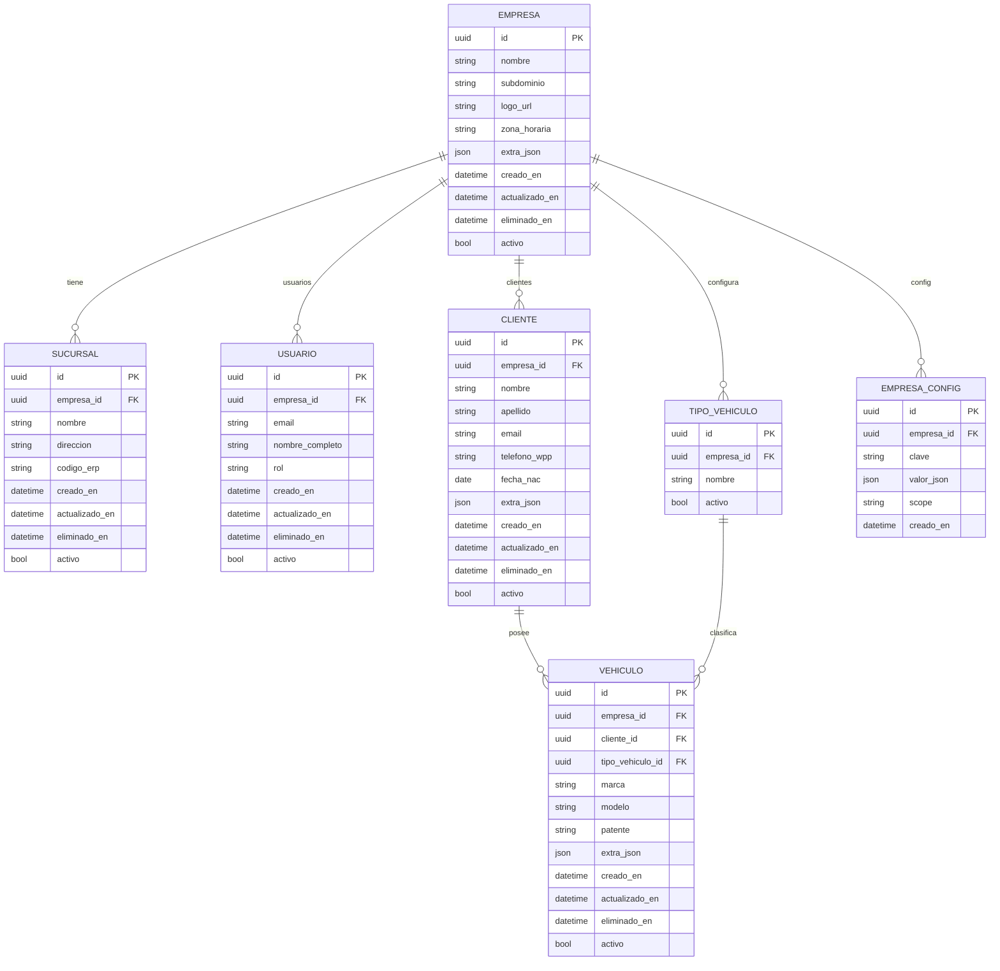
```mermaid
erDiagram
  EMPRESA ||--o{ SUCURSAL : "tiene"
  EMPRESA ||--o{ USUARIO : "usuarios"
  EMPRESA ||--o{ CLIENTE : "clientes"
  EMPRESA ||--o{ TIPO_VEHICULO : "configura"
  EMPRESA ||--o{ EMPRESA_CONFIG : "config"
  CLIENTE ||--o{ VEHICULO : "posee"
  TIPO_VEHICULO ||--o{ VEHICULO : "clasifica"

  EMPRESA {
    uuid id PK
    string nombre
    string subdominio
    string logo_url
    string zona_horaria
    json extra_json
    datetime creado_en
    datetime actualizado_en
    datetime eliminado_en
    bool activo
  }
  EMPRESA_CONFIG {
    uuid id PK
    uuid empresa_id FK
    string clave
    json valor_json
    string scope
    datetime creado_en
  }
  SUCURSAL {
    uuid id PK
    uuid empresa_id FK
    string nombre
    string direccion
    string codigo_erp
    datetime creado_en
    datetime actualizado_en
    datetime eliminado_en
    bool activo
  }
  USUARIO {
    uuid id PK
    uuid empresa_id FK
    string email
    string nombre_completo
    string rol
    datetime creado_en
    datetime actualizado_en
    datetime eliminado_en
    bool activo
  }
  CLIENTE {
    uuid id PK
    uuid empresa_id FK
    string nombre
    string apellido
    string email
    string telefono_wpp
    date fecha_nac
    json extra_json
    datetime creado_en
    datetime actualizado_en
    datetime eliminado_en
    bool activo
  }
  TIPO_VEHICULO {
    uuid id PK
    uuid empresa_id FK
    string nombre
    bool activo
  }
  VEHICULO {
    uuid id PK
    uuid empresa_id FK
    uuid cliente_id FK
    uuid tipo_vehiculo_id FK
    string marca
    string modelo
    string patente
    json extra_json
    datetime creado_en
    datetime actualizado_en
    datetime eliminado_en
    bool activo
  }
```

**Notas y propósito**

- **EMPRESA**: tenant; raíz jerárquica.
- **EMPRESA_CONFIG**: extensión por claves (p.ej., `moneda`, `propina_porcentual_sugerida`, `habilitar_whatsapp`).
- **SUCURSAL**: soporta `codigo_erp` para mapear con sistemas existentes.
- **USUARIO**: autorización por rol simple (ver §6).
- **CLIENTE**: datos básicos y `extra_json` para campos libres.
- **TIPO_VEHICULO**: catálogo simple.
- **VEHICULO**: vehículo por cliente; `patente` utilizada para búsquedas rápidas.

---

## 2) Vista B — Catálogo y Precios

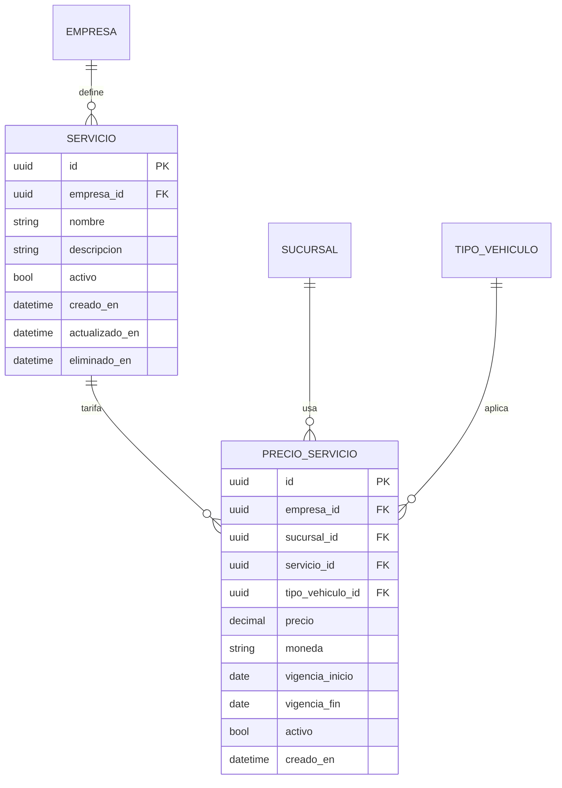
```mermaid
erDiagram
  EMPRESA ||--o{ SERVICIO : "define"
  SERVICIO ||--o{ PRECIO_SERVICIO : "tarifa"
  SUCURSAL ||--o{ PRECIO_SERVICIO : "usa"
  TIPO_VEHICULO ||--o{ PRECIO_SERVICIO : "aplica"

  SERVICIO {
    uuid id PK
    uuid empresa_id FK
    string nombre
    string descripcion
    bool activo
    datetime creado_en
    datetime actualizado_en
    datetime eliminado_en
  }
  PRECIO_SERVICIO {
    uuid id PK
    uuid empresa_id FK
    uuid sucursal_id FK
    uuid servicio_id FK
    uuid tipo_vehiculo_id FK
    decimal precio
    string moneda
    date vigencia_inicio
    date vigencia_fin
    bool activo
    datetime creado_en
  }
```

**Notas y propósito**

- **SERVICIO**: catálogo (lavado, encerado, interior, etc.).
- **PRECIO_SERVICIO**: tarifa efectiva por `sucursal + tipo_vehiculo + servicio + rango de vigencia`.

---

## 3) Vista C — Ventas, Pagos, Comprobantes y Cierre


```mermaid
erDiagram
  SUCURSAL ||--o{ VENTA : "registra"
  CLIENTE ||--o{ VENTA : "compra"
  VEHICULO ||--o{ VENTA : "para"
  VENTA ||--|{ VENTA_ITEM : "contiene"
  SERVICIO ||--o{ VENTA_ITEM : "se_vende"
  VENTA ||--o{ PAGO : "recibe"
  VENTA ||--o{ COMPROBANTE : "emite"
  VENTA ||--o{ LOG_NOTIF : "notifica"
  SUCURSAL ||--o{ SECUENCIA_COMPROBANTE : "numeracion"
  CLIENTE ||--o{ CLIENTE_FACTURACION : "datos_facturacion"
  SUCURSAL ||--o{ CIERRE_CAJA : "cierra"
  CIERRE_CAJA ||--o{ CIERRE_CAJA_TOTAL : "totales_por_metodo"

  VENTA {
    uuid id PK
    uuid empresa_id FK
    uuid sucursal_id FK
    uuid cliente_id FK
    uuid vehiculo_id FK
    datetime creado_en
    datetime actualizado_en
    string estado
    decimal subtotal
    decimal descuento
    decimal propina
    decimal total
    decimal saldo_pendiente
    string notas
  }
  VENTA_ITEM {
    uuid id PK
    uuid venta_id FK
    uuid servicio_id FK
    string servicio_nombre_cache
    decimal precio_unitario
    int cantidad
    decimal total_linea
  }
  PAGO {
    uuid id PK
    uuid venta_id FK
    string metodo
    decimal monto
    bool es_propina
    string referencia
    string idempotency_key
    datetime pagado_en
  }
  CLIENTE_FACTURACION {
    uuid id PK
    uuid cliente_id FK
    string razon_social
    string cuit
    string direccion
    string ciudad
    string provincia
    string codigo_postal
    bool activo
  }
  COMPROBANTE {
    uuid id PK
    uuid venta_id FK
    uuid cliente_facturacion_id FK
    string tipo
    string punto_venta
    string numero
    decimal total
    string moneda
    string pdf_url
    datetime emitido_en
  }
  SECUENCIA_COMPROBANTE {
    uuid id PK
    uuid sucursal_id FK
    string tipo
    int proximo_numero
    datetime actualizado_en
  }
  PLANTILLA_NOTIF {
    uuid id PK
    uuid empresa_id FK
    string clave
    string canal
    text cuerpo_tpl
    bool activo
  }
  LOG_NOTIF {
    uuid id PK
    uuid venta_id FK
    string canal
    string destinatario
    text cuerpo_renderizado
    string estado
    datetime enviado_en
  }
  CIERRE_CAJA {
    uuid id PK
    uuid empresa_id FK
    uuid sucursal_id FK
    uuid usuario_id FK
    datetime abierto_en
    datetime cerrado_en
    string notas
  }
  CIERRE_CAJA_TOTAL {
    uuid id PK
    uuid cierre_caja_id FK
    string metodo
    decimal monto
    decimal propinas
  }
```

**Reglas y fórmulas mínimas**

- `total_linea = cantidad * precio_unitario`
- `subtotal = SUM(total_linea)`
- `total = subtotal - descuento + propina`
- `saldo_pendiente = total - SUM(pagos donde es_propina=false)`
- La **propina** se almacena también en `PAGO.es_propina=true` si se cobra separada por método.

### 3.1) Estados de una venta (MVP)

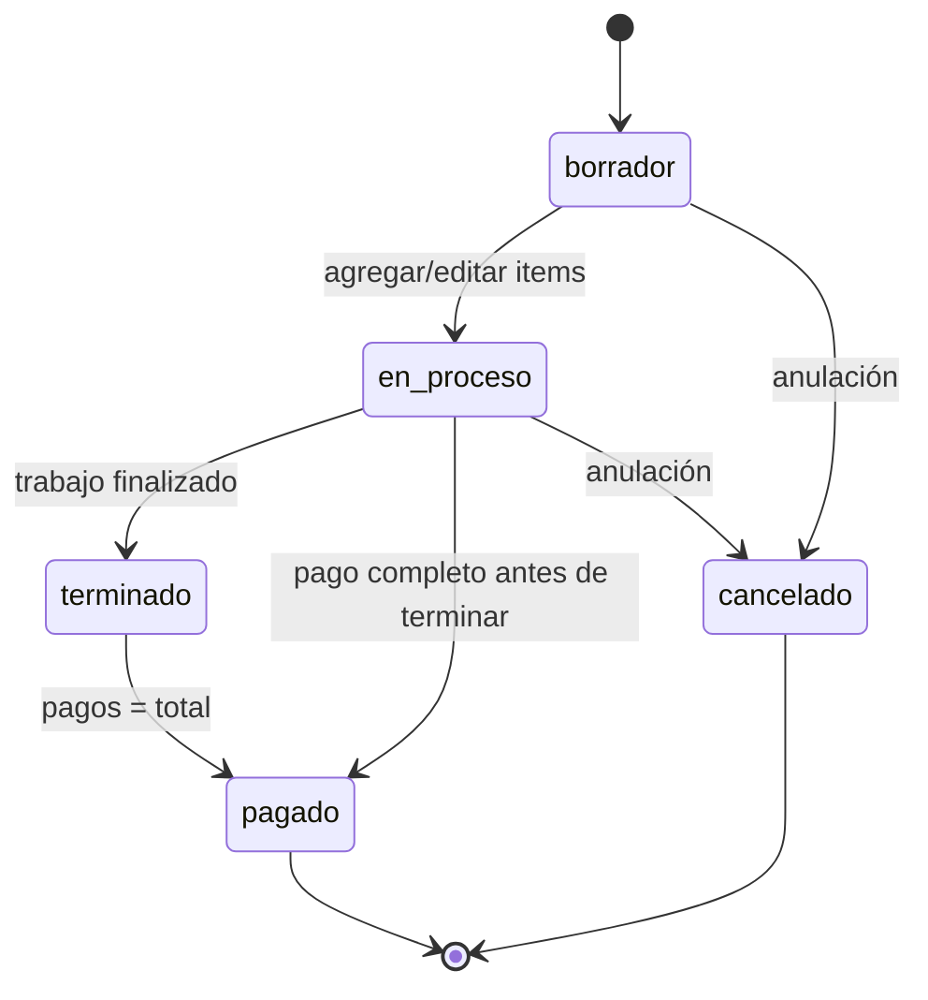
```mermaid
stateDiagram-v2
  [*] --> borrador
  borrador --> en_proceso: agregar/editar items
  en_proceso --> terminado: trabajo finalizado
  terminado --> pagado: pagos = total
  en_proceso --> pagado: pago completo antes de terminar
  borrador --> cancelado: anulación
  en_proceso --> cancelado: anulación
  pagado --> [*]
  cancelado --> [*]
```

---

## 4) Vista D — SaaS y Observabilidad

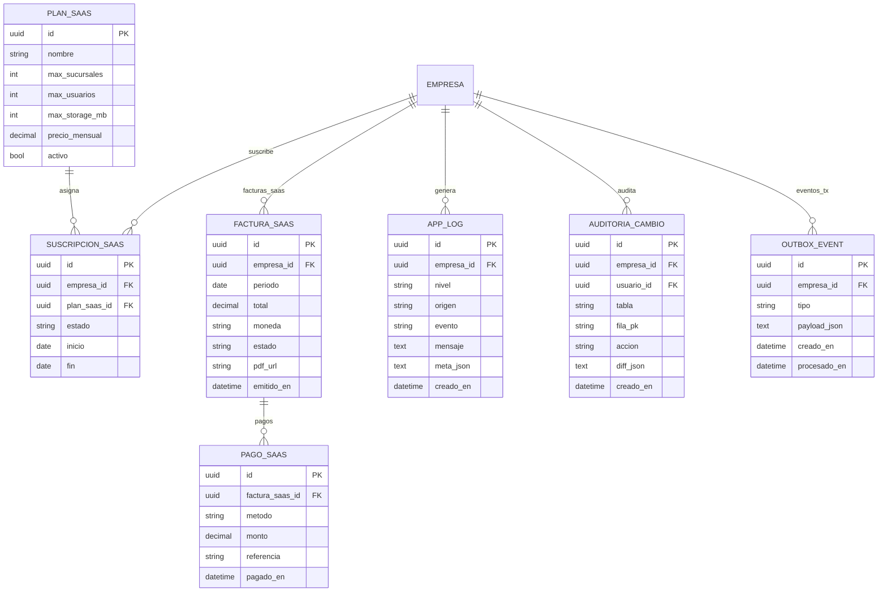
```mermaid
erDiagram
  PLAN_SAAS ||--o{ SUSCRIPCION_SAAS : "asigna"
  EMPRESA ||--o{ SUSCRIPCION_SAAS : "suscribe"
  EMPRESA ||--o{ FACTURA_SAAS : "facturas_saas"
  FACTURA_SAAS ||--o{ PAGO_SAAS : "pagos"
  EMPRESA ||--o{ APP_LOG : "genera"
  EMPRESA ||--o{ AUDITORIA_CAMBIO : "audita"
  EMPRESA ||--o{ OUTBOX_EVENT : "eventos_tx"

  PLAN_SAAS {
    uuid id PK
    string nombre
    int max_sucursales
    int max_usuarios
    int max_storage_mb
    decimal precio_mensual
    bool activo
  }
  SUSCRIPCION_SAAS {
    uuid id PK
    uuid empresa_id FK
    uuid plan_saas_id FK
    string estado
    date inicio
    date fin
  }
  FACTURA_SAAS {
    uuid id PK
    uuid empresa_id FK
    date periodo
    decimal total
    string moneda
    string estado
    string pdf_url
    datetime emitido_en
  }
  PAGO_SAAS {
    uuid id PK
    uuid factura_saas_id FK
    string metodo
    decimal monto
    string referencia
    datetime pagado_en
  }
  APP_LOG {
    uuid id PK
    uuid empresa_id FK
    string nivel
    string origen
    string evento
    text mensaje
    text meta_json
    datetime creado_en
  }
  AUDITORIA_CAMBIO {
    uuid id PK
    uuid empresa_id FK
    uuid usuario_id FK
    string tabla
    string fila_pk
    string accion
    text diff_json
    datetime creado_en
  }
  OUTBOX_EVENT {
    uuid id PK
    uuid empresa_id FK
    string tipo
    text payload_json
    datetime creado_en
    datetime procesado_en
  }
```

**Eventos recomendados (Outbox, MVP)**

- `VentaPagada`, `ComprobanteEmitido`, `VehiculoListo`, `CierreCajaCerrado`

---

## 5) Restricciones, índices y validaciones (valor negocio)

**Unicidad y formato**

- `VEHICULO.patente` **única por empresa** `(empresa_id, patente_normalizada)` con normalización (trim, uppercase, sin guiones/espacios).
- `SERVICIO.nombre` **único por empresa** `(empresa_id, nombre_normalizado)` para evitar duplicados.
- `SUCURSAL.codigo_erp` **único por empresa** si se usa mapeo ERP.

**Precios sin solapamiento (simple)**

- En `PRECIO_SERVICIO`, no permitir rangos superpuestos para la misma tupla `(empresa_id, sucursal_id, servicio_id, tipo_vehiculo_id)`.
  - Chequeo: al insertar, validar que `[vigencia_inicio, vigencia_fin]` no colisione con otro rango activo.

**Integridad operacional**

- `VENTA_ITEM.cantidad >= 1`, `precio_unitario >= 0`.
- `PAGO.monto > 0` y no exceder `saldo_pendiente` cuando `es_propina=false`.
- `COMPROBANTE.numero` consecutivo por `(sucursal_id, tipo)` vía `SECUENCIA_COMPROBANTE` + **idempotencia** a nivel de operación de emisión.

**Índices prácticos**

- Búsquedas:
  - `CLIENTE(email)`, `CLIENTE(telefono_wpp)`
  - `VEHICULO(patente_normalizada)`
  - `VENTA(sucursal_id, creado_en)`, `VENTA(estado)`
  - `PAGO(venta_id, pagado_en)`
  - `PRECIO_SERVICIO(sucursal_id, servicio_id, tipo_vehiculo_id, vigencia_inicio)`

---

## 6) Roles (mínimos, MVP)

- **Admin**: todo sobre su empresa (catálogo, usuarios, precios, reportes, cierres).
- **Operador/Cajero**: crear ventas, ítems, pagos, emitir comprobantes, notificar, cerrar caja.
- **Auditor (solo lectura)**: reportes, ventas, cierres, sin modificar.

_(Implementable en Django con `groups`/`permissions` simples.)_

---

## 7) Procesos granulares (Entradas / Salidas / Reglas / Errores)

> **Regla de oro**: cada proceso retorna una **salida clara** y deja **estado consistente**.

### 7.1 Alta/selección de Cliente y Vehículo

- **Entradas**: `empresa_id`, (`cliente_id` _o_ {nombre, apellido, email?, telefono*wpp?}), (`vehiculo_id` \_o* {tipo_vehiculo_id, marca, modelo, patente?})
- **Salidas**: `cliente_id`, `vehiculo_id` (upsert si coincide por teléfono/email y patente)
- **Reglas**: normalizar `telefono_wpp`, `patente`; evitar duplicados.
- **Errores**: formato inválido, patente duplicada, tipo_vehiculo inexistente.

### 7.2 Crear venta (borrador)

- **Entradas**: `empresa_id`, `sucursal_id`, `cliente_id`, `vehiculo_id`
- **Salidas**: `venta_id` (estado=`borrador`, `saldo_pendiente = 0`)
- **Reglas**: sucursal activa, cliente/vehículo pertenecen a la misma empresa.
- **Errores**: referencias cruzadas de otra empresa, sucursal inactiva.

### 7.3 Agregar/editar ítems de venta

- **Entradas**: `venta_id`, lista de `{servicio_id, cantidad}`, **fecha_precio** (default: `now()` del servidor)
- **Salida**: `subtotal`, `total`, `saldo_pendiente` recalculados
- **Reglas**: resolver **precio** en `PRECIO_SERVICIO` por `sucursal + servicio + tipo_vehiculo + fecha_precio`; cachear `servicio_nombre`.
- **Errores**: precio no encontrado, cantidad < 1, servicio inactivo.

### 7.4 Registrar pago(s)

- **Entradas**: `venta_id`, `metodo` (efectivo/tarjeta/MP), `monto`, `es_propina?`, `idempotency_key?`
- **Salida**: `saldo_pendiente` actualizado; posible transición a `pagado` si `saldo_pendiente = 0`.
- **Reglas**: no permitir `monto` > `saldo_pendiente` cuando `es_propina=false`.
- **Errores**: monto inválido, `idempotency_key` repetida (duplicado).

### 7.5 Finalizar venta (trabajo completo)

- **Entradas**: `venta_id`
- **Salida**: `estado=terminado` (o `pagado` si saldo=0)
- **Reglas**: debe existir ≥1 `VENTA_ITEM`.
- **Errores**: venta sin ítems; venta cancelada.

### 7.6 Emitir comprobante (no fiscal)

- **Entradas**: `venta_id`, `tipo`, `punto_venta`, `cliente_facturacion_id?`
- **Salida**: `COMPROBANTE{numero, pdf_url}`
- **Reglas**: reservar número con `SECUENCIA_COMPROBANTE` (transacción + idempotencia); snapshot de totales.
- **Errores**: secuencia bloqueada, venta sin total, venta cancelada.

### 7.7 Notificar cliente (opcional)

- **Entradas**: `venta_id`, `PLANTILLA_NOTIF.clave`
- **Salida**: `LOG_NOTIF{id, estado=enviado|fallido}`
- **Reglas**: render de plantilla con placeholders y datos de la venta.
- **Errores**: canal no habilitado, destinatario vacío.

### 7.8 Cierre de caja

- **Entradas**: `sucursal_id`, `usuario_id`, `rango_horas`
- **Salida**: `CIERRE_CAJA{id}` + `CIERRE_CAJA_TOTAL` agrupado por `metodo`
- **Reglas**: sumar pagos del periodo; propinas separadas.
- **Errores**: solapamiento de cierres, rango vacío.

#### Diagrama de flujo de Cierre (MVP)

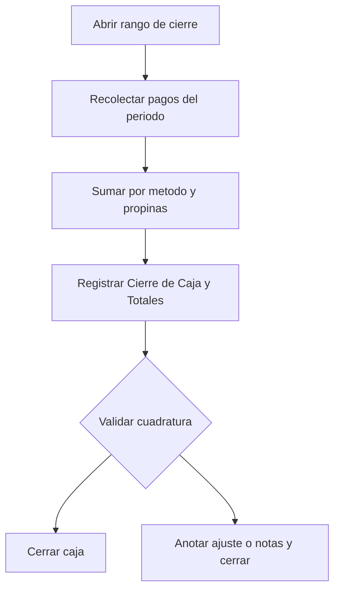
```mermaid
flowchart TD
  A["Abrir rango de cierre"]
  B["Recolectar pagos del periodo"]
  C["Sumar por metodo y propinas"]
  D["Registrar Cierre de Caja y Totales"]
  E{"Validar cuadratura"}
  F["Cerrar caja"]
  G["Anotar ajuste o notas y cerrar"]

  A --> B
  B --> C
  C --> D
  D --> E
  E --> F
  E --> G
```

---

## 8) Endpoints MVP (sugeridos, nombres lógicos)

- `/clientes [GET/POST]`, `/vehiculos [GET/POST]`
- `/ventas [POST]` (crear borrador), `/ventas/{id} [GET/PATCH]`
- `/ventas/{id}/items [POST/PATCH/DELETE]`
- `/ventas/{id}/pagos [POST]`
- `/ventas/{id}/finalizar [POST]`
- `/ventas/{id}/comprobante [POST]`
- `/ventas/{id}/notificar [POST]`
- `/cierres [POST]`, `/cierres/{id} [GET]`
- `/precios [GET/POST]`, `/servicios [GET/POST]`

_(En Django: `UUIDField` como PK, `auto_now(_add)` para timestamps, `constraints` en `Meta`.)_

---

## 9) Reportes y KPIs (operativos, MVP)

- **Ventas por día / sucursal** (total, #ventas, ticket promedio)
- **Servicios top** por cantidad y facturación
- **Métodos de pago** (mix por periodo)
- **Propinas** (total y % sobre ventas)
- **Clientes recurrentes** (% repiten en 30/60 días) _(simple: por `vehiculo_id` o `cliente_id`)_

---

## 10) Consideraciones de implementación (Django, prácticas simples)

- **Soft-delete**: usar `eliminado_en` (filtro global por empresa y `eliminado_en IS NULL`).
- **Transactions**: emisión de comprobante y movimientos críticos con `select_for_update()` sobre `SECUENCIA_COMPROBANTE`.
- **Idempotencia**: `PAGO.idempotency_key` y “safe re-try” en emisión de comprobantes.
- **Validación de precios**: función única `resolver_precio(empresa, sucursal, servicio, tipo_vehiculo, fecha)` para centralizar la lógica.
- **Serializadores simples**: exponer sólo campos necesarios a UI.
- **Seeds mínimos**: `TIPO_VEHICULO` comunes (auto, moto, camioneta).

---

## 11) Circuito de una Venta (secuencia)

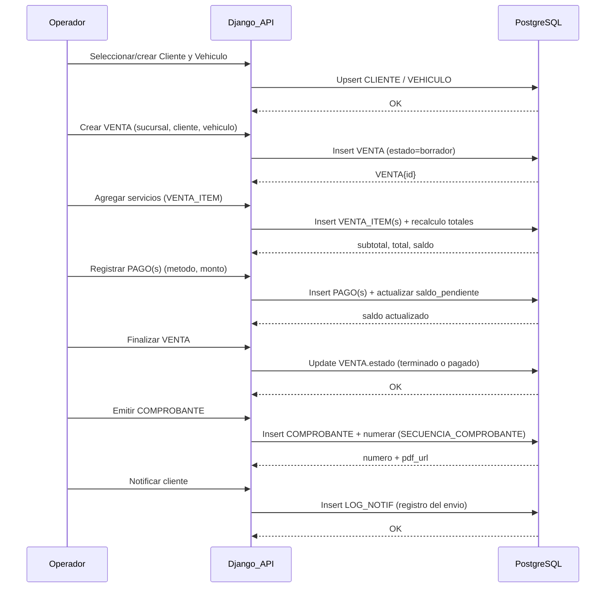
```mermaid
sequenceDiagram
  participant U as Operador
  participant API as Django_API
  participant DB as PostgreSQL

  U->>API: Seleccionar/crear Cliente y Vehiculo
  API->>DB: Upsert CLIENTE / VEHICULO
  DB-->>API: OK

  U->>API: Crear VENTA (sucursal, cliente, vehiculo)
  API->>DB: Insert VENTA (estado=borrador)
  DB-->>API: VENTA{id}

  U->>API: Agregar servicios (VENTA_ITEM)
  API->>DB: Insert VENTA_ITEM(s) + recalculo totales
  DB-->>API: subtotal, total, saldo

  U->>API: Registrar PAGO(s) (metodo, monto)
  API->>DB: Insert PAGO(s) + actualizar saldo_pendiente
  DB-->>API: saldo actualizado

  U->>API: Finalizar VENTA
  API->>DB: Update VENTA.estado (terminado o pagado)
  DB-->>API: OK

  U->>API: Emitir COMPROBANTE
  API->>DB: Insert COMPROBANTE + numerar (SECUENCIA_COMPROBANTE)
  DB-->>API: numero + pdf_url

  U->>API: Notificar cliente
  API->>DB: Insert LOG_NOTIF (registro del envio)
  DB-->>API: OK
```

---

# Plan detallado por app (Django) — SaaS Lavaderos (MVP)

> Objetivo: que cada app tenga **responsabilidades claras**, **módulos internos** y **flujos** listos para implementar.  
> Convención de diagramas: usar `flowchart` sin etiquetas en aristas para máxima compatibilidad.

---

## 1) `accounts/` (allauth + membresías + roles)

**Rol**: Autenticación (allauth), pertenencia a empresas y autorización por rol.

**Módulos**

- `models.py`: `UserProfile`, `EmpresaMembership(user, empresa, rol)`
- `services.py`: alta empresa + owner, asignación de roles, helpers de autorización
- `serializers.py` (DRF): perfiles y membresías
- `views.py`/`urls.py`: endpoints de perfil y onboarding simple
- `permissions.py`: `IsMemberOfEmpresa`, `HasRole`

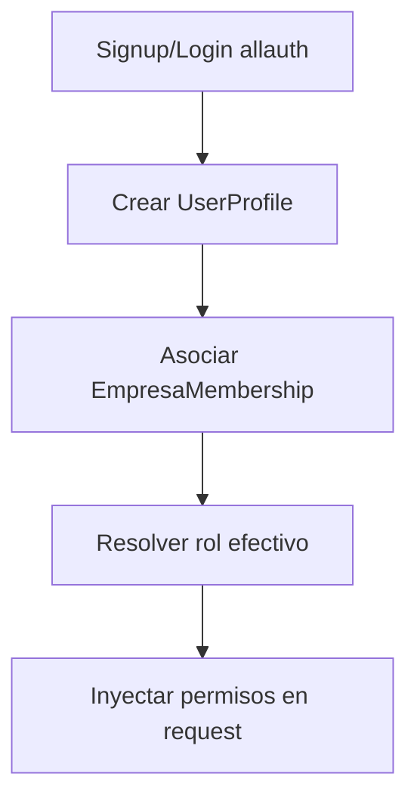
```mermaid
flowchart TD
  A[Signup/Login allauth] --> B[Crear UserProfile]
  B --> C[Asociar EmpresaMembership]
  C --> D[Resolver rol efectivo]
  D --> E[Inyectar permisos en request]
```

---

## 2) `org/` (empresa, sucursal, configuración)

**Rol**: Raíz multi-tenant; sucursales; configuración por claves.

**Módulos**

- `models.py`: `EMPRESA`, `SUCURSAL`, `EMPRESA_CONFIG`
- `services.py`: lectura de config, alta sucursal, validaciones
- `serializers.py` y `views.py`: CRUD limitado
- `selectors.py`: queries frecuentes por empresa/sucursal

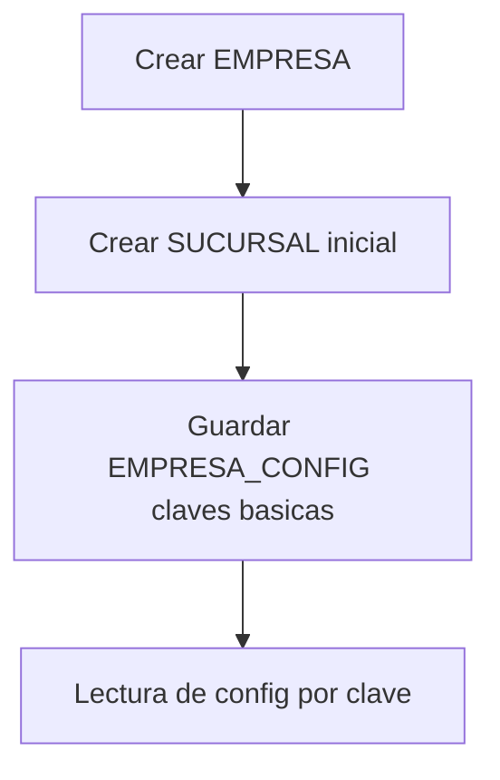
```mermaid
flowchart TD
  A[Crear EMPRESA] --> B[Crear SUCURSAL inicial]
  B --> C[Guardar EMPRESA_CONFIG claves basicas]
  C --> D[Lectura de config por clave]
```

---

## 3) `customers/` (clientes y datos de facturación)

**Rol**: Gestión de clientes y perfiles fiscales.

**Módulos**

- `models.py`: `CLIENTE`, `CLIENTE_FACTURACION`
- `services.py`: `upsert_cliente`, `get_or_create_facturacion`
- `serializers.py` y `views.py`: endpoints REST
- `normalizers.py`: email/teléfono

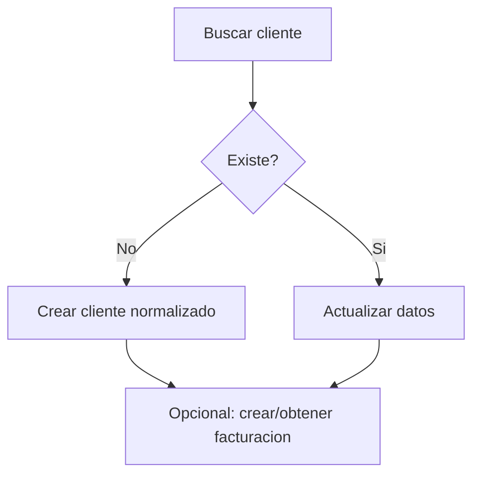
```mermaid
flowchart TD
  A[Buscar cliente] --> B{Existe?}
  B -->|No| C[Crear cliente normalizado]
  B -->|Si| D[Actualizar datos]
  C --> E[Opcional: crear facturacion]
  D --> E[Opcional: crear/obtener facturacion]
```

---

## 4) `vehicles/` (tipos y vehículos)

**Rol**: Tipos de vehículo y vehículos por cliente con unicidad de patente por empresa.

**Módulos**

- `models.py`: `TIPO_VEHICULO`, `VEHICULO`
- `services.py`: `upsert_vehiculo`, `normalizar_patente`
- `serializers.py` y `views.py`: endpoints REST
- `validators.py`: unicidad `(empresa_id, patente_normalizada)`

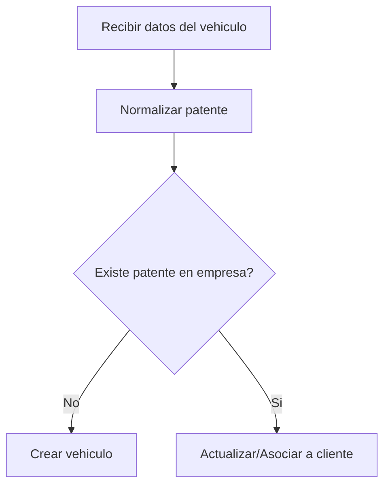
```mermaid
flowchart TD
  A[Recibir datos del vehiculo] --> B[Normalizar patente]
  B --> C{Existe patente en empresa?}
  C -->|No| D[Crear vehiculo]
  C -->|Si| E[Actualizar/Asociar a cliente]
```

---

## 5) `catalog/` (servicios)

**Rol**: Catálogo de servicios.

**Módulos**

- `models.py`: `SERVICIO`
- `services.py`: validación de nombre único por empresa
- `serializers.py`, `views.py`
- `selectors.py`: listar activos

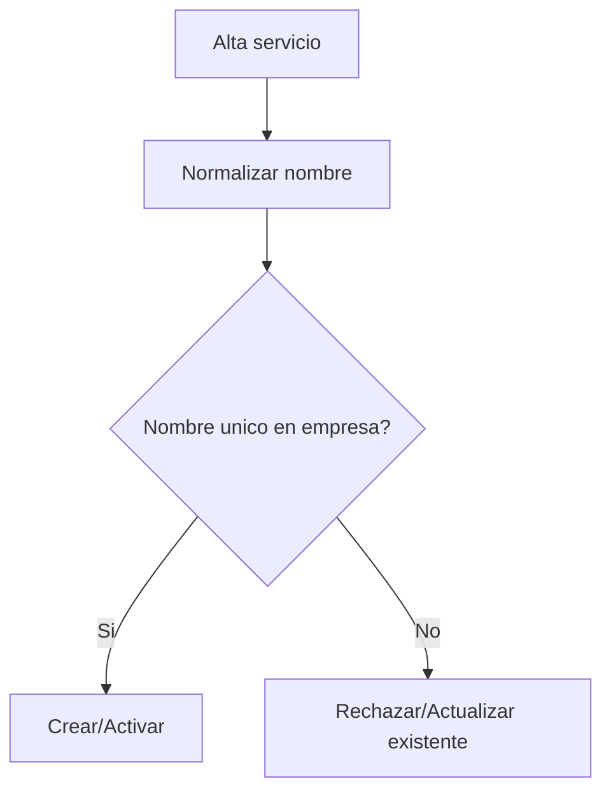
```mermaid
flowchart TD
  A[Alta servicio] --> B[Normalizar nombre]
  B --> C{Nombre unico en empresa?}
  C -->|Si| D[Crear/Activar]
  C -->|No| E[Rechazar/Actualizar existente]
```

---

## 6) `pricing/` (precios efectivos por sucursal/tipo/servicio)

**Rol**: Tarifas con vigencia; resolver precio efectivo.

**Módulos**

- `models.py`: `PRECIO_SERVICIO`
- `services.py`: `resolver_precio`, alta sin solapamientos
- `validators.py`: colisión de rangos
- `serializers.py`, `views.py`

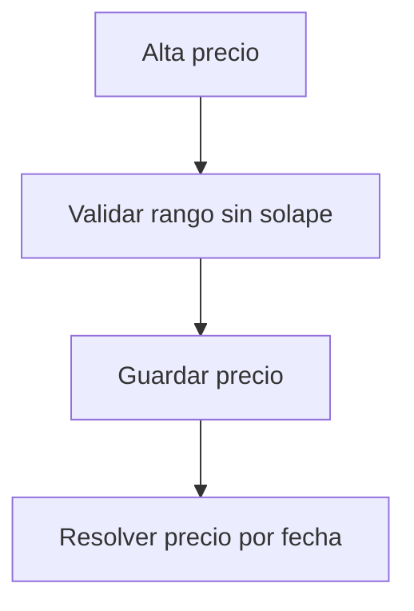
```mermaid
flowchart TD
  A[Alta precio] --> B[Validar rango sin solape]
  B --> C[Guardar precio]
  C --> D[Resolver precio por fecha]
```

---

## 7) `sales/` (ventas e ítems; estados)

**Rol**: Crear venta, gestionar ítems, totales y estados.

**Módulos**

- `models.py`: `VENTA`, `VENTA_ITEM` (métodos de recálculo)
- `services.py`: `crear_venta`, `agregar_items`, `finalizar_venta`
- `calculations.py`: subtotal, total, saldo
- `serializers.py`, `views.py`
- `fsm.py`: transiciones de estado

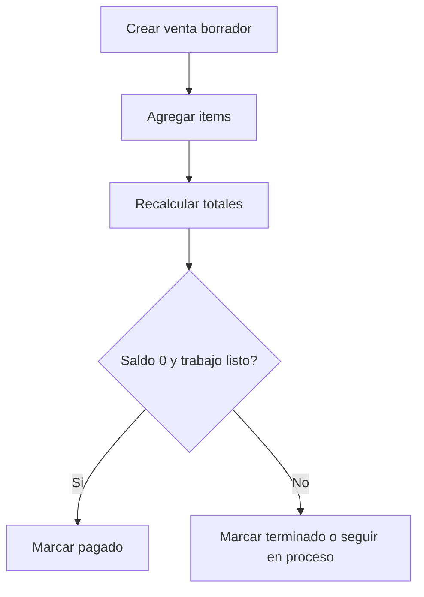
```mermaid
flowchart TD
  A[Crear venta borrador] --> B[Agregar items]
  B --> C[Recalcular totales]
  C --> D{Saldo 0 y trabajo listo?}
  D -->|Si| E[Marcar pagado]
  D -->|No| F[Marcar terminado o seguir en proceso]
```

---

## 8) `payments/` (pagos e idempotencia)

**Rol**: Registrar pagos, actualizar saldo, transición a pagado.

**Módulos**

- `models.py`: `PAGO`
- `services.py`: `registrar_pago` con `idempotency_key`
- `serializers.py`, `views.py`
- `validators.py`: `monto > 0`, límite por saldo

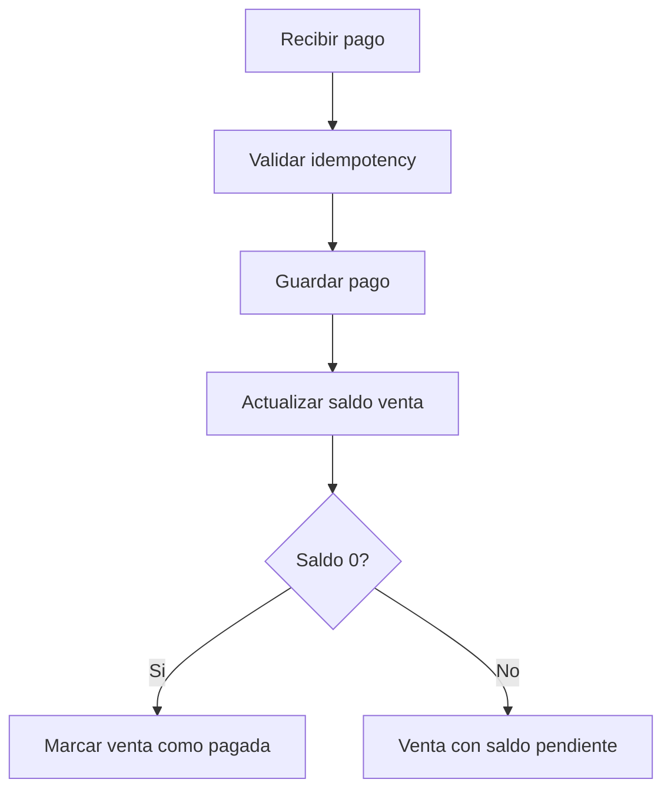
```mermaid
flowchart TD
  A[Recibir pago] --> B[Validar idempotency]
  B --> C[Guardar pago]
  C --> D[Actualizar saldo venta]
  D --> E{Saldo 0?}
  E -->|Si| F[Marcar venta como pagada]
  E -->|No| G[Venta con saldo pendiente]
```

---

## 9) `invoicing/` (comprobante no fiscal + secuencia)

**Rol**: Emitir comprobante con numeración atómica por sucursal/tipo.

**Módulos**

- `models.py`: `COMPROBANTE`, `SECUENCIA_COMPROBANTE`
- `services.py`: `emitir_comprobante` (`select_for_update` sobre secuencia)
- `pdf.py`: generador PDF simple (placeholder MVP)
- `serializers.py`, `views.py`

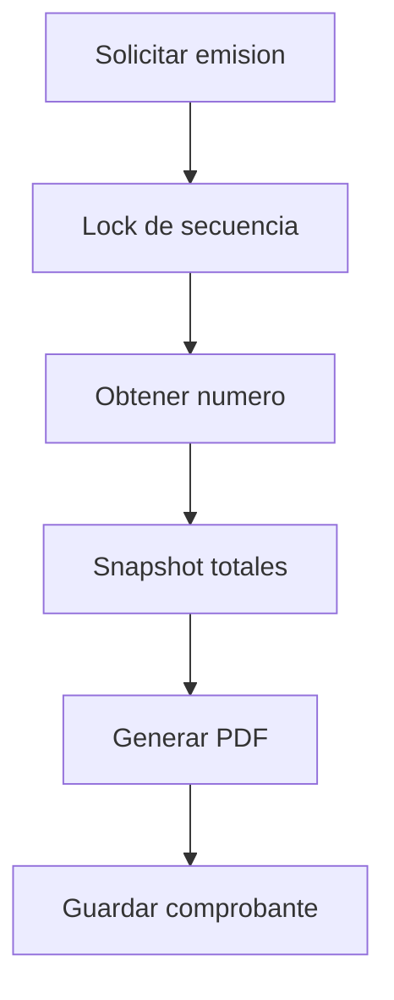
```mermaid
flowchart TD
  A[Solicitar emision] --> B[Lock de secuencia]
  B --> C[Obtener numero]
  C --> D[Snapshot totales]
  D --> E[Generar PDF]
  E --> F[Guardar comprobante]
```

---

## 10) `notifications/` (plantillas y logs)

**Rol**: Render de mensajes y registro de envíos.

**Módulos**

- `models.py`: `PLANTILLA_NOTIF`, `LOG_NOTIF`
- `services.py`: `enviar_notificacion(venta, clave_plantilla)`
- `renderers.py`: placeholders estándar
- `serializers.py`, `views.py`

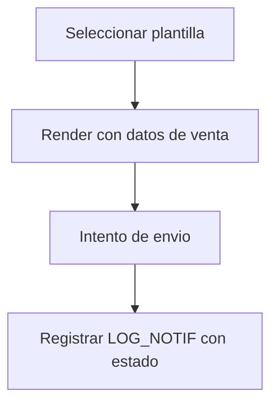
```mermaid
flowchart TD
  A[Seleccionar plantilla] --> B[Render con datos de venta]
  B --> C[Intento de envio]
  C --> D[Registrar LOG_NOTIF con estado]
```

---

## 11) `cashbox/` (cierres de caja)

**Rol**: Consolidar pagos por rango y método; generar cierre + totales.

**Módulos**

- `models.py`: `CIERRE_CAJA`, `CIERRE_CAJA_TOTAL`
- `services.py`: `cerrar_caja(sucursal, desde, hasta)`
- `serializers.py`, `views.py`

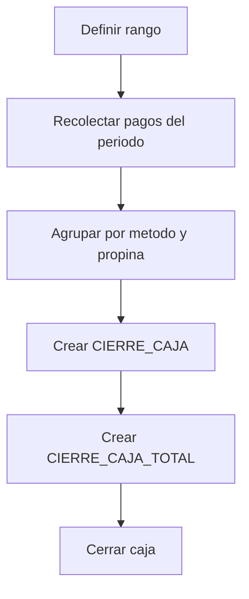
```mermaid
flowchart TD
  A[Definir rango] --> B[Recolectar pagos del periodo]
  B --> C[Agrupar por metodo y propina]
  C --> D[Crear CIERRE_CAJA]
  D --> E[Crear CIERRE_CAJA_TOTAL]
  E --> F[Cerrar caja]
```

---

## 12) `saas/` (planes y suscripciones — estructura básica)

**Rol**: Estructura para planes y facturas SaaS (automatización luego).

**Módulos**

- `models.py`: `PLAN_SAAS`, `SUSCRIPCION_SAAS`, `FACTURA_SAAS`, `PAGO_SAAS`
- `services.py`: alta suscripción, emitir factura demo
- `serializers.py`, `views.py`

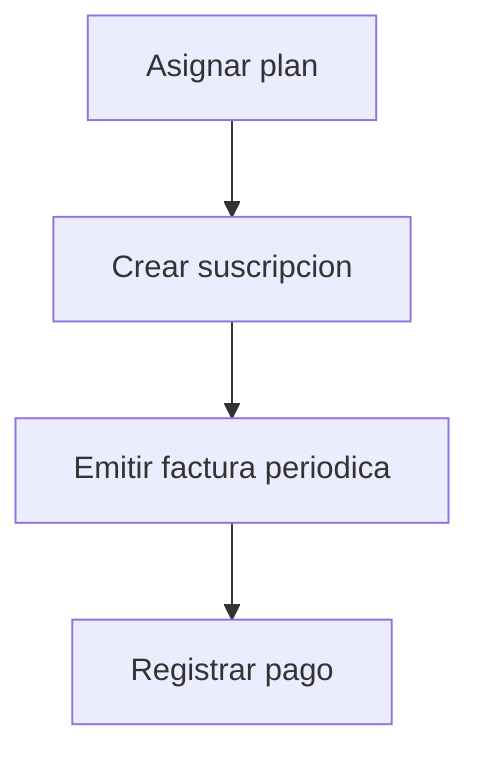
```mermaid
flowchart TD
  A[Asignar plan] --> B[Crear suscripcion]
  B --> C[Emitir factura periodica]
  C --> D[Registrar pago]
```

---

## 13) `audit/` y `app_log/` (observabilidad mínima)

**Rol**: Auditoría de cambios y logs de eventos.

**Módulos**

- `audit/models.py`: `AUDITORIA_CAMBIO`
- `audit/middleware.py`: captura de cambios CRUD simples
- `app_log/models.py`: `APP_LOG`
- `app_log/services.py`: registrar eventos técnicos/de negocio

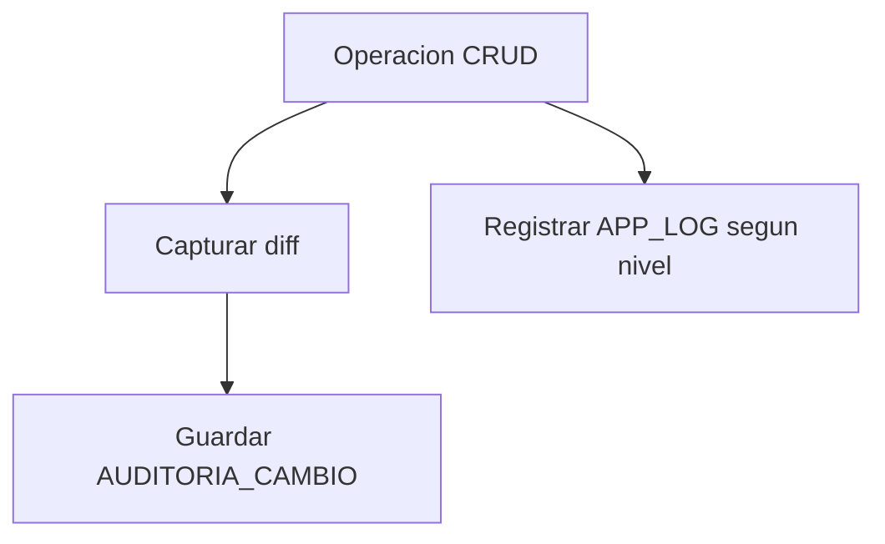
```mermaid
flowchart TD
  A[Operacion CRUD] --> B[Capturar diff]
  B --> C[Guardar AUDITORIA_CAMBIO]
  A --> D[Registrar APP_LOG segun nivel]
```

---

## 14) Diagrama de dependencias entre apps (alto nivel)

```mermaid
flowchart LR
  accounts --> org
  accounts --> customers
  accounts --> vehicles
  org --> pricing
  catalog --> pricing
  vehicles --> sales
  customers --> sales
  pricing --> sales
  sales --> payments
  sales --> invoicing
  sales --> notifications
  payments --> cashbox
  invoicing --> notifications
  org --> cashbox
  saas --> org
```

---

## 15) Contratos de servicios (resumen de E/S por app)

- **customers**: `upsert_cliente(empresa, datos)` → `CustomerDTO`
- **vehicles**: `upsert_vehiculo(empresa, cliente, datos)` → `VehicleDTO`
- **pricing**: `resolver_precio(empresa, sucursal, servicio, tipo, fecha)` → `{precio, moneda}`
- **sales**: `crear_venta(...)` → `VentaDTO`; `agregar_items(venta, items, fecha)` → `VentaDTO`; `finalizar_venta(venta)` → `VentaDTO`
- **payments**: `registrar_pago(venta, metodo, monto, es_propina?, key?)` → `VentaDTO`
- **invoicing**: `emitir_comprobante(venta, tipo, pv, cf?)` → `ComprobanteDTO`
- **notifications**: `enviar_notificacion(venta, plantilla)` → `log_id`
- **cashbox**: `cerrar_caja(empresa, sucursal, desde, hasta)` → `CierreCajaDTO`

---

## 16) Reglas transversales (mínimas y prácticas)

- **Multitenancy**: `empresa_id` obligatorio en todo; filtros por defecto en managers.
- **Estados de venta**: transiciones controladas; no finalizar sin ítems.
- **Idempotencia** en pagos y emisión de comprobantes (lock de secuencia).
- **Validación de precios**: sin solapamiento por tupla `(empresa, sucursal, servicio, tipo)`.
- **Unicidades**: patente por empresa; servicio por nombre normalizado y empresa.

---

# LavaderosApp — Documentación de **Estructura General**

> **Objetivo**: Establecer la arquitectura de carpetas, los layouts de UI y las convenciones transversales del proyecto.  
> **Alcance**: Estructura global, _no_ de cada módulo; dejamos listo el terreno para seguir “app por app”.  
> **Stack**: Django (server-rendered) + Bootstrap 5 (tema Bootswatch local). **Sin DRF**.

---

## 1) Árbol del proyecto (actualizado)

```bash
lavaderosapp/
├── manage.py
├── .env
├── .gitignore
├── README.md
├── lavaderos/
│   ├── __init__.py
│   ├── urls.py                      # enrutamiento global (incluye urls de apps)
│   ├── tenancy.py                   # utilidades multi-tenant (subdominio/header) [opcional]
│   ├── middleware.py                # TenancyMiddleware: inyecta empresa/sucursal en request
│   ├── permissions.py               # permisos/roles reutilizables a nivel proyecto
│   └── settings/
│       ├── __init__.py
│       ├── base.py                  # base común a todos los entornos
│       ├── development.py           # DEBUG, sqlite, email consola
│       ├── production.py            # Postgres, seguridad, SMTP real
│       └── render.py                # ajustes para Render.com (si aplica)
├── templates/                       # templates globales + overrides de librerías
│   ├── base.html                    # layout PÚBLICO (landing, marketing, login/signup)
│   ├── base_auth.html               # layout AUTENTICADO (navbar compacto + sidebar)
│   ├── home_dashboard.html          # panel contextual para usuarios logueados
│   ├── includes/
│   │   ├── _navbar_public.html      # navbar público (CTA de login/signup)
│   │   ├── _navbar_auth.html        # navbar autenticado (perfil, membresías, salir)
│   │   ├── _sidebar.html            # menú lateral principal (apps, selector de sucursal)
│   │   ├── _messages.html           # Django messages (alerts Bootstrap)
│   │   ├── _footer.html             # pie de página
│   │   └── _pagination.html         # componente reutilizable de paginación
│   ├── account/                     # overrides de django-allauth
│   │   ├── login.html
│   │   ├── signup.html
│   │   ├── password_reset.html
│   │   ├── password_reset_done.html
│   │   ├── password_reset_from_key.html
│   │   ├── password_reset_from_key_done.html
│   │   ├── password_change.html
│   │   └── password_change_done.html
│   └── errors/                      # páginas de error personalizadas
│       ├── 401.html
│       ├── 403.html
│       ├── 404.html
│       └── 500.html
├── static/                          # assets globales versionados
│   ├── css/
│   │   ├── bootswatch/brite.min.css # tema Bootstrap local
│   │   └── app.css                  # reservado para estilos propios (mínimos)
│   ├── js/
│   │   ├── bootstrap.bundle.min.js  # Bootstrap + Popper
│   │   └── app.js                   # scripts globales (inicializaciones)
│   ├── img/
│   │   └── logo.png
│   └── vendor/                      # librerías opcionales (bootstrap-icons, chart.js, etc.)
├── media/                           # uploads en desarrollo (en prod: storage externo)
├── staticfiles/                     # destino de collectstatic (no editar a mano)
└── apps/                            # **todas** las apps de dominio
    ├── accounts/                    # auth (allauth), perfil, membresías
    ├── org/                         # lavadero (Empresa), Sucursal, selector
    ├── customers/
    ├── vehicles/
    ├── catalog/
    ├── pricing/
    ├── sales/
    ├── payments/
    ├── invoicing/
    ├── notifications/
    ├── cashbox/
    ├── saas/                        # planes/limitaciones (ej. 1 empresa por usuario)
    ├── audit/
    └── app_log/
```

> **Regla de oro**: los templates de cada app viven en `apps/<app>/templates/<app>/**`. Así evitamos colisiones de nombres y mantenemos aislamiento por dominio.

---

## 2) Layouts y herencia de templates

### 2.1 `templates/base.html` (público)

- **Uso**: landing/marketing, login/signup y páginas no autenticadas.
- **Bloques clave**: `title`, `meta_description`, `navbar`, `hero`, `content`, `extra_css`, `extra_js`, `footer`.
- **Navbar**: incluye `includes/_navbar_public.html` (sobrescribir `block navbar` si se desea otra cabecera).
- **Hero**: bloque opcional; se puede anular con ``.

### 2.2 `templates/base_auth.html` (autenticado)

- **Uso**: toda página tras login.
- **Composición**:
  - Navbar compacto: `includes/_navbar_auth.html` (perfil, membresías, logout).
  - **Layout con sidebar**:
    - Columna fija con `includes/_sidebar.html` (menú acordeón y **selector de sucursal**).
    - Contenedor principal para ``.
- **Mensajes**: `_messages.html` integrado antes del contenido.

### 2.3 `templates/home_dashboard.html`

- **Uso**: panel contextual tras login.
- **Lógica de presentación** (sin entrar al código):
  - Sin lavadero → CTA “Crear lavadero”.
  - Con lavadero pero sin sucursales → CTA “Crear primera sucursal”.
  - “Listo para operar” (≥ 1 sucursal) → accesos rápidos y widgets placeholder (KPIs).

---

## 3) Partials globales (includes)

- **`_navbar_public.html`**: marca + CTAs “Ingresar” / “Crear cuenta”. Sin enlaces de operación.
- **`_navbar_auth.html`**: avatar/nombre, accesos a **Perfil**, **Membresías**, **Cambiar contraseña** y **Salir**. Navegación funcional se deriva al **sidebar**.
- **`_sidebar.html`**:
  - Encabezado: **Lavadero actual** (empresa activa).
  - **Selector de Sucursal** (`<select>` con `onchange=submit`) que hace **POST** a una ruta de selector (centraliza la fijación en sesión).
  - Acordeones: Organización, Operación, Maestros, Reportes, Administración (links preparados; algunos módulos aún en desarrollo).
- **`_messages.html`**: renderiza `django.contrib.messages` a Bootstrap alerts.
- **`_pagination.html`**: tabla/listados con paginación consistente.
- **`_footer.html`**: pie común (legal/links).

> **Convención**: cualquier página autenticada que necesite navegación de negocio **debe** extender `base_auth.html` para heredar sidebar y mensajes.

---

## 4) Estáticos (static/) y assets

- **Bootstrap**: tema **Bootswatch “brite”** local (`static/css/bootswatch/brite.min.css`).  
  No dependemos de CDNs.
- **JS**: `bootstrap.bundle.min.js` + `app.js` para inicializaciones (por ejemplo, tooltips).
- **Imágenes**: `static/img/` (logo, íconos básicos).
- **Vendor**: espacio para librerías de terceros sin NPM (p. ej., `bootstrap-icons/`).
- **Producción**: ejecutar `collectstatic` → servir `staticfiles/` (Nginx u otro).

---

## 5) Settings y middleware (resumen de integración)

- `INSTALLED_APPS` (clave):
  - `django.contrib.sites`, `allauth`, `allauth.account`
  - Apps propias (`apps.org`, `apps.accounts`, …)
  - `SITE_ID = 1`
- `MIDDLEWARE`:
  - **`lavaderos.middleware.TenancyMiddleware`** (inyecta `request.empresa_activa` y `request.sucursal_activa` desde sesión; si falta, intenta fijar por defecto la primera empresa del usuario).
- `TEMPLATES`:
  - `DIRS = [BASE_DIR / "templates"]`
  - `context_processors.request` **habilitado** (requerido por allauth y varios templates).
- Allauth (email-only recomendado en MVP):
  - `ACCOUNT_AUTHENTICATION_METHOD="email"`
  - `ACCOUNT_EMAIL_REQUIRED=True`
  - `ACCOUNT_EMAIL_VERIFICATION="none"` (en prod real: `"mandatory"`)
  - `ACCOUNT_USERNAME_REQUIRED=False`
  - `ACCOUNT_LOGOUT_ON_GET=True`
  - `LOGIN_REDIRECT_URL="/"`, `LOGOUT_REDIRECT_URL="/"`

---

## 6) Convenciones por app (estructura recomendada)

Cada módulo en `apps/<app>/` sigue este patrón (MVP):

```bash
apps/<app>/
├── __init__.py
├── apps.py
├── admin.py
├── migrations/
│   └── __init__.py
├── models.py
├── urls.py
├── views.py                     # CBVs; delgadas; usan services/selectors
├── forms/
│   ├── __init__.py
│   └── <app>.py
├── services/
│   ├── __init__.py
│   └── casos_de_uso.py          # lógica de dominio (crear/editar, etc.)
├── selectors.py                 # lecturas/queries para vistas
├── permissions.py               # reglas de acceso/roles específicas del app
├── templates/<app>/             # templates namespaced de la app
│   └── ...
└── static/<app>/                # assets propios del módulo
    └── ...
```

**Principios**:

- **Separation of concerns**: vistas delgadas; mutaciones en `services/`, lecturas en `selectors.py`.
- **Templates con Bootstrap** directo (solo clases en HTML; sin CSS custom salvo casos puntuales).
- **Nombres namespaced** (`templates/<app>/**`) para evitar choques entre apps.

---

## 7) Ruteo global y convenciones de URL

- `lavaderos/urls.py` incluye:
  - `/accounts/` (django-allauth)
  - Rutas de **accounts** propias (perfil, membresías), p. ej.: `/cuenta/perfil/`, `/cuenta/membresias/`
  - Rutas por **app** con prefijos claros (`/org/...`, `/clientes/...`, etc.).
- **Nombrado**: `app_namespace:view_name` (p. ej., `org:sucursales`), para usar con `` sin ambigüedad.

---

## 8) Tenancy (multi-tenant simplificado)

- **Plan estándar**: 1 empresa por usuario (controlado desde `apps/saas/` o settings).
- **Sesión**:
  - `empresa_id`: lavadero activo
  - `sucursal_id`: sucursal activa dentro del lavadero
- **TenancyMiddleware**:
  - Carga `request.empresa_activa` / `request.sucursal_activa`.
  - Si `empresa_id` no existe y el usuario tiene empresas, fija la **primera** por defecto.
  - Si `sucursal_id` no pertenece a la empresa activa, se limpia.
- **Selector centralizado**: un único endpoint que recibe `POST` con `sucursal` (y, en planes superiores, `empresa`) para actualizar la sesión.

> Esto permite que **cualquier** vista pueda suponer un contexto consistente (`request.empresa_activa`, `request.sucursal_activa`) sin duplicar lógica.

---

## 9) Accesibilidad, SEO y calidad

- **A11y**: skip link, labels, `autocomplete` en formularios, colores y contrastes por Bootstrap.
- **SEO meta** en `base.html`: `title`, `description`, Open Graph y Twitter Cards con valores por defecto y bloques sobrescribibles.
- **Mensajería** clara: usar `django.contrib.messages` para éxitos y errores de validación/flujo.
- **Errores**: páginas personalizadas en `templates/errors/` (401/403/404/500).

---

## 10) Cómo agregar una página nueva (checklist)

1. Elegí layout: **público** (`base.html`) o **autenticado** (`base_auth.html`).
2. Creá el template en `apps/<app>/templates/<app>/mi_pagina.html` y extendé el layout correspondiente.
3. Agregá la **CBV** en `views.py` y la ruta en `urls.py` del app (namespace).
4. Si la página necesita navegación del sistema, usa **`base_auth.html`** para heredar sidebar.
5. Mostrá feedback con `messages` y, si es un form, **errores de campo y `non_field_errors`**.
6. (Opcional) Añadí assets específicos en `apps/<app>/static/<app>/` y referencialos con ``.

---

# Módulo 1 — `apps/accounts` (Autenticación, Perfil y Membresías)

> **Objetivo:** Integrar **django-allauth** (login/registro/cierre de sesión y recuperación de clave), exponer vistas server-rendered para **Perfil** y **Membresías**, y modelar la relación **Usuario ↔ Empresa (rol)** del SaaS.  
> **Fuera de alcance:** alta/edición de Empresa/Sucursal (vive en `apps/org`) y flujos de operación/ventas.

---

## 1) Estructura del módulo (MVP final)

```
apps/accounts/
├─ __init__.py
├─ apps.py
├─ admin.py
├─ migrations/
│  └─ __init__.py
├─ models.py                  # EmpresaMembership (User↔Empresa, rol)
├─ urls.py                    # /cuenta/perfil/, /cuenta/membresias/
├─ views.py                   # ProfileView, MembershipListView (server-rendered)
├─ forms/
│  ├─ __init__.py             # Login/Signup + Reset/Set/Change Password (Bootstrap)
│  └─ profile.py              # ProfileForm (Bootstrap)
├─ services/
│  ├─ __init__.py
│  ├─ memberships.py          # ensure_membership, cambio de rol
│  └─ profile.py              # update_user_profile
├─ selectors.py               # memberships_for(user), etc.
├─ permissions.py             # helpers de rol (admin/operador/auditor)
├─ templates/
│  └─ accounts/
│     ├─ profile.html
│     ├─ memberships.html
│     └─ _profile_form.html
```

### Estructura global de templates (overrides + layout)

```
templates/
├─ base.html
├─ includes/
│  ├─ _navbar.html            # menú Cuenta, selector de empresa, logout
│  └─ _messages.html          # alerts Bootstrap (django.messages)
└─ account/                   # overrides de allauth (sin “s”)
   ├─ login.html
   ├─ signup.html
   ├─ password_reset.html
   ├─ password_reset_done.html
   ├─ password_reset_from_key.html
   ├─ password_reset_from_key_done.html
   ├─ password_change.html            # ambio estando logueado
   └─ password_change_done.html
```

---

## 2) Qué hace cada cosa (resumen ejecutivo)

- **`models.py`**: `EmpresaMembership(user, empresa, rol)` con unicidad `(user, empresa)`.
- **`forms/__init__.py`**: _todos_ los formularios clave de allauth (login, signup, reset, set, change) inyectan clases Bootstrap a widgets (`form-control`, `form-select`, `form-check-input`) y placeholders/`autocomplete`.
- **`forms/profile.py`**: `ProfileForm` con el mismo patrón Bootstrap.
- **`views.py`**: vistas delgadas; mutaciones en **services**, lecturas en **selectors**.
- **`services/*`**: casos de uso (perfil y membresías), con logging mínimo.
- **`selectors.py`**: consultas para vistas/UX (p.ej., membresías del usuario).
- **`templates/account/*`**: todos los flujos de allauth con el layout de `base.html`.
- **`_messages.html`**: muestra feedback como alerts.
- **`_navbar.html`**: accesos a Perfil, Membresías, Selector de empresa y Logout.

> **Principio:** vistas finas; lógica en services/selectors; estilos Bootstrap desde los **forms** (no repetimos clases en cada template).

---

## 3) Settings esenciales (lo mínimo para que funcione igual en todos los entornos)

```python
INSTALLED_APPS += [
    "django.contrib.sites",
    "allauth",
    "allauth.account",
    "apps.org",        # debe migrar antes que accounts (FK)
    "apps.accounts",
]
SITE_ID = 1

MIDDLEWARE += [
    "allauth.account.middleware.AccountMiddleware",  # requerido por allauth reciente
]

TEMPLATES[0]["DIRS"] = [BASE_DIR / "templates"]
# ¡Importante! para allauth:
# "django.template.context_processors.request" debe estar en context_processors

AUTHENTICATION_BACKENDS = [
    "django.contrib.auth.backends.ModelBackend",
    "allauth.account.auth_backends.AuthenticationBackend",
]

# Email-only login (MVP)
ACCOUNT_AUTHENTICATION_METHOD = "email"
ACCOUNT_EMAIL_REQUIRED = True
ACCOUNT_EMAIL_VERIFICATION = "none"   # en prod real: "mandatory"
ACCOUNT_USERNAME_REQUIRED = False
ACCOUNT_LOGOUT_ON_GET = True          # logout inmediato (sin logout.html)
LOGIN_REDIRECT_URL = "/"
LOGOUT_REDIRECT_URL = "/"

ACCOUNT_FORMS = {
    "login": "apps.accounts.forms.LoginForm",
    "signup": "apps.accounts.forms.SignupForm",
    "reset_password": "apps.accounts.forms.ResetPasswordForm",
    "reset_password_from_key": "apps.accounts.forms.ResetPasswordKeyForm",
    "change_password": "apps.accounts.forms.ChangePasswordForm",  # opcional
}
```

---

## 4) Rutas y vistas (qué URL usa qué template)

**Allauth (ya provisto, con nuestros overrides):**

- `/accounts/login/` → `account/login.html`
- `/accounts/signup/` → `account/signup.html`
- `/accounts/logout/` → inmediato si `ACCOUNT_LOGOUT_ON_GET=True` (sin template)
- `/accounts/password/reset/` → `account/password_reset.html`
- `/accounts/password/reset/done/` → `account/password_reset_done.html`
- `/accounts/password/reset/key/<uidb36>-<key>/` → `account/password_reset_from_key.html`
- `/accounts/password/reset/key/done/` → `account/password_reset_from_key_done.html`
- `/accounts/password/change/` → `account/password_change.html` _(opcional)_
- `/accounts/password/change/done/` → `account/password_change_done.html` _(opcional)_

**Accounts (esta app):**

- `/cuenta/perfil/` → perfil (GET/POST)
- `/cuenta/membresias/` → listado de empresas y rol; botón **“Activar”** → `/org/seleccionar/?empresa=<id>`

---

## 5) Modelado de membresías (multi-tenant)

- `EmpresaMembership(user, empresa, rol)` con choices (`admin`, `operador`, `auditor`).
- Un registro **único por (user, empresa)**.
- **Dependencia**: `org.Empresa` debe existir y migrar **antes**.
- Uso en UI: `memberships.html` linkea al selector `/org/seleccionar/`.

---

## 6) UX / UI (convenciones)

- **Bootstrap 5** global en `base.html` (tema Bootswatch ok).
- **Mensajes** → `_messages.html` (alerts).
- **Navbar** → `_navbar.html` con acciones de cuenta y chip de empresa activa (si `empresa_id` en sesión).
- **Accesibilidad**: labels y `autocomplete` correctos; placeholders coherentes.

---

## 7) Seguridad / permisos

- Vistas del módulo → requieren **usuario autenticado**.
- No se mutan empresas ni roles desde `accounts`.
- CSRF por defecto en formularios server-rendered.
- Reutilizar `permissions.py` donde aplique.

---

## 8) Pasos de verificación rápida

1. Migrar `org` y `accounts` (en ese orden).
2. Crear una **Empresa** en admin y asignar membresía al usuario.
3. Probar: signup → login → perfil → membresías → activar empresa.
4. Probar “¿Olvidaste tu contraseña?” en login:
   - reset → done → link email → set password → done.

---

## 9) Estado actual y próximos pasos

- **Estado**: `accounts` completo (allauth con Bootstrap, perfil, membresías, integración con selector de `org`).
- **Siguiente**: `apps/org` CRUD Empresa/Sucursal y middleware de tenancy (inyectar `empresa_activa` en request/plantillas).
- **Producción**: valorar `ACCOUNT_EMAIL_VERIFICATION="mandatory"` y backend SMTP real.

> **Decisión registrada:** estilos centralizados en **forms**; overrides de templates en `templates/account/`; vistas delgadas con lógica en services/selectors. La selección de empresa vive en `org` y se invoca desde “Membresías”.

# Módulo 2 — `apps/org` (Lavadero/Empresa, Sucursales, Empleados y Contexto)

> **Objetivo:** Modelar **Lavadero (Empresa)** y **Sucursales**, proveer el **onboarding** (crear lavadero → crear sucursal), mantener el **contexto activo** (empresa/sucursal) y permitir a la empresa **gestionar empleados y permisos**.  
> **Alcance:** Django server-rendered (sin DRF), CBVs, Bootstrap 5, permisos centralizados.  
> **Integración SaaS:** límites y suscripciones se resuelven vía `apps.saas` (`limits.py`, `services/subscriptions.py`).

---

## 1) Estructura del módulo (actualizada)

```
apps/org/
├─ __init__.py
├─ apps.py
├─ admin.py
├─ migrations/
│  └─ __init__.py
├─ models.py                 # Empresa (+ cashbox_policy), EmpresaConfig (opcional), Sucursal
├─ urls.py                   # /org/...
├─ views.py                  # CBVs: empresas, sucursales, empleados, selector, post-login
├─ forms/
│  ├─ __init__.py
│  └─ org.py                 # EmpresaForm, SucursalForm, EmpleadoForm
├─ services/
│  ├─ __init__.py
│  ├─ empresa.py             # (opcional)
│  └─ sucursal.py            # (opcional)
├─ selectors.py              # empresas_para_usuario, etc.
├─ permissions.py            # Perm, ROLE_POLICY, mixins (centraliza permisos)
├─ utils.py                  # get_cashbox_policy(empresa)  ← NUEVO helper liviano
├─ templatetags/
│  ├─ __init__.py
│  └─ org_perms.py           #  en templates
├─ templates/
│  └─ org/
│     ├─ empresas.html
│     ├─ empresa_form.html
│     ├─ sucursales.html
│     ├─ sucursal_form.html
│     ├─ empleados.html
│     └─ empleado_form.html
├─ static/
│  └─ org/
│     ├─ org.js
│     └─ org.css
└─ emails/
   └─ empresa_created.txt    # (opcional)
```

**Notas de diseño**

- **Vistas delgadas**: la lógica de permisos y contexto vive en `permissions.py`; las vistas declaran `required_perms` y heredan de los mixins de `org`.
- **Bootstrap 5** en templates; formularios “limpios” (sin seguridad).
- **Onboarding** guiado (signup → empresa → primera sucursal).
- **Límites por plan**: todo el gating pasa por `apps.saas.limits` y la suscripción vigente de la empresa.
- **Política de Caja (empresa)**: `Empresa.cashbox_policy` define cómo otros módulos (p. ej. `payments`, `cashbox`) exigen caja abierta.

---

## 2) Modelos (resumen)

### `Empresa`

- Campos principales: `nombre`, `subdominio` (único), `logo`, `activo`, timestamps.
- Relaciones: `memberships` (`accounts.EmpresaMembership`), `sucursales`, **`suscripcion`** (OneToOne con `saas.SuscripcionSaaS`).
- Contexto en sesión: `empresa_id`.

**Política de Caja (nuevo campo):**

- `cashbox_policy: CharField(choices=CashboxPolicy, default=PAYMENTS_ONLY)`
- `CashboxPolicy`:
  - `STRICT` → ventas **y** pagos requieren caja abierta.
  - `PAYMENTS_ONLY` (default) → solo los pagos requieren caja abierta.
  - `BY_METHOD` → enforcement por medio de pago (granular, si el resto del sistema lo implementa).

> Uso recomendado desde otros módulos: **no** leer el campo directamente; usar `org.utils.get_cashbox_policy(empresa)`.

### `Sucursal`

- Campos: `empresa` (FK), `nombre`, `direccion` (opcional), `codigo_interno` (único por empresa, **autogenerado en `save()`**).
- Contexto en sesión: `sucursal_id`.

### `EmpresaConfig` (opcional)

- Par `clave/valor` JSON por empresa para parámetros no críticos.

---

## 3) Formularios (`forms/org.py`)

- `EmpresaForm`: `nombre`, `subdominio`, `logo`, `activo` (en alta, forzado a `True`), **`cashbox_policy`** (desplegable con las 3 opciones).
- `SucursalForm`: `nombre`, `direccion` (sin `codigo_interno`).
- `EmpleadoForm`: `email`, `rol` (`admin` / `operador`), `sucursal_asignada`, `password_inicial` (solo crear).

---

## 4) Permisos centralizados (`permissions.py`)

- **`Perm`** (extracto org): `ORG_VIEW`, `ORG_EMPRESAS_MANAGE`, `ORG_SUCURSALES_MANAGE`, `ORG_EMPLEADOS_MANAGE` (extensible con otros módulos).
- **`ROLE_POLICY`** asigna el conjunto de permisos efectivos por rol (admin/operador/…).
- **Mixins clave**:
  - `EmpresaPermRequiredMixin`: resuelve **contexto** (empresa/membership), valida `required_perms` y evita loops con `SAFE_VIEWNAMES`.
- **Helper**:
  - `has_empresa_perm(user, empresa, perm)`: única función para verificar permisos desde cualquier módulo.

> `org` no “decide” reglas de negocio de otros módulos; solo provee **contexto + permisos** consistentes.

---

## 5) Gating por Plan (integración con `apps.saas`)

- Consultas de límite vía **`apps.saas.limits`** (p. ej., `can_create_empresa(user)`, `can_create_sucursal(empresa)`, `can_add_usuario_a_empresa(empresa)`, `can_add_empleado(sucursal)`).
- **Enforcement**:
  - **Soft** (default): UI muestra mensajes y deshabilita CTAs; el `POST` valida y devuelve alerta si corresponde.
  - **Hard** (`settings.SAAS_ENFORCE_LIMITS = True`): además, los `POST` bloquean la creación si `should_block()` es `True`.
- **Suscripción por defecto**: tras crear empresa se llama a `ensure_default_subscription_for_empresa(empresa)`.

---

## 6) Vistas (CBVs) y comportamiento

- **`EmpresaListView`** (`/org/empresas/`): `required_perms = (ORG_VIEW,)`.  
  Contexto: `puede_crear_empresa`, `gate_empresa_msg` (de `limits`).

- **`EmpresaCreateView`** (onboarding): valida `can_create_empresa(user)` → crea Empresa + `EmpresaMembership` (owner/admin/activa) → guarda `empresa_id` en sesión → `ensure_default_subscription_for_empresa` → redirige a crear la primera sucursal.  
  El formulario incluye `cashbox_policy` (default `PAYMENTS_ONLY`).

- **`EmpresaUpdateView`**: `ORG_EMPRESAS_MANAGE` (incluye edición de `cashbox_policy`).

- **`SucursalListView`** / **`SucursalCreateView`** / **`SucursalUpdateView`**: `ORG_VIEW` / `ORG_SUCURSALES_MANAGE` (sin cambios funcionales).

- **Empleados** (`List/Create/Update/Acciones`): `ORG_EMPLEADOS_MANAGE`.  
  `EmpleadoCreateView` valida `can_add_usuario_a_empresa(empresa)` y, si hay sucursal, `can_add_empleado(sucursal)`.

- **`SelectorEmpresaView`** / **`PostLoginRedirectView`**: mantienen/sanean contexto (empresa/sucursal) y evitan loops.

---

## 7) URLs (namespace `org`) — incluye empleados

```
/org/empresas/                      name="org:empresas"
/org/empresas/nueva/                name="org:empresa_nueva"
/org/empresas/<int:pk>/editar/      name="org:empresa_editar"

# Sucursales
/org/sucursales/                    name="org:sucursales"
/org/sucursales/nueva/              name="org:sucursal_nueva"
/org/sucursales/<int:pk>/editar/    name="org:sucursal_editar"

# Empleados
/org/empleados/                     name="org:empleados"
/org/empleados/nuevo/               name="org:empleado_nuevo"
/org/empleados/<int:pk>/editar/     name="org:empleado_editar"
# Acciones POST-only
/org/empleados/<int:pk>/reset-pass/ name="org:empleado_reset_pass"
/org/empleados/<int:pk>/toggle/     name="org:empleado_toggle"
/org/empleados/<int:pk>/eliminar/usuario/  name="org:empleado_eliminar_usuario"

# Selector
/org/seleccionar/                   name="org:selector"
```

---

## 8) Templates (UI/UX + permisos + límites)

- Cargar `` para CTAs condicionados por permisos.
- Mostrar mensajes con `` (ya en `base_auth.html`).
- Variables de UI típicas (si la vista las provee):  
  `puede_crear_empresa`, `gate_empresa_msg`, `puede_crear_sucursal`, `gate_sucursal_msg`, `puede_agregar_empleado`, `gate_empleado_msg`.
- `org` no renderiza estado de caja; si la UI global lo muestra, esa lógica vive en `cashbox`/`payments` y consulta permisos/política.

---

## 9) Sesión y Middleware (Tenancy)

- Claves de sesión: `empresa_id`, `sucursal_id`.
- `TenancyMiddleware` inyecta `request.empresa_activa` / `request.sucursal_activa` y limpia inconsistencias.
- `EmpresaPermRequiredMixin` y `SelectorEmpresaView` evitan redirecciones cíclicas con `SAFE_VIEWNAMES`.

---

## 10) Seguridad y reglas

- Solo **miembros activos** operan sobre una empresa.
- `owner`: no editable/deshabilitable/eliminable desde la UI de empleados.
- Acciones destructivas: **POST-only** + **CSRF** + modales de confirmación.
- Si una membresía queda inactiva y el usuario no tiene otras activas, se puede marcar `user.is_active = False` (criterio del producto).

---

## 11) Onboarding (secuencia)

```mermaid
sequenceDiagram
  participant U as Usuario
  participant WEB as Vistas Django
  participant DB as DB

  U->>WEB: /accounts/signup -> login
  WEB-->>U: redirect / (Panel)

  alt sin lavadero
    U->>WEB: POST /org/empresas/nueva/
    WEB->>DB: create Empresa + EmpresaMembership(admin/owner)
    DB-->>WEB: Empresa {id, cashbox_policy=PAYMENTS_ONLY}
    note over WEB,U: session.empresa_id = id
    WEB-->>U: redirect /org/sucursales/nueva/
  end

  U->>WEB: POST /org/sucursales/nueva/
  WEB->>DB: create Sucursal(empresa_id = session.empresa_id)
  DB-->>WEB: Sucursal {id}

  alt primera sucursal
    WEB-->>U: redirect /(Panel) + success Listo para operar
  else mas sucursales
    WEB-->>U: redirect /org/sucursales/ + success
  end
```

---

## 12) Planes (SaaS)

- **Límites por plan** en `saas.PlanSaaS` (p. ej., `max_sucursales_por_empresa`, `max_usuarios_por_empresa`, `max_empleados_por_sucursal`, etc.).
- **Gating centralizado** en `saas/limits.py` (cada función retorna mensaje y `should_block()`).
- **Enforcement** configurable: `SAAS_ENFORCE_LIMITS = False` (soft, default) / `True` (hard).
- **Suscripción por defecto**: `ensure_default_subscription_for_empresa(empresa)` tras crear empresa.

---

## 13) Auditoría y datos históricos

- Al eliminar usuarios, **preservar** trazabilidad del negocio: usar FK `SET_NULL` + campos denormalizados de autor (p. ej., `autor_email`, `autor_nombre`) en entidades críticas.
- Las entidades de negocio deben ligar historial a **empresa/sucursal**, no al usuario.

---

## 14) Errores comunes

- No se ven avisos de límites → incluir `_messages.html` y pasar variables `puede_*`/`gate_*` desde las vistas.
- Se crean recursos fuera de plan → verificar `SAAS_ENFORCE_LIMITS` y usar `limits.*` en los `POST`.
- Permisos “no aplican” → confirmar que todas las CBVs usan `EmpresaPermRequiredMixin` y definen `required_perms`.

---

## 15) Extensiones previstas

- Invitaciones por correo con token (alta de empleados sin password directo).
- Auditoría fina (quién cambió `cashbox_policy`, cuándo).
- `SucursalConfig` si hubiera políticas específicas a nivel sucursal.

---

## 16) Integraciones que consultan `org`

- **Cashbox/Payments/Sales** obtienen el contexto de empresa/sucursal y verifican permisos vía `has_empresa_perm(...)`.
- **Política de Caja**: usar `org.utils.get_cashbox_policy(empresa)` para decidir enforcement de caja abierta en flujos de pago/venta.

---

### Resumen ejecutivo

- `apps/org` concentra **contexto**, **permisos** y **onboarding** de empresas/sucursales/empleados.
- Introduce `cashbox_policy` por empresa y un helper mínimo (`get_cashbox_policy`) para que otros módulos apliquen reglas de caja sin acoplarse al modelo.
- El gating por plan y suscripciones es **externo** (`apps.saas`) y configurable (soft/hard) sin tocar vistas.

# Módulo 3 — `apps/customers` (Clientes)

> **Objetivo del módulo:** Administrar los datos de los clientes (contacto, cumpleaños, notas internas). Este módulo provee la información base para asociar clientes a vehículos, ventas y notificaciones.

---

## 1) Estructura de carpetas/archivos

```
apps/customers/
├─ __init__.py
├─ apps.py                   # Config de la app (name="apps.customers")
├─ admin.py                  # Registro de Cliente en admin
├─ migrations/
│  └─ __init__.py
├─ models.py                 # Modelo Cliente
├─ urls.py                   # Rutas propias (listado, alta, edición, detalle)
├─ views.py                  # Vistas server-rendered CRUD de clientes
├─ forms/
│  ├─ __init__.py
│  └─ customer.py            # Formulario CustomerForm (validaciones + normalizaciones)
├─ services/
│  ├─ __init__.py
│  └─ customers.py           # Casos de uso: crear/editar cliente
├─ selectors.py              # Lecturas: buscar cliente por nombre/teléfono/email
├─ normalizers.py            # Normalización de datos (email, documento, teléfono, capitalización)
├─ templates/
│  └─ customers/
│     ├─ list.html           # Listado de clientes + búsqueda
│     ├─ form.html           # Alta/edición de cliente
│     ├─ detail.html         # Detalle con datos del cliente (extensible a vehículos/ventas)
│     └─ _form_fields.html   # Partial con los campos (incluible en alta/edición)
├─ static/
│  └─ customers/
│     ├─ customers.css       # Estilos propios (mínimos)
│     └─ customers.js        # Mejoras UX (placeholder para búsqueda/validaciones simples)
└─ emails/
   └─ birthday.txt           # (Opcional) plantilla de felicitación de cumpleaños
```

### Rol de cada componente

- **`models.py`**: define `Cliente` (nombre, apellido, email, teléfono WhatsApp, fecha_nac, dirección, etc.) y campos auxiliares (`tags`, `notas`, `activo`).
- **`forms/customer.py`**: `CustomerForm` con:
  - inyección de clases Bootstrap,
  - normalización de email, documento, teléfono,
  - guardado con empresa activa y usuario creador,
  - conversión de `tags` a lista.
- **`services/customers.py`**: mutaciones de dominio (crear/editar cliente).
- **`selectors.py`**: consultas de lectura (`buscar_cliente(q)`).
- **`normalizers.py`**: helpers para normalizar input (email, documento, teléfono a E.164, capitalizar textos).
- **`views.py`**: CRUD basado en `ListView`, `CreateView`, `UpdateView`, `DetailView`. Incluye vistas para activar/desactivar cliente.
- **`templates/customers/*`**: interfaz UI (listado, formulario, detalle). `_form_fields.html` maneja validación y muestra correctamente `fecha_nac`.

---

## 2) Endpoints implementados

- `/clientes/` → Listado + búsqueda de clientes.
- `/clientes/nuevo/` → Alta de cliente.
- `/clientes/<id>/editar/` → Edición de cliente.
- `/clientes/<id>/detalle/` → Detalle de cliente (con notas y estado activo/inactivo).
- `/clientes/<id>/desactivar/` → POST para desactivar cliente.
- `/clientes/<id>/activar/` → POST para reactivar cliente.
- `/clientes/<id>/eliminar/` → (opcional, solo admin, con confirmación).

---

## 3) Contratos de entrada/salida

### Alta Cliente

- **Input (POST)**: nombre, apellido, email, tel_wpp, fecha_nac, dirección, notas, activo.
- **Proceso**:
  - validación de campos obligatorios,
  - normalización de email/documento/teléfono,
  - asignación de empresa activa y usuario creador.
- **Output**: cliente creado, redirect a listado con mensaje de éxito.

### Edición Cliente

- **Input (POST)**: mismos campos.
- **Proceso**: validar cambios, conservar fecha_nac guardada si no se modifica, actualizar registro.
- **Output**: redirect con mensaje “Cliente actualizado”.

### Búsqueda Cliente

- **Input (GET)**: `q` (cadena).
- **Proceso**: selectors buscan en nombre, apellido, email, tel.
- **Output**: listado filtrado.

### Activar / Desactivar Cliente

- **Input (POST)**: acción sobre un cliente existente.
- **Proceso**: cambia flag `activo`.
- **Output**: redirect con mensaje de confirmación.

---

## 4) Dependencias e integraciones

- **Depende de `org`**: todos los clientes pertenecen a la empresa activa.
- **Integración futura con `vehicles`**: un cliente puede tener uno o varios vehículos.
- **Integración futura con `sales`**: las ventas requieren un cliente asociado.
- **Integración futura con `notifications`**: notificación de cumpleaños o segmentación por etiquetas.

---

## 5) Seguridad

- Todas las vistas requieren usuario autenticado.
- Validación multi-tenant:
  - Solo se listan/gestionan clientes de la empresa activa (`request.empresa_activa`).
- Acciones de activar/desactivar o eliminar restringidas a roles `admin` / `operador`.

---

## 6) Estado actual del módulo

- Modelo `Cliente` completo y migrado.
- `CustomerForm` con validaciones y normalización.
- Normalización de teléfono para Argentina → formato E.164 (+549…).
- Templates list, form, detail con `_form_fields.html` que muestran errores y mantienen valores (incluida fecha de nacimiento).
- Vistas CRUD + activar/desactivar implementadas.
- Admin: listado de clientes y filtros básicos.
- UX: mensajes de feedback (`django.contrib.messages`) integrados con Bootstrap.

---

## 7) Extensiones previstas

- Exportar/Importar clientes (CSV/Excel).
- Segmentación avanzada con `tags` o categorías predefinidas.
- Asociar clientes a vehículos (`apps.vehicles`).
- Mostrar historial de ventas en el `detail`.
- Hook de cumpleaños en `notifications`.
- Acciones masivas (activar/inactivar, exportar) en listado.

---

# Módulo 4 — `apps/vehicles` (Vehículos)

> **Objetivo del módulo:** Administrar los vehículos de los clientes, clasificarlos por tipo y mantenerlos disponibles para asociar a las ventas. Cada vehículo pertenece a un cliente y a una empresa (tenant).

---

## 1) Estructura de carpetas/archivos

```
apps/vehicles/
├─ __init__.py
├─ apps.py                   # Config de la app (name="apps.vehicles")
├─ admin.py                  # Registro de Vehículo y TipoVehículo en admin
├─ migrations/
│  └─ __init__.py
├─ models.py                 # Modelos: Vehiculo, TipoVehiculo
├─ urls.py                   # Rutas propias (listado, alta, edición, detalle)
├─ views.py                  # Vistas server-rendered CRUD de vehículos y tipos
├─ forms/
│  ├─ __init__.py
│  └─ vehicle.py             # Formularios de alta/edición de vehículo
├─ services/
│  ├─ __init__.py
│  ├─ vehicles.py            # Casos de uso: crear/editar vehículo
│  └─ types.py               # Casos de uso: CRUD de TipoVehiculo
├─ selectors.py              # Lecturas: buscar por patente, por cliente, listar tipos
├─ validators.py             # Validaciones específicas (ej. patente única por empresa)
├─ templates/
│  └─ vehicles/
│     ├─ list.html           # Listado de vehículos
│     ├─ form.html           # Alta/edición de vehículo
│     ├─ detail.html         # Detalle de vehículo
│     ├─ type_form.html      # Alta/edición de tipos
│     ├─ types_list.html     # Listado de tipos
│     └─ _form_fields.html   # Partial de formulario de vehículo
├─ static/
│  └─ vehicles/
│     ├─ vehicles.css        # Estilos propios (mínimos)
│     └─ vehicles.js         # Scripts UX (validaciones cliente-side, búsqueda rápida)
└─ emails/
   └─ vehicle_added.txt      # (Opcional) notificación al cliente al registrar vehículo
```

### Rol de cada componente

- **`models.py`**:
  - `TipoVehiculo`: catálogo de tipos de vehículos (auto, moto, camioneta, etc.).
  - `Vehiculo`: datos principales (cliente, tipo, marca, modelo, año, color, patente única por empresa, activo/inactivo).
- **`forms/vehicle.py`**: `VehicleForm` con validaciones y compatibilidad Bootstrap.
- **`services/vehicles.py`**: mutaciones de dominio (`crear_vehiculo`, `editar_vehiculo`, `activar_vehiculo`, `desactivar_vehiculo`).
- **`services/types.py`**: mutaciones de dominio sobre tipos de vehículo.
- **`selectors.py`**: consultas de lectura (`vehiculos_de(cliente)`, `buscar_por_patente`, `tipos_activos`).
- **`validators.py`**: helper de validación para patente única dentro de la empresa.
- **`views.py`**: CRUD con CBVs (`ListView`, `CreateView`, `UpdateView`, `DetailView`) tanto de vehículos como de tipos. Incluye mixin `BackUrlMixin` para soportar botón **Volver** en todas las vistas.
- **`templates/vehicles/*`**: interfaz UI con Bootstrap 5, hereda de `base_auth.html`.
  - `list.html`: tabla de vehículos con filtros.
  - `form.html`: alta/edición con `_form_fields.html`.
  - `detail.html`: ficha de vehículo.
  - `types_list.html` y `type_form.html`: gestión de tipos.
- **`static/vehicles/*`**: assets opcionales de mejora UX.

---

## 2) Endpoints implementados

- `/vehiculos/` → Listado de vehículos (con búsqueda y filtro por cliente).
- `/vehiculos/nuevo/` → Alta de vehículo (soporta `?cliente=<id>` para preseleccionar).
- `/vehiculos/<id>/editar/` → Edición de vehículo.
- `/vehiculos/<id>/detalle/` → Detalle de vehículo.
- `/vehiculos/<id>/activar/` → Reactivar vehículo.
- `/vehiculos/<id>/desactivar/` → Desactivar vehículo.
- `/vehiculos/tipos-vehiculo/` → Listado de tipos de vehículo.
- `/vehiculos/tipos-vehiculo/nuevo/` → Alta de tipo.
- `/vehiculos/tipos-vehiculo/<id>/editar/` → Edición de tipo.
- `/vehiculos/tipos-vehiculo/<id>/activar/` → Activar tipo.
- `/vehiculos/tipos-vehiculo/<id>/desactivar/` → Desactivar tipo.

---

## 3) Contratos de entrada/salida

### Alta Vehículo

- **Input (POST)**: cliente, tipo_vehiculo, marca, modelo, año, color, patente, notas, activo.
- **Proceso**:
  - Validación de unicidad de patente por empresa (en `validators.py`).
  - Persistencia vía `services.crear_vehiculo`.
  - Mensaje de éxito con `django.contrib.messages`.
- **Output**: redirect a:
  - `next` (si estaba en query/POST, p. ej. volver a edición de cliente),
  - o al listado de vehículos.

### Edición Vehículo

- **Input (POST)**: mismos campos.
- **Proceso**: validación de cambios, persistencia en `services.editar_vehiculo`.
- **Output**: redirect a `next` o al listado con mensaje de éxito.

### Activar/Desactivar Vehículo

- **Input (POST)**: ID de vehículo.
- **Proceso**: cambia flag `activo`.
- **Output**: redirect a `next` o listado.

### Alta/Edición TipoVehículo

- **Input (POST)**: nombre, slug, activo.
- **Proceso**: validación de slug único por empresa. Persistencia en `services/types.py`.
- **Output**: redirect a `next` (si existía, p. ej. volver a form de vehículo) o listado de tipos.

---

## 4) Dependencias e integraciones

- **Depende de `customers`**: cada vehículo requiere un cliente asociado.
- **Depende de `org`**: el vehículo y el tipo pertenecen a la empresa activa (`request.empresa_activa`).
- **Integración con `customers.detail.html`**: muestra todos los vehículos asociados a un cliente, con CTA “Agregar vehículo” si no tiene ninguno.
- **Integración futura con `sales`**: al crear una venta se seleccionará un vehículo de un cliente.
- **Integración futura con `pricing`**: el tipo de vehículo determina el precio base del servicio.

---

## 5) Seguridad

- Todas las vistas requieren usuario autenticado.
- Validación multi-tenant:
  - Solo se listan/gestionan vehículos de la empresa activa.
  - Las vistas de edición comprueban que el objeto pertenezca a la empresa activa.
- **Permisos declarados en `apps.org.permissions.Perm`:**
  - `VEHICLES_VIEW`, `VEHICLES_CREATE`, `VEHICLES_EDIT`, `VEHICLES_DEACTIVATE`, `VEHICLES_DELETE`
  - `VEHICLE_TYPES_VIEW`, `VEHICLE_TYPES_CREATE`, `VEHICLE_TYPES_EDIT`, `VEHICLE_TYPES_DEACTIVATE`, `VEHICLE_TYPES_DELETE`
- **Matriz de roles (`ROLE_POLICY`):**
  - **Admin**: todos los permisos de vehículos y tipos.
  - **Operador**: puede ver/crear/editar vehículos. Solo puede **ver** tipos de vehículo, sin crearlos ni editarlos.
- Control en backend con `EmpresaPermRequiredMixin` y `has_empresa_perm`. Los botones de UI se muestran/deshabilitan según los flags en contexto.

---

## 6) UX / UI

- Formularios con `crispy` Bootstrap manual (clases aplicadas en `_form_fields.html`).
- Botones **Volver** y **Cancelar**:
  - Implementados con `BackUrlMixin`.
  - Prioridad: `?next` > `HTTP_REFERER` > fallback (`list` o `types_list`).
- Listado de clientes muestra un resumen de sus vehículos (hasta 3 patentes, badge “+N” si hay más).
- Si el cliente no tiene vehículos → botón directo **Agregar vehículo** (lleva al form con `?cliente=<id>&next=<listado>`).
- En el form de vehículo, botón “+ Crear tipo” abre el alta de tipo con `next` apuntando al form actual → al guardar vuelve a la edición/alta del vehículo.
- En listados y formularios, los botones se muestran u ocultan según permisos calculados en `get_context_data`.

---

## 7) Estado actual

- Modelos y migraciones completas (`Vehiculo`, `TipoVehiculo`).
- Formularios con validaciones (patente única por empresa).
- Services y Selectors implementados (mutaciones y lecturas).
- CBVs CRUD funcionales, integradas con `BackUrlMixin` y `EmpresaPermRequiredMixin`.
- Templates `list`, `form`, `detail`, `types_list`, `type_form` listos y probados.
- Integración con `customers.detail.html` y `customers.list.html`.
- Sidebar actualizado: enlace directo a **Vehículos** en sección **Maestros**.

---

## 8) Extensiones previstas

- Exportar vehículos (CSV/Excel).
- Historial de lavados por vehículo (integración con `sales`).
- Notificación al cliente cuando el vehículo esté listo (`apps.notifications`).
- Filtros avanzados en listado (por tipo, año, color).
- Soporte para adjuntar fotos/documentos del vehículo.

---

## 9) Diagrama de relaciones

```mermaid
erDiagram
    Empresa ||--o{ Cliente : tiene
    Empresa ||--o{ TipoVehiculo : define
    Cliente ||--o{ Vehiculo : posee
    TipoVehiculo ||--o{ Vehiculo : clasifica

    Empresa {
        int id
        varchar nombre
    }

    Cliente {
        int id
        varchar nombre
        varchar apellido
        varchar email
        int empresa_id
    }

    TipoVehiculo {
        int id
        varchar nombre
        varchar slug
        bool activo
        int empresa_id
    }

    Vehiculo {
        int id
        varchar marca
        varchar modelo
        int anio
        varchar color
        varchar patente
        bool activo
        int cliente_id
        int tipo_id
        int empresa_id
    }
```

# Módulo 5 — `apps/catalog` (Catálogo de Servicios)

> **Objetivo del módulo:** Administrar el catálogo de **servicios** que ofrece el lavadero (lavado, encerado, interior, etc.), que luego serán asociados a precios y ventas. Este módulo es la fuente central de qué se puede vender.

---

## 1) Estructura de carpetas/archivos

```
apps/catalog/
├─ __init__.py
├─ apps.py                   # Config de la app (name="apps.catalog")
├─ admin.py                  # Registro de Servicio en admin
├─ migrations/
│  └─ __init__.py
├─ models.py                 # Modelo Servicio
├─ urls.py                   # Rutas propias (listado, alta, edición, detalle)
├─ views.py                  # Vistas server-rendered CRUD de servicios
├─ forms/
│  ├─ __init__.py
│  └─ service.py             # Formulario de alta/edición de servicio
├─ services/
│  ├─ __init__.py
│  └─ services.py            # Casos de uso: crear, editar, activar, desactivar, eliminar servicio
├─ selectors.py              # Lecturas: listar activos, buscar por nombre, get por ID
├─ templates/
│  └─ catalog/
│     ├─ list.html           # Listado de servicios
│     ├─ form.html           # Alta/edición
│     ├─ detail.html         # Detalle de servicio
│     └─ _form_fields.html   # Partial de formulario
├─ static/
│  └─ catalog/
│     ├─ catalog.css         # Estilos propios
│     └─ catalog.js          # Scripts UX
└─ emails/
   └─ service_updated.txt    # (Opcional) aviso interno si cambia un servicio
```

### Rol de cada componente

- **`models.py`**: define `Servicio` (nombre, descripción, slug, activo, timestamps, empresa FK).
- **`forms/service.py`**:
  - valida nombre único en empresa,
  - inyecta clases Bootstrap,
  - gestiona campo `activo` (oculto en creación, editable en edición).
- **`services/services.py`**: mutaciones de dominio (`crear_servicio`, `editar_servicio`, `activar_servicio`, `desactivar_servicio`, `eliminar_servicio`).
- **`selectors.py`**: consultas (`servicios_activos(empresa)`, `buscar_por_nombre`, `get_servicio_por_id`).
- **`views.py`**:
  - CBVs para List, Create, Update, Detail, Delete,
  - acciones POST para activar/desactivar,
  - soporte `?next` para redirecciones.
- **`templates/catalog/*`**: interfaz UI:
  - `list.html` listado con búsqueda, badges de estado, acciones,
  - `form.html` con `_form_fields.html`,
  - `detail.html` ficha completa con info, acciones y recordatorio de integraciones (pricing, sales).

---

## 2) Endpoints implementados

- `/catalogo/servicios/` → Listado de servicios (`ServiceListView`).
- `/catalogo/servicios/nuevo/` → Alta servicio (`ServiceCreateView`).
- `/catalogo/servicios/<id>/editar/` → Edición servicio (`ServiceUpdateView`).
- `/catalogo/servicios/<id>/detalle/` → Detalle de servicio (`ServiceDetailView`).
- `/catalogo/servicios/<id>/activar/` → Activar servicio (`ServiceActivateView`).
- `/catalogo/servicios/<id>/desactivar/` → Desactivar servicio (`ServiceDeactivateView`).
- `/catalogo/servicios/<id>/eliminar/` → Eliminar servicio (`ServiceDeleteView`).

---

## 3) Contratos de entrada/salida

### Alta Servicio

- **Input (POST)**: nombre, descripción opcional.
- **Proceso**:
  - validación de unicidad por empresa,
  - creación de `Servicio`,
  - asignación a empresa activa.
- **Output**: servicio creado, redirect a listado (o a `next` si existe), mensaje de éxito.

### Edición Servicio

- **Input (POST)**: nombre, descripción, activo.
- **Proceso**: validaciones y actualización.
- **Output**: redirect a listado (o `next`), mensaje “Servicio actualizado”.

### Detalle Servicio

- **Input (GET)**: id.
- **Proceso**: obtener servicio de empresa activa, validar permisos.
- **Output**: render `detail.html` con info completa y acciones.

### Listado Servicios

- **Input (GET)**: opcional `q` (búsqueda por nombre).
- **Proceso**: filtrar servicios de empresa activa, paginar.
- **Output**: render `list.html`.

### Activar/Desactivar Servicio

- **Input (POST)**: id + `csrf_token`.
- **Proceso**: cambiar flag `activo`.
- **Output**: redirect a listado o detalle (según `next`), mensaje confirmación.

### Eliminar Servicio

- **Input (POST)**: id + `csrf_token`.
- **Proceso**: borrado definitivo de `Servicio`.
- **Output**: redirect a listado (ignora `next` si apunta al detalle borrado), mensaje de confirmación.

---

## 4) Dependencias e integraciones

- **Depende de `org`**: cada servicio pertenece a la empresa activa.
- **Integración con `pricing`**: los precios se definen por combinación (`servicio` + `tipo_vehículo` + `sucursal`).
- **Integración con `sales`**: las ventas referencian un servicio del catálogo.
- **Integración UI**: sidebar actualizado con link directo a Catálogo de Servicios.

---

## 5) Seguridad

- Todas las vistas requieren usuario autenticado y empresa activa.
- Validación multi-tenant: solo se listan/gestionan servicios de la empresa activa (`request.empresa_activa`).
- **Permisos granulares (`apps.org.permissions.Perm`)**:
  - `CATALOG_VIEW`: ver/listar servicios (list/detail).
  - `CATALOG_CREATE`: crear servicios.
  - `CATALOG_EDIT`: editar servicios.
  - `CATALOG_ACTIVATE` / `CATALOG_DEACTIVATE`: cambiar estado activo.
  - `CATALOG_DELETE`: eliminar definitivamente.
- **Política por rol (`ROLE_POLICY`)**:
  - `admin`: todos los permisos sobre catálogo.
  - `operador`: solo `CATALOG_VIEW` (puede listar/ver detalle, no crear/editar).
  - `supervisor`: solo `CATALOG_VIEW` (lectura).
- Los botones en UI se muestran/ocultan o deshabilitan según flags de permisos (`puede_crear`, `puede_editar`, `puede_eliminar`, etc.).
- Backend aplica seguridad con `EmpresaPermRequiredMixin`, nunca solo en frontend.

---

## 6) Estado actual

- Modelo `Servicio` implementado con unicidad por empresa y slug autogenerado.
- Formularios estilizados con Bootstrap (`form-control`, `is-invalid`, `form-check-input`).
- Vistas CRUD, activación/desactivación y eliminación funcionando con permisos.
- Templates `list`, `form`, `detail` completos, con tooltips y modales de confirmación.
- Sidebar con link a “Catálogo de servicios”.
- Mensajes de éxito/error integrados con `django.contrib.messages`.

---

## 7) Extensiones previstas

- Exportar/Importar servicios (CSV/Excel).
- Historial de cambios en servicios (auditoría).
- Hooks de notificación (`service_updated.txt`).
- Integración más profunda con `pricing` para gestionar precios desde el detalle de servicio.
- Posibilidad de categorizar servicios por grupos (ej. básicos, premium).

---

## 8) Diagrama de relaciones (actual + integración futura con precios)

```mermaid
erDiagram
    Empresa ||--o{ Servicio : ofrece
    Servicio ||--o{ ServicePrice : tiene
    TipoVehiculo ||--o{ ServicePrice : condiciona
    Sucursal ||--o{ ServicePrice : aplica_en

    Empresa {
        int id
        varchar nombre
    }

    Servicio {
        int id
        varchar nombre
        text descripcion
        varchar slug
        bool activo
        int empresa_id
    }

    TipoVehiculo {
        int id
        varchar nombre
        bool activo
        int empresa_id
    }

    Sucursal {
        int id
        varchar nombre
        int empresa_id
    }

    ServicePrice {
        int id
        int servicio_id
        int tipo_vehiculo_id
        int sucursal_id
        decimal precio
        date vigente_desde
        date vigente_hasta
    }
```

# Módulo 6 — `apps/pricing` (Precios por Sucursal y Tipo de Vehículo)

> **Objetivo del módulo:** Definir y resolver el **precio vigente** de cada **Servicio × TipoVehículo × Sucursal** dentro de una Empresa. Es la fuente única de verdad para cálculos de ventas.

---

## 1) Estructura de carpetas/archivos

```
apps/pricing/
├─ __init__.py
├─ apps.py                    # Config de la app (name="apps.pricing")
├─ admin.py                   # Registro de modelos en admin
├─ migrations/
│  └─ __init__.py
├─ models.py                  # Modelo PrecioServicio (con vigencias)
├─ urls.py                    # Rutas propias (listado, alta, edición, desactivación)
├─ views.py                   # Vistas server-rendered CRUD y consulta
├─ forms/
│  ├─ __init__.py
│  └─ price.py                # Form de alta/edición (validaciones + widgets tipo date)
├─ services/
│  ├─ __init__.py
│  ├─ pricing.py              # Comandos: crear/actualizar precio; cerrar vigencias
│  └─ resolver.py             # Resolver: obtener precio vigente dado (srv, tipo, suc)
├─ selectors.py               # Lecturas: listar precios por filtros/estado
├─ validators.py              # Reglas: solapamiento de vigencias, consistencia de empresa, moneda válida
├─ templates/
│  └─ pricing/
│     ├─ list.html            # Listado con filtros, tabla responsive y acciones (editar/desactivar)
│     ├─ form.html            # Alta/edición de precio
│     └─ _form_fields.html    # Partial del formulario (Bootstrap)
└─ static/
   └─ pricing/
      ├─ pricing.css          # Estilos propios
      └─ pricing.js           # UX: filtros dinámicos, validaciones simples
```

### Rol de cada componente

- **`models.py`**: `PrecioServicio(empresa, sucursal, servicio, tipo_vehiculo, precio, moneda, vigencia_inicio, vigencia_fin, activo)`.
- **`forms/price.py`**:
  - valida montos y fechas,
  - fuerza `vigencia_inicio` y `vigencia_fin` como `<input type="date">` (calendario HTML5),
  - integra Bootstrap (`form-control`, `form-select`).
- **`validators.py`**: chequea **solapamientos** de vigencias y consistencia de pertenencia a empresa (sucursal, servicio, tipo).
- **`services/pricing.py`**: mutaciones seguras (cierre automático de vigencias previas, alta de nuevo precio, actualización).
- **`services/resolver.py`**: API interna para ventas: `get_precio_vigente(empresa, sucursal, servicio, tipo, fecha=None)`.
- **`selectors.py`**: consultas para listados y filtros (por sucursal, servicio, estado, fecha).
- **`templates/*`**: interfaz Bootstrap 5:
  - `list.html`: filtros amigables, tabla con botones de acción y modal de confirmación para desactivar,
  - `form.html` + `_form_fields.html`: alta/edición con selects dinámicos y calendarios.

---

## 2) Endpoints implementados

- `GET /precios/` → listado con filtros (sucursal, servicio, tipo, estado, vigencia).
- `GET /precios/nuevo/` → alta de precio.
- `POST /precios/nuevo/` → crear precio (cierra/ajusta vigencias previas si aplica).
- `GET /precios/<id>/editar/` → edición de precio.
- `POST /precios/<id>/editar/` → actualizar precio (opcional: finalizar vigencia).
- `POST /precios/<id>/desactivar/` → desactivar (soft-delete) y cerrar vigencia.

> Nota: el **resolver** de precios **no expone vista**; es consumido por `sales` vía `services.resolver`.

---

## 3) Contratos de entrada/salida

### Alta/Edición de Precio

- **Input (POST)**: `sucursal`, `servicio`, `tipo_vehiculo`, `precio`, `moneda`, `vigencia_inicio`, `vigencia_fin` (opcional).
- **Proceso**:
  - Validar que **no haya solapamiento** de vigencias para la misma combinación.
  - Validar consistencia: sucursal, servicio y tipo de vehículo deben pertenecer a la empresa activa.
  - Si existe un precio vigente que choca, **cerrar** su `vigencia_fin` al día anterior.
  - Persistir nuevo registro “activo”.
- **Output**: creación/actualización exitosa; redirect a `/precios/` con mensaje.

### Desactivación de Precio

- **Input (POST)**: id del precio a desactivar.
- **Proceso**: marcar como `activo=False` y, si corresponde, cerrar `vigencia_fin` con fecha de hoy.
- **Output**: redirect a `/precios/` con mensaje de éxito.

### Resolución de Precio (uso interno)

- **Input**: `empresa`, `sucursal`, `servicio`, `tipo_vehiculo`, `fecha` (default: hoy).
- **Proceso**: buscar registro con `vigencia_inicio <= fecha <= vigencia_fin (o NULL)` y `activo=True`, priorizando la fecha de inicio más reciente.
- **Output**: objeto `PrecioServicio` o excepción `PrecioNoDisponibleError`.

---

## 4) Dependencias e integraciones

- **Depende de `org`**: Sucursal y Empresa.
- **Depende de `catalog`**: Servicio.
- **Depende de `vehicles`**: TipoVehiculo.
- **Usado por `sales`**: cálculo de ítems en venta (precio unitario cacheado).

---

## 5) Seguridad

- **Tenancy:** todas las vistas filtran por `empresa=self.empresa` (provista por `TenancyMiddleware`).
- **Permisos granulares:** definidos en `apps.org.permissions.Perm` y asignados en `ROLE_POLICY`.
  - Admin: `PRICING_VIEW`, `PRICING_CREATE`, `PRICING_EDIT`, `PRICING_DEACTIVATE`, `PRICING_DELETE`.
  - Operador: solo `PRICING_VIEW`.
  - Supervisor (opcional): solo `PRICING_VIEW`.
- **Enforcement backend:** las vistas usan `EmpresaPermRequiredMixin` + `required_perms`.
  - List: `(Perm.PRICING_VIEW,)`
  - Create: `(Perm.PRICING_CREATE,)`
  - Edit: `(Perm.PRICING_EDIT,)`
  - Deactivate: `(Perm.PRICING_DEACTIVATE,)`
- **UI/UX:** flags `puede_crear`, `puede_editar`, `puede_eliminar`, `puede_desactivar` para mostrar/ocultar botones.
  - La acción de desactivar se confirma con un **modal Bootstrap**, no con alert JS.
- **Validaciones:** `validators.py` asegura consistencia de empresa y no solapamiento de vigencias.

---

## 6) Estado actual del módulo

- Modelo `PrecioServicio` migrado y en uso.
- Formularios con selects dinámicos y `<input type="date">` para vigencias.
- Validaciones de solapamiento y de pertenencia a empresa activa funcionando.
- Vistas CRUD limpias con CBVs y permisos granulares.
- Vista de desactivación implementada como soft-delete con confirmación modal.
- Redirecciones controladas (`?next`) para mejor UX.
- Templates Bootstrap 5: UX consistente con sidebar y otros módulos.
- Admin: registro de `PrecioServicio` con filtros por empresa, servicio, sucursal y vigencia.

---

## 7) Roadmap próximo

1. Mejorar filtros en `list.html` con selects dependientes (sucursal → servicios de esa sucursal).
2. Integrar el resolver directamente en `sales` para precargar precio unitario en línea de venta.
3. Exportar precios (CSV/Excel) con filtros aplicados.
4. Agregar historial de cambios (auditoría).
5. Integración de notificaciones cuando se actualicen precios.
6. Evaluar si corresponde implementar eliminación definitiva (hard delete) o mantener siempre soft-delete.

---

## 8) Diagrama de relaciones

```mermaid
erDiagram
    Empresa ||--o{ Sucursal : contiene
    Empresa ||--o{ Servicio : ofrece
    Empresa ||--o{ TipoVehiculo : define
    Sucursal ||--o{ PrecioServicio : tiene
    Servicio ||--o{ PrecioServicio : tiene
    TipoVehiculo ||--o{ PrecioServicio : condiciona

    Empresa {
        int id
        varchar nombre
    }

    Sucursal {
        int id
        varchar nombre
        int empresa_id
    }

    Servicio {
        int id
        varchar nombre
        text descripcion
        int empresa_id
    }

    TipoVehiculo {
        int id
        varchar nombre
        int empresa_id
    }

    PrecioServicio {
        int id
        int sucursal_id
        int servicio_id
        int tipo_vehiculo_id
        decimal precio
        varchar moneda
        date vigencia_inicio
        date vigencia_fin
        bool activo
        int empresa_id
    }
```

# Módulo 7 — `apps/sales` — Ventas / Órdenes de Servicio

Sistema de gestión de **ventas** (órdenes de servicio) para lavaderos. Cubre: alta y edición de ventas, manejo de **ítems** (servicios), **estados de proceso (FSM)**, **pagos**, **comprobantes**, **notificaciones** y un módulo completo de **promociones/descuentos** con control de permisos.

> **Novedades relevantes**
>
> - **Auditoría por turno**: `Venta.turno` (FK a `cashbox.TurnoCaja`) se asigna **al crear** la venta si hay turno abierto.
> - **Enforcement de caja abierta** en la creación de ventas (redirige a abrir turno si aplica).
> - La política de caja se toma desde `apps.org` (`Empresa.cashbox_policy`, helper `org.utils.get_cashbox_policy`).

---

## 1) Propósito y alcance

- **Entidad principal:** `Venta` (orden de servicio) que orquesta ítems, totales, pagos, emisión de comprobantes y notificaciones.
- **Experiencia operativa:** flujo claro desde el **borrador** hasta el **terminado/pagado**, con reglas que impiden errores comunes (editar ítems en estados finales, facturar si no está pagada, etc.).
- **Multi-empresa / multi-sucursal:** toda la lógica respeta empresa activa y sucursal activa.
- **Seguridad por roles:** capacidades diferenciadas para **Administrador** y **Operador** (ver §6).
- **Trazabilidad operativa:** enlace de la venta con el **turno de caja** vigente (si corresponde).

---

## 2) Mapa del módulo (qué es cada cosa)

```
apps/sales/
├─ admin.py                # Alta en Django Admin: Venta, VentaItem, Promotion, SalesAdjustment
├─ apps.py                 # Configuración de la app
├─ calculations.py         # Motor de totales (subtotal, descuentos, propina, total, saldo)
├─ fsm.py                  # Máquina de estados de la Venta (reglas de transición)
├─ models.py               # Modelos: Venta, VentaItem, Promotion, SalesAdjustment
├─ selectors.py            # (Opcional) Lecturas optimizadas y consultas de apoyo
├─ services/
│  ├─ sales.py             # Orquestación de ventas: crear, iniciar/finalizar, cancelar, recalcular
│  ├─ items.py             # Operaciones con ítems: agregar/quitar/actualizar y recalcular
│  ├─ lifecycle.py         # Hooks de negocio: on_iniciar, on_finalizar, on_pagada, on_cancelar
│  └─ discounts.py         # Negocio de promociones y descuentos (aplicar/quitar, vigencia, unicidad)
├─ forms/
│  ├─ sale.py              # VentaForm (cliente, vehículo, notas)
│  ├─ service_select.py    # ServiceSelectionForm (servicios con precio vigente)
│  ├─ discounts.py         # Formularios de ajustes: venta/ítem y aplicar promoción
│  └─ promotion.py         # Formulario de gestión de promociones (admin)
├─ templates/sales/
│  ├─ list.html            # Listado con filtros y acciones rápidas
│  ├─ create.html          # Alta guiada en dos pasos (cliente/vehículo → servicios)
│  ├─ detail.html          # Detalle integral de la venta
│  ├─ _summary_card.html   # Resumen de montos (subtotal, descuento, propina, total, saldo)
│  ├─ _discounts_card.html # Tabla de ajustes + modales (promos/desc.)
│  ├─ _item_row.html       # Fila reutilizable de ítem en la tabla
│  ├─ _services_add_card.html # Panel lateral para agregar servicios
│  ├─ _payments_card.html  # Pagos asociados y CTA para registrar
│  └─ _messages.html       # Mensajes flash coherentes
├─ urls.py                 # Enrutamiento público del módulo
├─ views.py                # Vistas de ventas (listado, alta, detalle, acciones de estado)
└─ views_promotions.py     # Vistas de promociones/ajustes (gestión y aplicación a ventas)
```

**Reglas de diseño clave**

- **Servicios** encapsulan la lógica de negocio; las **vistas** coordinan entrada/salida y contextos; los **templates** renderizan sin lógica compleja (reciben _flags_).
- **FSM** y **calculation engine** están separados para ser testeables y reusables.
- **Promos/descuentos** viven en su propio _service_ con validaciones estrictas e integridad en DB.
- **Integración con Cashbox**: la capa de servicios resuelve y exige el turno cuando corresponde (ver §9 y §10).

---

## 3) Data Model — visión conceptual

```mermaid
erDiagram
    Empresa ||--o{ Sucursal : tiene
    Cliente ||--o{ Vehiculo : posee
    Sucursal ||--o{ Venta   : opera
    Cliente  ||--o{ Venta   : solicita
    Vehiculo ||--o{ Venta   : se_atiende_en

    Venta ||--o{ VentaItem         : compone
    VentaItem }o--|| Servicio      : referencia
    Venta ||--o{ SalesAdjustment   : ajusta_total
    VentaItem ||--o{ SalesAdjustment : ajusta_subtotal
    Promotion ||--o{ SalesAdjustment : aplica_promocion

    %% Integraciones
    Venta ||..o{ Pago        : registra
    Venta ||..|| Comprobante : emite
    Venta }o--|| TurnoCaja   : turno      %% NUEVO: trazabilidad de caja
```

**Aclaraciones**

- `Venta.turno` es **opcional en DB** (NULL permitido), pero el **service de creación** lo asigna cuando hay turno **abierto** y la política lo exige.
- La relación con `TurnoCaja` habilita trazabilidad por turno en reportes/arqueos.

---

## 4) Máquina de estados (FSM) de la Venta

```mermaid
stateDiagram-v2
    [*] --> borrador
    borrador --> en_proceso: iniciar_trabajo
    en_proceso --> terminado: finalizar_trabajo

    %% Pagos pueden cerrar en pagado cuando saldo=0
    borrador --> pagado: saldo_pendiente=0
    en_proceso --> pagado: saldo_pendiente=0
    terminado --> pagado: saldo_pendiente=0

    %% Cancelación
    borrador --> cancelado: cancelar
    en_proceso --> cancelado: cancelar
    terminado --> cancelado: cancelar

    pagado --> [*]
    cancelado --> [*]
```

**Políticas asociadas**

- **Edición** de ítems/ajustes: permitida en `borrador`/`en_proceso`; bloqueada desde `terminado`.
- **Comprobante**: solo con venta **pagada**.
- **Notificaciones**: al pasar a **terminado**.

---

## 5) Totales: cómo se calculan

```mermaid
flowchart TD
    A[Items de Venta] --> B[Subtotal Items]
    B --> C[SalesAdjustments por Ítem]
    C --> D[Subtotal Ajustado de Ítems]
    D --> E[SalesAdjustments por Venta]
    E --> F[Subtotal Final con Descuentos]
    F --> G[Propina]
    G --> H[Total]
    H --> I[Pagos registrados]
    I --> J[Saldo pendiente]
```

- Ajustes por **ítem** y por **venta** (porcentaje o monto).
- **Recalcular** tras cada mutación relevante (servicios centralizan).

---

## 6) Roles y permisos (quién puede hacer qué)

El módulo **consume** permisos desde `apps.org.permissions`:

- `SALES_VIEW`, `SALES_CREATE`, `SALES_EDIT`, `SALES_FINALIZE`, `SALES_CANCEL`
- Ítems: `SALES_ITEM_ADD`, `SALES_ITEM_UPDATE_QTY`, `SALES_ITEM_REMOVE`
- Promos/Descuentos: `SALES_PROMO_MANAGE`, `SALES_PROMO_APPLY`, `SALES_DISCOUNT_ADD`, `SALES_DISCOUNT_REMOVE`

**Admin**: todas las capacidades.  
**Operador**: operación diaria (crear/editar, ítems, aplicar promos; no gestiona catálogo de promos ni descuentos manuales).

Defensa en profundidad: **templates** (flags), **vistas** (required_perms), **servicios** (validaciones).

---

## 7) Flujos UI principales

### 7.1 Crear Venta (2 pasos + enforcement de caja)

1. GET: seleccionar **Cliente** → habilita **Vehículo** (solo del cliente).
2. POST: elegir **Servicios** vigentes.
3. **Si la política de caja exige turno abierto y no hay turno**, la vista redirige a **abrir turno** con `next=` para volver.
4. Al crear, el service **asigna** `venta.turno` con el turno abierto.

```mermaid
sequenceDiagram
    participant U as Usuario
    participant V as Vista Create
    participant S as services.sales
    participant C as cashbox.guards

    U->>V: GET /ventas/nueva/
    V-->>U: Form Cliente + Vehículo
    U->>V: POST alta
    V->>S: crear_venta(...)
    S->>C: require_turno_abierto(empresa, sucursal)
    alt sin turno
      C-->>S: SinTurnoAbierto
      S-->>V: excepción
      V-->>U: redirect /caja/abrir/?next=/ventas/nueva/...
    else con turno
      C-->>S: TurnoCaja
      S->>S: create Venta(turno=TurnoCaja)
      S-->>V: OK
      V-->>U: Redirect a Detail
    end
```

### 7.2 Detalle de Venta

Secciones y CTAs como antes (ítems, resumen, pagos, promos/desc., transiciones).

### 7.3 Promos/Descuentos y 7.4 Finalización

Sin cambios de contrato; ver documentación existente.

---

## 8) Rutas (enrutamiento público)

**Ventas**

- `GET /ventas/` — listado con filtros.
- `GET|POST /ventas/nueva/` — alta; **redirige a caja/abrir** si la política de caja lo exige y no hay turno.
- `GET /ventas/<uuid:pk>/` — detalle.
- `POST /ventas/<uuid:pk>/iniciar/` — iniciar trabajo.
- `POST /ventas/<uuid:pk>/finalizar/` — finalizar trabajo.
- `POST /ventas/<uuid:pk>/cancelar/` — cancelar venta.
- Ítems: agregar/quitar/actualizar (POST).

**Promos/Ajustes**: aplicar/quitar (POST).  
**Gestión de Promos** (admin): CRUD/toggle.

---

## 9) Integraciones y dependencias relevantes

- **Org**: contexto de empresa/sucursal y permisos; política de caja vía `org.utils.get_cashbox_policy(empresa)`.
- **Cashbox**:
  - `cashbox.services.guards.require_turno_abierto(empresa, sucursal)` → usado en **crear venta**.
  - `Venta.turno` almacena el turno asignado (auditoría/arqueo).
- **Pricing**: selector de servicios según precios vigentes.
- **Payments**: registra pagos; puede marcar la venta **pagada** si el saldo llega a 0.
- **Invoicing**: emisión cuando la venta está **pagada**.
- **Notifications**: mensajes cuando la venta pasa a **terminado**.

---

## 10) Contratos clave (lo que cambió y cómo usarlo)

### 10.1 Modelo `Venta` (extracto)

- **Nuevo campo**:
  - `turno: ForeignKey(cashbox.TurnoCaja, null=True, blank=True, on_delete=SET_NULL, related_name="ventas")`  
    “Turno operativo asignado al crear la venta.”

### 10.2 Servicio `services/sales.py`

- **`crear_venta(...)`**:
  - **Enforcement**: llama a `require_turno_abierto(empresa, sucursal)`; si no hay, propaga `SinTurnoAbierto`.
  - **Asignación**: setea `venta.turno = turno` devuelto por el guard.
  - Estado inicial: `borrador`; `payment_status = "no_pagada"` (default del modelo).

### 10.3 Vista `VentaCreateView`

- En `POST`, envuelve la llamada a `crear_venta`.  
  Si recibe `SinTurnoAbierto`, **redirige** a `cashbox:abrir` con `?next=` hacia el formulario actual para retomar el flujo tras abrir la caja.

> Importante: los **tests** que creen ventas deben considerar que ahora el **service** exige turno (o se debe _mockear_ el guard).

---

## 11) Seguridad y Tenancy

- Todas las vistas usan el **mixin de empresa** y filtran por **empresa activa**.
- **Sucursal activa** limita catálogo de servicios, precios y promos.
- **Permisos** evaluados en: templates (flags), vistas (required_perms) y servicios (reglas).

---

## 12) Promociones y Descuentos — reglas de negocio (sin cambios)

- Vigencia, scope (venta/ítem), unicidad, stacking según configuración.
- Permisos: aplicar (admin/operador), descuentos manuales y eliminar ajustes (solo admin).
- Estados válidos: `borrador`/`en_proceso` (bloqueo en finales).

---

## 13) Performance y calidad

- `select_related`/`prefetch_related` en vistas.
- Recalcular solo tras cambios; idempotencia donde aplica.
- Mensajería consistente en UI.

---

## 14) Testing recomendado

- **Unit**: FSM, cálculos, discounts.
- **Integration**: crear → detalle → promos → finalizar → pagar → emitir.
- **Nuevo**: casos con/ sin turno abierto en `crear_venta()`; asserts de redirección a `cashbox:abrir` en la vista.

---

## 15) Operación diaria (guía breve)

- **Operador**: crea venta (si hay caja abierta según política), agrega servicios, aplica promos, finaliza, registra pagos, verifica saldo 0 (pagada).
- **Admin**: además gestiona promociones, descuentos manuales y auditoría por turno (reportes en cashbox).

---

## 16) Glosario mínimo

- **Venta**: orden de servicio; unidad de trabajo sobre un vehículo para un cliente.
- **Ítem**: servicio prestado dentro de la venta.
- **Ajuste**: modificación del subtotal (promo o descuento).
- **Saldo**: total menos pagos aplicados (0 → **pagada**).
- **Turno**: período operativo de caja; en ventas, deja **rastro** del turno vigente al crear.

---

## 17) Diagramas de referencia

### 17.1 Arquitectura lógica (capas)

```mermaid
graph TD
    UI[Templates] --> V[Views]
    V --> S1[services.sales]
    V --> S2[services.items]
    V --> S3[services.discounts]
    S1 --> M[Models]
    S2 --> M
    S3 --> M
    V --> FSM[fsm]
    V --> CALC[calculations]
    V --> EXT[(Org/Cashbox/Pricing/Payments\nInvoicing/Notifications)]
```

### 17.2 Crear venta con política de caja

```mermaid
sequenceDiagram
    participant V as VentaCreateView
    participant S as services.sales
    participant G as cashbox.guards
    V->>S: crear_venta(...)
    S->>G: require_turno_abierto(empresa, sucursal)
    alt hay turno
      G-->>S: turno
      S-->>V: Venta(turno=turno)
    else no hay turno
      G-->>S: SinTurnoAbierto
      S-->>V: excepción
      V-->>V: redirect a cashbox:abrir?next=...
    end
```

---

# Módulo 8 — `apps/payments` (Pagos)

> **Objetivo del módulo:** Registrar **pagos** para una venta (medio, monto, propina), mantener **saldo** consistente y, cuando el saldo llegue a **0**, pasar la venta a **`pagado`** (aunque esté en `borrador`/`en_proceso`). El módulo garantiza **idempotencia** básica, maneja **sobrepago** con confirmación (puede **dividir** en pago + propina) y aporta trazabilidad (`referencia`, `idempotency_key`).  
> **Stack:** Django + CBVs server-rendered, Bootstrap 5 (modales; sin `confirm()` nativo).

> **Novedades relevantes**
>
> - **Vínculo operativo con caja:** `Pago.turno` (FK a `cashbox.TurnoCaja`) se completa **al registrar** el pago.
> - **Enforcement de caja abierta**: al crear un pago se exige **turno abierto** en la sucursal de la venta; si no existe, se redirige a **abrir turno** con `next=` para retomar el flujo.
> - Los services usan `cashbox.services.guards.require_turno_abierto(empresa, sucursal)` para resolver el turno y **asignarlo** al pago.

---

## 1) Estructura de carpetas/archivos (actualizada)

```
apps/payments/
├─ __init__.py
├─ apps.py                       # name="apps.payments"
├─ admin.py                      # Registro de MedioPago y Pago
├─ migrations/
│  └─ __init__.py
├─ models.py                     # MedioPago, Pago
├─ urls.py                       # Rutas (crear pago, confirmar sobrepago, listado; CRUD de medios)
├─ views.py                      # Vistas de pagos (form de pago + sobrepago integrado + list)
├─ views_medios.py               # Vistas de gestión de medios de pago (list/create/update/toggle)
├─ forms/
│  ├─ __init__.py
│  ├─ payment.py                 # PaymentForm (medio, monto, referencia, notas)
│  └─ medio_pago.py              # MedioPagoForm (nombre, activo) con validaciones por empresa
├─ services/
│  ├─ __init__.py
│  └─ payments.py                # registrar_pago(), recalcular_saldo(), OverpayNeedsConfirmation
├─ selectors.py                  # Consultas (pagos por venta, por rango/medio/sucursal)
├─ validators.py                 # (Opcional) Reglas extra
├─ templates/
│  └─ payments/
│     ├─ form.html               # Alta de pago (desde detalle de venta), modal de sobrepago
│     ├─ list.html               # (Opcional) Listado global/por fecha
│     ├─ medios_list.html        # Gestión de medios (admin)
│     ├─ medios_form.html        # Nuevo/Editar medio (admin)
│     └─ _summary_sale.html      # (Opcional) Resumen venta+saldo para sidebar
└─ static/
   └─ payments/
      ├─ payments.js             # (Opcional) UX (máscaras, autoselect)
      └─ payments.css            # (Opcional) Estilos
```

**Notas clave**

- Permisos granulares y tenancy se resuelven vía `apps.org.permissions` y `EmpresaPermRequiredMixin` (vistas).
- El **turno** se resuelve en **services** y se persiste en el `Pago` (trazabilidad de caja).

---

## 2) Endpoints

```
# Pagos
GET  /ventas/<uuid:venta_id>/pagos/nuevo/                name="payments:create"
POST /ventas/<uuid:venta_id>/pagos/nuevo/                name="payments:create"
GET  /pagos/                                             name="payments:list"       # opcional

# Medios de pago (configuración admin)
GET  /pagos/medios/                                      name="payments:medios_list"
GET  /pagos/medios/nuevo/                                name="payments:medios_create"
POST /pagos/medios/nuevo/                                name="payments:medios_create"
GET  /pagos/medios/<int:pk>/editar/                      name="payments:medios_update"
POST /pagos/medios/<int:pk>/editar/                      name="payments:medios_update"
POST /pagos/medios/<int:pk>/toggle/                      name="payments:medios_toggle"
```

> Entrada típica: botón **“Registrar pago”** en `sales:detail` abre `payments:create` (misma página o ruta dedicada).

---

## 3) Modelos

### 3.1 `MedioPago`

- Campos: `empresa(FK)`, `nombre`, `activo`, timestamps.
- Constraint: **único** por `empresa+nombre` (evita duplicados).

### 3.2 `Pago`

- Campos: `id(UUID pk)`, `venta(FK)`, `medio(FK)`, `monto(>0)`, `es_propina(bool)`, `referencia`, `notas`, `idempotency_key`, `creado_por(FK user)`, timestamps.
- **Nuevo**:
  ```python
  # Turno operativo (se completa en el service al registrar el pago)
  turno = models.ForeignKey(
      "cashbox.TurnoCaja",
      on_delete=models.SET_NULL,
      null=True,
      blank=True,
      related_name="pagos",
      help_text=_("Turno operativo en el momento del pago."),
  )
  ```
- Índices sugeridos: por fecha y `(venta, es_propina)`.
- Constraint: `monto > 0`. Idempotencia condicional por `(venta, idempotency_key)` (cuando la key no es `NULL`).

**Reglas de negocio**

- **Propina** no descuenta saldo.
- **Idempotencia**: si existe `(venta, idempotency_key)`, se retorna ese pago y se recalcula saldo (no duplica).
- **Sobrepago**:
  - Si el pago NO es propina y `monto > saldo` → se exige confirmación para registrar **diferencia como propina**.
  - Al confirmar (o con `auto_split_propina=True`), se crean **dos pagos** con keys derivadas: `"<key>:saldo"` y `"<key>:propina"`.

---

## 4) Services (negocio)

### 4.1 `registrar_pago(venta, medio, monto, es_propina, referencia, notas, creado_por, idempotency_key=None, auto_split_propina=False) -> list[Pago]`

- **Turno requerido** (enforcement centralizado):
  ```python
  turno = require_turno_abierto(venta.empresa, venta.sucursal)  # SinTurnoAbierto si no existe
  ```
  El turno resultante se **asigna** a cada `Pago` creado (`turno=turno`).
- Bloquea la venta con `select_for_update()` (consistencia en concurrencia).
- Valida `monto > 0` y `medio.empresa == venta.empresa` (tenancy).
- Idempotencia simple (cuando **no hay split**).
- Recalcula saldo **antes y después**; si queda en 0 y la venta no está cancelada → `sales.services.marcar_pagada(venta)`.
- Casuística:
  - `es_propina=True` → crea pago propina, recalcula.
  - `es_propina=False` y `monto <= saldo` → crea pago normal, recalcula.
  - `es_propina=False` y `monto > saldo` → `OverpayNeedsConfirmation` o split automático (saldo + propina).

### 4.2 `recalcular_saldo(venta)`

- Suma pagos **no propina** y setea `venta.saldo_pendiente = max(venta.total - sum, 0)` (update atómico).
- **No** toca FSM; la transición a “pagado” se hace en el propio service tras recalcular.

> **Efecto práctico:** una venta puede quedar **`pagado`** aun en `borrador`/`en_proceso`. Luego puede marcarse `terminado` para notificar.

---

## 5) Vistas y seguridad declarativa (CBVs)

### 5.1 Patrón común

- Heredar de **`EmpresaPermRequiredMixin`** (maneja login + empresa/membership y `required_perms`).
- Filtrar por empresa activa en `get_object()` / `get_queryset()`.
- Usar flags de UI (`puede_crear`, `puede_configurar`) **solo** para experiencia de usuario (no seguridad).

### 5.2 `PaymentCreateView` (alta de pago)

- `required_perms = (Perm.PAYMENTS_CREATE,)`.
- **Enforcement de turno abierto** ANTES de renderizar/registrar:
  ```python
  try:
      require_turno_abierto(empresa=venta.empresa, sucursal=venta.sucursal)
  except TurnoInexistenteError:
      messages.warning(request, "Antes de registrar pagos debés abrir un turno de caja para esta sucursal.")
      return redirect(f"{reverse('cashbox:abrir')}?next={request.get_full_path()}")
  ```
- Rechaza pagos sobre ventas `cancelado`.
- Defensa multi-tenant extra: `medio.empresa_id == venta.empresa_id` (si no, error de usuario).
- Sobrepago: captura `OverpayNeedsConfirmation` y re-renderiza con confirmación (o usa split automático si viene `confirmar_split=1`).

### 5.3 Vistas de Medios (`views_medios.py`)

- CRUD protegido por `PAYMENTS_CONFIG`.
- Querysets limitados por `empresa=self.empresa_activa`.

---

## 6) Permisos y roles (integración con `apps.org.permissions`)

### 6.1 `Perm` (resumen)

```
PAYMENTS_VIEW     # ver pagos (listados / lectura)
PAYMENTS_CREATE   # registrar pago
PAYMENTS_EDIT     # editar pago (si se habilita en roadmap)
PAYMENTS_DELETE   # eliminar/revertir pago (si se habilita)
PAYMENTS_CONFIG   # gestionar medios de pago
```

### 6.2 Política por rol (`ROLE_POLICY`)

- **admin**: ver/crear/editar/borrar pagos + configurar medios.
- **operador**: ver/crear pagos.
- **supervisor**: ver pagos.

> **Fuente de verdad**: `Perm` + `ROLE_POLICY` en `apps.org.permissions`. No consultar roles directos en vistas/plantillas.

---

## 7) Templates (flags y UX)

### 7.1 `payments/form.html`

- Aviso si `requiere_confirmacion` (fallback servidor) y `confirmar_split` oculto cuando aplica.
- Flags de UI:
  - `puede_crear`: habilita “Registrar pago”/“Confirmar y aplicar diferencia”.
  - `puede_configurar`: CTA “Configurar medios”.

### 7.2 `payments/list.html` (opcional)

- Tabla con fecha, venta, método, monto, propina, usuario, referencia.
- `puede_configurar` → CTAs de medios.

### 7.3 `medios_*`

- Formularios y listado con gating por `PAYMENTS_CONFIG`.
- Confirmación simple en toggle activo/inactivo.

> Los templates no implementan seguridad; solo mejoran la UX. La seguridad está en **mixins** y **services**.

---

## 8) Integraciones con `sales` / `cashbox` / `invoicing`

- **Sales**: `sales:detail` muestra pagos y CTA “Registrar pago”.
- **Cashbox**: cada `Pago` queda asociado al **TurnoCaja** vigente → reportes y cierres por método/propinas funcionan sin ambigüedades.
- **Invoicing**: emisión permitida únicamente con venta **pagada**; hooks pueden autoemitir si la política lo permite.

---

## 9) Tenancy (multi-empresa / sucursal)

- `EmpresaPermRequiredMixin` valida empresa/membership.
- Querysets limitados por empresa activa.
- `PaymentForm` filtra `medio` por empresa activa y solo **activos**.
- Service y vista validan `medio.empresa_id == venta.empresa_id`.

---

## 10) Seguridad (defensa en profundidad)

1. **Templates** → Flags de UI (`puede_*`).
2. **Vistas** → `EmpresaPermRequiredMixin` + `required_perms` + filtros por empresa.
3. **Services** → Reglas críticas (monto>0, tenant, idempotencia, sobrepago, recalcular saldo + FSM, **resolver y asignar turno**).

Evitar: leer `rol` directo, mezclar mixins, helpers alternativos de permisos, confiar en front para seguridad.

---

## 11) Errores tratados / Idempotencia / Concurrencia

- **Idempotencia**: `(venta, idempotency_key)` evita duplicar; en split se usan `key:saldo` y `key:propina`.
- **Concurrencia**: `select_for_update()` sobre Venta al registrar y recalcular saldo.
- **Sobrepago**: `OverpayNeedsConfirmation` → confirmación/split; mensajes claros en UI.

---

## 12) QA Manual (checklist)

1. Crear **Medios** (“Efectivo”, “Transferencia”).
2. Intentar registrar pago **sin turno abierto** → redirección a **/caja/abrir/** con `next=`.
3. Abrir turno y volver → formulario de pago disponible.
4. Pago **parcial** → saldo disminuye, venta **no pagada**.
5. Pago **exacto** → saldo = 0; venta **pagada**.
6. **Propina** marcada → saldo no cambia; propina suma aparte.
7. **Sobrepago** no marcado como propina → confirmación y split (saldo + propina).
8. Reintento con misma **idempotency_key** → no duplica.
9. Ver en reportes de caja que los pagos figuran con su **turno**.
10. Operador sin `PAYMENTS_CONFIG` no puede acceder a rutas de medios (403/redirect).

---

## 13) Roadmap breve

- Reversa de pago (soft delete/estado `revertido` + auditoría).
- Cierres/arqueos enriquecidos (consolidado por medio, propinas, diferencias).
- Integración con pasarelas (usar `referencia` + `idempotency_key` externas).
- Roles finos (cajero/supervisor de caja).

---

## 14) Diagramas de referencia

### 14.1 Secuencia registrar pago (con caja)

```mermaid
sequenceDiagram
  participant U as Usuario
  participant VW as PaymentCreateView
  participant S as payments.services
  participant G as cashbox.guards
  participant DB as DB

  U->>VW: GET /ventas/<id>/pagos/nuevo/
  VW-->>U: Form (medio, monto, referencia, notas)

  U->>VW: POST
  VW->>G: require_turno_abierto(empresa, sucursal)
  alt no hay turno
    G-->>VW: SinTurnoAbierto
    VW-->>U: redirect /caja/abrir/?next=...
  else hay turno
    G-->>VW: OK
    VW->>S: registrar_pago(...)
    S->>DB: lock venta + validar + crear Pago(turno=TurnoCaja)
    S->>DB: recalcular_saldo + marcar_pagada si saldo=0
    VW-->>U: mensaje + redirect a sales:detail
  end
```

---

### Resumen ejecutivo

- **Pagos robustos** con idempotencia, **sobrepago** gestionado (confirmación/split) y **tenancy** garantizado.
- **Turno operativo** asignado a cada pago para **trazabilidad de caja** y reportes.
- Seguridad declarativa (mixins + services) y UX cuidada con mensajes/flags.
- Integración fluida con `sales` (saldo/estado) y con `cashbox` (turno/arqueos).

# Módulo 9 — `apps/invoicing` (Comprobantes no fiscales + numeración por sucursal)

> **Objetivo:** Emitir **comprobantes no fiscales** (p. ej. **REMITO** o **TICKET**) para **ventas pagadas**; numeración **atómica** por **Sucursal + Punto de Venta + Tipo**, guardar **snapshot inmutable** (ítems, totales, descuentos/promos, metadatos) y generar archivo **HTML** y (opcional) **PDF** imprimible.  
> **Stack:** Django (CBVs server-rendered) + Bootstrap 5 (UI/templating), renderer HTML→PDF.  
> **Estados relevantes:** La emisión requiere **`payment_status="pagada"`** (independiente del estado de proceso `borrador/en_proceso/terminado/cancelado`).

---

## 1) Estructura del módulo

```
apps/invoicing/
├─ __init__.py
├─ apps.py                           # name="apps.invoicing"
├─ admin.py                          # Admin de Comprobante / Secuencia
├─ migrations/
│  └─ __init__.py
├─ models.py                         # Comprobante, SecuenciaComprobante, TipoComprobante
├─ urls.py                           # Rutas: listado, detalle, descargar, emitir (desde venta)
├─ views.py                          # List, Detail, Emit (FormView), Download, públicos (print/download)
├─ forms/
│  ├─ __init__.py
│  └─ invoice.py                     # InvoiceEmitForm (tipo, cliente_facturacion opcional)
├─ services/
│  ├─ __init__.py
│  ├─ numbering.py                   # next_number(): numeración atómica (sucursal/tipo/punto_venta)
│  ├─ emit.py                        # emitir(): valida → numera → snapshot → render → persistencia
│  └─ renderers.py                   # render_html(context) y html_to_pdf(html) (opcional)
├─ selectors.py                      # por_rango(empresa, sucursal?, tipo?, desde?, hasta?)
├─ templates/
│  └─ invoicing/
│     ├─ list.html                   # Listado con filtros (fecha/sucursal/tipo)
│     ├─ emit.html                   # Form de emisión (modal de confirmación claro)
│     ├─ detail.html                 # Detalle del comprobante (metadatos + acciones)
│     └─ _invoice_print.html         # Plantilla imprimible A4 B/N (con “PAGADO”, descuentos/promos)
├─ static/
│  └─ invoicing/
│     ├─ invoicing.css               # Reglas mínimas para impresión (opcional)
│     └─ invoicing.js                # Mejoras UI (opcional)
└─ pdf/
   └─ storage_backend.md             # Notas de almacenamiento (MEDIA en dev; S3/GCS en prod)
```

**Cambios clave vs iteración anterior**

- Se **alineó** con la separación **`estado`** (proceso) / **`payment_status`** (pago) de `Venta`.
- **Form de emisión**: quedó **minimal** (Tipo + Cliente de facturación opcional). El **Punto de Venta** **no** lo pide el usuario; el sistema lo resuelve vía secuencia y/o `sucursal_activa.punto_venta` (si fue configurado).
- **Snapshot** incluye ahora **ajustes** (promos/desc.) con etiquetas listas para UI (`kind_label`), y totales derivados (**precio_lista_total**, **descuento_total**, **promo_total**, etc.).
- Plantilla **imprimible**: muestra **precio de lista**, **descuento/promoción** (si aplica) y un **sello “PAGADO”** (si `payment_status="pagada"`). **Propina** no figura en el total (se mantiene fuera del total imponible/operativo del comprobante).

---

## 2) Modelos (visión funcional)

### 2.1 `TipoComprobante` (enum)

- Valores actuales: `REMITO`, `TICKET`. Extensible.
- `choices` para forms/filters.

### 2.2 `SecuenciaComprobante`

- Claves: `sucursal(FK)`, `tipo (enum)`, `punto_venta (int)`, `proximo_numero (int)`.
- **Unicidad**: `(sucursal, tipo, punto_venta)`.
- Usada por `services/numbering.py` con **row lock** para asignar números de forma **atómica** y **concurrente-segura**.

### 2.3 `Comprobante`

- **Relaciones**: `empresa(FK)`, `sucursal(FK)`, `venta(OneToOne)` _(MVP: 1 venta → 1 comprobante)_, `cliente(FK)`, `cliente_facturacion(FK opc.)`, `emitido_por (User)`.
- **Numeración**: `tipo (enum)`, `punto_venta (int)`, `numero (int)` + propiedad `numero_completo` (formato `PPPP-NNNNNNNN`).
- **Valores**: `total`, `moneda`.
- **Snapshot**: `JSONField` **inmutable** (ítems, totales, ajustes, metadatos).
- **Archivos**: `archivo_html` (obligatorio), `archivo_pdf` (opcional).
- **Público opcional**: `public_key`, `public_expires_at`, `public_revocado` (para vista/descarga pública).

> **Cliente de facturación**: el modelo vive en **`apps.customers`** (`ClienteFacturacion`, OneToOne o perfil alternativo vinculado al cliente). Su uso es **opcional** y se ofrece solo si existe un perfil.

---

## 3) Snapshot (contrato)

**Estructura mínima (ejemplo):**

```json
{
  "comprobante": {
    "tipo": "TICKET",
    "numero": "0001-00001234",
    "emitido_en": "2025-10-01T00:00:00-03:00",
    "moneda": "ARS"
  },
  "empresa": {
    "id": 8,
    "nombre": "Lavadero XYZ",
    "logo_data": "data:image/png;base64,..."
  },
  "sucursal": { "id": 3, "nombre": "Casa Central", "punto_venta": "1" },
  "cliente": {
    "id": 21,
    "nombre": "Juan",
    "apellido": "Pérez",
    "cuit": "20-12345678-9",
    "domicilio": "Av. Siempreviva 742",
    "localidad": "San Miguel",
    "iva": "RI"
  },
  "cliente_facturacion": {
    "razon_social": "EMPRESA SA",
    "cuit": "30-12345678-9",
    "cond_iva": "RI",
    "domicilio_fiscal": "Ruta 9 km 123, Tucumán"
  },
  "vehiculo": { "id": 10, "patente": "ABC123", "tipo": "Pick-up" },
  "venta": {
    "id": "1c8dd985-9984-469f-9891-b8f9f4f8b595",
    "estado": "terminado",
    "payment_status": "pagada",
    "subtotal": "35000.00",
    "descuento": "2000.00",
    "propina": "0.00",
    "total": "33000.00",
    "saldo_pendiente": "0.00",
    "notas": ""
  },
  "items": [
    {
      "servicio_id": 5,
      "servicio_nombre": "Lavado Full",
      "cantidad": 1,
      "precio_unitario": "35000.00",
      "subtotal": "35000.00"
    }
  ],
  "ajustes": [
    {
      "scope": "venta",
      "kind": "promo",
      "kind_label": "Promoción",
      "label": "Promo Primavera -10%",
      "monto": "3500.00",
      "porcentaje": true,
      "target": null
    },
    {
      "scope": "venta",
      "kind": "descuento_manual",
      "kind_label": "Descuento",
      "label": "Redondeo",
      "monto": "500.00",
      "porcentaje": false,
      "target": null
    }
  ],
  "totales": {
    "precio_lista_total": "35000.00",
    "promo_total": "3500.00",
    "descuento_total": "500.00"
  },
  "leyendas": { "no_fiscal": "Documento no fiscal." }
}
```

**Notas**

- **`ajustes`** lista **promociones y descuentos** (por venta o por ítem) con: `scope`, `kind`, **`kind_label`** (texto listo: “Promoción”/“Descuento”), `label`, `monto`, `porcentaje`, `target` (si aplica a un servicio puntual).
- **`totales`** agrega sumatorias útiles para la plantilla: **`precio_lista_total`**, **`promo_total`**, **`descuento_total`**.
- **`payment_status`** persiste el estado de pago en el momento de emisión (drive de “PAGADO”).
- El snapshot se valida (JSON-serializable) y **no se muta** luego de emitirse el comprobante.

---

## 4) Servicios

### 4.1 Numeración — `services/numbering.py`

```python
next_number(sucursal, tipo, punto_venta) -> ctx
# ctx: { punto_venta: int, numero: int, numero_completo: "PPPP-NNNNNNNN" }
```

- Resuelve/crea `SecuenciaComprobante` y **incrementa** bajo transacción.
- El **punto de venta** puede venir de `Sucursal` (config app org) y/o por parámetro. En UI, **no se solicita**; lo resuelve el backend/secuencia.

### 4.2 Emisión — `services/emit.py`

```python
emitir(
  *, venta_id, tipo: str, punto_venta: int = 1,
  cliente_facturacion_id: int | None = None,
  actor: User | None = None,
  reintentos_idempotentes: bool = True,
) -> EmitirResultado  # { comprobante, creado: bool }
```

**Validaciones y flujo:**

1. Cargar `Venta` con relaciones necesarias.
2. Exigir `payment_status == "pagada"` y **no** `estado == "cancelado"`.
3. Si ya existe comprobante y `reintentos_idempotentes=True` → devolver existente (`creado=False`).
4. `next_number(...)` por `(sucursal, tipo, punto_venta)`.
5. Construir **snapshot** (ítems, ajustes, totales).
6. Render HTML (+ PDF opcional), persistir archivos y registro `Comprobante`.
7. (Opcional) **Auto-emisión** (`emitir_auto(...)`) disponible para flujos que lo requieran (por defecto **OFF**; controlado a nivel app/setting).

---

## 5) Formularios

### 5.1 `InvoiceEmitForm`

- **Campos**:
  - `tipo` (`TipoComprobante.choices`).
  - `cliente_facturacion`: `ModelChoiceField` sobre perfiles **del cliente operativo actual** (si existe). Si el cliente **no** tiene perfil, el campo no se muestra en la UI.
- **UI Rules**: clases Bootstrap; validaciones livianas; **sin** campo de **punto de venta** (lo decide el sistema).

---

## 6) Vistas + URLs + Seguridad

### 6.1 URLs (`namespace="invoicing"`)

```
GET   /comprobantes/                               name="invoicing:list"
GET   /comprobantes/<uuid:pk>/                     name="invoicing:detail"
GET   /comprobantes/<uuid:pk>/descargar/           name="invoicing:download"
GET   /public/comprobantes/<key>/                  name="invoicing:public_view"      # sin auth
GET   /public/comprobantes/<key>/descargar/        name="invoicing:public_download"  # sin auth

# Inicio desde venta:
GET   /ventas/<uuid:venta_id>/emitir/              name="invoicing:emit"
POST  /ventas/<uuid:venta_id>/emitir/              name="invoicing:emit"
```

### 6.2 Seguridad declarativa (permisos)

- **Fuente de verdad**: `apps.org.permissions.Perm` + `ROLE_POLICY`.
- **Mixins**: todas las vistas usan `EmpresaPermRequiredMixin` (con Tenancy). **No** mezclar con `LoginRequiredMixin` directo.
- **Perms sugeridos** para este módulo:
  - `INVOICING_VIEW` → listar/ver comprobantes.
  - `INVOICING_EMIT` → emitir comprobante desde venta.
  - `INVOICING_DOWNLOAD` → descargar archivo del comprobante.
- **Tenancy**: todos los querysets filtran por **empresa activa**; descarga valida propiedad.

### 6.3 Vistas

- `ComprobanteListView` → filtros por sucursal/tipo/fechas vía `selectors.por_rango(...)` (siempre por empresa activa).
- `ComprobanteDetailView` → `select_related` (empresa, sucursal, venta, cliente, cliente_facturacion, emitido_por) y filtro por empresa.
- `EmitirComprobanteView` → valida `payment_status="pagada"`. Form minimal con confirmación (modal). Flag `puede_emitir` calculado en contexto.
- `ComprobanteDownloadView` → sirve **PDF** si existe; si no, **HTML**. Filtro por empresa.
- `PublicInvoiceView/PublicInvoiceDownloadView` → ver/descargar por `public_key` con control de expiración y revocación.

---

## 7) Plantillas (UX)

### 7.1 `emit.html` (resumen)

- Breadcrumbs + header claros.
- Avisos:
  - Si **no pagada** → alerta **warning** (no deja emitir).
  - Si **ya tiene comprobante** → alerta **info** con link a detalle.
- **Formulario simple**:
  - **Tipo** (select).
  - **Cliente de facturación** (solo si el cliente tiene perfil de facturación cargado).
- **Modal de confirmación** con lenguaje claro orientado a usuario (“Vamos a generar el comprobante… no se puede deshacer… crear PDF/HTML para imprimir o enviar”).

### 7.2 `list.html`

- Filtros por **Sucursal**, **Tipo**, **Desde/Hasta**.
- Tabla con: **N°**, **Tipo**, **Sucursal**, **Cliente**, **Total**, **Emitido**, **Acciones** (Ver / Descargar).
- Paginación server-side.

### 7.3 `detail.html`

- Header con **N° completo**, **Tipo**, **Emitido** (fecha/hora).
- Panel **Resumen**: Empresa/Sucursal, Moneda, Total, Cliente (operativo) y, si aplica, **Cliente de facturación**.
- Panel **Cliente y Venta**: cliente, venta, vehículo, estado de venta (badge), notas.
- Tabla **Ítems** (servicio, precio, subtotal) + footer (subtotal, descuento, total).
- Acciones: Ver/Descargar archivo (HTML/PDF).

### 7.4 `_invoice_print.html` (A4 B/N)

- **Encabezado**: logo (o placeholder), Empresa + Sucursal (dirección opcional), título (`REMITO`/`TICKET`), leyenda (_Documento no fiscal_), N° y fecha.
- **Datos de Cliente**:
  - Bloque del **cliente operativo**.
  - Bloque **Facturado a** (solo si hay **Cliente de facturación**).
- **Ítems** con columnas: CANTIDAD, DESCRIPCIÓN, P. UNIT., PARCIAL.
- **Totales** al pie:
  - **Precio de lista** (suma de parciales).
  - **Promociones aplicadas** (si las hubo).
  - **Descuentos** (si los hubo).
  - **TOTAL** (importe final cobrado; **propina no** forma parte).
- **Sello “PAGADO”** (si `payment_status="pagada"`): marca visual en layout (sin color).
- **Observaciones** y **firmas** (entregué/recibí).

---

## 8) Selectors

### 8.1 `selectors.por_rango(empresa, sucursal=None, tipo=None, desde=None, hasta=None)`

- Devuelve `QuerySet` de `Comprobante` filtrado por empresa y opcionalmente sucursal/tipo/fechas (inclusive por día).
- `select_related`: `empresa`, `sucursal`, `venta`, `cliente` (optimiza listados).

---

## 9) Integraciones

- **Sales (`apps/sales`)**: en `sales:detail`, la tarjeta **Comprobante** usa flags:
  - `venta_pagada` (por `payment_status`), `ya_tiene_comprobante`, `puede_emitir`.
  - Si se puede emitir → CTA a `invoicing:emit`. Si ya existe → **Ver/Descargar**.
- **Payments (`apps/payments`)**: cuando el service de pagos deja `saldo=0`, muta **`payment_status="pagada"`** (independiente de `estado`). Esto habilita la emisión.
- **Customers (`apps.customers`)**: `ClienteFacturacion` OneToOne/perfil; si existe, se ofrece en el form de emisión y queda reflejado en el snapshot.

---

## 10) Seguridad y Tenancy

- **Tenancy**: todas las vistas usan `EmpresaPermRequiredMixin` (resuelve `empresa_activa`, membership, etc.).
- **Permisos** (sugerencia, fuente de verdad en `apps.org.permissions`):
  - `INVOICING_VIEW` → ver/listar.
  - `INVOICING_EMIT` → emitir.
  - `INVOICING_DOWNLOAD` → descargar.
- **Defensa en profundidad**: templates solo reflejan **flags** para UX; la seguridad real vive en **mixins** (CBV) y **services** (reglas/validaciones).

---

## 11) QA Manual (checklist)

1. **Venta pagada** (`payment_status="pagada"`) y **no cancelada** → `Emitir` disponible; crea `Comprobante` + archivos.
2. **Reintento** de emisión sobre la misma venta (con `reintentos_idempotentes=True`) → devuelve existente (**mensaje info**).
3. **Listado**: filtros por sucursal/tipo/fecha, paginado y conteo.
4. **Detalle**: muestra N°, tipo, fecha, cliente (y facturación si aplica), ítems y totales.
5. **Imprimible**: sello **PAGADO** si corresponde; **precio de lista**, **promociones** y **descuentos** si existieron; **propina** no se suma al total.
6. **Descarga**: entrega **PDF** si existe; si no, **HTML** con `content-type` correcto.
7. **Tenancy**: intentar acceder a comprobante de otra empresa → 404/redirect seguro.
8. **Cliente de facturación**: si el cliente tiene perfil, aparece en form; si no, no “hace ruido”.
9. **Número**: respeta secuencia por `(sucursal, tipo, punto_venta)` bajo concurrencia (sin saltos erráticos).

---

## 12) Roadmap

- **Anulación / Nota de crédito** (no fiscal) con encadenamiento.
- **Exportes** (CSV/PDF por rango/filters).
- **Impresión térmica** (layout chico).
- **Campos fiscales por país** (si escala a integración AFIP/CAE u otros).
- **Compartir público**: links con expiración y revocación ya soportados (UI pendiente).

---

## 13) Flujo de alto nivel

```mermaid
sequenceDiagram
  participant U as Operador
  participant PAY as Payments
  participant SALES as Sales
  participant INV as Invoicing
  participant DB as DB

  U->>SALES: Ver detalle de venta
  U->>PAY: Registrar pagos (si corresponde)
  PAY->>DB: Persistir pagos + recalcular saldo
  alt saldo == 0
    PAY->>DB: Venta.payment_status = "pagada"
  end

  U->>INV: Emitir comprobante (tipo, cliente_facturación?)
  INV->>DB: next_number(sucursal, tipo, ptoV) (atomic)
  INV->>DB: Guardar Comprobante + snapshot + archivo HTML/PDF
  DB-->>U: OK (número, enlaces Ver/Descargar)
```

---

### Resumen ejecutivo

- Emisión **idempotente** para **ventas pagadas** con numeración **atómica** por sucursal/tipo/punto de venta.
- **Snapshot** rico (ítems, ajustes y totales derivados) → plantillas claras: **precio de lista**, **descuento/promos** y sello **PAGADO**.
- **Form minimal** (cero ruido): solo **Tipo** y, si aplica, **Cliente de facturación**.
- Tenancy, permisos y CBVs alineados al estándar del proyecto.
- Integrado con `sales` y `payments`; listo para crecer a anulaciones/exportes/impresoras térmicas.

# Módulo 10 — `apps/notifications` (Plantillas, Envíos y Log de Notificaciones)

> **Objetivo del módulo:**  
> Gestionar **plantillas de mensajes** (Email / WhatsApp — SMS opcional futuro), **renderizarlas** con datos de la venta/cliente y **registrar** cada envío en un **log** auditable.  
> En el **MVP**, los envíos son **simulados**: no hay integración real con proveedores externos todavía.

---

## 1) Estructura de carpetas/archivos

```
apps/notifications/
├─ __init__.py
├─ apps.py                         # Config de la app (name="apps.notifications")
├─ admin.py                        # Registro de PlantillaNotif y LogNotif en admin
├─ migrations/
│  └─ __init__.py
├─ models.py                       # Modelos: PlantillaNotif, LogNotif, enums Canal/EstadoEnvio
├─ urls.py                         # Rutas: CRUD de plantillas, envío desde venta, preview, logs
├─ views.py                        # Vistas server-rendered (CRUD, enviar, preview, logs)
├─ forms/
│  ├─ __init__.py
│  └─ template.py                  # Forms: TemplateForm, SendFromSaleForm, PreviewForm
├─ services/
│  ├─ __init__.py
│  ├─ renderers.py                 # Render de plantilla con contexto (venta, cliente, empresa)
│  └─ dispatcher.py                # Orquestación de envío simulado + persistencia en LogNotif
├─ selectors.py                    # Lecturas: plantillas activas, logs filtrados
├─ templates/
│  └─ notifications/
│     ├─ templates_list.html       # Listado de plantillas
│     ├─ template_form.html        # Alta/edición de plantilla
│     ├─ preview.html              # Vista previa de plantillas
│     └─ send_from_sale.html       # Enviar notificación de una venta (con preview modal)
├─ static/
│  └─ notifications/
│     ├─ notifications.css         # Estilos específicos
│     └─ notifications.js          # UX: toggle campos, vista previa dinámica
└─ emails/
   └─ generic_subject.txt          # (Opcional) asunto por defecto para email
```

### Rol de cada componente

- **`models.py`**

  - `PlantillaNotif`: define clave única, canal (`email`/`whatsapp`), cuerpo de mensaje y opcionalmente `asunto_tpl` (solo email).
  - `LogNotif`: registra cada envío con: venta, canal, destinatario, asunto/cuerpo renderizado, estado y metadatos.
  - Enums `Canal` y `EstadoEnvio` estandarizan valores (`email` / `whatsapp`, `enviado` / `error`).

- **`forms/template.py`**

  - `TemplateForm`: creación/edición de plantillas.
    - Si canal=whatsapp → **se oculta/elimina** el campo `asunto_tpl`.
    - Si canal=email → `asunto_tpl` visible (no obligatorio en MVP).
  - `SendFromSaleForm`: permite seleccionar plantilla activa, destinatario y nota_extra al enviar desde venta.
  - `PreviewForm`: carga plantilla + venta_id (opcional) para ver render final.

- **`services/renderers.py`**: arma el **contexto** (cliente, vehículo, venta, empresa, sucursal) y renderiza el cuerpo del mensaje. Valores faltantes se reemplazan con `"—"`.

- **`services/dispatcher.py`**:

  - Valida precondiciones: venta en estado `terminado`, plantilla activa, destinatario válido (email o E.164).
  - Renderiza asunto/cuerpo.
  - Simula envío y persiste `LogNotif`.

- **`views.py`**

  - CRUD de plantillas (list/create/update).
  - Enviar notificación desde venta (`SendFromSaleView`).
  - Preview de plantilla (`PreviewView`).
  - Listado de logs (`LogListView`).

- **`templates`**
  - UI consistente con Bootstrap 5.
  - `template_form.html`: oculta el campo Asunto si canal=whatsapp.
  - `send_from_sale.html`: tras enviar, abre un modal de vista previa con link directo a WhatsApp Web.
  - `preview.html`: muestra resultado renderizado y contexto usado.

---

## 2) Endpoints principales

- `GET  /notificaciones/plantillas/` → Listado de plantillas.
- `GET  /notificaciones/plantillas/nueva/` → Alta.
- `POST /notificaciones/plantillas/nueva/` → Crear.
- `GET  /notificaciones/plantillas/<uuid:id>/editar/` → Edición.
- `POST /notificaciones/plantillas/<uuid:id>/editar/` → Actualizar.
- `GET  /ventas/<uuid:venta_id>/notificar/` → Form para seleccionar plantilla y destinatario.
- `POST /ventas/<uuid:venta_id>/notificar/` → Render, simular envío y crear `LogNotif`.
- `GET  /notificaciones/preview/` → Previsualización con datos de muestra o reales.
- `GET  /notificaciones/logs/` → Listado de logs, filtrable por venta/estado/canal/fecha.

---

## 3) Contratos conceptuales

### Crear/Editar Plantilla

- Input: `clave`, `canal`, `cuerpo_tpl`, `asunto_tpl` (solo email), `activo`.
- Validaciones:
  - Clave única por empresa.
  - Cuerpo obligatorio.
  - Si canal=whatsapp → asunto siempre vacío.
- Output: Plantilla lista para envíos.

### Enviar desde una Venta

- Input: `venta_id`, `plantilla_id`, `destinatario`, `nota_extra` opcional.
- Proceso:
  1. Render con contexto de la venta.
  2. Simulación de envío (deep link en WhatsApp / log en email).
  3. Persistencia en `LogNotif`.
- Output: feedback en UI, link directo (ej. `api.whatsapp.com/send?...`).

### Preview

- Input: `plantilla_id`, `venta_id` (opcional).
- Proceso: render con datos reales (si hay venta) o con datos de muestra.
- Output: vista previa con asunto, cuerpo y contexto usado.

---

## 4) Variables soportadas en plantillas

- Cliente: `{{cliente.nombre}}`, `{{cliente.apellido}}`, `{{cliente.telefono}}`
- Vehículo: `{{vehiculo.patente}}`, `{{vehiculo.marca}}`, `{{vehiculo.modelo}}`
- Venta: `{{venta.id}}`, `{{venta.total}}`, `{{venta.estado}}`
- Empresa: `{{empresa.nombre}}`, `{{sucursal.nombre}}`
- Comprobante: `{{venta.comprobante_url}}`, `{{venta.comprobante_public_url}}`
- Extra: `{{nota_extra}}`

---

## 5) Permisos y roles

- **Perm.NOTIF_TEMPLATES_MANAGE** → requerido para crear/editar plantillas (solo admins).
- **Perm.NOTIF_SEND** (implícito) → permite enviar notificaciones con plantillas existentes (operadores).
- En templates, los botones de acción se muestran/ocultan según `puede_crear` / `puede_editar`.

---

## 6) Dependencias e integraciones

- **`apps.sales`**: fuente de `Venta` y su estado `terminado`.
- **`apps.invoicing`**: provee URL pública del comprobante (si existe).
- **`apps.org`**: provee `empresa` y `sucursal` activas.
- **`apps.accounts`**: controla permisos de usuario (admin vs operador).

---

## 7) Seguridad

- Multi-tenant: siempre se filtra por `empresa_activa`.
- Solo usuarios autenticados con permisos adecuados.
- Validaciones de formato (email válido, teléfono E.164).
- Links públicos de comprobantes usan `public_key` UUID (seguridad por ofuscación).

---

## 8) Roadmap siguiente

1. Agregar **modelo EmailServer/SMTP** por empresa/usuario → enviar emails reales.
2. Extender `dispatcher` para integrar con proveedor de WhatsApp (Twilio, Meta Cloud API).
3. Agregar soporte a **adjuntos** (comprobantes PDF).
4. Mejorar auditoría de `LogNotif` con métricas (intentos, retries).
5. Integración con colas (Celery/RQ) para envíos asíncronos.
6. Panel de administración de entregabilidad.

# Módulo 11 — `apps/cashbox` (Turnos de Caja, Arqueos y Cierres)

> **Objetivo del módulo:** Gestionar el **ciclo de caja** por sucursal mediante **Turnos de Caja**: abrir (inicio de operación), registrar pagos ligados al turno, **previsualizar** totales, **cerrar** y persistir el **resumen por método** (monto y propinas). Incluye un **cierre Z** (consolidado diario por sucursal) y utilidades para **enforcement** desde `sales` y `payments` (no operar sin turno).

---

## 1) Estructura de carpetas/archivos (actualizada)

```
apps/cashbox/
├─ __init__.py
├─ apps.py
├─ admin.py
├─ migrations/
│  └─ __init__.py
├─ models.py                      # TurnoCaja, TurnoCajaTotal
├─ urls.py                        # abrir, cerrar, detalle, listado, cierre Z
├─ views.py                       # TurnoListView, TurnoOpenView, TurnoCloseView, TurnoDetailView, ZReportView
├─ forms/
│  ├─ __init__.py
│  └─ closure.py                  # OpenCashboxForm, CloseCashboxForm (sin campos de fechas)
├─ services/
│  ├─ __init__.py
│  ├─ cashbox.py                  # abrir_turno(), cerrar_turno() + helpers
│  ├─ totals.py                   # sumar_pagos_por_metodo(), preview_totales_turno()
│  └─ guards.py                   # require_turno_abierto(), get_turno_abierto(), errores dominio
├─ selectors.py                   # consultas de apoyo (listados/aux)
├─ templates/
│  └─ cashbox/
│     ├─ list.html                # listado de turnos por sucursal/empresa
│     ├─ form.html                # abrir/cerrar (UX unificada con flags)
│     ├─ detail.html              # detalle de turno + tabla de totales
│     └─ z.html                   # cierre Z (consolidado diario)
└─ static/
   └─ cashbox/
      ├─ cashbox.css
      └─ cashbox.js
```

**Diferencias respecto a versiones previas**

- Se estandariza la **nomenclatura**: `TurnoCaja` y `TurnoCajaTotal` (antes “CierreCaja”).
- **NUEVO** `services/guards.py`: punto único de **enforcement** (abrir requerido) consumido por `sales` y `payments`.
- **NUEVO** `templates/cashbox/z.html`: cierre **Z** (consolidado por día/sucursal).
- **Forms** sin campos de fechas: **no** se permite manipular `abierto_en`/`cerrado_en` desde UI.
- **Totals** evita colisiones de anotaciones con nombres de campos reales.

---

## 2) Modelos

### 2.1 `TurnoCaja`

- **Tenancy**: `empresa`, `sucursal` (FKs).
- **Apertura**: `abierto_en` (auto `timezone.now()`), `abierto_por` (FK user).
- **Cierre**: `cerrado_en` (set al cerrar), `cerrado_por` (FK user).
- **Notas**: `observaciones` (texto libre; en cierre se puede **append**).
- **Estado derivado**: `esta_abierto` (bool por `cerrado_en is null`), `rango()` (tuple aware: desde apertura hasta cierre/now).
- **Relaciona**: `ventas` y `pagos` (por FKs desde `sales.Venta.turno` y `payments.Pago.turno`).

**Reglas estructurales**

- **Único** turno **abierto** por sucursal (constraint parcial o lógica en service + guard).

### 2.2 `TurnoCajaTotal`

- `turno` (FK a `TurnoCaja`).
- Identificador de **medio** de pago **por nombre** (`medio_nombre`) o por FK `medio` (según el modelo del proyecto).
- Campos de importes persistidos (según tu esquema actual; el service los resuelve dinámicamente):
  - **teóricos**: `monto_teorico`, `propinas_teoricas` (sumas calculadas desde Pagos).
  - **conteo físico** (opcional): `monto_contado`, `propinas_contadas`.
  - **diferencias** (opcional): `dif_monto`, `dif_propinas`.

> El service de cierre **descubre** en runtime cómo se llaman los campos de importes en tu modelo concreto para realizar el `bulk_create` sin colisiones.

---

## 3) Formularios (`forms/closure.py`)

### 3.1 `OpenCashboxForm`

- Campos: `notas` (opcional).
- **Sin** `abierto_en`: la marca de tiempo la fija el service con `timezone.now()`.

### 3.2 `CloseCashboxForm`

- Campos:
  - `notas_append` (opcional): se agrega al final de `observaciones`.
  - `confirmar` (**obligatorio**): casilla para evitar cierres accidentales.
- **Sin** `cerrado_en`: la marca la fija el service al momento del cierre.

> Ambos formularios aplican un **mixin bootstrap** que inyecta clases a los widgets; el template es genérico y recorre campos.

---

## 4) Servicios

### 4.1 `services/guards.py` (enforcement cross-módulo)

- `require_turno_abierto(empresa, sucursal) -> TurnoCaja`: devuelve el turno abierto o lanza `SinTurnoAbierto` / `TurnoInexistenteError`.
- `get_turno_abierto(empresa, sucursal) -> Optional[TurnoCaja]`: helper de lectura (sin lanzar).

> **Consumido por** `sales.services.crear_venta` y `payments.services.registrar_pago` para **rechazar** operaciones cuando no hay turno abierto (las vistas redirigen a **abrir turno** con `next=`).

### 4.2 `services/cashbox.py` (negocio de turnos)

- **Abrir**  
  `abrir_turno(empresa, sucursal, user, responsable_nombre="", observaciones="") -> TurnoCaja`

  - Verifica que **no** haya turno abierto en esa sucursal.
  - Persiste apertura (`abierto_en=now`, `abierto_por=user`).

- **Cerrar**  
  `cerrar_turno(turno, user, monto_contado_total=None, cerrado_en=None, notas_append=None, recalcular_y_guardar_totales=True) -> CierreTurnoResult`
  - Valida que el turno esté **abierto** y que `now >= abierto_en`.
  - Calcula **totales teóricos** por método con `services.totals.sumar_pagos_por_metodo()` (monto sin propina + propinas).
  - Limpia totales previos y hace `bulk_create` en `TurnoCajaTotal`, **resolviendo nombres de campos** del modelo (flexible).
  - Sella cierre (`cerrado_en=now`, `cerrado_por=user`) y **concatena** `notas_append` a `observaciones`.
  - Devuelve `CierreTurnoResult(turno, totales)` para que la vista pueda redirigir con el ID correcto.

> El service **no** realiza anotaciones que colisionen con nombres de campos reales del modelo; toda agregación vive en `totals.py`.

### 4.3 `services/totals.py` (sumatorias y preview)

- `sumar_pagos_por_metodo(turno, hasta=None) -> list[TotalesMetodo]`: agrega `Pago` por método (separando **propinas**), en el rango `turno.abierto_en`…`hasta or turno.cerrado_en or now`.
- `preview_totales_turno(turno) -> list[TotalesMetodo]`: misma lógica, pensado para **GET** del cierre (no persiste).

> Lógica a prueba de colisiones: no se usa `.annotate(monto=Sum("monto"))` si ya existe columna `monto`; en su lugar se calculan alias seguros y se proyectan a DTOs (`TotalesMetodo`).

---

## 5) Vistas y URLs

### 5.1 URLs (`apps/cashbox/urls.py`)

```
GET  /caja/                     name="cashbox:list"     # listado de turnos
GET  /caja/abrir/               name="cashbox:abrir"    # form abrir
POST /caja/abrir/               name="cashbox:abrir"
GET  /caja/<uuid:id>/           name="cashbox:detalle"  # detalle turno
GET  /caja/<uuid:id>/cerrar/    name="cashbox:cerrar"   # form cerrar (con preview)
POST /caja/<uuid:id>/cerrar/    name="cashbox:cerrar"

# Cierre Z (consolidado diario por sucursal)
GET  /caja/z/                   name="cashbox:z"        # filtros desde/hasta(+sucursal)
```

### 5.2 Vistas (`apps/cashbox/views.py`)

- **TurnoListView**: lista turnos de la empresa activa (filtros por sucursal, rango y abiertos/cerrados).
- **TurnoOpenView**: muestra el form de apertura; valida que **no** exista abierto; crea turno y redirige a **detalle**.
- **TurnoCloseView**: GET muestra **preview** (via `preview_totales_turno`); POST llama `cerrar_turno(...)` y redirige a **detalle**.
- **TurnoDetailView**: muestra metadatos y **tabla de totales** (preview compute-only).
- **ZReportView** (`templates/cashbox/z.html`): consolida por **día** y **sucursal** (considera todos los turnos del día).

**Notas de UX**

- El **template único** `form.html` sirve para abrir y cerrar (usa `accion` y `preview_totales`).
- Los campos de fecha **no** se muestran (controlados por el service).
- Se usan mensajes `django.contrib.messages` para éxito/errores.

---

## 6) Selectors

- Consultas de soporte para listados/filtrado.
- Mantienen **tenancy** (empresa activa) y evitan N+1 (`select_related`/`prefetch_related` cuando aplica).

---

## 7) Integraciones y Enforcement

- **`sales`**

  - Al **crear venta**: `sales.services.crear_venta(...)` llama `require_turno_abierto(empresa, sucursal)` y **asigna** `venta.turno`.
  - Si no hay turno: la vista redirige a **abrir turno** con `?next=` y mensaje.

- **`payments`**

  - Al **registrar pago**: `payments.services.registrar_pago(...)` llama `require_turno_abierto(...)` y **asigna** `pago.turno`.
  - Si no hay turno: la vista redirige a **abrir turno** con `?next=` y mensaje.
  - Los totales de cierre separan **monto (sin propina)** y **propinas**.

- **`org`**
  - Política de caja por empresa (`Empresa.cashbox_policy`), expuesta por `apps.org.utils.get_cashbox_policy()`.
  - Permisos centralizados en `apps.org.permissions` (`Perm.CASHBOX_*`).

---

## 8) Permisos (declarativos)

- `Perm.CASHBOX_VIEW` — ver listados/detalles.
- `Perm.CASHBOX_OPEN` — abrir turno.
- `Perm.CASHBOX_CLOSE` — cerrar turno.
- `Perm.CASHBOX_COUNT` — (si se usa) cargar conteo físico.
- `Perm.CASHBOX_REPORT` — ver/descargar reportes (incluye Z).
- `Perm.CASHBOX_CONFIG` — configuración (si aplica).

> Las CBVs usan `EmpresaPermRequiredMixin` y declaran `required_perms`. Los templates **no** implementan seguridad; solo reflejan **flags** (`puede_*`).

---

## 9) Templates (puntos finos)

- **`cashbox/form.html`**:

  - No renderiza fechas; recorre dinámicamente los campos del form.
  - Si `accion == "cerrar"`, muestra **preview**: columnas **Método**, **Monto (sin propina)**, **Propinas**, **Total** (monto+propinas).

- **`cashbox/detail.html`**:

  - Encabezado del turno (abierto/cerrado, usuarios, notas).
  - Tabla de totales en lectura (mismo layout que el preview).
  - CTA “Cerrar turno” si `esta_abierto` y el usuario tiene permiso.

- **`cashbox/list.html`**:

  - Filtros por sucursal, rango y estado.
  - Columna de estado (abierto/cerrado), acciones por fila (detalle/cerrar si aplica).

- **`cashbox/z.html`**:
  - Filtros: sucursal + fecha (día o rango corto).
  - Consolida pagos del día: **monto** y **propinas** por método (sumando varios turnos).

---

## 10) Errores tratados y decisiones técnicas

- Se evitaron **colisiones** de nombres en `.annotate()` (p. ej., `monto` ya existente en el modelo) usando DTOs y alias seguros.
- `cerrar_turno()` resuelve dinámicamente los **nombres de campos** de `TurnoCajaTotal` para setear “monto teórico / propinas teóricas” (o variantes existentes), manteniendo compatibilidad con tu esquema.
- El **sellado temporal** (`abierto_en`/`cerrado_en`) lo realiza **exclusivamente** el service, no los forms.
- `select_for_update()` sobre `TurnoCaja` en cierre, y sobre `Venta` en registro de pagos, para consistencia.

---

## 11) Seguridad y Tenancy

- Todas las vistas heredan de `EmpresaPermRequiredMixin` (login + empresa + membership).
- Querysets filtrados por `empresa_activa`.
- `guards.require_turno_abierto` evita fugas de reglas hacia otras capas.
- Mensajes de error claros y redirecciones con `?next=` para retomar el flujo tras abrir turno.

---

## 12) Cierre Z (resumen diario)

- Vista `ZReportView` (server-rendered) en `templates/cashbox/z.html`.
- Entrada: **sucursal** (opcional, default sucursal activa) y **fecha** (o rango corto).
- Salida: tabla **por método** con **monto sin propina**, **propinas**, **total** y totales generales; link a turnos del día.

---

## 13) QA Manual (checklist)

1. Intentar crear **venta** sin turno → redirección a “Abrir Turno” con `next=`.
2. Abrir turno → crear venta → registrar **pagos** con diferentes **medios** y **propinas**.
3. Ver **preview** en `GET /caja/<id>/cerrar/` con sumas correctas por método.
4. Cerrar turno → verificar `TurnoCajaTotal` persistido (nombres de campos correctos) y `cerrado_en/cerrado_por`.
5. Reabrir otro turno y repetir; luego ir a **Z** (día) y comprobar consolidado.
6. Ver que en `sales.detail`/`payments` los registros quedaron asociados al **turno** correcto.
7. Probar permisos: operador puede abrir/cerrar; supervisor solo ver; admin todo.

---

## 14) Roadmap

- Arqueo físico por método (`monto_contado`/`propinas_contadas`) + cálculo de **diferencias** y tolerancias.
- Exportaciones (CSV/PDF) y firmas digitales del cierre.
- Cierres parciales (cortes) dentro del día.
- Widgets embebibles en dashboard (estado de caja de la sucursal).

---

### Resumen ejecutivo

- `apps/cashbox` define **Turnos** como unidad operativa de caja: abrir → registrar pagos → previsualizar → **cerrar** con totales persistidos.
- Integra con `sales`/`payments` vía **guards** para asegurar que no se opere sin turno.
- El **cierre Z** consolida la actividad diaria (multi-turno) por sucursal.
- El diseño evita colisiones de ORM, mantiene tenencia estricta y centraliza reglas en **services**.

# Módulo 12 — `apps/saas` (Planes y Suscripciones)

> **Objetivo del módulo:** Administrar **planes** del SaaS y **suscripciones** de cada Empresa. Controlar límites (soft) y estado de facturación en un **MVP sin pasarela**.  
> **UX actual:**
>
> - El usuario ve su **panel** con plan/estado/uso y un **catálogo de planes** para solicitar upgrade.
> - **Toda** la administración real de Planes y Suscripciones se hace en **Django Admin** (no hay CRUD público).

---

## 1) Estructura de carpetas/archivos (viva)

```
apps/saas/
├─ __init__.py
├─ apps.py                       # Config de la app (name="apps.saas")
├─ admin.py                      # Admin de PlanSaaS y SuscripcionSaaS
├─ migrations/
│  └─ __init__.py
├─ models.py                     # PlanSaaS, SuscripcionSaaS
├─ urls.py                       # /saas/panel/, /saas/planes/, /saas/upgrade/
├─ views.py                      # Panel empresa + catálogo público + acción POST upgrade
├─ forms/
│  ├─ __init__.py
│  ├─ plan.py                    # ModelForm (uso en admin/soporte si se necesitara)
│  └─ subscription.py            # ModelForm (idem)
├─ services/
│  ├─ __init__.py                # ServiceError, ServiceResult
│  ├─ plans.py                   # create/update/set_default (planes)
│  └─ subscriptions.py           # ensure_default, change_plan, confirm_paid_cycle, etc.
├─ selectors.py                  # planes_activos, suscripcion_snapshot, ...
├─ limits.py                     # gating soft: can_create_* y snapshots de uso
├─ templates/
│  └─ saas/
│     ├─ panel.html              # Panel de la empresa (plan vigente + uso + CTA)
│     └─ planes_public.html      # Catálogo público de planes (usuarios logueados)
└─ policies/
   └─ gating.md                  # Lineamientos de “gating” por plan (referencial)
```

> **Eliminados** del árbol (ya no se usan): `plans_list.html`, `plan_form.html`, `subs_list.html`, `sub_form.html` y las vistas CRUD públicas.

---

## 2) Endpoints (actuales)

- `GET  /saas/panel/` → **Panel** de la empresa activa: plan, estado (vigente/trial/suspendida), y **uso vs límites** (sucursales, usuarios, empleados de sucursal activa).
- `GET  /saas/planes/` → **Catálogo público** de planes (todo usuario autenticado). Muestra precio, límites y badges “recomendado/trial”.
- `POST /saas/upgrade/` → Acción de **“Solicitar upgrade”** (MVP: registra intención con mensaje; no cambia plan ni cobra).

> **Backoffice real** (crear/editar Planes y Suscripciones): **Django Admin**.

---

## 3) Contratos (conceptual)

### Plan (`PlanSaaS`)

- **Campos clave:** `nombre`, `descripcion`, `activo`, `default`, `trial_days`,  
  `max_empresas_por_usuario`, `max_sucursales_por_empresa`,  
  `max_usuarios_por_empresa`, `max_empleados_por_sucursal`, `max_storage_mb`,  
  `precio_mensual`, `external_plan_id`.
- **Salida típica (UI):** nombre, precio, límites y badges (default/trial).

### Suscripción (`SuscripcionSaaS`)

- **Relación:** `empresa (OneToOne) → plan (FK)`.
- **Estado funcional (`estado`):** `activa | vencida | suspendida`.
- **Pago (`payment_status`):** `trial | paid | unpaid | past_due` (informativo en MVP).
- **Fechas:** `inicio`, `fin` (vigencia funcional).
- **Cálculos:** `vigente`, `trial_ends_at`, `is_trialing`.

### Panel (empresa)

- **Input:** empresa activa (de sesión/middleware).
- **Proceso:** `suscripcion_snapshot(empresa)` + `get_usage_snapshot(empresa, sucursal)`.
- **Output:** plan/estado/fechas + uso vs límites y **CTA** de upgrade.

---

## 4) Dependencias e integraciones

- **`apps/org`**:

  - **Onboarding** de empresa debe invocar
    ```python
    ensure_default_subscription_for_empresa(empresa=empresa)
    ```
    para asignar automáticamente el **plan default** (con trial si corresponde).
  - Los flujos de **crear sucursal** / **invitar empleado** pueden llamar a `limits.can_create_sucursal(empresa)` y `limits.can_add_empleado(sucursal)` para mostrar **avisos** (o bloquear si activás enforcement duro).

- **`apps/accounts`**:

  - Para contar usuarios/membresías activas en `limits.py`.

- **Tenancy middleware**:
  - Expone `request.empresa_activa` y `request.sucursal_activa` (requeridos por el panel y algunos contadores).

---

## 5) Seguridad

- **Panel `/saas/panel/`**: requiere usuario autenticado y empresa activa.
- **Catálogo `/saas/planes/`**: requiere usuario autenticado (no requiere empresa activa).
- **Upgrade `/saas/upgrade/`**: `POST` y requiere empresa activa.
- **Admin Django**: restringe Planes/Suscripciones a staff/superuser.

---

## 6) Límites (gating)

- Implementados en **`limits.py`** como **“soft”** por defecto:
  - `can_create_empresa(user)` → usa plan **default** como política global (L1).
  - `can_create_sucursal(empresa)` (L2).
  - `can_add_empleado(sucursal)` (L3).
  - `can_add_usuario_a_empresa(empresa)` (opcional).
- **Snapshot** de uso: `get_usage_snapshot(empresa, sucursal)` → alimenta UI del panel.
- **Enforcement duro (opcional):**
  ```python
  # settings.py
  SAAS_ENFORCE_LIMITS = True
  ```
  Si está `True`, los `GateResult.should_block()` permiten bloquear creaciones en los servicios/vistas de `org`.

---

## 7) Flujo de upgrades (MVP y escalabilidad)

- **MVP (actual):**

  - El usuario ve `/saas/planes/` y **POST** `/saas/upgrade/`.
  - Mostramos **mensaje** de interés; **no** cambiamos plan ni cobramos.
  - Vos cambiás plan desde **Admin** o, si querés, podemos activar en el POST:
    ```python
    change_plan(empresa=empresa, nuevo_plan=plan, keep_window=True)
    ```
    (deshabilitado por ahora para no sorprender).

- **Trial 30 días (listo):**

  - `PlanSaaS.trial_days` + `SuscripcionSaaS.payment_status="trial"` al crear la suscripción default.
  - `trial_ends_at` se muestra en el panel.

- **Pasarela (futuro, p. ej. Mercado Pago):**
  - POST `/saas/upgrade/` inicia checkout → al **webhook de pago**:  
    `confirm_paid_cycle(empresa=empresa, months=1, external_subscription_id=..., ...)`  
    que actualiza `payment_status="paid"`, fechas y `fin`.

---

## 8) Integración con `org` (puntos de anclaje)

- **Onboarding Empresa** → después de `EmpresaCreateView` exitoso:
  ```python
  from apps.saas.services.subscriptions import ensure_default_subscription_for_empresa
  ensure_default_subscription_for_empresa(empresa=empresa)
  ```
- **Crear Sucursal (Org)** → previo a persistir:
  ```python
  from apps.saas.limits import can_create_sucursal
  gate = can_create_sucursal(empresa)
  # mostrar gate.message como warning; si SAAS_ENFORCE_LIMITS=True y gate.should_block(): abortar
  ```
- **Crear/Invitar Empleado (Org)** → previo a persistir:
  ```python
  from apps.saas.limits import can_add_empleado, can_add_usuario_a_empresa
  gate1 = can_add_usuario_a_empresa(empresa)
  gate2 = can_add_empleado(sucursal)
  ```
- **Navbar** → link visible a `/saas/panel/` para usuarios autenticados.

---

## 9) Verificación rápida

1. **Crear planes** en **Admin** (marcar uno como **default**).
2. Crear una **empresa** → se asigna suscripción automáticamente (trial si aplica).
3. **Panel `/saas/panel/`**: se visualiza plan/estado/uso.
4. **Catálogo `/saas/planes/`**: cards con precios y límites; botón de **Solicitar upgrade** (POST).
5. Probar límites (crear sucursales/usuarios) y recibir **avisos** (soft).
6. (Opcional) Activar `SAAS_ENFORCE_LIMITS=True` y validar **bloqueo** en flows de `org`.

---

## 10) Decisiones y razones

- **CRUD público eliminado**: administración real via **Django Admin** (más simple y seguro).
- **Catálogo público** y **Panel** separados: UX clara (info + upsell).
- **States separados**: `estado` (funcional) vs. `payment_status` (pago); necesario para pasarela.
- **Gating en `limits.py`**: centralizado y **conmutable** (soft → hard) por `settings`.

---

## 11) Roadmap corto

1. Hook de **backfill**: script para `ensure_default_subscription_for_empresa` sobre empresas legadas.
2. Conectar **gating** en `org` (views de sucursales/empleados) con mensajes Bootstrap.
3. (Opcional) Habilitar que `/saas/upgrade/` haga `change_plan` automático en entornos de demo.
4. Integrar **pasarela** (Mercado Pago): checkout + webhooks → `confirm_paid_cycle`.

# Módulo 13 — `apps/audit` (Auditoría de Cambios y Accesos)

> **Objetivo del módulo:** Registrar eventos de **auditoría** (quién hizo qué y cuándo) sobre modelos y vistas clave del sistema. En el MVP: traza mínima de **accesos a vistas sensibles** y **mutaciones** (create/update/delete) con un **diff** compacto.

---

## 1) Estructura de carpetas/archivos

```
apps/audit/
├─ __init__.py
├─ apps.py                      # Config de la app (name="apps.audit")
├─ admin.py                     # Registro de AuditEvent en admin
├─ migrations/
│  └─ __init__.py
├─ models.py                    # Modelo: AuditEvent
├─ urls.py                      # Rutas: listado y detalle (opcional en MVP)
├─ views.py                     # Vistas server-rendered (listado/filtrado de auditoría)
├─ middleware.py                # Middleware: registra accesos a vistas marcadas como sensibles
├─ hooks/
│  ├─ __init__.py
│  ├─ django_signals.py         # Conexiones a post_save/post_delete para modelos clave
│  └─ audit_helpers.py          # Helpers para construir diffs y normalizar payloads
├─ services/
│  ├─ __init__.py
│  └─ audit_log.py              # API interna: write_event(actor, action, object_ref, diff, meta)
├─ selectors.py                  # Lecturas: filtrar eventos por fecha/usuario/modelo/empresa
├─ templates/
│  └─ audit/
│     ├─ list.html              # Listado con filtros
│     └─ detail.html            # Vista detalle de un evento (payload/diff)
└─ static/
   └─ audit/
      ├─ audit.css              # Estilos (enfatizar campos cambiados)
      └─ audit.js               # UX (toggle JSON pretty-print, filtros)
```

### Rol de cada componente

- **`models.py`**: `AuditEvent(empresa, usuario, accion, tabla, fila_pk, diff_json, meta_json, creado_en)`; `accion ∈ {create, update, delete, access}`.
- **`middleware.py`**: registra `access` para vistas marcadas (por convención: añadir un atributo en la vista o usar path regex).
- **`hooks/django_signals.py`**: conecta `post_save`/`post_delete` para modelos críticos (Venta, Pago, Comprobante, PrecioServicio, etc.) y construye el **diff** con `audit_helpers`.
- **`services/audit_log.py`**: punto único de escritura; asegura normalización y control de tamaño de `diff_json`.
- **`selectors.py`**: consultas para reportes/filtrado.
- **`templates/audit/*`**: interfaz simple para inspección (opcional en MVP).

---

## 2) Endpoints propuestos

- `GET  /audit/` → Listado de eventos con filtros: fecha (rango), usuario, modelo, acción, empresa/sucursal.
- `GET  /audit/<uuid:id>/` → Detalle del evento (muestra `diff_json` y `meta_json`).

> Los endpoints son opcionales en MVP si solo se consulta por admin. Se recomiendan para soporte.

---

## 3) Contratos de entrada/salida (conceptual)

### Escritura de evento (API interna)

- **Input**:
  - `actor`: `request.user` o sistema.
  - `accion`: `create|update|delete|access`.
  - `tabla` y `fila_pk`: referencia al objeto (o `None` si es acceso general).
  - `diff_json`: JSON compacto (`{"campo": ["antes", "despues"], ...}` para update; o snapshot mínimo para create/delete).
  - `meta_json`: JSON con contexto (IP, path, método, empresa_id, sucursal_id, user_agent).
- **Proceso**: normaliza y persiste `AuditEvent`.
- **Output**: id de evento para posible correlación con logs técnicos.

### Acceso a vista sensible (middleware)

- **Input**: `request` a rutas marcadas (p.ej. `/ventas/<id>/`, `/pagos/`, `/comprobantes/`).
- **Proceso**: si cumple criterios, invoca `audit_log.write_event(accion="access", ...)`.
- **Output**: evento `access` registrado (no afecta respuesta).

### Mutaciones (signals)

- **Input**: `post_save` (`created=True/False`) y `post_delete` de modelos seleccionados.
- **Proceso**: construir `diff_json` comparando estado anterior/posterior (para update) o snapshot (create/delete).
- **Output**: evento `create|update|delete` persistido.

---

## 4) Integraciones y alcance

- **Modelos iniciales a auditar (MVP)**: `Venta`, `Pago`, `Comprobante`, `PrecioServicio`.
- **Campos sensibles**: montos, estado, referencias; no registrar datos altamente sensibles (en MVP no hay tarjetas).
- **Relación con `app_log`**: `AuditEvent` es **funcional**; `app_log` es **técnico**. Pueden correlacionarse por timestamps o IDs si se desea.

---

## 5) Seguridad

- Vistas `/audit/` requieren rol `admin` de la **empresa activa**.
- Sanitizar `meta_json` (no guardar cookies/headers sensibles).
- Limitar tamaño de `diff_json` para evitar payloads excesivos.

---

## 6) Roadmap inmediato

1. Modelo `AuditEvent` y migración.
2. Servicio `audit_log.write_event(...)`.
3. Hooks: conectar `post_save/post_delete` de 3–4 modelos clave.
4. Middleware de `access` para 1–2 rutas sensibles.
5. Listado/Detalle básico para inspección rápida en soporte.

# Módulo 14 — `apps/app_log` (Observabilidad: Logs Técnicos + Auditoría + Negocio)

> **Objetivo:** Proveer observabilidad **profesional y reutilizable**:
>
> - **Access logs** enriquecidos (HTTP) con `request_id` y `parent_request_id`.
> - **Business logs** (servicios de dominio) con `success`, `reason`, `affected_rows`, `prev_state/new_state`.
> - **Auditoría CRUD** automática con diffs `before/after`.
> - **Destino dual**: **BD** (consulta/soporte) y **archivos por usuario/día** (debug rápido).
> - **Sanitización de payloads** (body preview) y metadata útil para diagnóstico.

---

## 1) Estructura

```
apps/app_log/
├─ __init__.py
├─ apps.py                       # AppConfig que carga señales
├─ admin.py                      # Admin de AppLog y AuditLog
├─ migrations/
│  └─ __init__.py
├─ models.py                     # AppLog, AuditLog
├─ services/
│  ├─ __init__.py
│  └─ logger.py                  # log_event, log_exception, helpers
├─ logging_handler.py            # Handler: logging de Django → AppLog (BD)
├─ file_handler.py               # Handler: archivos por usuario/día
├─ logging_filters.py            # RequestContextFilter (usuario, empresa, req/parent IDs, etc.)
├─ signals.py                    # Auditoría CRUD (pre/post save/delete) + logger apps.audit
├─ selectors.py                  # Consultas de soporte (filtros por empresa, nivel, fecha)
├─ middleware.py                 # RequestID + AccessLog + ExceptionLog (enriquecidos)
├─ templates/
│  └─ app_log/
│     ├─ list.html               # Listado filtrable (opcional)
│     └─ detail.html             # Detalle (mensaje + meta_json)
└─ static/
   └─ app_log/
      ├─ app_log.css
      └─ app_log.js
```

---

## 2) Modelos

### `AppLog`

- **Qué registra:** eventos técnicos y **access logs** con contexto.
- **Campos clave:** `empresa_id`, `user_id`, `username`, `nivel`, `origen`, `evento`, `mensaje`, `http_method`, `http_path`, `http_status`, `duration_ms`, `ip`, `user_agent`, `meta_json`, `request_id`, `correlation_id`.
- **`meta_json` típico (access):**
  ```json
  {
    "status": 302,
    "duration_ms": 20,
    "route_name": "sales:cancel",
    "redirect_to": "/ventas/<id>/",
    "messages": [{ "level": "success", "message": "Venta cancelada." }],
    "template_name": null,
    "body_preview": { "csrfmiddlewaretoken": "***redacted***" },
    "parent_request_id": "aaa-bbb-ccc"
  }
  ```

### `AuditLog`

- **Qué registra:** auditoría de negocio (CRUD) con snapshots y diffs.
- **Campos clave:** `empresa_id`, `user_id`, `username`, `resource_type`, `resource_id`, `action (create|update|delete|soft_delete|restore)`, `changes`, `snapshot_before`, `snapshot_after`, `success`, `reason`, `ip`, `user_agent`, `request_id`.

---

## 3) Flujo de observabilidad

```mermaid
flowchart TD
    subgraph Request
        A[HTTP Request]
        B[RequestIDMiddleware]
        C[RequestLogMiddleware (access enriquecido)]
        D[Views/Services (business logs)]
        E[Signals (Audit CRUD)]
    end

    A --> B --> C --> D --> F
    D --> E --> F
    C --> F

    subgraph Sinks
        F[Handlers]
        F --> G[BD: AppLog / AuditLog]
        F --> H[Archivos: logs/YYYY-MM-DD/<username>.log]
    end
```

- **Correlación:** `request_id` por request; cuando hay redirect 3xx, el siguiente request lleva `parent_request_id` para encadenar POST → GET.

---

## 4) Dónde loguear (guía práctica)

- **Middleware (automático, una vez):**
  - Access log **enriquecido**: `method`, `path`, `status`, `duration_ms`, `redirect_to`, `route_name`, `template_name`, `messages`, `body_preview` (sanitizado).
  - Excepciones no manejadas → AppLog + archivos.
- **Servicios de dominio (`apps/*/services/*.py`):**
  - Cada operación crítica: **ANTES** (validaciones) y **DESPUÉS** (persistencia), con:
    - `success`, `reason`, `affected_rows`
    - `entity_id(s)`
    - `prev_state` / `new_state`
  - Ej: `cancelar_venta(venta, user, request)` hace `save(update_fields=["estado"])`, re-lee, compara y loguea `success`.
- **Señales (`signals.py`):**
  - CRUD automático con `changes` y snapshots (no para `bulk_*`).
- **Regla simple:** **vistas** llaman **servicios**; los servicios contienen la **verdad** (persistencia + logs de negocio).

---

## 5) Configuración en `settings.py`

### Variables

```python
AUDIT_TRACKED_MODELS = [
    "sales.Venta",
    "payments.Pago",
    "vehicles.Vehiculo",
    "catalog.Servicio",
]
AUDIT_EXCLUDE_FIELDS = ["id", "creado_en", "actualizado_en", "created_at", "updated_at"]
```

### Feature flags (por entorno)

```python
APP_LOG_ENABLE_DB = True              # BD AppLog
APP_LOG_ENABLE_AUDIT = True           # BD AuditLog (señales)
APP_LOG_ENABLE_FILES = True           # Archivos por usuario/día
APP_LOG_FILES_BASE_DIR = "logs"       # Carpeta de logs
# APP_LOG_JSON_FILES = False          # (opcional) JSONL si usás python-json-logger
```

### LOGGING (handlers y loggers)

- **Handlers**:
  - `applog_db`: a BD (AppLog).
  - `per_user_daily_file`: **formato corto** (negocio/auditoría).
  - `per_user_daily_access_file`: **formato extendido** (access).
- **Loggers**:
  - `apps.access` → `per_user_daily_access_file` (+ BD si flag).
  - `apps` → `per_user_daily_file` (+ BD si flag).
  - `apps.audit` → `per_user_daily_file` (+ BD si flag).
  - `django.request` (errores) → `per_user_daily_access_file` (+ BD si flag).

_(ver bloque de LOGGING en el settings del proyecto)_

---

## 6) Seguridad y sanitización

- **Nunca** almacenar secretos (contraseñas, tokens, cookies).
- `body_preview` captura **solo** primeras N bytes y **redacta** claves sensibles.
- Sanitizar snapshots y diffs (`AuditLog`) si contienen PII no necesaria.

---

## 7) Operación y retención

- **Archivos:** `logs/YYYY-MM-DD/<username>.log`.
- **BD:** AppLog/AuditLog consultables por admin (índices por fecha, empresa, status, path).
- **Retención recomendada:** dev 15–30 días (archivos), prod según normas (BD/archivos).
- Comando (sugerido) de limpieza BD: `manage.py prune_logs --days N` (implementar si aplica).

---

## 8) Debug checklist (casos como “cancelar venta”)

1. Ver access del **POST**: `status`, `messages`, `redirect_to`, `body_preview`.
2. Ver **business log** del servicio: `success`, `reason`, `prev_state/new_state`, `affected_rows`.
3. Ver **AuditLog**: `changes.estado` (debería mostrar `before → after`).
4. Si 2 o 3 no muestran cambio, es que **no se persistió** (revisar `save()` y `update_fields`).
5. Correlacionar POST `request_id` con GET `parent_request_id` para la pantalla resultante.

---

## 9) Buenas prácticas

- **Idempotencia** en servicios (si ya está cancelada, `success=False` con `reason` explícito).
- **Logs estructurados** (usa keys estables en `meta_json`).
- **No usar prints**; usar `logging.getLogger("apps")` y `log_event`.
- **Evitar bulk_update** en operaciones auditadas (no dispara señales); o loguear explícito.
- **Tests**: cubrir que el servicio deja `success=True` y que `AuditLog` registra el diff esperado.

---

# Módulo 15 — `apps/reports` — Reportes Operativos (v1.1)

Módulo de **reportería y analítica** sobre datos consolidados de _LavaderosApp_. Lee en **solo lectura** las entidades de `sales`, `payments` y `cashbox` para construir **resúmenes operativos diarios**, **consolidados mensuales** y **datasets** para exportación. Respeta **tenancy** (`request.empresa_activa`) y **permisos** via `EmpresaPermRequiredMixin` / `Perm.REPORTS_*`.

> **Cambios clave de esta versión**
>
> - **UX de filtros renovada**: chips de filtros visibles + **modal** “Editar filtros” (sin recargar la grilla).
> - **Chart.js estable**: datos embebidos con `json_script` (evita re-render/loops).
> - **Correcciones en agregaciones**: conteo de ventas por día/turno arreglado (`Count("id")`), sin duplicaciones.
> - **Service `ventas_por_turno` extendido**: ahora devuelve **composición por método** y **propinas**.
> - **Contrato estable** entre selectors → services → templates → exportadores.

---

## 1) Propósito y alcance

- **Objetivo:** visibilidad operativa/financiera sin duplicar lógica de negocio.
- **Ámbitos:** ventas por día/turno/sucursal, pagos por método, propinas, consolidado mensual.
- **Resultados:** vistas SSR (Bootstrap), export a **XLSX/CSV/PDF**, dataset BI (futuro).
- **Seguridad:** `Perm.REPORTS_VIEW` para vistas; `Perm.REPORTS_EXPORT` para descargas.

---

## 2) Mapa del módulo

```
apps/reports/
├─ models.py                # SavedReport, ReportExport, enums
├─ views.py                 # Vistas SSR + ExportReportView
├─ urls.py                  # namespace='reports'
├─ forms/
│  └─ filters.py            # ReportFilterForm (fechas, sucursal, métodos, estados, turno, granularidad)
├─ selectors/
│  ├─ base.py               # Tenancy/rangos/aggregates seguros
│  ├─ sales_selectors.py    # Ventas: día/turno/mensual
│  ├─ payments_selectors.py # Pagos: por método, propinas por usuario
│  └─ cashbox_selectors.py  # Caja: cierres/totales por turno
├─ services/
│  └─ reports.py            # Orquesta selectors y normaliza DTOs
├─ exports/
│  ├─ excel.py              # XLSX
│  ├─ csv.py                # CSV
│  └─ pdf.py                # PDF
└─ templates/reports/
   ├─ sales_daily.html
   ├─ payments_by_method.html
   ├─ monthly_consolidated.html
   └─ cashbox_summary.html
```

**Principios de diseño**: solo lectura, separación **selectors → services → views**, filtros componibles, exportadores desacoplados, SSR puro (Bootstrap + Chart.js por CDN).

---

## 3) Modelos internos (resumen)

- **SavedReport**: preset reutilizable (`empresa`, `sucursal?`, `report_type`, `params{}`, visibilidad, autor). No guarda resultados, solo intención (filtros).
- **ReportExport**: log de exportación (`empresa`, `report_type`, `fmt`, `row_count`, `duration_ms`, `status`, `error_message`, `file?`). Auditable y re-descargable.

---

## 4) Selectors — contratos y correcciones

> Todos los selectors aplican **tenancy** (`empresa`) y **rango** de fechas usando `apply_date_range` (consciente de `DateField` vs `DateTimeField`). Agregan con `Sum/Count/Avg/Coalesce` para evitar `NULL`.

### 4.1 `sales_selectors.py`

- `ventas_por_dia(empresa, sucursal=None, dr, estados=None)`  
  Devuelve: `fecha`, `ventas` (**Count("id")**), `total_monto` (`Sum("total")`), `total_items` (`Sum("items__cantidad")`), `ticket_promedio` (`Avg("total")`).  
  **Fix v1.1:** se reemplazó `Sum(Value(1))` por `Count("id")` para evitar duplicación por join en `items`.

- `ventas_por_turno(empresa, sucursal=None, dr)`  
  Devuelve: `turno_id`, `sucursal__nombre` → `sucursal`, `abierto_en`, `cerrado_en`, `ventas` (Count), `total_ventas` (Sum).

- `ventas_mensual_por_sucursal(empresa, dr)`  
  Devuelve: `anio`, `mes`, `sucursal__nombre`, `ventas`, `total_ventas`, `ticket_promedio`.

### 4.2 `payments_selectors.py`

- `pagos_por_metodo(empresa, sucursal=None, dr, metodo_ids=None)`  
  Devuelve: `medio__nombre` → `metodo`, `total` (monto sin propinas), `propinas` (solo propinas).

- `ingresos_mensuales_por_metodo(empresa, dr)`  
  Devuelve: `anio`, `mes`, `metodo`, `total`, `propinas`.

- `propinas_por_usuario(empresa, dr)`  
  Devuelve: `creado_por__username`, `propinas`.

### 4.3 `cashbox_selectors.py`

- `totales_por_turno(empresa, sucursal=None, dr)`  
  Devuelve ventas teóricas por `TurnoCaja`: `turno_id`, `sucursal__nombre` → `sucursal`, `abierto_en`, `cerrado_en`, `total_ventas` (=Sum Venta.total), `ventas` (Count).

- `cierres_por_dia(empresa, sucursal=None, dr)`  
  Base para cierres Z: `fecha`, `sucursal__nombre`, `total_teorico` (Sum Venta.total).

---

## 5) Services — DTOs y contratos de salida

> Los services orquestan selectors y **no** recalculan lógica; solo consolidan y normalizan claves.

### 5.1 `resumen_diario(empresa, params)`

- **Entradas**: `params = {"fecha_desde","fecha_hasta","sucursal_id","metodos":[],"estados":[],"turno_id","granularidad"}` (strings/ids).
- **Salida**:
  ```json
  {
    "meta": {"report_type":"sales_daily","duration_ms":123,"params":{...}},
    "totales": {"total_ventas": 0.0, "total_pagos": 0.0, "diferencia": 0.0},
    "ventas_por_dia": [ {"fecha":"YYYY-MM-DD","ventas":1,"total_monto":0.0,"total_items":0,"ticket_promedio":0.0}, ... ],
    "pagos_por_metodo": [ {"metodo":"Efectivo","total":0.0,"propinas":0.0}, ... ]
  }
  ```

### 5.2 `pagos_por_metodo(empresa, params)`

- **Salida**:
  ```json
  {
    "meta": {...},
    "totales": {"total":0.0, "propinas":0.0},
    "detalle": [ {"metodo":"Efectivo","total":0.0,"propinas":0.0}, ... ]
  }
  ```

### 5.3 `ventas_por_turno(empresa, params)` **(extendido v1.1)**

- **Salida**:
  ```json
  {
    "meta": {"report_type":"sales_by_shift", ...},
    "totales": {
      "total_ventas": 0.0,
      "ventas": 0,
      "total_teorico": 0.0,   // alias para UI de Caja
      "propinas": 0.0
    },
    "por_turno": [
      {"turno_id": 1, "sucursal":"Central", "abierto_en":"...", "cerrado_en":null, "ventas":2, "total_ventas": 13500.00},
      ...
    ],
    "metodos": [ {"metodo":"Efectivo","total":0.0,"propinas":0.0}, ... ]
  }
  ```

### 5.4 `mensual_por_sucursal(empresa, params)`

- **Salida**:
  ```json
  {
    "meta": {"report_type":"sales_monthly", ...},
    "totales": {"total_ventas": 0.0, "ventas": 0},
    "detalle": [
      {"anio":2025, "mes":10, "sucursal__nombre":"Central", "ventas":1, "total_ventas":13500.00, "ticket_promedio":13500.00},
      ...
    ]
  }
  ```

### 5.5 `build_dataset(report_type, empresa, params)`

- Devuelve `(columns, rows)` listo para exportadores. Soporta:
  - `SALES_DAILY`, `PAYMENTS_BY_METHOD`, `SALES_BY_SHIFT`, `SALES_MONTHLY`.

### 5.6 `create_export_log(...)`

- Crea `ReportExport` para auditoría (OK/FAILED).

---

## 6) Vistas — permisos, filtros y payloads

- **Todas** heredan de `BaseReportView` (permiso `Perm.REPORTS_VIEW`).
- Filtros con `ReportFilterForm`. Si es inválido → UI con _messages.warning_.
- **Rutas**:
  - `/reports/sales/daily/` → `SalesDailyView`
  - `/reports/payments/method/` → `PaymentsByMethodView`
  - `/reports/sales/shift/` → `SalesByShiftView`
  - `/reports/monthly/` → `MonthlyConsolidatedView` (default `granularidad: "mes"`)
  - `/reports/export/` → `ExportReportView` (permiso `Perm.REPORTS_EXPORT`)

**Contexto esperado por template (por vista)**

- **`sales_daily.html`**: `form`, `totales`, `ventas_por_dia`, `pagos_por_metodo`, `filters` (chips).
- **`payments_by_method.html`**: `form`, `totales`, `detalle`, `filters`.
- **`monthly_consolidated.html`**: `form`, `series_mensual`, `por_sucursal_resumen`, `totales`, `filters`.
- **`cashbox_summary.html`**: `form`, `por_turno`, `metodos`, `totales`, `filters`.

> `filters` se arma en la vista con valores “presentables” (labels/fechas) para las **chips**.

---

## 7) UI — pautas y componentes

- **Filtros (UX)**: chips de lectura + botón “Editar filtros” (abre **modal** con el `ReportFilterForm`).
  - “Limpiar” = link a `?` (reinicia al rango por defecto del form).
  - Inputs con clases Bootstrap (via `BootstrapFormMixin`).
- **Chart.js**:
  - Sin estilos globales ni colores hardcode innecesarios.
  - **Datos** embebidos con `{{ data|json_script:"elementId" }}` y `JSON.parse(...)` (evita loops/reflows).
  - `maintainAspectRatio:false`, alturas CSS fijas (máx. ~260px).
  - `animation:false` para SSR más liviano.
- **Tablas**: Bootstrap `.table-sm`, `thead` fijo, `tfoot` con totales.
- **Export**: botones CSV/XLSX/PDF reusan `request.GET.urlencode` (filtros vigentes).

---

## 8) Correcciones/bugs resueltos

- **Conteos duplicados** en ventas diarias y por turno por `JOIN` con `items`: se reemplazó conteo sintético por `Count("id")` (y `Sum("items__cantidad")` solo para “items”).
- **Diferencia ventas–pagos**: ahora `resumen_diario` calcula totales independientes desde selectors y presenta `diferencia = total_ventas - total_pagos`.
- **Render infinito de charts**: se usa `json_script` y canvases con altura estable.
- **Form chips que rompían**: se evita usar `cleaned_data` directo en template; se expone `filters` serializado desde la vista.
- **Inconsistencias de nombres**: claves de salida unificadas (`ventas_por_dia`, `series_mensual`, `por_turno`, `metodos`).

---

## 9) Exportadores

- **CSV**: `utf-8-sig`, cabecera con columnas, filas de `rows`.
- **XLSX**: hoja única, _freeze panes_, formatos numéricos, anchos auto, autofiltro.
- **PDF**: render simple a partir de columnas/filas o tabla HTML.
- Siempre se registra `ReportExport` (OK/Failed).

---

## 10) Tenancy y permisos

- **Tenancy**: todos los selectors filtran por `empresa`. Si hay sucursal, se aplica con `apply_sucursal`.
- **Permisos**:
  - Ver reportes: `Perm.REPORTS_VIEW`.
  - Exportar: `Perm.REPORTS_EXPORT`.
  - (Opc.) Gestionar presets públicos: `Perm.REPORTS_MANAGE`.

---

## 11) Performance

- `select_related("sucursal","turno","medio")` en selectors para claves mostradas.
- `values()` solo con columnas necesarias.
- Rango por defecto desde `ReportFilterForm` si faltan fechas (defensa front).
- Índices en origen (recomendado):  
  `Venta(empresa, sucursal, creado, estado, turno)`,  
  `Pago(venta__empresa, creado_en, medio, turno)`,  
  `TurnoCaja(empresa, sucursal, abierto_en, cerrado_en)`.

---

## 12) Testing (recomendado)

- **Unit (selectors)**: filtros por `empresa/sucursal`, rangos, agregaciones (`Sum/Count/Avg`).
- **Service**: estructuras de salida, `diferencia`, consolidación multi-selector.
- **View**: permisos, render con `filters`, export con `ReportExport` creado.
- **Regresión**: caso de una venta con 2 ítems (verificá que `ventas=1`, `total_items=2`).

---

## 13) Plantillas — notas de implementación (ya incluidas)

### 13.1 `sales_daily.html`

- Chips + modal (igual patrón del resto).
- KPIs: `total_ventas`, `total_pagos`, `diferencia`, `días con ventas`.
- Chart lineal de ventas por día + barras de pagos por método.
- Tabla por día y detalle por método.

### 13.2 `payments_by_method.html`

- KPIs: `total cobrado`, `propinas`.
- Gráfico de barras (monto vs propinas) + doughnut de participación (%).
- Tabla por método.

### 13.3 `monthly_consolidated.html` (corregido)

- Serie mensual (labels `YYYY-MM`) y doughnut por sucursal.
- Tabla “Ventas por mes” + “Resumen por sucursal” con `% del total`.

### 13.4 `cashbox_summary.html` (nuevo contrato)

- **Service extendido** para añadir `metodos` y `propinas`.
- KPIs: `total_teorico` (alias de ventas), `propinas`, `turnos listados`, `métodos activos`.
- Chart por turno (línea) + por método (barras).
- Tabla de turnos y tabla por método.

---

## 14) Snippets de referencia

### 14.1 Fix de conteo (ventas por día/turno)

```python
# Reemplazar contadores sintéticos por Count("id") y sumar items aparte
.annotate(
    ventas=Count("id"),
    total_monto=Coalesce(Sum("total"), Value(0)),
    total_items=Coalesce(Sum("items__cantidad"), Value(0)),
    ticket_promedio=Coalesce(Avg("total"), Value(0)),
)
```

### 14.2 Service extendido — `ventas_por_turno`

```python
rows_qs = sales_sel.ventas_por_turno(...)
rows = list(rows_qs)

pagos_qs = pay_sel.pagos_por_metodo(...)
pagos = list(pagos_qs)

total_ventas = float(sum(r.get("total_ventas", 0) or 0 for r in rows))
cant_ventas  = int(sum(r.get("ventas", 0) or 0 for r in rows))
propinas     = float(sum(r.get("propinas", 0) or 0 for r in pagos))

return {
  "totales": {
    "total_ventas": total_ventas,
    "ventas": cant_ventas,
    "total_teorico": total_ventas,
    "propinas": propinas,
  },
  "por_turno": rows,
  "metodos": pagos,
}
```

### 14.3 Chart.js estable (SSR)

```django
{{ ventas_por_dia|json_script:"ventasData" }}
<script>
  const data = JSON.parse(document.getElementById('ventasData').textContent);
  // new Chart(...)
</script>
```

---

## 15) Operación diaria

1. Abrir el reporte deseado.
2. Revisar chips de filtros (fecha/sucursal/turno); si necesitás cambiar, usar **Editar filtros** (modal).
3. Analizar KPIs y gráficos. Usar tablas para detalles.
4. Exportar CSV/XLSX/PDF según necesidad (queda auditado en `ReportExport`).

---

## 16) Roadmap

- **v1.2**: dataset BI (CSV/Parquet), endpoint autenticado para extracción.
- **v1.3**: “Reportes guardados” públicos/privados desde UI, duplicar preset.
- **v2.0**: alertas automáticas (diferencias ventas–pagos, ticket bajo, outliers) vía `notifications`.

---

## 17) Compatibilidad y migración

- No requiere cambios de esquema en `sales`, `payments`, `cashbox`.
- Alineá **nombres de contexto** en templates según contratos arriba (ej.: `por_turno`, `metodos`, `series_mensual`).
- Si existían plantillas antiguas, reemplazarlas por las nuevas (chips + modal + `json_script`).

---

## 18) Glosario

- **Turno**: período operativo entre `abierto_en` y `cerrado_en` (puede estar abierto).
- **Total teórico**: suma de `Venta.total` (base de conciliación); **no** incluye propinas.
- **Diferencia**: `total_ventas - total_pagos` (control grueso, puede haber timing/ajustes).
- **Ticket promedio**: `total_ventas / ventas` (por agrupación/periodo).
