# Documentación de Modelos — SaaS Lavaderos (MVP mejorado)

Este documento consolida el **modelo de datos** y lo complementa con **reglas de negocio**, **procesos granulares con entradas/salidas**, **estados**, **restricciones** e **indicadores**. El objetivo es mantener un **MVP simple, vendible y operable**, evitando complejidades innecesarias pero dejando espacio para escalar.

---

## 0) Alcance y principios del MVP

- **Simplicidad primero**: cubrir recepción → venta → cobro → comprobante no fiscal → cierre de caja.
- **Multitenant real**: todo cuelga de `EMPRESA`. Datos aislados por empresa.
- **Precios determinísticos**: resolución por `sucursal + servicio + tipo_vehiculo + fecha`.
- **Trazabilidad**: cada venta tiene cliente, vehículo, ítems, pagos, comprobante y notificaciones.
- **Operable en campo**: flujos en 5–7 toques; mínimos obligatorios.
- **Medible**: ventas, ticket promedio, servicios top, métodos de pago, propinas.

### Mejoras sugeridas (sin complejizar)

1. **Índices y restricciones** (ver §5) para evitar inconsistencias y acelerar consultas.
2. **Estados explícitos de venta** (ver §3.1) y transiciones claras.
3. **Campos de tiempo de proceso** opcionales en `VENTA` (`iniciado_en`, `finalizado_en`) para medir lead time. _(Opcional, pero muy útil para tiempos y productividad)_
4. **Normalización mínima de patente y teléfono** para evitar duplicados por formato. _(sin crear nuevas tablas)_
5. **Plantillas de notificación** por empresa con **placeholders estándar** (`{{nombre}}`, `{{patente}}`, `{{total}}`).

---

## 1) Vista A — Organización y Clientes

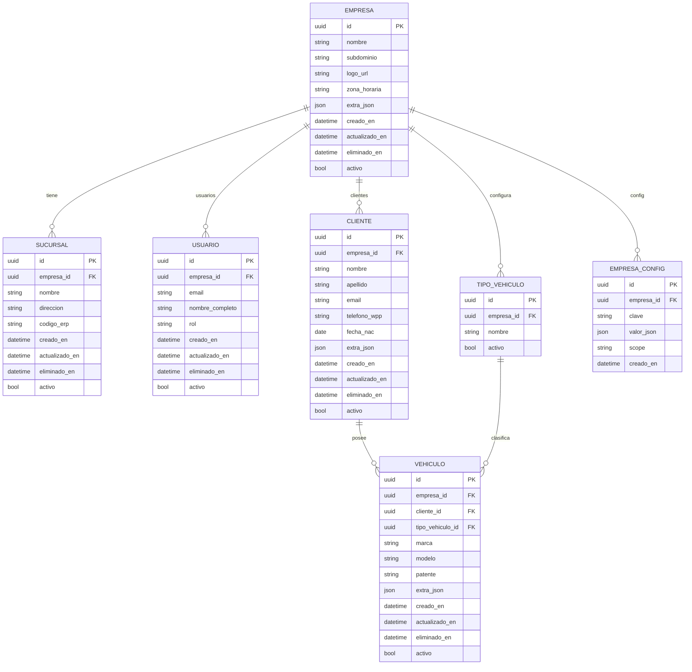
```mermaid
erDiagram
  EMPRESA ||--o{ SUCURSAL : "tiene"
  EMPRESA ||--o{ USUARIO : "usuarios"
  EMPRESA ||--o{ CLIENTE : "clientes"
  EMPRESA ||--o{ TIPO_VEHICULO : "configura"
  EMPRESA ||--o{ EMPRESA_CONFIG : "config"
  CLIENTE ||--o{ VEHICULO : "posee"
  TIPO_VEHICULO ||--o{ VEHICULO : "clasifica"

  EMPRESA {
    uuid id PK
    string nombre
    string subdominio
    string logo_url
    string zona_horaria
    json extra_json
    datetime creado_en
    datetime actualizado_en
    datetime eliminado_en
    bool activo
  }
  EMPRESA_CONFIG {
    uuid id PK
    uuid empresa_id FK
    string clave
    json valor_json
    string scope
    datetime creado_en
  }
  SUCURSAL {
    uuid id PK
    uuid empresa_id FK
    string nombre
    string direccion
    string codigo_erp
    datetime creado_en
    datetime actualizado_en
    datetime eliminado_en
    bool activo
  }
  USUARIO {
    uuid id PK
    uuid empresa_id FK
    string email
    string nombre_completo
    string rol
    datetime creado_en
    datetime actualizado_en
    datetime eliminado_en
    bool activo
  }
  CLIENTE {
    uuid id PK
    uuid empresa_id FK
    string nombre
    string apellido
    string email
    string telefono_wpp
    date fecha_nac
    json extra_json
    datetime creado_en
    datetime actualizado_en
    datetime eliminado_en
    bool activo
  }
  TIPO_VEHICULO {
    uuid id PK
    uuid empresa_id FK
    string nombre
    bool activo
  }
  VEHICULO {
    uuid id PK
    uuid empresa_id FK
    uuid cliente_id FK
    uuid tipo_vehiculo_id FK
    string marca
    string modelo
    string patente
    json extra_json
    datetime creado_en
    datetime actualizado_en
    datetime eliminado_en
    bool activo
  }
```

**Notas y propósito**

- **EMPRESA**: tenant; raíz jerárquica.
- **EMPRESA_CONFIG**: extensión por claves (p.ej., `moneda`, `propina_porcentual_sugerida`, `habilitar_whatsapp`).
- **SUCURSAL**: soporta `codigo_erp` para mapear con sistemas existentes.
- **USUARIO**: autorización por rol simple (ver §6).
- **CLIENTE**: datos básicos y `extra_json` para campos libres.
- **TIPO_VEHICULO**: catálogo simple.
- **VEHICULO**: vehículo por cliente; `patente` utilizada para búsquedas rápidas.

---

## 2) Vista B — Catálogo y Precios

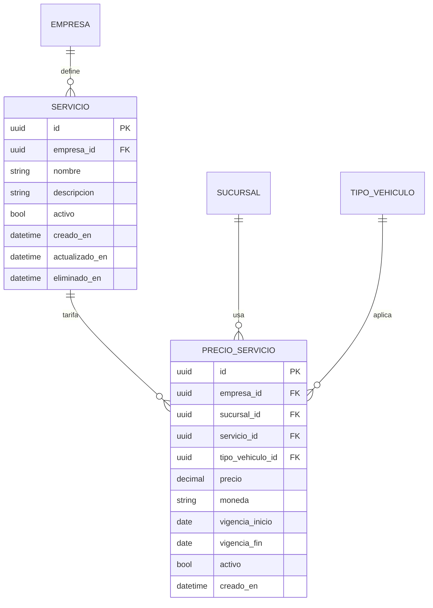
```mermaid
erDiagram
  EMPRESA ||--o{ SERVICIO : "define"
  SERVICIO ||--o{ PRECIO_SERVICIO : "tarifa"
  SUCURSAL ||--o{ PRECIO_SERVICIO : "usa"
  TIPO_VEHICULO ||--o{ PRECIO_SERVICIO : "aplica"

  SERVICIO {
    uuid id PK
    uuid empresa_id FK
    string nombre
    string descripcion
    bool activo
    datetime creado_en
    datetime actualizado_en
    datetime eliminado_en
  }
  PRECIO_SERVICIO {
    uuid id PK
    uuid empresa_id FK
    uuid sucursal_id FK
    uuid servicio_id FK
    uuid tipo_vehiculo_id FK
    decimal precio
    string moneda
    date vigencia_inicio
    date vigencia_fin
    bool activo
    datetime creado_en
  }
```

**Notas y propósito**

- **SERVICIO**: catálogo (lavado, encerado, interior, etc.).
- **PRECIO_SERVICIO**: tarifa efectiva por `sucursal + tipo_vehiculo + servicio + rango de vigencia`.

---

## 3) Vista C — Ventas, Pagos, Comprobantes y Cierre


```mermaid
erDiagram
  SUCURSAL ||--o{ VENTA : "registra"
  CLIENTE ||--o{ VENTA : "compra"
  VEHICULO ||--o{ VENTA : "para"
  VENTA ||--|{ VENTA_ITEM : "contiene"
  SERVICIO ||--o{ VENTA_ITEM : "se_vende"
  VENTA ||--o{ PAGO : "recibe"
  VENTA ||--o{ COMPROBANTE : "emite"
  VENTA ||--o{ LOG_NOTIF : "notifica"
  SUCURSAL ||--o{ SECUENCIA_COMPROBANTE : "numeracion"
  CLIENTE ||--o{ CLIENTE_FACTURACION : "datos_facturacion"
  SUCURSAL ||--o{ CIERRE_CAJA : "cierra"
  CIERRE_CAJA ||--o{ CIERRE_CAJA_TOTAL : "totales_por_metodo"

  VENTA {
    uuid id PK
    uuid empresa_id FK
    uuid sucursal_id FK
    uuid cliente_id FK
    uuid vehiculo_id FK
    datetime creado_en
    datetime actualizado_en
    string estado
    decimal subtotal
    decimal descuento
    decimal propina
    decimal total
    decimal saldo_pendiente
    string notas
  }
  VENTA_ITEM {
    uuid id PK
    uuid venta_id FK
    uuid servicio_id FK
    string servicio_nombre_cache
    decimal precio_unitario
    int cantidad
    decimal total_linea
  }
  PAGO {
    uuid id PK
    uuid venta_id FK
    string metodo
    decimal monto
    bool es_propina
    string referencia
    string idempotency_key
    datetime pagado_en
  }
  CLIENTE_FACTURACION {
    uuid id PK
    uuid cliente_id FK
    string razon_social
    string cuit
    string direccion
    string ciudad
    string provincia
    string codigo_postal
    bool activo
  }
  COMPROBANTE {
    uuid id PK
    uuid venta_id FK
    uuid cliente_facturacion_id FK
    string tipo
    string punto_venta
    string numero
    decimal total
    string moneda
    string pdf_url
    datetime emitido_en
  }
  SECUENCIA_COMPROBANTE {
    uuid id PK
    uuid sucursal_id FK
    string tipo
    int proximo_numero
    datetime actualizado_en
  }
  PLANTILLA_NOTIF {
    uuid id PK
    uuid empresa_id FK
    string clave
    string canal
    text cuerpo_tpl
    bool activo
  }
  LOG_NOTIF {
    uuid id PK
    uuid venta_id FK
    string canal
    string destinatario
    text cuerpo_renderizado
    string estado
    datetime enviado_en
  }
  CIERRE_CAJA {
    uuid id PK
    uuid empresa_id FK
    uuid sucursal_id FK
    uuid usuario_id FK
    datetime abierto_en
    datetime cerrado_en
    string notas
  }
  CIERRE_CAJA_TOTAL {
    uuid id PK
    uuid cierre_caja_id FK
    string metodo
    decimal monto
    decimal propinas
  }
```

**Reglas y fórmulas mínimas**

- `total_linea = cantidad * precio_unitario`
- `subtotal = SUM(total_linea)`
- `total = subtotal - descuento + propina`
- `saldo_pendiente = total - SUM(pagos donde es_propina=false)`
- La **propina** se almacena también en `PAGO.es_propina=true` si se cobra separada por método.

### 3.1) Estados de una venta (MVP)

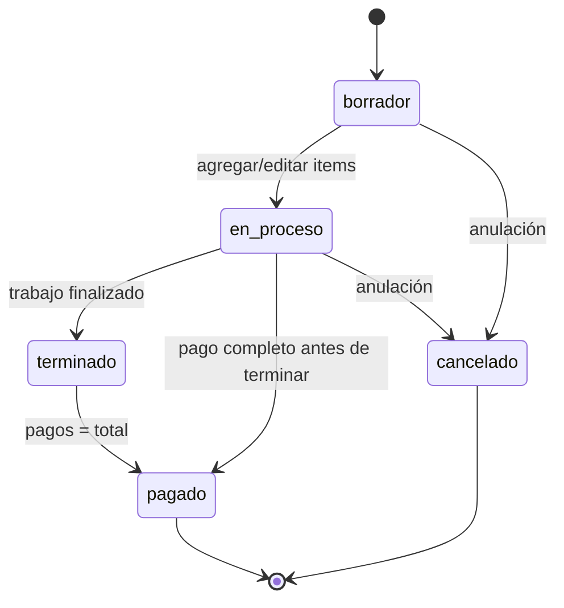
```mermaid
stateDiagram-v2
  [*] --> borrador
  borrador --> en_proceso: agregar/editar items
  en_proceso --> terminado: trabajo finalizado
  terminado --> pagado: pagos = total
  en_proceso --> pagado: pago completo antes de terminar
  borrador --> cancelado: anulación
  en_proceso --> cancelado: anulación
  pagado --> [*]
  cancelado --> [*]
```

---

## 4) Vista D — SaaS y Observabilidad

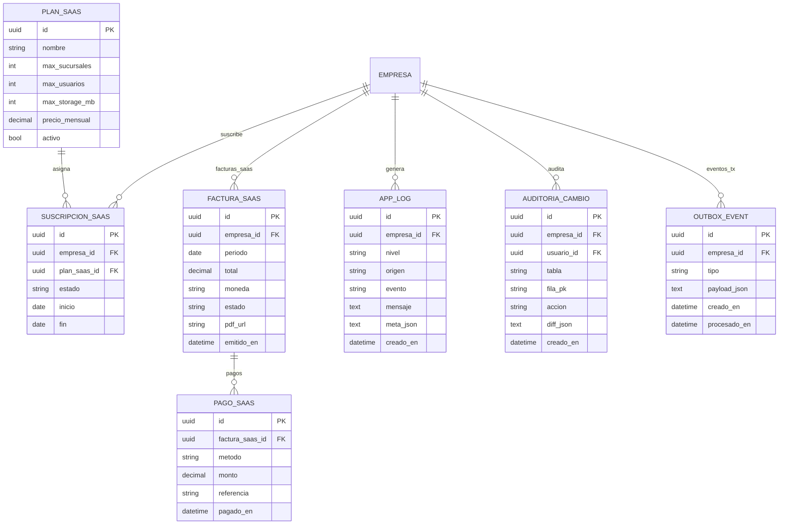
```mermaid
erDiagram
  PLAN_SAAS ||--o{ SUSCRIPCION_SAAS : "asigna"
  EMPRESA ||--o{ SUSCRIPCION_SAAS : "suscribe"
  EMPRESA ||--o{ FACTURA_SAAS : "facturas_saas"
  FACTURA_SAAS ||--o{ PAGO_SAAS : "pagos"
  EMPRESA ||--o{ APP_LOG : "genera"
  EMPRESA ||--o{ AUDITORIA_CAMBIO : "audita"
  EMPRESA ||--o{ OUTBOX_EVENT : "eventos_tx"

  PLAN_SAAS {
    uuid id PK
    string nombre
    int max_sucursales
    int max_usuarios
    int max_storage_mb
    decimal precio_mensual
    bool activo
  }
  SUSCRIPCION_SAAS {
    uuid id PK
    uuid empresa_id FK
    uuid plan_saas_id FK
    string estado
    date inicio
    date fin
  }
  FACTURA_SAAS {
    uuid id PK
    uuid empresa_id FK
    date periodo
    decimal total
    string moneda
    string estado
    string pdf_url
    datetime emitido_en
  }
  PAGO_SAAS {
    uuid id PK
    uuid factura_saas_id FK
    string metodo
    decimal monto
    string referencia
    datetime pagado_en
  }
  APP_LOG {
    uuid id PK
    uuid empresa_id FK
    string nivel
    string origen
    string evento
    text mensaje
    text meta_json
    datetime creado_en
  }
  AUDITORIA_CAMBIO {
    uuid id PK
    uuid empresa_id FK
    uuid usuario_id FK
    string tabla
    string fila_pk
    string accion
    text diff_json
    datetime creado_en
  }
  OUTBOX_EVENT {
    uuid id PK
    uuid empresa_id FK
    string tipo
    text payload_json
    datetime creado_en
    datetime procesado_en
  }
```

**Eventos recomendados (Outbox, MVP)**

- `VentaPagada`, `ComprobanteEmitido`, `VehiculoListo`, `CierreCajaCerrado`

---

## 5) Restricciones, índices y validaciones (valor negocio)

**Unicidad y formato**

- `VEHICULO.patente` **única por empresa** `(empresa_id, patente_normalizada)` con normalización (trim, uppercase, sin guiones/espacios).
- `SERVICIO.nombre` **único por empresa** `(empresa_id, nombre_normalizado)` para evitar duplicados.
- `SUCURSAL.codigo_erp` **único por empresa** si se usa mapeo ERP.

**Precios sin solapamiento (simple)**

- En `PRECIO_SERVICIO`, no permitir rangos superpuestos para la misma tupla `(empresa_id, sucursal_id, servicio_id, tipo_vehiculo_id)`.
  - Chequeo: al insertar, validar que `[vigencia_inicio, vigencia_fin]` no colisione con otro rango activo.

**Integridad operacional**

- `VENTA_ITEM.cantidad >= 1`, `precio_unitario >= 0`.
- `PAGO.monto > 0` y no exceder `saldo_pendiente` cuando `es_propina=false`.
- `COMPROBANTE.numero` consecutivo por `(sucursal_id, tipo)` vía `SECUENCIA_COMPROBANTE` + **idempotencia** a nivel de operación de emisión.

**Índices prácticos**

- Búsquedas:
  - `CLIENTE(email)`, `CLIENTE(telefono_wpp)`
  - `VEHICULO(patente_normalizada)`
  - `VENTA(sucursal_id, creado_en)`, `VENTA(estado)`
  - `PAGO(venta_id, pagado_en)`
  - `PRECIO_SERVICIO(sucursal_id, servicio_id, tipo_vehiculo_id, vigencia_inicio)`

---

## 6) Roles (mínimos, MVP)

- **Admin**: todo sobre su empresa (catálogo, usuarios, precios, reportes, cierres).
- **Operador/Cajero**: crear ventas, ítems, pagos, emitir comprobantes, notificar, cerrar caja.
- **Auditor (solo lectura)**: reportes, ventas, cierres, sin modificar.

_(Implementable en Django con `groups`/`permissions` simples.)_

---

## 7) Procesos granulares (Entradas / Salidas / Reglas / Errores)

> **Regla de oro**: cada proceso retorna una **salida clara** y deja **estado consistente**.

### 7.1 Alta/selección de Cliente y Vehículo

- **Entradas**: `empresa_id`, (`cliente_id` _o_ {nombre, apellido, email?, telefono*wpp?}), (`vehiculo_id` \_o* {tipo_vehiculo_id, marca, modelo, patente?})
- **Salidas**: `cliente_id`, `vehiculo_id` (upsert si coincide por teléfono/email y patente)
- **Reglas**: normalizar `telefono_wpp`, `patente`; evitar duplicados.
- **Errores**: formato inválido, patente duplicada, tipo_vehiculo inexistente.

### 7.2 Crear venta (borrador)

- **Entradas**: `empresa_id`, `sucursal_id`, `cliente_id`, `vehiculo_id`
- **Salidas**: `venta_id` (estado=`borrador`, `saldo_pendiente = 0`)
- **Reglas**: sucursal activa, cliente/vehículo pertenecen a la misma empresa.
- **Errores**: referencias cruzadas de otra empresa, sucursal inactiva.

### 7.3 Agregar/editar ítems de venta

- **Entradas**: `venta_id`, lista de `{servicio_id, cantidad}`, **fecha_precio** (default: `now()` del servidor)
- **Salida**: `subtotal`, `total`, `saldo_pendiente` recalculados
- **Reglas**: resolver **precio** en `PRECIO_SERVICIO` por `sucursal + servicio + tipo_vehiculo + fecha_precio`; cachear `servicio_nombre`.
- **Errores**: precio no encontrado, cantidad < 1, servicio inactivo.

### 7.4 Registrar pago(s)

- **Entradas**: `venta_id`, `metodo` (efectivo/tarjeta/MP), `monto`, `es_propina?`, `idempotency_key?`
- **Salida**: `saldo_pendiente` actualizado; posible transición a `pagado` si `saldo_pendiente = 0`.
- **Reglas**: no permitir `monto` > `saldo_pendiente` cuando `es_propina=false`.
- **Errores**: monto inválido, `idempotency_key` repetida (duplicado).

### 7.5 Finalizar venta (trabajo completo)

- **Entradas**: `venta_id`
- **Salida**: `estado=terminado` (o `pagado` si saldo=0)
- **Reglas**: debe existir ≥1 `VENTA_ITEM`.
- **Errores**: venta sin ítems; venta cancelada.

### 7.6 Emitir comprobante (no fiscal)

- **Entradas**: `venta_id`, `tipo`, `punto_venta`, `cliente_facturacion_id?`
- **Salida**: `COMPROBANTE{numero, pdf_url}`
- **Reglas**: reservar número con `SECUENCIA_COMPROBANTE` (transacción + idempotencia); snapshot de totales.
- **Errores**: secuencia bloqueada, venta sin total, venta cancelada.

### 7.7 Notificar cliente (opcional)

- **Entradas**: `venta_id`, `PLANTILLA_NOTIF.clave`
- **Salida**: `LOG_NOTIF{id, estado=enviado|fallido}`
- **Reglas**: render de plantilla con placeholders y datos de la venta.
- **Errores**: canal no habilitado, destinatario vacío.

### 7.8 Cierre de caja

- **Entradas**: `sucursal_id`, `usuario_id`, `rango_horas`
- **Salida**: `CIERRE_CAJA{id}` + `CIERRE_CAJA_TOTAL` agrupado por `metodo`
- **Reglas**: sumar pagos del periodo; propinas separadas.
- **Errores**: solapamiento de cierres, rango vacío.

#### Diagrama de flujo de Cierre (MVP)

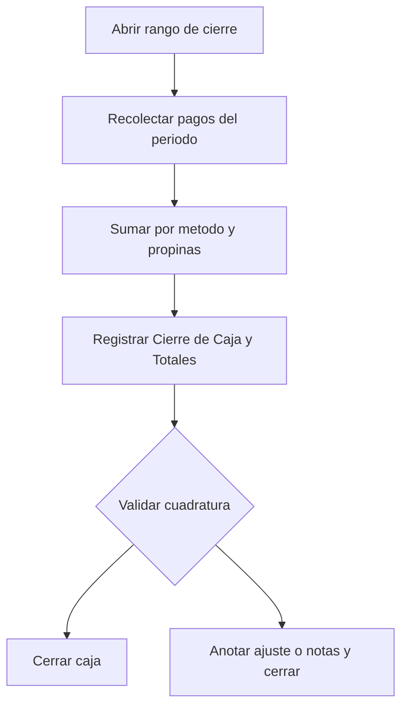
```mermaid
flowchart TD
  A["Abrir rango de cierre"]
  B["Recolectar pagos del periodo"]
  C["Sumar por metodo y propinas"]
  D["Registrar Cierre de Caja y Totales"]
  E{"Validar cuadratura"}
  F["Cerrar caja"]
  G["Anotar ajuste o notas y cerrar"]

  A --> B
  B --> C
  C --> D
  D --> E
  E --> F
  E --> G
```

---

## 8) Endpoints MVP (sugeridos, nombres lógicos)

- `/clientes [GET/POST]`, `/vehiculos [GET/POST]`
- `/ventas [POST]` (crear borrador), `/ventas/{id} [GET/PATCH]`
- `/ventas/{id}/items [POST/PATCH/DELETE]`
- `/ventas/{id}/pagos [POST]`
- `/ventas/{id}/finalizar [POST]`
- `/ventas/{id}/comprobante [POST]`
- `/ventas/{id}/notificar [POST]`
- `/cierres [POST]`, `/cierres/{id} [GET]`
- `/precios [GET/POST]`, `/servicios [GET/POST]`

_(En Django: `UUIDField` como PK, `auto_now(_add)` para timestamps, `constraints` en `Meta`.)_

---

## 9) Reportes y KPIs (operativos, MVP)

- **Ventas por día / sucursal** (total, #ventas, ticket promedio)
- **Servicios top** por cantidad y facturación
- **Métodos de pago** (mix por periodo)
- **Propinas** (total y % sobre ventas)
- **Clientes recurrentes** (% repiten en 30/60 días) _(simple: por `vehiculo_id` o `cliente_id`)_

---

## 10) Consideraciones de implementación (Django, prácticas simples)

- **Soft-delete**: usar `eliminado_en` (filtro global por empresa y `eliminado_en IS NULL`).
- **Transactions**: emisión de comprobante y movimientos críticos con `select_for_update()` sobre `SECUENCIA_COMPROBANTE`.
- **Idempotencia**: `PAGO.idempotency_key` y “safe re-try” en emisión de comprobantes.
- **Validación de precios**: función única `resolver_precio(empresa, sucursal, servicio, tipo_vehiculo, fecha)` para centralizar la lógica.
- **Serializadores simples**: exponer sólo campos necesarios a UI.
- **Seeds mínimos**: `TIPO_VEHICULO` comunes (auto, moto, camioneta).

---

## 11) Circuito de una Venta (secuencia)

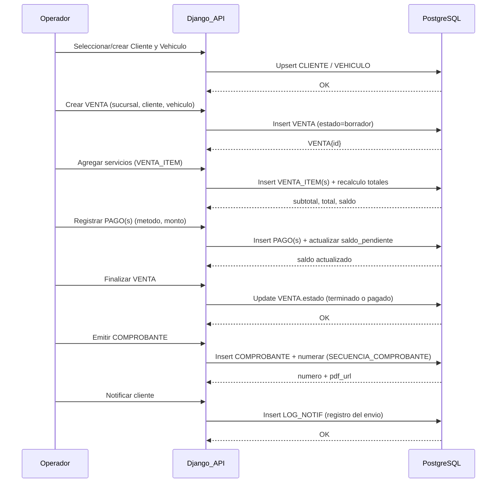
```mermaid
sequenceDiagram
  participant U as Operador
  participant API as Django_API
  participant DB as PostgreSQL

  U->>API: Seleccionar/crear Cliente y Vehiculo
  API->>DB: Upsert CLIENTE / VEHICULO
  DB-->>API: OK

  U->>API: Crear VENTA (sucursal, cliente, vehiculo)
  API->>DB: Insert VENTA (estado=borrador)
  DB-->>API: VENTA{id}

  U->>API: Agregar servicios (VENTA_ITEM)
  API->>DB: Insert VENTA_ITEM(s) + recalculo totales
  DB-->>API: subtotal, total, saldo

  U->>API: Registrar PAGO(s) (metodo, monto)
  API->>DB: Insert PAGO(s) + actualizar saldo_pendiente
  DB-->>API: saldo actualizado

  U->>API: Finalizar VENTA
  API->>DB: Update VENTA.estado (terminado o pagado)
  DB-->>API: OK

  U->>API: Emitir COMPROBANTE
  API->>DB: Insert COMPROBANTE + numerar (SECUENCIA_COMPROBANTE)
  DB-->>API: numero + pdf_url

  U->>API: Notificar cliente
  API->>DB: Insert LOG_NOTIF (registro del envio)
  DB-->>API: OK
```

---

# Plan detallado por app (Django) — SaaS Lavaderos (MVP)

> Objetivo: que cada app tenga **responsabilidades claras**, **módulos internos** y **flujos** listos para implementar.  
> Convención de diagramas: usar `flowchart` sin etiquetas en aristas para máxima compatibilidad.

---

## 1) `accounts/` (allauth + membresías + roles)

**Rol**: Autenticación (allauth), pertenencia a empresas y autorización por rol.

**Módulos**

- `models.py`: `UserProfile`, `EmpresaMembership(user, empresa, rol)`
- `services.py`: alta empresa + owner, asignación de roles, helpers de autorización
- `serializers.py` (DRF): perfiles y membresías
- `views.py`/`urls.py`: endpoints de perfil y onboarding simple
- `permissions.py`: `IsMemberOfEmpresa`, `HasRole`

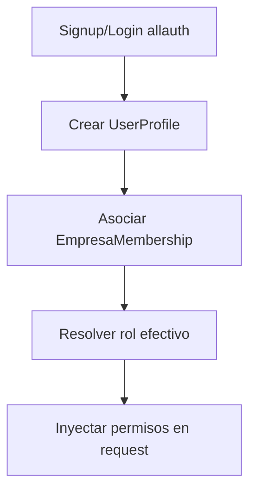
```mermaid
flowchart TD
  A[Signup/Login allauth] --> B[Crear UserProfile]
  B --> C[Asociar EmpresaMembership]
  C --> D[Resolver rol efectivo]
  D --> E[Inyectar permisos en request]
```

---

## 2) `org/` (empresa, sucursal, configuración)

**Rol**: Raíz multi-tenant; sucursales; configuración por claves.

**Módulos**

- `models.py`: `EMPRESA`, `SUCURSAL`, `EMPRESA_CONFIG`
- `services.py`: lectura de config, alta sucursal, validaciones
- `serializers.py` y `views.py`: CRUD limitado
- `selectors.py`: queries frecuentes por empresa/sucursal

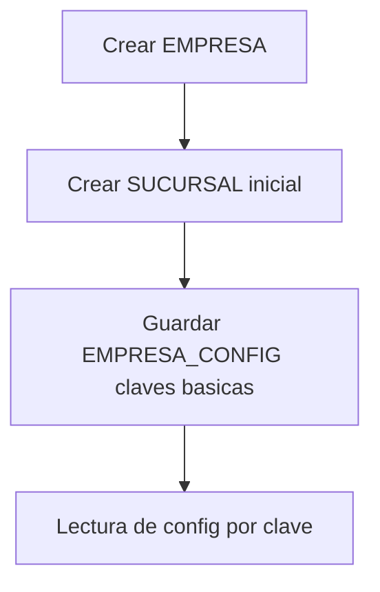
```mermaid
flowchart TD
  A[Crear EMPRESA] --> B[Crear SUCURSAL inicial]
  B --> C[Guardar EMPRESA_CONFIG claves basicas]
  C --> D[Lectura de config por clave]
```

---

## 3) `customers/` (clientes y datos de facturación)

**Rol**: Gestión de clientes y perfiles fiscales.

**Módulos**

- `models.py`: `CLIENTE`, `CLIENTE_FACTURACION`
- `services.py`: `upsert_cliente`, `get_or_create_facturacion`
- `serializers.py` y `views.py`: endpoints REST
- `normalizers.py`: email/teléfono

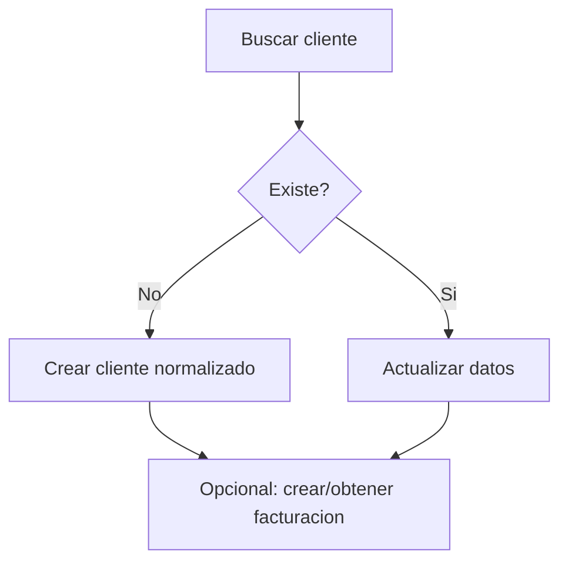
```mermaid
flowchart TD
  A[Buscar cliente] --> B{Existe?}
  B -->|No| C[Crear cliente normalizado]
  B -->|Si| D[Actualizar datos]
  C --> E[Opcional: crear facturacion]
  D --> E[Opcional: crear/obtener facturacion]
```

---

## 4) `vehicles/` (tipos y vehículos)

**Rol**: Tipos de vehículo y vehículos por cliente con unicidad de patente por empresa.

**Módulos**

- `models.py`: `TIPO_VEHICULO`, `VEHICULO`
- `services.py`: `upsert_vehiculo`, `normalizar_patente`
- `serializers.py` y `views.py`: endpoints REST
- `validators.py`: unicidad `(empresa_id, patente_normalizada)`

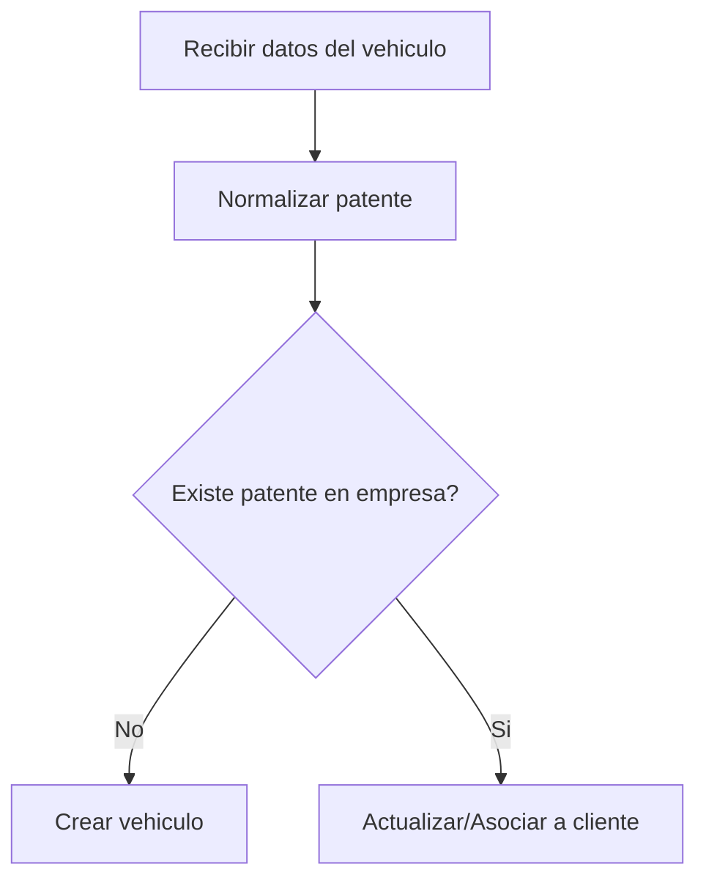
```mermaid
flowchart TD
  A[Recibir datos del vehiculo] --> B[Normalizar patente]
  B --> C{Existe patente en empresa?}
  C -->|No| D[Crear vehiculo]
  C -->|Si| E[Actualizar/Asociar a cliente]
```

---

## 5) `catalog/` (servicios)

**Rol**: Catálogo de servicios.

**Módulos**

- `models.py`: `SERVICIO`
- `services.py`: validación de nombre único por empresa
- `serializers.py`, `views.py`
- `selectors.py`: listar activos

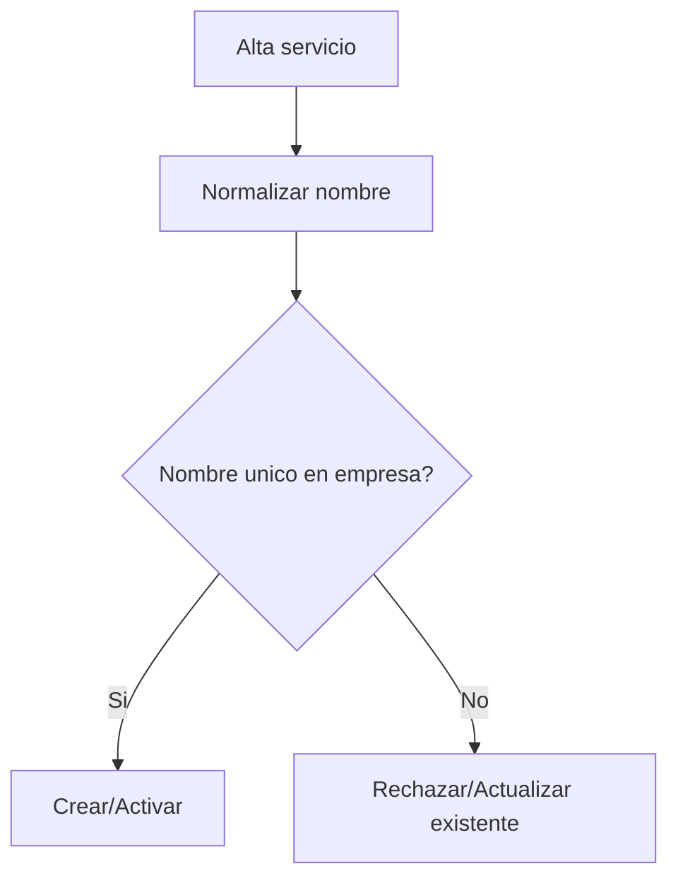
```mermaid
flowchart TD
  A[Alta servicio] --> B[Normalizar nombre]
  B --> C{Nombre unico en empresa?}
  C -->|Si| D[Crear/Activar]
  C -->|No| E[Rechazar/Actualizar existente]
```

---

## 6) `pricing/` (precios efectivos por sucursal/tipo/servicio)

**Rol**: Tarifas con vigencia; resolver precio efectivo.

**Módulos**

- `models.py`: `PRECIO_SERVICIO`
- `services.py`: `resolver_precio`, alta sin solapamientos
- `validators.py`: colisión de rangos
- `serializers.py`, `views.py`

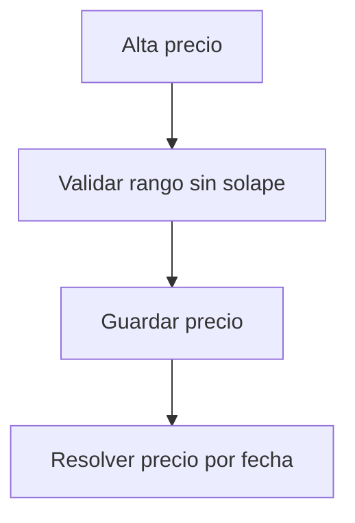
```mermaid
flowchart TD
  A[Alta precio] --> B[Validar rango sin solape]
  B --> C[Guardar precio]
  C --> D[Resolver precio por fecha]
```

---

## 7) `sales/` (ventas e ítems; estados)

**Rol**: Crear venta, gestionar ítems, totales y estados.

**Módulos**

- `models.py`: `VENTA`, `VENTA_ITEM` (métodos de recálculo)
- `services.py`: `crear_venta`, `agregar_items`, `finalizar_venta`
- `calculations.py`: subtotal, total, saldo
- `serializers.py`, `views.py`
- `fsm.py`: transiciones de estado

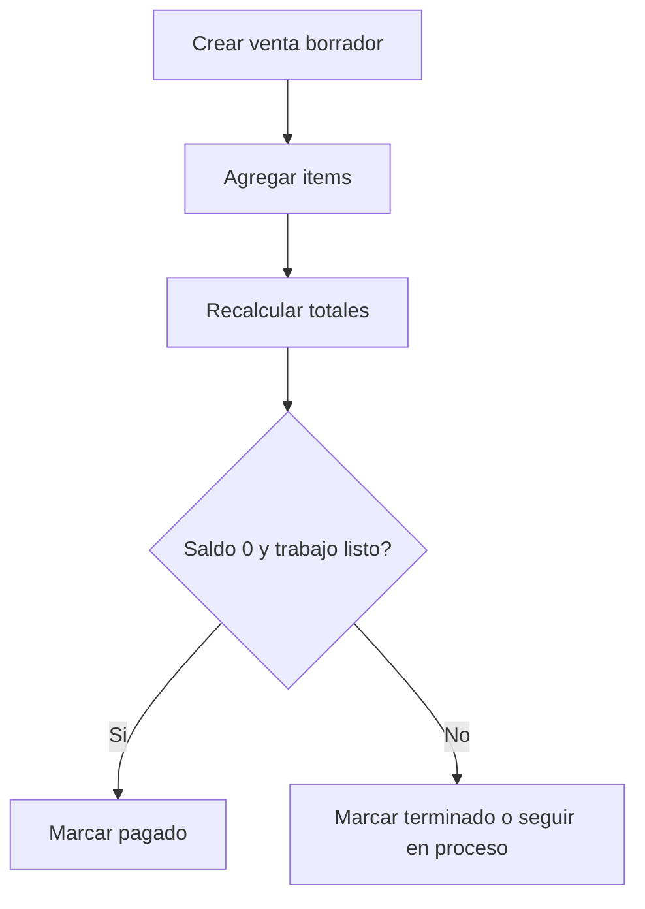
```mermaid
flowchart TD
  A[Crear venta borrador] --> B[Agregar items]
  B --> C[Recalcular totales]
  C --> D{Saldo 0 y trabajo listo?}
  D -->|Si| E[Marcar pagado]
  D -->|No| F[Marcar terminado o seguir en proceso]
```

---

## 8) `payments/` (pagos e idempotencia)

**Rol**: Registrar pagos, actualizar saldo, transición a pagado.

**Módulos**

- `models.py`: `PAGO`
- `services.py`: `registrar_pago` con `idempotency_key`
- `serializers.py`, `views.py`
- `validators.py`: `monto > 0`, límite por saldo

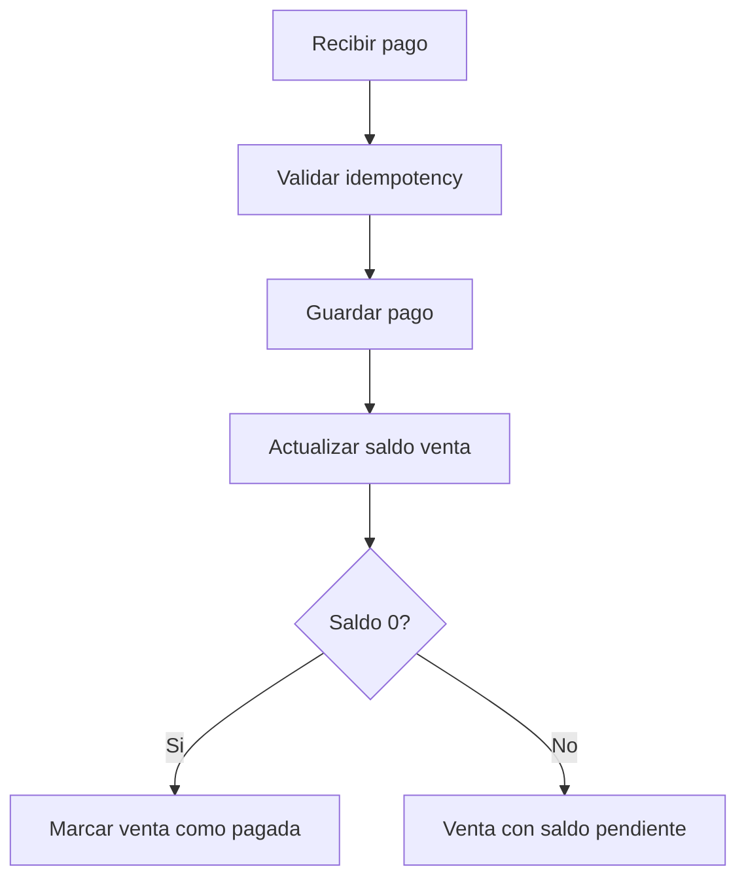
```mermaid
flowchart TD
  A[Recibir pago] --> B[Validar idempotency]
  B --> C[Guardar pago]
  C --> D[Actualizar saldo venta]
  D --> E{Saldo 0?}
  E -->|Si| F[Marcar venta como pagada]
  E -->|No| G[Venta con saldo pendiente]
```

---

## 9) `invoicing/` (comprobante no fiscal + secuencia)

**Rol**: Emitir comprobante con numeración atómica por sucursal/tipo.

**Módulos**

- `models.py`: `COMPROBANTE`, `SECUENCIA_COMPROBANTE`
- `services.py`: `emitir_comprobante` (`select_for_update` sobre secuencia)
- `pdf.py`: generador PDF simple (placeholder MVP)
- `serializers.py`, `views.py`

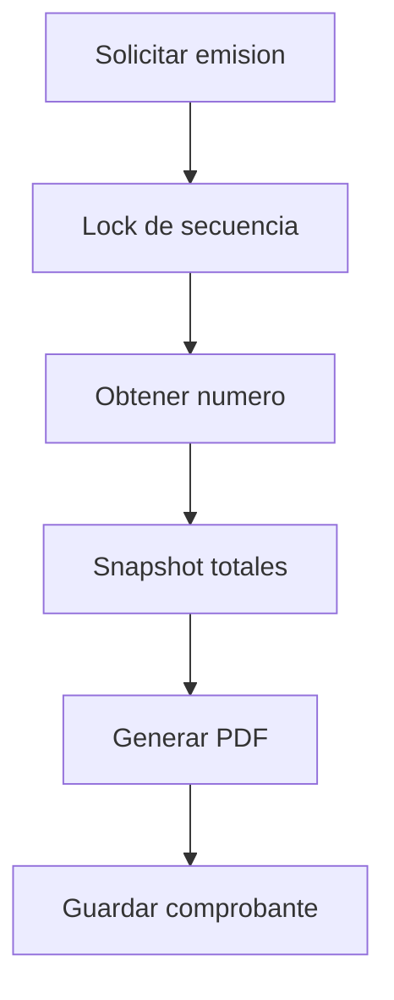
```mermaid
flowchart TD
  A[Solicitar emision] --> B[Lock de secuencia]
  B --> C[Obtener numero]
  C --> D[Snapshot totales]
  D --> E[Generar PDF]
  E --> F[Guardar comprobante]
```

---

## 10) `notifications/` (plantillas y logs)

**Rol**: Render de mensajes y registro de envíos.

**Módulos**

- `models.py`: `PLANTILLA_NOTIF`, `LOG_NOTIF`
- `services.py`: `enviar_notificacion(venta, clave_plantilla)`
- `renderers.py`: placeholders estándar
- `serializers.py`, `views.py`

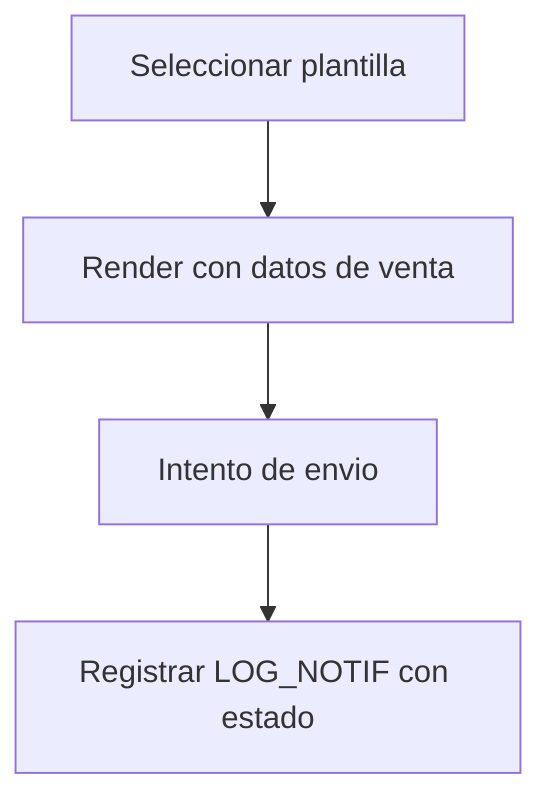
```mermaid
flowchart TD
  A[Seleccionar plantilla] --> B[Render con datos de venta]
  B --> C[Intento de envio]
  C --> D[Registrar LOG_NOTIF con estado]
```

---

## 11) `cashbox/` (cierres de caja)

**Rol**: Consolidar pagos por rango y método; generar cierre + totales.

**Módulos**

- `models.py`: `CIERRE_CAJA`, `CIERRE_CAJA_TOTAL`
- `services.py`: `cerrar_caja(sucursal, desde, hasta)`
- `serializers.py`, `views.py`

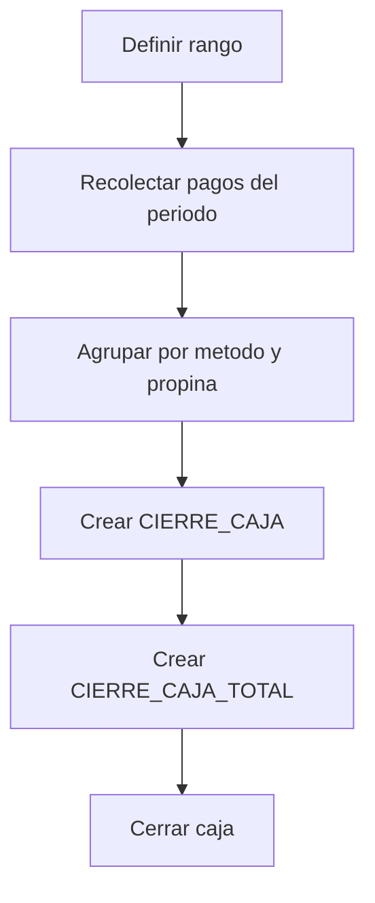
```mermaid
flowchart TD
  A[Definir rango] --> B[Recolectar pagos del periodo]
  B --> C[Agrupar por metodo y propina]
  C --> D[Crear CIERRE_CAJA]
  D --> E[Crear CIERRE_CAJA_TOTAL]
  E --> F[Cerrar caja]
```

---

## 12) `saas/` (planes y suscripciones — estructura básica)

**Rol**: Estructura para planes y facturas SaaS (automatización luego).

**Módulos**

- `models.py`: `PLAN_SAAS`, `SUSCRIPCION_SAAS`, `FACTURA_SAAS`, `PAGO_SAAS`
- `services.py`: alta suscripción, emitir factura demo
- `serializers.py`, `views.py`

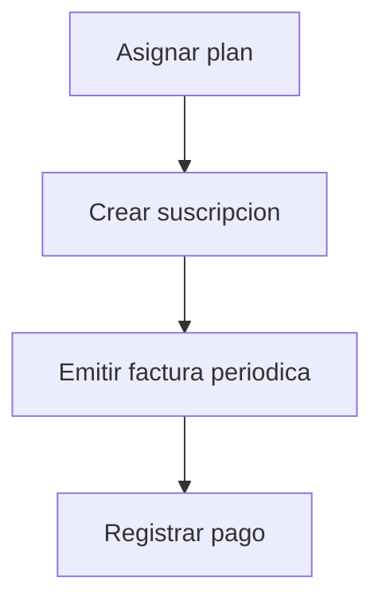
```mermaid
flowchart TD
  A[Asignar plan] --> B[Crear suscripcion]
  B --> C[Emitir factura periodica]
  C --> D[Registrar pago]
```

---

## 13) `audit/` y `app_log/` (observabilidad mínima)

**Rol**: Auditoría de cambios y logs de eventos.

**Módulos**

- `audit/models.py`: `AUDITORIA_CAMBIO`
- `audit/middleware.py`: captura de cambios CRUD simples
- `app_log/models.py`: `APP_LOG`
- `app_log/services.py`: registrar eventos técnicos/de negocio

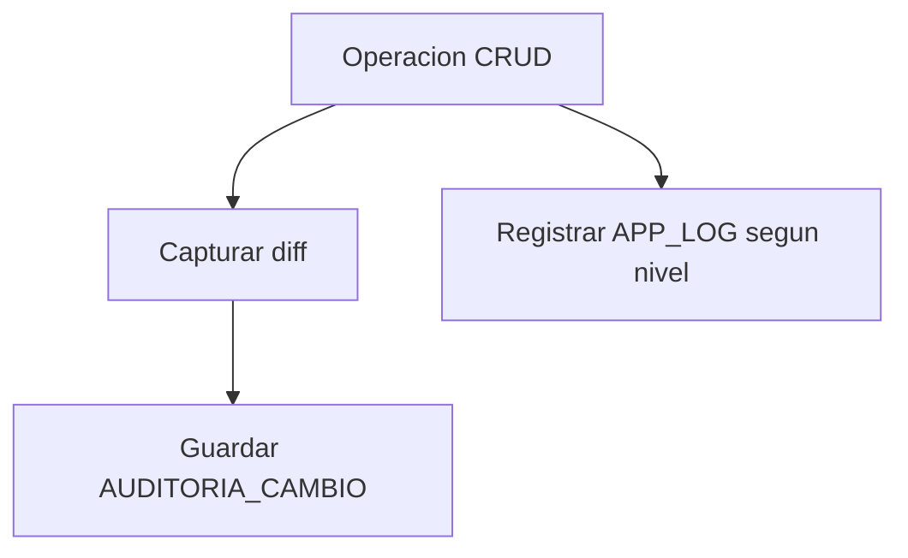
```mermaid
flowchart TD
  A[Operacion CRUD] --> B[Capturar diff]
  B --> C[Guardar AUDITORIA_CAMBIO]
  A --> D[Registrar APP_LOG segun nivel]
```

---

## 14) Diagrama de dependencias entre apps (alto nivel)

```mermaid
flowchart LR
  accounts --> org
  accounts --> customers
  accounts --> vehicles
  org --> pricing
  catalog --> pricing
  vehicles --> sales
  customers --> sales
  pricing --> sales
  sales --> payments
  sales --> invoicing
  sales --> notifications
  payments --> cashbox
  invoicing --> notifications
  org --> cashbox
  saas --> org
```

---

## 15) Contratos de servicios (resumen de E/S por app)

- **customers**: `upsert_cliente(empresa, datos)` → `CustomerDTO`
- **vehicles**: `upsert_vehiculo(empresa, cliente, datos)` → `VehicleDTO`
- **pricing**: `resolver_precio(empresa, sucursal, servicio, tipo, fecha)` → `{precio, moneda}`
- **sales**: `crear_venta(...)` → `VentaDTO`; `agregar_items(venta, items, fecha)` → `VentaDTO`; `finalizar_venta(venta)` → `VentaDTO`
- **payments**: `registrar_pago(venta, metodo, monto, es_propina?, key?)` → `VentaDTO`
- **invoicing**: `emitir_comprobante(venta, tipo, pv, cf?)` → `ComprobanteDTO`
- **notifications**: `enviar_notificacion(venta, plantilla)` → `log_id`
- **cashbox**: `cerrar_caja(empresa, sucursal, desde, hasta)` → `CierreCajaDTO`

---

## 16) Reglas transversales (mínimas y prácticas)

- **Multitenancy**: `empresa_id` obligatorio en todo; filtros por defecto en managers.
- **Estados de venta**: transiciones controladas; no finalizar sin ítems.
- **Idempotencia** en pagos y emisión de comprobantes (lock de secuencia).
- **Validación de precios**: sin solapamiento por tupla `(empresa, sucursal, servicio, tipo)`.
- **Unicidades**: patente por empresa; servicio por nombre normalizado y empresa.

---

## 17) Próximos pasos (operativos)

1. Generar **stubs** por app (`services.py` con firmas y docstrings).
2. Implementar **tests unitarios** para `resolver_precio`, totales, pagos, emisión, cierre.
3. Exponer **endpoints DRF** con permisos `IsMemberOfEmpresa` + `HasRole`.
4. Integrar **admin** para gestión básica (seed de catálogo y precios).

# Plan detallado por app (Django) — SaaS Lavaderos (MVP)

> Objetivo: que cada app tenga **responsabilidades claras**, **módulos internos** y **flujos** listos para implementar.  
> Convención de diagramas: usar `flowchart` sin etiquetas en aristas para máxima compatibilidad.

# Stubs de implementación (Django) — listo para codear

> Estructura de archivos y `services.py` por app con firmas, `dataclass` DTO y docstrings.  
> Incluye un `tenancy.py` y `permissions.py` básicos. Listo para tests y wiring con DRF.

```bash
lavaderos/
├── manage.py
├── lavaderos/
│   ├── __init__.py
│   ├── settings.py
│   ├── urls.py
│   ├── tenancy.py
│   ├── middleware.py
│   └── permissions.py
└── apps/
    ├── accounts/
    │   ├── __init__.py
    │   ├── models.py
    │   ├── services.py
    │   ├── serializers.py
    │   ├── views.py
    │   └── urls.py
    ├── org/
    │   ├── __init__.py
    │   ├── models.py
    │   ├── services.py
    │   ├── selectors.py
    │   └── urls.py
    ├── customers/
    │   ├── __init__.py
    │   ├── models.py
    │   ├── services.py
    │   ├── normalizers.py
    │   └── urls.py
    ├── vehicles/
    │   ├── __init__.py
    │   ├── models.py
    │   ├── services.py
    │   ├── validators.py
    │   └── urls.py
    ├── catalog/
    │   ├── __init__.py
    │   ├── models.py
    │   ├── services.py
    │   └── urls.py
    ├── pricing/
    │   ├── __init__.py
    │   ├── models.py
    │   ├── services.py
    │   ├── validators.py
    │   └── urls.py
    ├── sales/
    │   ├── __init__.py
    │   ├── models.py
    │   ├── services.py
    │   ├── calculations.py
    │   ├── fsm.py
    │   └── urls.py
    ├── payments/
    │   ├── __init__.py
    │   ├── models.py
    │   ├── services.py
    │   ├── validators.py
    │   └── urls.py
    ├── invoicing/
    │   ├── __init__.py
    │   ├── models.py
    │   ├── services.py
    │   ├── pdf.py
    │   └── urls.py
    ├── notifications/
    │   ├── __init__.py
    │   ├── models.py
    │   ├── services.py
    │   ├── renderers.py
    │   └── urls.py
    ├── cashbox/
    │   ├── __init__.py
    │   ├── models.py
    │   ├── services.py
    │   └── urls.py
    ├── saas/
    │   ├── __init__.py
    │   ├── models.py
    │   ├── services.py
    │   └── urls.py
    ├── audit/
    │   ├── __init__.py
    │   ├── models.py
    │   └── middleware.py
    └── app_log/
        ├── __init__.py
        ├── models.py
        └── services.py
```

---

## `lavaderos/tenancy.py`

```python
# lavaderos/tenancy.py
from contextvars import ContextVar
from typing import Optional

_current_empresa_id: ContextVar[Optional[str]] = ContextVar("empresa_id", default=None)

def set_current_empresa_id(empresa_id: Optional[str]) -> None:
    """Fija el tenant actual (empresa) en un contextvar (thread-safe)."""
    _current_empresa_id.set(empresa_id)

def get_current_empresa_id() -> Optional[str]:
    """Obtiene el tenant actual (empresa) del contexto."""
    return _current_empresa_id.get()
```

## `lavaderos/middleware.py`

```python
# lavaderos/middleware.py
from django.http import HttpRequest
from lavaderos.tenancy import set_current_empresa_id
from typing import Callable

class TenantBySubdomainMiddleware:
    """
    Resuelve empresa por subdominio: <empresa>.miapp.com
    En MVP puedes usar un header 'X-Empresa-Id' para simplificar.
    """
    def __init__(self, get_response: Callable):
        self.get_response = get_response

    def __call__(self, request: HttpRequest):
        empresa_id = request.headers.get("X-Empresa-Id")  # MVP
        set_current_empresa_id(empresa_id)
        response = self.get_response(request)
        return response
```

## `lavaderos/permissions.py`

```python
# lavaderos/permissions.py
from rest_framework.permissions import BasePermission

class IsMemberOfEmpresa(BasePermission):
    """
    Permite acceso si el usuario está asociado a la empresa actual.
    Requiere que el viewset resuelva empresa actual (header o subdominio).
    """
    def has_permission(self, request, view):
        empresa_id = request.headers.get("X-Empresa-Id")
        if not request.user.is_authenticated or not empresa_id:
            return False
        # MVP: asume que todo user autenticado con header es válido.
        # En producción: validar EmpresaMembership.
        return True

class HasRole(BasePermission):
    """
    Valida que el usuario tenga un rol requerido (definido en la vista, e.g. view.required_roles).
    """
    def has_permission(self, request, view):
        required = getattr(view, "required_roles", None)
        if not required:
            return True
        # MVP: rol en user.profile.role o en membership.
        user_role = getattr(getattr(request.user, "profile", None), "role", None)
        return user_role in required
```

---

# APPS

## `apps/accounts/services.py`

```python
# apps/accounts/services.py
from dataclasses import dataclass
from typing import Optional, Literal
from django.contrib.auth import get_user_model

User = get_user_model()
Role = Literal["admin", "operador", "auditor"]

@dataclass
class UserProfileDTO:
    user_id: int
    email: str
    role: Role

@dataclass
class EmpresaOwnerDTO:
    empresa_id: str
    user_id: int
    sucursal_id: Optional[str]

def create_empresa_with_owner(*, nombre_empresa: str, subdominio: str,
                              owner_email: str, owner_password: str,
                              sucursal_nombre: str = "Principal") -> EmpresaOwnerDTO:
    """
    Crea EMPRESA, SUCURSAL inicial y usuario owner (admin).
    Retorna ids para enlazar front/onboarding.
    """
    raise NotImplementedError

def assign_role(*, user_id: int, empresa_id: str, role: Role) -> UserProfileDTO:
    """
    Asigna rol al usuario dentro de una empresa (EmpresaMembership).
    """
    raise NotImplementedError
```

## `apps/org/services.py`

```python
# apps/org/services.py
from dataclasses import dataclass
from typing import Optional, Any

@dataclass
class EmpresaDTO:
    id: str
    nombre: str
    subdominio: str
    activo: bool

@dataclass
class SucursalDTO:
    id: str
    empresa_id: str
    nombre: str
    codigo_erp: Optional[str]

def create_empresa(*, nombre: str, subdominio: str) -> EmpresaDTO:
    """
    Alta de empresa (tenant). Unicidad de subdominio.
    """
    raise NotImplementedError

def create_sucursal(*, empresa_id: str, nombre: str, codigo_erp: Optional[str]=None) -> SucursalDTO:
    """
    Crea una sucursal para la empresa.
    """
    raise NotImplementedError

def set_config(*, empresa_id: str, clave: str, valor_json: Any, scope: str="app") -> None:
    """
    Guarda o actualiza EMPRESA_CONFIG[clave].
    """
    raise NotImplementedError

def get_config(*, empresa_id: str, clave: str, default: Any=None) -> Any:
    """
    Lee EMPRESA_CONFIG[clave] o retorna default.
    """
    raise NotImplementedError
```

## `apps/customers/services.py`

```python
# apps/customers/services.py
from dataclasses import dataclass
from typing import Optional

@dataclass
class CustomerDTO:
    id: str
    nombre: str
    apellido: str
    email: Optional[str]
    telefono_wpp: Optional[str]

def upsert_cliente(*, empresa_id: str, nombre: str, apellido: str,
                   email: Optional[str]=None, telefono_wpp: Optional[str]=None) -> CustomerDTO:
    """
    Crea/actualiza cliente evitando duplicados por (empresa_id + email/telefono).
    Normaliza email y teléfono.
    """
    raise NotImplementedError

def get_or_create_facturacion(*, cliente_id: str, razon_social: str,
                              cuit: str, direccion: str,
                              ciudad: str, provincia: str, codigo_postal: str) -> str:
    """
    Asegura un registro de CLIENTE_FACTURACION y retorna su id.
    """
    raise NotImplementedError
```

## `apps/vehicles/services.py`

```python
# apps/vehicles/services.py
from dataclasses import dataclass
from typing import Optional

@dataclass
class VehicleDTO:
    id: str
    cliente_id: str
    tipo_vehiculo_id: str
    marca: str
    modelo: str
    patente: Optional[str]

def normalizar_patente(patente: str) -> str:
    """
    Uppercase, sin guiones/espacios. Validar longitud/formato si aplica.
    """
    raise NotImplementedError

def upsert_vehiculo(*, empresa_id: str, cliente_id: str, tipo_vehiculo_id: str,
                    marca: str, modelo: str, patente: Optional[str]=None) -> VehicleDTO:
    """
    Unicidad por (empresa_id, patente_normalizada) cuando patente no es None.
    """
    raise NotImplementedError
```

## `apps/catalog/services.py`

```python
# apps/catalog/services.py
from dataclasses import dataclass

@dataclass
class ServicioDTO:
    id: str
    empresa_id: str
    nombre: str
    descripcion: str
    activo: bool

def create_servicio(*, empresa_id: str, nombre: str, descripcion: str="") -> ServicioDTO:
    """
    Alta de servicio con validación de nombre único por empresa (normalizado).
    """
    raise NotImplementedError

def toggle_servicio(*, servicio_id: str, activo: bool) -> ServicioDTO:
    """
    Activa/inactiva servicio.
    """
    raise NotImplementedError
```

## `apps/pricing/services.py`

```python
# apps/pricing/services.py
from dataclasses import dataclass
from datetime import date
from decimal import Decimal
from typing import Optional

@dataclass
class PrecioResolucion:
    precio: Decimal
    moneda: str
    vigente_desde: date
    vigente_hasta: Optional[date]

def create_precio(*, empresa_id: str, sucursal_id: str, servicio_id: str,
                  tipo_vehiculo_id: str, precio: Decimal, moneda: str,
                  vigencia_inicio: date, vigencia_fin: Optional[date]=None) -> str:
    """
    Crea precio validando no-solapamiento para la tupla (empresa, sucursal, servicio, tipo).
    Retorna id del registro PRECIO_SERVICIO.
    """
    raise NotImplementedError

def resolver_precio(*, empresa_id: str, sucursal_id: str, servicio_id: str,
                    tipo_vehiculo_id: str, fecha: date) -> PrecioResolucion:
    """
    Selecciona el precio vigente en 'fecha' para la tupla dada.
    Error si no hay coincidencia única.
    """
    raise NotImplementedError
```

## `apps/sales/services.py`

```python
# apps/sales/services.py
from dataclasses import dataclass
from datetime import date
from decimal import Decimal
from typing import List, Dict

@dataclass
class VentaDTO:
    id: str
    estado: str
    subtotal: Decimal
    descuento: Decimal
    propina: Decimal
    total: Decimal
    saldo_pendiente: Decimal

def crear_venta(*, empresa_id: str, sucursal_id: str, cliente_id: str, vehiculo_id: str) -> VentaDTO:
    """
    Crea venta en estado 'borrador' con importes en cero.
    """
    raise NotImplementedError

def agregar_items(*, venta_id: str, items: List[Dict], fecha_precio: date) -> VentaDTO:
    """
    items = [{'servicio_id': str, 'cantidad': int, 'tipo_vehiculo_id': str}]
    Resuelve precio por pricing.resolver_precio(); total_linea=cantidad*precio; recalcula totales.
    """
    raise NotImplementedError

def finalizar_venta(*, venta_id: str) -> VentaDTO:
    """
    Cambia a 'terminado' si tiene ítems; 'pagado' si saldo_pendiente=0.
    """
    raise NotImplementedError
```

## `apps/payments/services.py`

```python
# apps/payments/services.py
from dataclasses import dataclass
from decimal import Decimal
from typing import Optional
from apps.sales.services import VentaDTO

@dataclass
class PagoDTO:
    id: str
    metodo: str
    monto: Decimal
    es_propina: bool

def registrar_pago(*, venta_id: str, metodo: str, monto: Decimal,
                   es_propina: bool=False, idempotency_key: Optional[str]=None) -> VentaDTO:
    """
    Crea PAGO y actualiza saldo de la venta.
    Regla: si es_propina=False, monto <= saldo_pendiente.
    Si idempotency_key ya existe, retorna estado actual sin duplicar.
    """
    raise NotImplementedError
```

## `apps/invoicing/services.py`

```python
# apps/invoicing/services.py
from dataclasses import dataclass
from typing import Optional

@dataclass
class ComprobanteDTO:
    id: str
    tipo: str
    numero: str
    pdf_url: str

def emitir_comprobante(*, venta_id: str, tipo: str, punto_venta: str,
                       cliente_facturacion_id: Optional[str]=None) -> ComprobanteDTO:
    """
    Emite comprobante no fiscal numerado por (sucursal, tipo).
    Debe usar transacción con select_for_update sobre SECUENCIA_COMPROBANTE.
    Genera snapshot de totales y pdf_url (dummy en MVP).
    """
    raise NotImplementedError
```

## `apps/notifications/services.py`

```python
# apps/notifications/services.py
from typing import Dict

def render_plantilla(cuerpo_tpl: str, contexto: Dict[str, str]) -> str:
    """
    Reemplaza placeholders {{clave}} por valores del contexto (simple).
    """
    raise NotImplementedError

def enviar_notificacion(*, venta_id: str, plantilla_clave: str) -> str:
    """
    Renderiza plantilla y registra LOG_NOTIF (estado enviado/fallido).
    Retorna log_notif_id.
    """
    raise NotImplementedError
```

## `apps/cashbox/services.py`

```python
# apps/cashbox/services.py
from dataclasses import dataclass
from datetime import datetime
from decimal import Decimal
from typing import List

@dataclass
class CierreTotalDTO:
    metodo: str
    monto: Decimal
    propinas: Decimal

@dataclass
class CierreCajaDTO:
    id: str
    sucursal_id: str
    abierto_en: datetime
    cerrado_en: datetime
    totales: List[CierreTotalDTO]

def cerrar_caja(*, empresa_id: str, sucursal_id: str,
                desde: datetime, hasta: datetime) -> CierreCajaDTO:
    """
    Suma PAGO por método en el rango; separa propinas; crea CIERRE_CAJA y CIERRE_CAJA_TOTAL.
    Maneja solapamientos y guarda nota si hay diferencias.
    """
    raise NotImplementedError
```

## `apps/saas/services.py`

```python
# apps/saas/services.py
from dataclasses import dataclass
from typing import Optional
from decimal import Decimal
from datetime import date

@dataclass
class SuscripcionDTO:
    id: str
    empresa_id: str
    plan_id: str
    estado: str
    inicio: date
    fin: Optional[date]

def asignar_plan(*, empresa_id: str, plan_id: str) -> SuscripcionDTO:
    """
    Crea/actualiza SUSCRIPCION_SAAS para una empresa.
    """
    raise NotImplementedError

def emitir_factura_saas(*, empresa_id: str, periodo: date, total: Decimal, moneda: str="ARS") -> str:
    """
    Genera FACTURA_SAAS para el periodo dado. Retorna factura_id.
    """
    raise NotImplementedError
```

## `apps/audit/middleware.py`

```python
# apps/audit/middleware.py
from typing import Callable
from django.http import HttpRequest

class SimpleAuditMiddleware:
    """
    MVP: registra acción, usuario y path en APP_LOG o AUDITORIA_CAMBIO básica.
    """
    def __init__(self, get_response: Callable):
        self.get_response = get_response

    def __call__(self, request: HttpRequest):
        # hook antes/después para registrar según necesidad
        response = self.get_response(request)
        return response
```

## `apps/app_log/services.py`

```python
# apps/app_log/services.py
from typing import Optional, Any

def log_event(*, empresa_id: Optional[str], nivel: str, origen: str,
              evento: str, mensaje: str, meta_json: Optional[Any]=None) -> None:
    """
    Registra un evento de aplicación (info/warn/error) vinculado a empresa.
    """
    raise NotImplementedError
```

---

# Siguientes pasos recomendados

1. Crear **modelos mínimos** por app para que los stubs puedan importar/consultar.
2. Implementar **tests unitarios** por servicio (pytest + pytest-django).
3. Conectar **DRF ViewSets** a estos servicios, aplicando `IsMemberOfEmpresa` y `HasRole`.
4. Agregar **fixtures/seeds** (tipos de vehículo, servicios demo, precios) para prueba rápida en dev.
