# Documentación de Modelos — SaaS Lavaderos

Este documento consolida el **modelo de datos** y lo complementa con **reglas de negocio**, **procesos granulares con entradas/salidas**, **estados**, **restricciones** e **indicadores**. El objetivo es mantener un **MVP simple, vendible y operable**, evitando complejidades innecesarias pero dejando espacio para escalar.

---

## 0) Alcance y principios del MVP

- **Simplicidad primero**: cubrir recepción → venta → cobro → comprobante no fiscal → cierre de caja.
- **Multitenant real**: todo cuelga de `EMPRESA`. Datos aislados por empresa.
- **Precios determinísticos**: resolución por `sucursal + servicio + tipo_vehiculo + fecha`.
- **Trazabilidad**: cada venta tiene cliente, vehículo, ítems, pagos, comprobante y notificaciones.
- **Operable en campo**: flujos en 5–7 toques; mínimos obligatorios.
- **Medible**: ventas, ticket promedio, servicios top, métodos de pago, propinas.

### Mejoras sugeridas

1. **Índices y restricciones** (ver §5) para evitar inconsistencias y acelerar consultas.
2. **Estados explícitos de venta** (ver §3.1) y transiciones claras.
3. **Campos de tiempo de proceso** opcionales en `VENTA` (`iniciado_en`, `finalizado_en`) para medir lead time. _(Opcional, pero muy útil para tiempos y productividad)_
4. **Normalización mínima de patente y teléfono** para evitar duplicados por formato. _(sin crear nuevas tablas)_
5. **Plantillas de notificación** por empresa con **placeholders estándar** (`{{nombre}}`, `{{patente}}`, `{{total}}`).

---

## 1) Vista A — Organización y Clientes

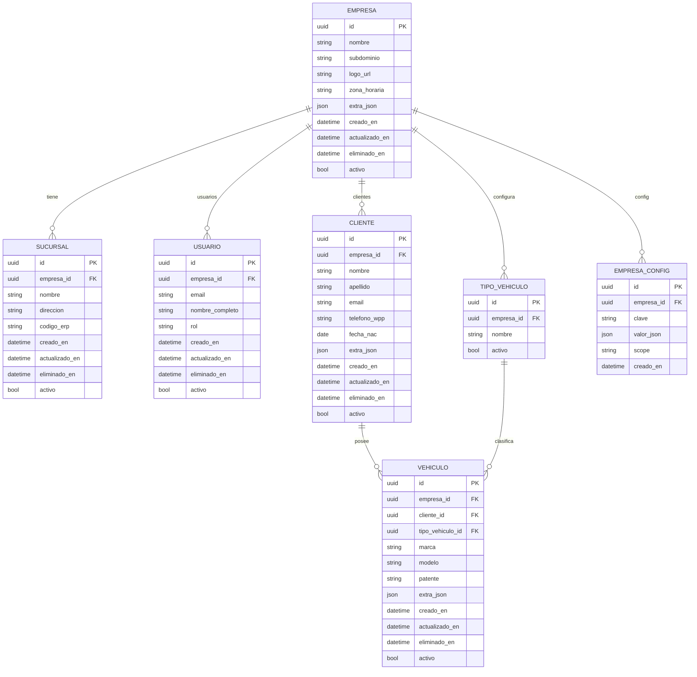
```mermaid
erDiagram
  EMPRESA ||--o{ SUCURSAL : "tiene"
  EMPRESA ||--o{ USUARIO : "usuarios"
  EMPRESA ||--o{ CLIENTE : "clientes"
  EMPRESA ||--o{ TIPO_VEHICULO : "configura"
  EMPRESA ||--o{ EMPRESA_CONFIG : "config"
  CLIENTE ||--o{ VEHICULO : "posee"
  TIPO_VEHICULO ||--o{ VEHICULO : "clasifica"

  EMPRESA {
    uuid id PK
    string nombre
    string subdominio
    string logo_url
    string zona_horaria
    json extra_json
    datetime creado_en
    datetime actualizado_en
    datetime eliminado_en
    bool activo
  }
  EMPRESA_CONFIG {
    uuid id PK
    uuid empresa_id FK
    string clave
    json valor_json
    string scope
    datetime creado_en
  }
  SUCURSAL {
    uuid id PK
    uuid empresa_id FK
    string nombre
    string direccion
    string codigo_erp
    datetime creado_en
    datetime actualizado_en
    datetime eliminado_en
    bool activo
  }
  USUARIO {
    uuid id PK
    uuid empresa_id FK
    string email
    string nombre_completo
    string rol
    datetime creado_en
    datetime actualizado_en
    datetime eliminado_en
    bool activo
  }
  CLIENTE {
    uuid id PK
    uuid empresa_id FK
    string nombre
    string apellido
    string email
    string telefono_wpp
    date fecha_nac
    json extra_json
    datetime creado_en
    datetime actualizado_en
    datetime eliminado_en
    bool activo
  }
  TIPO_VEHICULO {
    uuid id PK
    uuid empresa_id FK
    string nombre
    bool activo
  }
  VEHICULO {
    uuid id PK
    uuid empresa_id FK
    uuid cliente_id FK
    uuid tipo_vehiculo_id FK
    string marca
    string modelo
    string patente
    json extra_json
    datetime creado_en
    datetime actualizado_en
    datetime eliminado_en
    bool activo
  }
```

**Notas y propósito**

- **EMPRESA**: tenant; raíz jerárquica.
- **EMPRESA_CONFIG**: extensión por claves (p.ej., `moneda`, `propina_porcentual_sugerida`, `habilitar_whatsapp`).
- **SUCURSAL**: soporta `codigo_erp` para mapear con sistemas existentes.
- **USUARIO**: autorización por rol simple (ver §6).
- **CLIENTE**: datos básicos y `extra_json` para campos libres.
- **TIPO_VEHICULO**: catálogo simple.
- **VEHICULO**: vehículo por cliente; `patente` utilizada para búsquedas rápidas.

---

## 2) Vista B — Catálogo y Precios

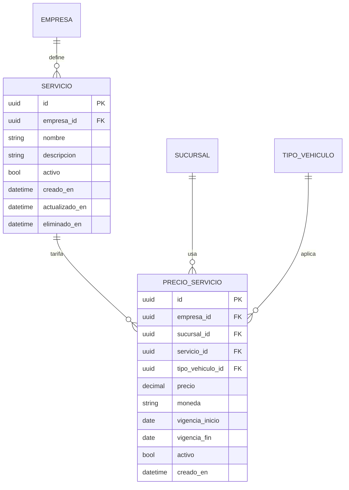
```mermaid
erDiagram
  EMPRESA ||--o{ SERVICIO : "define"
  SERVICIO ||--o{ PRECIO_SERVICIO : "tarifa"
  SUCURSAL ||--o{ PRECIO_SERVICIO : "usa"
  TIPO_VEHICULO ||--o{ PRECIO_SERVICIO : "aplica"

  SERVICIO {
    uuid id PK
    uuid empresa_id FK
    string nombre
    string descripcion
    bool activo
    datetime creado_en
    datetime actualizado_en
    datetime eliminado_en
  }
  PRECIO_SERVICIO {
    uuid id PK
    uuid empresa_id FK
    uuid sucursal_id FK
    uuid servicio_id FK
    uuid tipo_vehiculo_id FK
    decimal precio
    string moneda
    date vigencia_inicio
    date vigencia_fin
    bool activo
    datetime creado_en
  }
```

**Notas y propósito**

- **SERVICIO**: catálogo (lavado, encerado, interior, etc.).
- **PRECIO_SERVICIO**: tarifa efectiva por `sucursal + tipo_vehiculo + servicio + rango de vigencia`.

---

## 3) Vista C — Ventas, Pagos, Comprobantes y Cierre


```mermaid
erDiagram
  SUCURSAL ||--o{ VENTA : "registra"
  CLIENTE ||--o{ VENTA : "compra"
  VEHICULO ||--o{ VENTA : "para"
  VENTA ||--|{ VENTA_ITEM : "contiene"
  SERVICIO ||--o{ VENTA_ITEM : "se_vende"
  VENTA ||--o{ PAGO : "recibe"
  VENTA ||--o{ COMPROBANTE : "emite"
  VENTA ||--o{ LOG_NOTIF : "notifica"
  SUCURSAL ||--o{ SECUENCIA_COMPROBANTE : "numeracion"
  CLIENTE ||--o{ CLIENTE_FACTURACION : "datos_facturacion"
  SUCURSAL ||--o{ CIERRE_CAJA : "cierra"
  CIERRE_CAJA ||--o{ CIERRE_CAJA_TOTAL : "totales_por_metodo"

  VENTA {
    uuid id PK
    uuid empresa_id FK
    uuid sucursal_id FK
    uuid cliente_id FK
    uuid vehiculo_id FK
    datetime creado_en
    datetime actualizado_en
    string estado
    decimal subtotal
    decimal descuento
    decimal propina
    decimal total
    decimal saldo_pendiente
    string notas
  }
  VENTA_ITEM {
    uuid id PK
    uuid venta_id FK
    uuid servicio_id FK
    string servicio_nombre_cache
    decimal precio_unitario
    int cantidad
    decimal total_linea
  }
  PAGO {
    uuid id PK
    uuid venta_id FK
    string metodo
    decimal monto
    bool es_propina
    string referencia
    string idempotency_key
    datetime pagado_en
  }
  CLIENTE_FACTURACION {
    uuid id PK
    uuid cliente_id FK
    string razon_social
    string cuit
    string direccion
    string ciudad
    string provincia
    string codigo_postal
    bool activo
  }
  COMPROBANTE {
    uuid id PK
    uuid venta_id FK
    uuid cliente_facturacion_id FK
    string tipo
    string punto_venta
    string numero
    decimal total
    string moneda
    string pdf_url
    datetime emitido_en
  }
  SECUENCIA_COMPROBANTE {
    uuid id PK
    uuid sucursal_id FK
    string tipo
    int proximo_numero
    datetime actualizado_en
  }
  PLANTILLA_NOTIF {
    uuid id PK
    uuid empresa_id FK
    string clave
    string canal
    text cuerpo_tpl
    bool activo
  }
  LOG_NOTIF {
    uuid id PK
    uuid venta_id FK
    string canal
    string destinatario
    text cuerpo_renderizado
    string estado
    datetime enviado_en
  }
  CIERRE_CAJA {
    uuid id PK
    uuid empresa_id FK
    uuid sucursal_id FK
    uuid usuario_id FK
    datetime abierto_en
    datetime cerrado_en
    string notas
  }
  CIERRE_CAJA_TOTAL {
    uuid id PK
    uuid cierre_caja_id FK
    string metodo
    decimal monto
    decimal propinas
  }
```

**Reglas y fórmulas mínimas**

- `total_linea = cantidad * precio_unitario`
- `subtotal = SUM(total_linea)`
- `total = subtotal - descuento + propina`
- `saldo_pendiente = total - SUM(pagos donde es_propina=false)`
- La **propina** se almacena también en `PAGO.es_propina=true` si se cobra separada por método.

### 3.1) Estados de una venta (MVP)

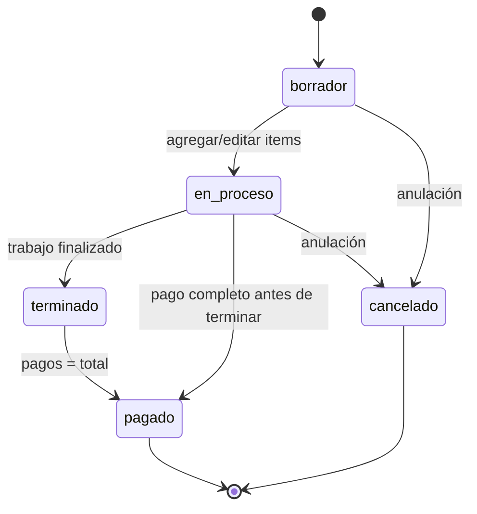
```mermaid
stateDiagram-v2
  [*] --> borrador
  borrador --> en_proceso: agregar/editar items
  en_proceso --> terminado: trabajo finalizado
  terminado --> pagado: pagos = total
  en_proceso --> pagado: pago completo antes de terminar
  borrador --> cancelado: anulación
  en_proceso --> cancelado: anulación
  pagado --> [*]
  cancelado --> [*]
```

---

## 4) Vista D — SaaS y Observabilidad

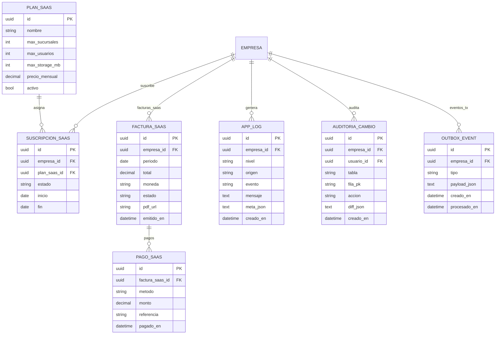
```mermaid
erDiagram
  PLAN_SAAS ||--o{ SUSCRIPCION_SAAS : "asigna"
  EMPRESA ||--o{ SUSCRIPCION_SAAS : "suscribe"
  EMPRESA ||--o{ FACTURA_SAAS : "facturas_saas"
  FACTURA_SAAS ||--o{ PAGO_SAAS : "pagos"
  EMPRESA ||--o{ APP_LOG : "genera"
  EMPRESA ||--o{ AUDITORIA_CAMBIO : "audita"
  EMPRESA ||--o{ OUTBOX_EVENT : "eventos_tx"

  PLAN_SAAS {
    uuid id PK
    string nombre
    int max_sucursales
    int max_usuarios
    int max_storage_mb
    decimal precio_mensual
    bool activo
  }
  SUSCRIPCION_SAAS {
    uuid id PK
    uuid empresa_id FK
    uuid plan_saas_id FK
    string estado
    date inicio
    date fin
  }
  FACTURA_SAAS {
    uuid id PK
    uuid empresa_id FK
    date periodo
    decimal total
    string moneda
    string estado
    string pdf_url
    datetime emitido_en
  }
  PAGO_SAAS {
    uuid id PK
    uuid factura_saas_id FK
    string metodo
    decimal monto
    string referencia
    datetime pagado_en
  }
  APP_LOG {
    uuid id PK
    uuid empresa_id FK
    string nivel
    string origen
    string evento
    text mensaje
    text meta_json
    datetime creado_en
  }
  AUDITORIA_CAMBIO {
    uuid id PK
    uuid empresa_id FK
    uuid usuario_id FK
    string tabla
    string fila_pk
    string accion
    text diff_json
    datetime creado_en
  }
  OUTBOX_EVENT {
    uuid id PK
    uuid empresa_id FK
    string tipo
    text payload_json
    datetime creado_en
    datetime procesado_en
  }
```

**Eventos recomendados (Outbox, MVP)**

- `VentaPagada`, `ComprobanteEmitido`, `VehiculoListo`, `CierreCajaCerrado`

---

## 5) Restricciones, índices y validaciones (valor negocio)

**Unicidad y formato**

- `VEHICULO.patente` **única por empresa** `(empresa_id, patente_normalizada)` con normalización (trim, uppercase, sin guiones/espacios).
- `SERVICIO.nombre` **único por empresa** `(empresa_id, nombre_normalizado)` para evitar duplicados.
- `SUCURSAL.codigo_erp` **único por empresa** si se usa mapeo ERP.

**Precios sin solapamiento (simple)**

- En `PRECIO_SERVICIO`, no permitir rangos superpuestos para la misma tupla `(empresa_id, sucursal_id, servicio_id, tipo_vehiculo_id)`.
  - Chequeo: al insertar, validar que `[vigencia_inicio, vigencia_fin]` no colisione con otro rango activo.

**Integridad operacional**

- `VENTA_ITEM.cantidad >= 1`, `precio_unitario >= 0`.
- `PAGO.monto > 0` y no exceder `saldo_pendiente` cuando `es_propina=false`.
- `COMPROBANTE.numero` consecutivo por `(sucursal_id, tipo)` vía `SECUENCIA_COMPROBANTE` + **idempotencia** a nivel de operación de emisión.

**Índices prácticos**

- Búsquedas:
  - `CLIENTE(email)`, `CLIENTE(telefono_wpp)`
  - `VEHICULO(patente_normalizada)`
  - `VENTA(sucursal_id, creado_en)`, `VENTA(estado)`
  - `PAGO(venta_id, pagado_en)`
  - `PRECIO_SERVICIO(sucursal_id, servicio_id, tipo_vehiculo_id, vigencia_inicio)`

---

## 6) Roles (mínimos, MVP)

- **Admin**: todo sobre su empresa (catálogo, usuarios, precios, reportes, cierres).
- **Operador/Cajero**: crear ventas, ítems, pagos, emitir comprobantes, notificar, cerrar caja.
- **Auditor (solo lectura)**: reportes, ventas, cierres, sin modificar.

_(Implementable en Django con `groups`/`permissions` simples.)_

---

## 7) Procesos granulares (Entradas / Salidas / Reglas / Errores)

> **Regla de oro**: cada proceso retorna una **salida clara** y deja **estado consistente**.

### 7.1 Alta/selección de Cliente y Vehículo

- **Entradas**: `empresa_id`, (`cliente_id` _o_ {nombre, apellido, email?, telefono*wpp?}), (`vehiculo_id` \_o* {tipo_vehiculo_id, marca, modelo, patente?})
- **Salidas**: `cliente_id`, `vehiculo_id` (upsert si coincide por teléfono/email y patente)
- **Reglas**: normalizar `telefono_wpp`, `patente`; evitar duplicados.
- **Errores**: formato inválido, patente duplicada, tipo_vehiculo inexistente.

### 7.2 Crear venta (borrador)

- **Entradas**: `empresa_id`, `sucursal_id`, `cliente_id`, `vehiculo_id`
- **Salidas**: `venta_id` (estado=`borrador`, `saldo_pendiente = 0`)
- **Reglas**: sucursal activa, cliente/vehículo pertenecen a la misma empresa.
- **Errores**: referencias cruzadas de otra empresa, sucursal inactiva.

### 7.3 Agregar/editar ítems de venta

- **Entradas**: `venta_id`, lista de `{servicio_id, cantidad}`, **fecha_precio** (default: `now()` del servidor)
- **Salida**: `subtotal`, `total`, `saldo_pendiente` recalculados
- **Reglas**: resolver **precio** en `PRECIO_SERVICIO` por `sucursal + servicio + tipo_vehiculo + fecha_precio`; cachear `servicio_nombre`.
- **Errores**: precio no encontrado, cantidad < 1, servicio inactivo.

### 7.4 Registrar pago(s)

- **Entradas**: `venta_id`, `metodo` (efectivo/tarjeta/MP), `monto`, `es_propina?`, `idempotency_key?`
- **Salida**: `saldo_pendiente` actualizado; posible transición a `pagado` si `saldo_pendiente = 0`.
- **Reglas**: no permitir `monto` > `saldo_pendiente` cuando `es_propina=false`.
- **Errores**: monto inválido, `idempotency_key` repetida (duplicado).

### 7.5 Finalizar venta (trabajo completo)

- **Entradas**: `venta_id`
- **Salida**: `estado=terminado` (o `pagado` si saldo=0)
- **Reglas**: debe existir ≥1 `VENTA_ITEM`.
- **Errores**: venta sin ítems; venta cancelada.

### 7.6 Emitir comprobante (no fiscal)

- **Entradas**: `venta_id`, `tipo`, `punto_venta`, `cliente_facturacion_id?`
- **Salida**: `COMPROBANTE{numero, pdf_url}`
- **Reglas**: reservar número con `SECUENCIA_COMPROBANTE` (transacción + idempotencia); snapshot de totales.
- **Errores**: secuencia bloqueada, venta sin total, venta cancelada.

### 7.7 Notificar cliente (opcional)

- **Entradas**: `venta_id`, `PLANTILLA_NOTIF.clave`
- **Salida**: `LOG_NOTIF{id, estado=enviado|fallido}`
- **Reglas**: render de plantilla con placeholders y datos de la venta.
- **Errores**: canal no habilitado, destinatario vacío.

### 7.8 Cierre de caja

- **Entradas**: `sucursal_id`, `usuario_id`, `rango_horas`
- **Salida**: `CIERRE_CAJA{id}` + `CIERRE_CAJA_TOTAL` agrupado por `metodo`
- **Reglas**: sumar pagos del periodo; propinas separadas.
- **Errores**: solapamiento de cierres, rango vacío.

#### Diagrama de flujo de Cierre (MVP)

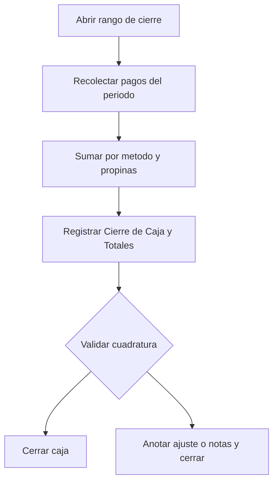
```mermaid
flowchart TD
  A["Abrir rango de cierre"]
  B["Recolectar pagos del periodo"]
  C["Sumar por metodo y propinas"]
  D["Registrar Cierre de Caja y Totales"]
  E{"Validar cuadratura"}
  F["Cerrar caja"]
  G["Anotar ajuste o notas y cerrar"]

  A --> B
  B --> C
  C --> D
  D --> E
  E --> F
  E --> G
```

---

## 8) Endpoints MVP (sugeridos, nombres lógicos)

- `/clientes [GET/POST]`, `/vehiculos [GET/POST]`
- `/ventas [POST]` (crear borrador), `/ventas/{id} [GET/PATCH]`
- `/ventas/{id}/items [POST/PATCH/DELETE]`
- `/ventas/{id}/pagos [POST]`
- `/ventas/{id}/finalizar [POST]`
- `/ventas/{id}/comprobante [POST]`
- `/ventas/{id}/notificar [POST]`
- `/cierres [POST]`, `/cierres/{id} [GET]`
- `/precios [GET/POST]`, `/servicios [GET/POST]`

_(En Django: `UUIDField` como PK, `auto_now(_add)` para timestamps, `constraints` en `Meta`.)_

---

## 9) Reportes y KPIs (operativos, MVP)

- **Ventas por día / sucursal** (total, #ventas, ticket promedio)
- **Servicios top** por cantidad y facturación
- **Métodos de pago** (mix por periodo)
- **Propinas** (total y % sobre ventas)
- **Clientes recurrentes** (% repiten en 30/60 días) _(simple: por `vehiculo_id` o `cliente_id`)_

---

## 10) Consideraciones de implementación (Django, prácticas simples)

- **Soft-delete**: usar `eliminado_en` (filtro global por empresa y `eliminado_en IS NULL`).
- **Transactions**: emisión de comprobante y movimientos críticos con `select_for_update()` sobre `SECUENCIA_COMPROBANTE`.
- **Idempotencia**: `PAGO.idempotency_key` y “safe re-try” en emisión de comprobantes.
- **Validación de precios**: función única `resolver_precio(empresa, sucursal, servicio, tipo_vehiculo, fecha)` para centralizar la lógica.
- **Serializadores simples**: exponer sólo campos necesarios a UI.
- **Seeds mínimos**: `TIPO_VEHICULO` comunes (auto, moto, camioneta).

---

## 11) Circuito de una Venta (secuencia)

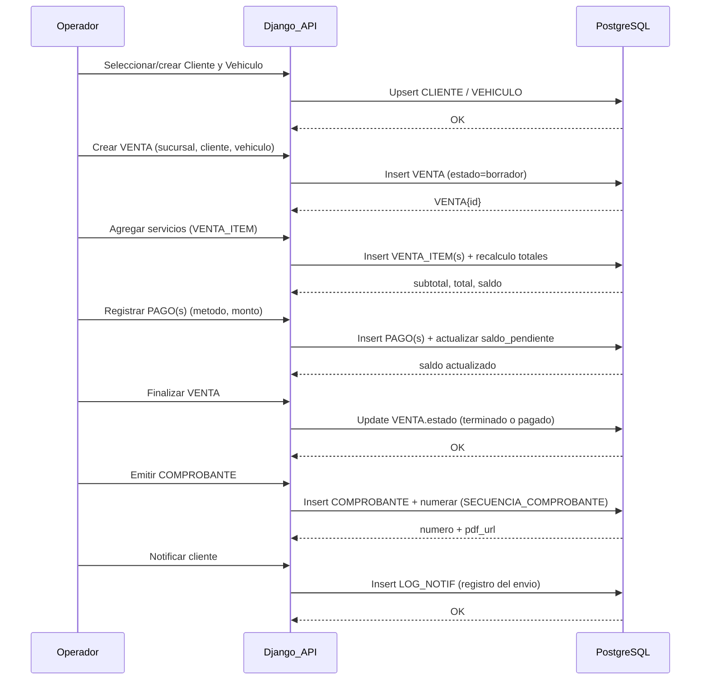
```mermaid
sequenceDiagram
  participant U as Operador
  participant API as Django_API
  participant DB as PostgreSQL

  U->>API: Seleccionar/crear Cliente y Vehiculo
  API->>DB: Upsert CLIENTE / VEHICULO
  DB-->>API: OK

  U->>API: Crear VENTA (sucursal, cliente, vehiculo)
  API->>DB: Insert VENTA (estado=borrador)
  DB-->>API: VENTA{id}

  U->>API: Agregar servicios (VENTA_ITEM)
  API->>DB: Insert VENTA_ITEM(s) + recalculo totales
  DB-->>API: subtotal, total, saldo

  U->>API: Registrar PAGO(s) (metodo, monto)
  API->>DB: Insert PAGO(s) + actualizar saldo_pendiente
  DB-->>API: saldo actualizado

  U->>API: Finalizar VENTA
  API->>DB: Update VENTA.estado (terminado o pagado)
  DB-->>API: OK

  U->>API: Emitir COMPROBANTE
  API->>DB: Insert COMPROBANTE + numerar (SECUENCIA_COMPROBANTE)
  DB-->>API: numero + pdf_url

  U->>API: Notificar cliente
  API->>DB: Insert LOG_NOTIF (registro del envio)
  DB-->>API: OK
```

---

# Plan detallado por app (Django) — SaaS Lavaderos (MVP)

> Objetivo: que cada app tenga **responsabilidades claras**, **módulos internos** y **flujos** listos para implementar.  
> Convención de diagramas: usar `flowchart` sin etiquetas en aristas para máxima compatibilidad.

---

## 1) `accounts/` (allauth + membresías + roles)

**Rol**: Autenticación (allauth), pertenencia a empresas y autorización por rol.

**Módulos**

- `models.py`: `UserProfile`, `EmpresaMembership(user, empresa, rol)`
- `services.py`: alta empresa + owner, asignación de roles, helpers de autorización
- `serializers.py` (DRF): perfiles y membresías
- `views.py`/`urls.py`: endpoints de perfil y onboarding simple
- `permissions.py`: `IsMemberOfEmpresa`, `HasRole`

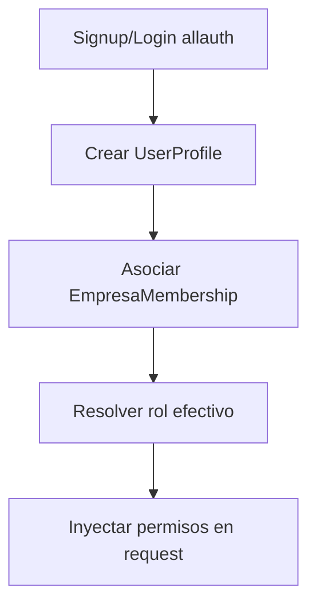
```mermaid
flowchart TD
  A[Signup/Login allauth] --> B[Crear UserProfile]
  B --> C[Asociar EmpresaMembership]
  C --> D[Resolver rol efectivo]
  D --> E[Inyectar permisos en request]
```

---

## 2) `org/` (empresa, sucursal, configuración)

**Rol**: Raíz multi-tenant; sucursales; configuración por claves.

**Módulos**

- `models.py`: `EMPRESA`, `SUCURSAL`, `EMPRESA_CONFIG`
- `services.py`: lectura de config, alta sucursal, validaciones
- `serializers.py` y `views.py`: CRUD limitado
- `selectors.py`: queries frecuentes por empresa/sucursal

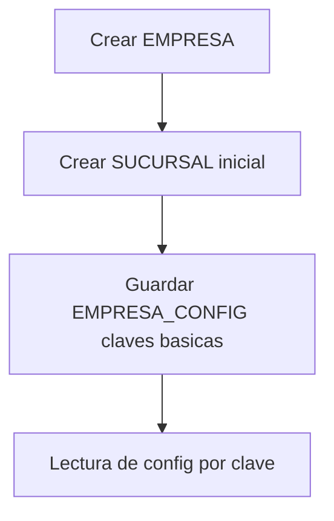
```mermaid
flowchart TD
  A[Crear EMPRESA] --> B[Crear SUCURSAL inicial]
  B --> C[Guardar EMPRESA_CONFIG claves basicas]
  C --> D[Lectura de config por clave]
```

---

## 3) `customers/` (clientes y datos de facturación)

**Rol**: Gestión de clientes y perfiles fiscales.

**Módulos**

- `models.py`: `CLIENTE`, `CLIENTE_FACTURACION`
- `services.py`: `upsert_cliente`, `get_or_create_facturacion`
- `serializers.py` y `views.py`: endpoints REST
- `normalizers.py`: email/teléfono

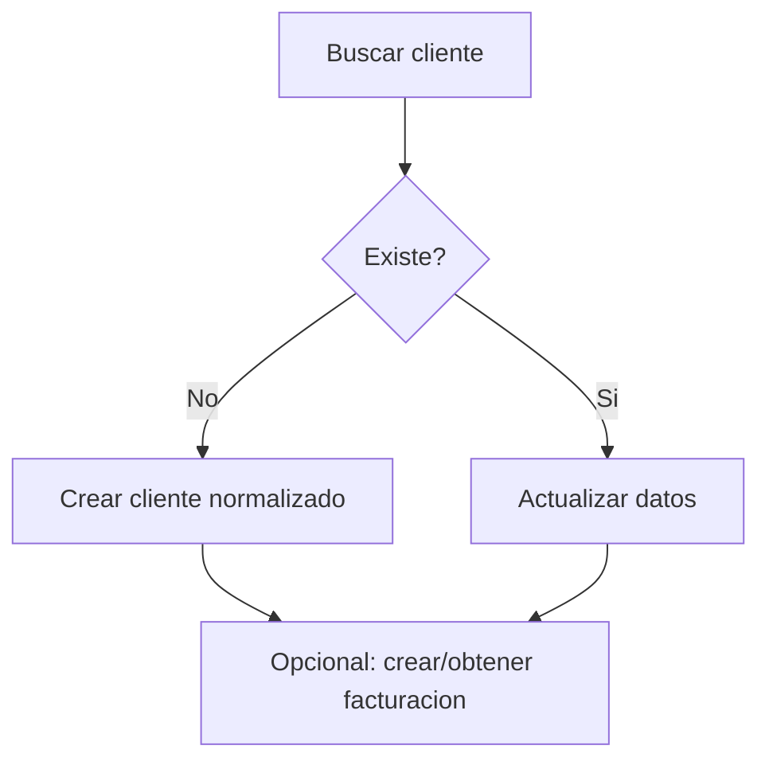
```mermaid
flowchart TD
  A[Buscar cliente] --> B{Existe?}
  B -->|No| C[Crear cliente normalizado]
  B -->|Si| D[Actualizar datos]
  C --> E[Opcional: crear facturacion]
  D --> E[Opcional: crear/obtener facturacion]
```

---

## 4) `vehicles/` (tipos y vehículos)

**Rol**: Tipos de vehículo y vehículos por cliente con unicidad de patente por empresa.

**Módulos**

- `models.py`: `TIPO_VEHICULO`, `VEHICULO`
- `services.py`: `upsert_vehiculo`, `normalizar_patente`
- `serializers.py` y `views.py`: endpoints REST
- `validators.py`: unicidad `(empresa_id, patente_normalizada)`

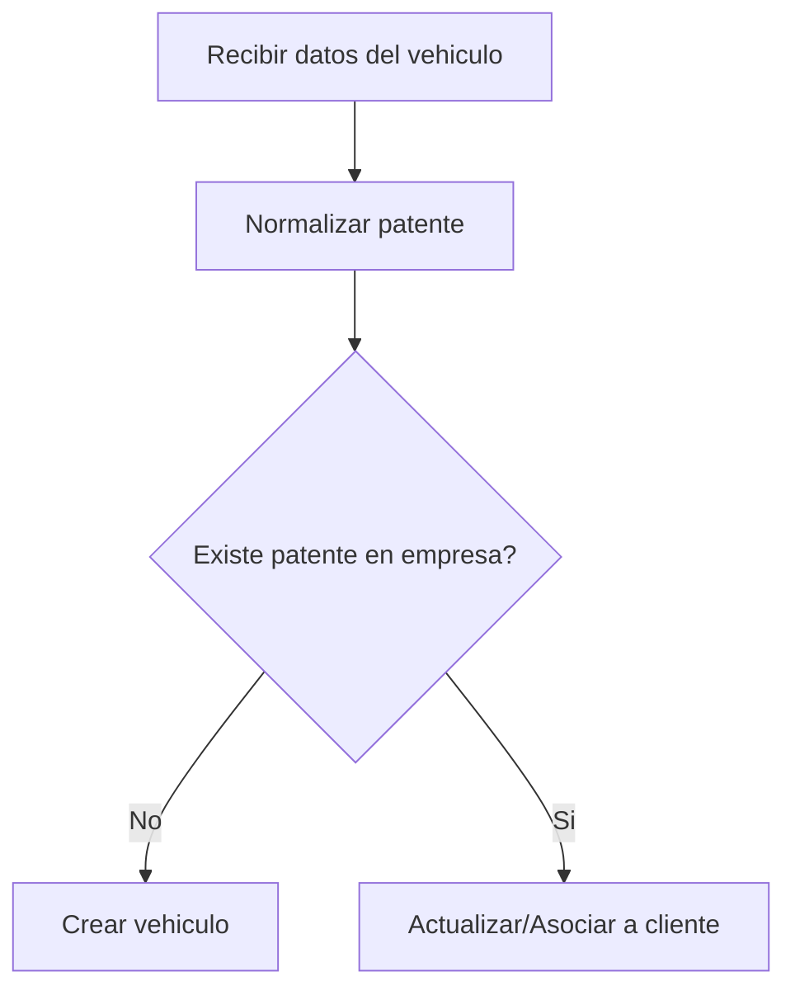
```mermaid
flowchart TD
  A[Recibir datos del vehiculo] --> B[Normalizar patente]
  B --> C{Existe patente en empresa?}
  C -->|No| D[Crear vehiculo]
  C -->|Si| E[Actualizar/Asociar a cliente]
```

---

## 5) `catalog/` (servicios)

**Rol**: Catálogo de servicios.

**Módulos**

- `models.py`: `SERVICIO`
- `services.py`: validación de nombre único por empresa
- `serializers.py`, `views.py`
- `selectors.py`: listar activos

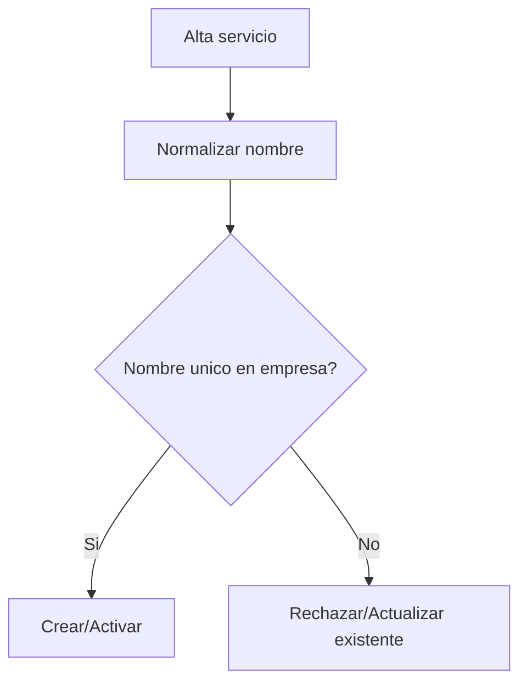
```mermaid
flowchart TD
  A[Alta servicio] --> B[Normalizar nombre]
  B --> C{Nombre unico en empresa?}
  C -->|Si| D[Crear/Activar]
  C -->|No| E[Rechazar/Actualizar existente]
```

---

## 6) `pricing/` (precios efectivos por sucursal/tipo/servicio)

**Rol**: Tarifas con vigencia; resolver precio efectivo.

**Módulos**

- `models.py`: `PRECIO_SERVICIO`
- `services.py`: `resolver_precio`, alta sin solapamientos
- `validators.py`: colisión de rangos
- `serializers.py`, `views.py`

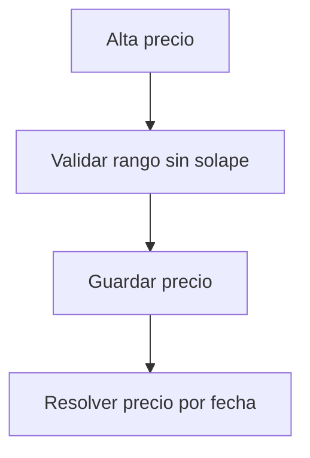
```mermaid
flowchart TD
  A[Alta precio] --> B[Validar rango sin solape]
  B --> C[Guardar precio]
  C --> D[Resolver precio por fecha]
```

---

## 7) `sales/` (ventas e ítems; estados)

**Rol**: Crear venta, gestionar ítems, totales y estados.

**Módulos**

- `models.py`: `VENTA`, `VENTA_ITEM` (métodos de recálculo)
- `services.py`: `crear_venta`, `agregar_items`, `finalizar_venta`
- `calculations.py`: subtotal, total, saldo
- `serializers.py`, `views.py`
- `fsm.py`: transiciones de estado

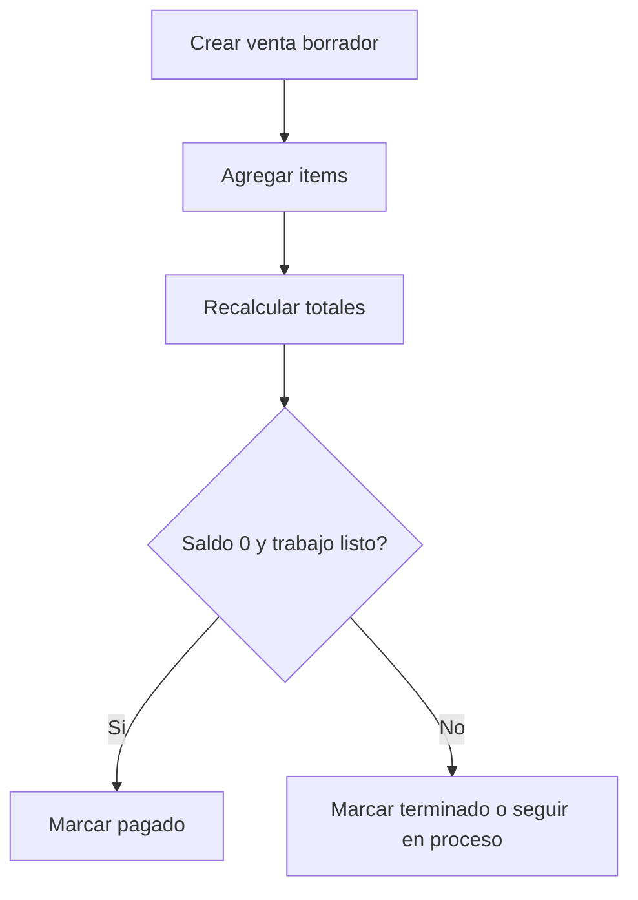
```mermaid
flowchart TD
  A[Crear venta borrador] --> B[Agregar items]
  B --> C[Recalcular totales]
  C --> D{Saldo 0 y trabajo listo?}
  D -->|Si| E[Marcar pagado]
  D -->|No| F[Marcar terminado o seguir en proceso]
```

---

## 8) `payments/` (pagos e idempotencia)

**Rol**: Registrar pagos, actualizar saldo, transición a pagado.

**Módulos**

- `models.py`: `PAGO`
- `services.py`: `registrar_pago` con `idempotency_key`
- `serializers.py`, `views.py`
- `validators.py`: `monto > 0`, límite por saldo

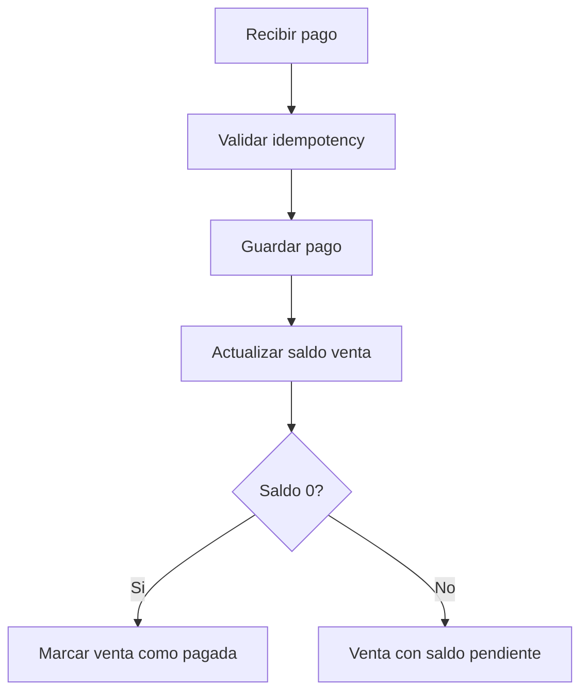
```mermaid
flowchart TD
  A[Recibir pago] --> B[Validar idempotency]
  B --> C[Guardar pago]
  C --> D[Actualizar saldo venta]
  D --> E{Saldo 0?}
  E -->|Si| F[Marcar venta como pagada]
  E -->|No| G[Venta con saldo pendiente]
```

---

## 9) `invoicing/` (comprobante no fiscal + secuencia)

**Rol**: Emitir comprobante con numeración atómica por sucursal/tipo.

**Módulos**

- `models.py`: `COMPROBANTE`, `SECUENCIA_COMPROBANTE`
- `services.py`: `emitir_comprobante` (`select_for_update` sobre secuencia)
- `pdf.py`: generador PDF simple (placeholder MVP)
- `serializers.py`, `views.py`

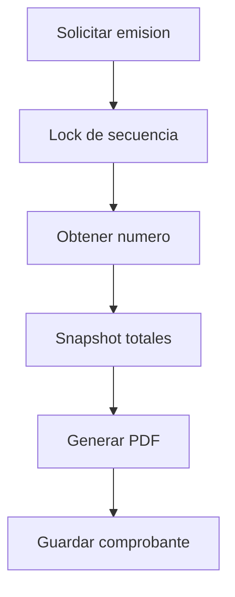
```mermaid
flowchart TD
  A[Solicitar emision] --> B[Lock de secuencia]
  B --> C[Obtener numero]
  C --> D[Snapshot totales]
  D --> E[Generar PDF]
  E --> F[Guardar comprobante]
```

---

## 10) `notifications/` (plantillas y logs)

**Rol**: Render de mensajes y registro de envíos.

**Módulos**

- `models.py`: `PLANTILLA_NOTIF`, `LOG_NOTIF`
- `services.py`: `enviar_notificacion(venta, clave_plantilla)`
- `renderers.py`: placeholders estándar
- `serializers.py`, `views.py`

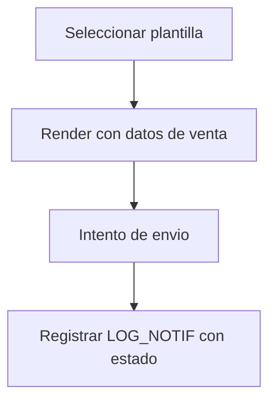
```mermaid
flowchart TD
  A[Seleccionar plantilla] --> B[Render con datos de venta]
  B --> C[Intento de envio]
  C --> D[Registrar LOG_NOTIF con estado]
```

---

## 11) `cashbox/` (cierres de caja)

**Rol**: Consolidar pagos por rango y método; generar cierre + totales.

**Módulos**

- `models.py`: `CIERRE_CAJA`, `CIERRE_CAJA_TOTAL`
- `services.py`: `cerrar_caja(sucursal, desde, hasta)`
- `serializers.py`, `views.py`

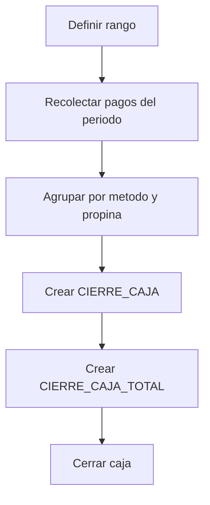
```mermaid
flowchart TD
  A[Definir rango] --> B[Recolectar pagos del periodo]
  B --> C[Agrupar por metodo y propina]
  C --> D[Crear CIERRE_CAJA]
  D --> E[Crear CIERRE_CAJA_TOTAL]
  E --> F[Cerrar caja]
```

---

## 12) `saas/` (planes y suscripciones — estructura básica)

**Rol**: Estructura para planes y facturas SaaS (automatización luego).

**Módulos**

- `models.py`: `PLAN_SAAS`, `SUSCRIPCION_SAAS`, `FACTURA_SAAS`, `PAGO_SAAS`
- `services.py`: alta suscripción, emitir factura demo
- `serializers.py`, `views.py`

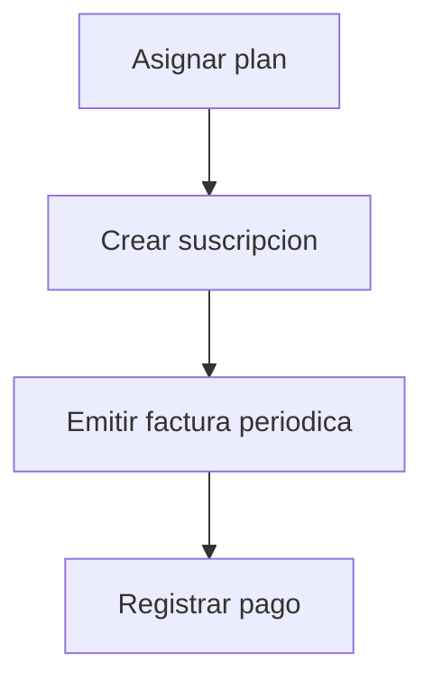
```mermaid
flowchart TD
  A[Asignar plan] --> B[Crear suscripcion]
  B --> C[Emitir factura periodica]
  C --> D[Registrar pago]
```

---

## 13) `audit/` y `app_log/` (observabilidad mínima)

**Rol**: Auditoría de cambios y logs de eventos.

**Módulos**

- `audit/models.py`: `AUDITORIA_CAMBIO`
- `audit/middleware.py`: captura de cambios CRUD simples
- `app_log/models.py`: `APP_LOG`
- `app_log/services.py`: registrar eventos técnicos/de negocio

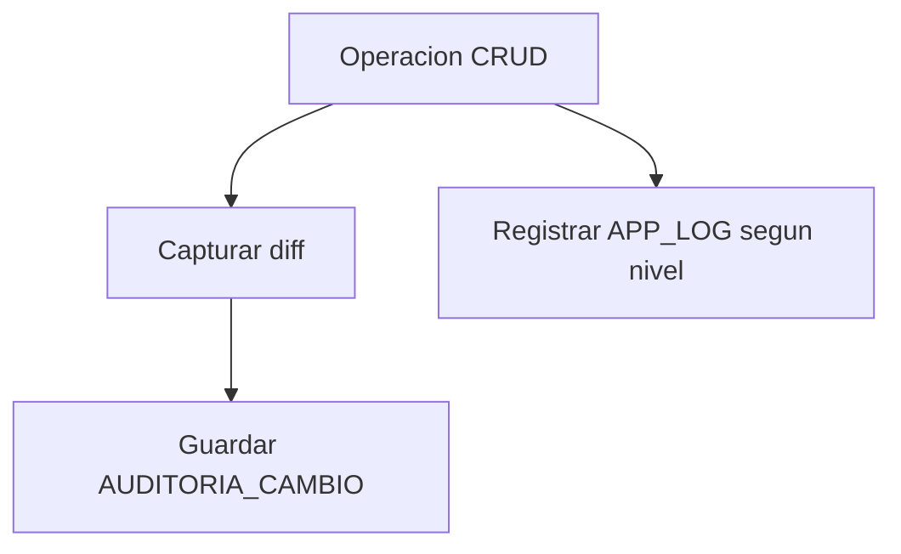
```mermaid
flowchart TD
  A[Operacion CRUD] --> B[Capturar diff]
  B --> C[Guardar AUDITORIA_CAMBIO]
  A --> D[Registrar APP_LOG segun nivel]
```

---

## 14) Diagrama de dependencias entre apps (alto nivel)

```mermaid
flowchart LR
  accounts --> org
  accounts --> customers
  accounts --> vehicles
  org --> pricing
  catalog --> pricing
  vehicles --> sales
  customers --> sales
  pricing --> sales
  sales --> payments
  sales --> invoicing
  sales --> notifications
  payments --> cashbox
  invoicing --> notifications
  org --> cashbox
  saas --> org
```

---

## 15) Contratos de servicios (resumen de E/S por app)

- **customers**: `upsert_cliente(empresa, datos)` → `CustomerDTO`
- **vehicles**: `upsert_vehiculo(empresa, cliente, datos)` → `VehicleDTO`
- **pricing**: `resolver_precio(empresa, sucursal, servicio, tipo, fecha)` → `{precio, moneda}`
- **sales**: `crear_venta(...)` → `VentaDTO`; `agregar_items(venta, items, fecha)` → `VentaDTO`; `finalizar_venta(venta)` → `VentaDTO`
- **payments**: `registrar_pago(venta, metodo, monto, es_propina?, key?)` → `VentaDTO`
- **invoicing**: `emitir_comprobante(venta, tipo, pv, cf?)` → `ComprobanteDTO`
- **notifications**: `enviar_notificacion(venta, plantilla)` → `log_id`
- **cashbox**: `cerrar_caja(empresa, sucursal, desde, hasta)` → `CierreCajaDTO`

---

## 16) Reglas transversales (mínimas y prácticas)

- **Multitenancy**: `empresa_id` obligatorio en todo; filtros por defecto en managers.
- **Estados de venta**: transiciones controladas; no finalizar sin ítems.
- **Idempotencia** en pagos y emisión de comprobantes (lock de secuencia).
- **Validación de precios**: sin solapamiento por tupla `(empresa, sucursal, servicio, tipo)`.
- **Unicidades**: patente por empresa; servicio por nombre normalizado y empresa.

---

# LavaderosApp — Documentación de **Estructura General**

> **Objetivo**: Establecer la arquitectura de carpetas, los layouts de UI y las convenciones transversales del proyecto.  
> **Alcance**: Estructura global, _no_ de cada módulo; dejamos listo el terreno para seguir “app por app”.  
> **Stack**: Django (server-rendered) + Bootstrap 5 (tema Bootswatch local). **Sin DRF**.

---

## 1) Árbol del proyecto (actualizado)

```bash
lavaderosapp/
├── manage.py
├── .env
├── .gitignore
├── README.md
├── lavaderos/
│   ├── __init__.py
│   ├── urls.py                      # enrutamiento global (incluye urls de apps)
│   ├── tenancy.py                   # utilidades multi-tenant (subdominio/header) [opcional]
│   ├── middleware.py                # TenancyMiddleware: inyecta empresa/sucursal en request
│   ├── permissions.py               # permisos/roles reutilizables a nivel proyecto
│   └── settings/
│       ├── __init__.py
│       ├── base.py                  # base común a todos los entornos
│       ├── development.py           # DEBUG, sqlite, email consola
│       ├── production.py            # Postgres, seguridad, SMTP real
│       └── render.py                # ajustes para Render.com (si aplica)
├── templates/                       # templates globales + overrides de librerías
│   ├── base.html                    # layout PÚBLICO (landing, marketing, login/signup)
│   ├── base_auth.html               # layout AUTENTICADO (navbar compacto + sidebar)
│   ├── home_dashboard.html          # panel contextual para usuarios logueados
│   ├── includes/
│   │   ├── _navbar_public.html      # navbar público (CTA de login/signup)
│   │   ├── _navbar_auth.html        # navbar autenticado (perfil, membresías, salir)
│   │   ├── _sidebar.html            # menú lateral principal (apps, selector de sucursal)
│   │   ├── _messages.html           # Django messages (alerts Bootstrap)
│   │   ├── _footer.html             # pie de página
│   │   └── _pagination.html         # componente reutilizable de paginación
│   ├── account/                     # overrides de django-allauth
│   │   ├── login.html
│   │   ├── signup.html
│   │   ├── password_reset.html
│   │   ├── password_reset_done.html
│   │   ├── password_reset_from_key.html
│   │   ├── password_reset_from_key_done.html
│   │   ├── password_change.html
│   │   └── password_change_done.html
│   └── errors/                      # páginas de error personalizadas
│       ├── 401.html
│       ├── 403.html
│       ├── 404.html
│       └── 500.html
├── static/                          # assets globales versionados
│   ├── css/
│   │   ├── bootswatch/brite.min.css # tema Bootstrap local
│   │   └── app.css                  # reservado para estilos propios (mínimos)
│   ├── js/
│   │   ├── bootstrap.bundle.min.js  # Bootstrap + Popper
│   │   └── app.js                   # scripts globales (inicializaciones)
│   ├── img/
│   │   └── logo.png
│   └── vendor/                      # librerías opcionales (bootstrap-icons, chart.js, etc.)
├── media/                           # uploads en desarrollo (en prod: storage externo)
├── staticfiles/                     # destino de collectstatic (no editar a mano)
└── apps/                            # **todas** las apps de dominio
    ├── accounts/                    # auth (allauth), perfil, membresías
    ├── org/                         # lavadero (Empresa), Sucursal, selector
    ├── customers/
    ├── vehicles/
    ├── catalog/
    ├── pricing/
    ├── sales/
    ├── payments/
    ├── invoicing/
    ├── notifications/
    ├── cashbox/
    ├── saas/                        # planes/limitaciones (ej. 1 empresa por usuario)
    ├── audit/
    └── app_log/
```

> **Regla de oro**: los templates de cada app viven en `apps/<app>/templates/<app>/**`. Así evitamos colisiones de nombres y mantenemos aislamiento por dominio.

---

## 2) Layouts y herencia de templates

### 2.1 `templates/base.html` (público)

- **Uso**: landing/marketing, login/signup y páginas no autenticadas.
- **Bloques clave**: `title`, `meta_description`, `navbar`, `hero`, `content`, `extra_css`, `extra_js`, `footer`.
- **Navbar**: incluye `includes/_navbar_public.html` (sobrescribir `block navbar` si se desea otra cabecera).
- **Hero**: bloque opcional; se puede anular con ``.

### 2.2 `templates/base_auth.html` (autenticado)

- **Uso**: toda página tras login.
- **Composición**:
  - Navbar compacto: `includes/_navbar_auth.html` (perfil, membresías, logout).
  - **Layout con sidebar**:
    - Columna fija con `includes/_sidebar.html` (menú acordeón y **selector de sucursal**).
    - Contenedor principal para ``.
- **Mensajes**: `_messages.html` integrado antes del contenido.

### 2.3 `templates/home_dashboard.html`

- **Uso**: panel contextual tras login.
- **Lógica de presentación** (sin entrar al código):
  - Sin lavadero → CTA “Crear lavadero”.
  - Con lavadero pero sin sucursales → CTA “Crear primera sucursal”.
  - “Listo para operar” (≥ 1 sucursal) → accesos rápidos y widgets placeholder (KPIs).

---

## 3) Partials globales (includes)

- **`_navbar_public.html`**: marca + CTAs “Ingresar” / “Crear cuenta”. Sin enlaces de operación.
- **`_navbar_auth.html`**: avatar/nombre, accesos a **Perfil**, **Membresías**, **Cambiar contraseña** y **Salir**. Navegación funcional se deriva al **sidebar**.
- **`_sidebar.html`**:
  - Encabezado: **Lavadero actual** (empresa activa).
  - **Selector de Sucursal** (`<select>` con `onchange=submit`) que hace **POST** a una ruta de selector (centraliza la fijación en sesión).
  - Acordeones: Organización, Operación, Maestros, Reportes, Administración (links preparados; algunos módulos aún en desarrollo).
- **`_messages.html`**: renderiza `django.contrib.messages` a Bootstrap alerts.
- **`_pagination.html`**: tabla/listados con paginación consistente.
- **`_footer.html`**: pie común (legal/links).

> **Convención**: cualquier página autenticada que necesite navegación de negocio **debe** extender `base_auth.html` para heredar sidebar y mensajes.

---

## 4) Estáticos (static/) y assets

- **Bootstrap**: tema **Bootswatch “brite”** local (`static/css/bootswatch/brite.min.css`).  
  No dependemos de CDNs.
- **JS**: `bootstrap.bundle.min.js` + `app.js` para inicializaciones (por ejemplo, tooltips).
- **Imágenes**: `static/img/` (logo, íconos básicos).
- **Vendor**: espacio para librerías de terceros sin NPM (p. ej., `bootstrap-icons/`).
- **Producción**: ejecutar `collectstatic` → servir `staticfiles/` (Nginx u otro).

---

## 5) Settings y middleware (resumen de integración)

- `INSTALLED_APPS` (clave):
  - `django.contrib.sites`, `allauth`, `allauth.account`
  - Apps propias (`apps.org`, `apps.accounts`, …)
  - `SITE_ID = 1`
- `MIDDLEWARE`:
  - **`lavaderos.middleware.TenancyMiddleware`** (inyecta `request.empresa_activa` y `request.sucursal_activa` desde sesión; si falta, intenta fijar por defecto la primera empresa del usuario).
- `TEMPLATES`:
  - `DIRS = [BASE_DIR / "templates"]`
  - `context_processors.request` **habilitado** (requerido por allauth y varios templates).
- Allauth (email-only recomendado en MVP):
  - `ACCOUNT_AUTHENTICATION_METHOD="email"`
  - `ACCOUNT_EMAIL_REQUIRED=True`
  - `ACCOUNT_EMAIL_VERIFICATION="none"` (en prod real: `"mandatory"`)
  - `ACCOUNT_USERNAME_REQUIRED=False`
  - `ACCOUNT_LOGOUT_ON_GET=True`
  - `LOGIN_REDIRECT_URL="/"`, `LOGOUT_REDIRECT_URL="/"`

---

## 6) Convenciones por app (estructura recomendada)

Cada módulo en `apps/<app>/` sigue este patrón (MVP):

```bash
apps/<app>/
├── __init__.py
├── apps.py
├── admin.py
├── migrations/
│   └── __init__.py
├── models.py
├── urls.py
├── views.py                     # CBVs; delgadas; usan services/selectors
├── forms/
│   ├── __init__.py
│   └── <app>.py
├── services/
│   ├── __init__.py
│   └── casos_de_uso.py          # lógica de dominio (crear/editar, etc.)
├── selectors.py                 # lecturas/queries para vistas
├── permissions.py               # reglas de acceso/roles específicas del app
├── templates/<app>/             # templates namespaced de la app
│   └── ...
└── static/<app>/                # assets propios del módulo
    └── ...
```

**Principios**:

- **Separation of concerns**: vistas delgadas; mutaciones en `services/`, lecturas en `selectors.py`.
- **Templates con Bootstrap** directo (solo clases en HTML; sin CSS custom salvo casos puntuales).
- **Nombres namespaced** (`templates/<app>/**`) para evitar choques entre apps.

---

## 7) Ruteo global y convenciones de URL

- `lavaderos/urls.py` incluye:
  - `/accounts/` (django-allauth)
  - Rutas de **accounts** propias (perfil, membresías), p. ej.: `/cuenta/perfil/`, `/cuenta/membresias/`
  - Rutas por **app** con prefijos claros (`/org/...`, `/clientes/...`, etc.).
- **Nombrado**: `app_namespace:view_name` (p. ej., `org:sucursales`), para usar con `` sin ambigüedad.

---

## 8) Tenancy (multi-tenant simplificado)

- **Plan estándar**: 1 empresa por usuario (controlado desde `apps/saas/` o settings).
- **Sesión**:
  - `empresa_id`: lavadero activo
  - `sucursal_id`: sucursal activa dentro del lavadero
- **TenancyMiddleware**:
  - Carga `request.empresa_activa` / `request.sucursal_activa`.
  - Si `empresa_id` no existe y el usuario tiene empresas, fija la **primera** por defecto.
  - Si `sucursal_id` no pertenece a la empresa activa, se limpia.
- **Selector centralizado**: un único endpoint que recibe `POST` con `sucursal` (y, en planes superiores, `empresa`) para actualizar la sesión.

> Esto permite que **cualquier** vista pueda suponer un contexto consistente (`request.empresa_activa`, `request.sucursal_activa`) sin duplicar lógica.

---

## 9) Accesibilidad, SEO y calidad

- **A11y**: skip link, labels, `autocomplete` en formularios, colores y contrastes por Bootstrap.
- **SEO meta** en `base.html`: `title`, `description`, Open Graph y Twitter Cards con valores por defecto y bloques sobrescribibles.
- **Mensajería** clara: usar `django.contrib.messages` para éxitos y errores de validación/flujo.
- **Errores**: páginas personalizadas en `templates/errors/` (401/403/404/500).

---

## 10) Cómo agregar una página nueva (checklist)

1. Elegí layout: **público** (`base.html`) o **autenticado** (`base_auth.html`).
2. Creá el template en `apps/<app>/templates/<app>/mi_pagina.html` y extendé el layout correspondiente.
3. Agregá la **CBV** en `views.py` y la ruta en `urls.py` del app (namespace).
4. Si la página necesita navegación del sistema, usa **`base_auth.html`** para heredar sidebar.
5. Mostrá feedback con `messages` y, si es un form, **errores de campo y `non_field_errors`**.
6. (Opcional) Añadí assets específicos en `apps/<app>/static/<app>/` y referencialos con ``.

---

# Módulo 1 — `apps/accounts` (Autenticación, Perfil y Membresías)

> **Objetivo:** Integrar **django-allauth** (login/registro/cierre de sesión y recuperación de clave), exponer vistas server-rendered para **Perfil** y **Membresías**, y modelar la relación **Usuario ↔ Empresa (rol)** del SaaS.  
> **Fuera de alcance:** alta/edición de Empresa/Sucursal (vive en `apps/org`) y flujos de operación/ventas.

---

## 1) Estructura del módulo (MVP final)

```
apps/accounts/
├─ __init__.py
├─ apps.py
├─ admin.py
├─ migrations/
│  └─ __init__.py
├─ models.py                  # EmpresaMembership (User↔Empresa, rol)
├─ urls.py                    # /cuenta/perfil/, /cuenta/membresias/
├─ views.py                   # ProfileView, MembershipListView (server-rendered)
├─ forms/
│  ├─ __init__.py             # Login/Signup + Reset/Set/Change Password (Bootstrap)
│  └─ profile.py              # ProfileForm (Bootstrap)
├─ services/
│  ├─ __init__.py
│  ├─ memberships.py          # ensure_membership, cambio de rol
│  └─ profile.py              # update_user_profile
├─ selectors.py               # memberships_for(user), etc.
├─ permissions.py             # helpers de rol (admin/operador/auditor)
├─ templates/
│  └─ accounts/
│     ├─ profile.html
│     ├─ memberships.html
│     └─ _profile_form.html
```

### Estructura global de templates (overrides + layout)

```
templates/
├─ base.html
├─ includes/
│  ├─ _navbar.html            # menú Cuenta, selector de empresa, logout
│  └─ _messages.html          # alerts Bootstrap (django.messages)
└─ account/                   # overrides de allauth (sin “s”)
   ├─ login.html
   ├─ signup.html
   ├─ password_reset.html
   ├─ password_reset_done.html
   ├─ password_reset_from_key.html
   ├─ password_reset_from_key_done.html
   ├─ password_change.html            # ambio estando logueado
   └─ password_change_done.html
```

---

## 2) Qué hace cada cosa (resumen ejecutivo)

- **`models.py`**: `EmpresaMembership(user, empresa, rol)` con unicidad `(user, empresa)`.
- **`forms/__init__.py`**: _todos_ los formularios clave de allauth (login, signup, reset, set, change) inyectan clases Bootstrap a widgets (`form-control`, `form-select`, `form-check-input`) y placeholders/`autocomplete`.
- **`forms/profile.py`**: `ProfileForm` con el mismo patrón Bootstrap.
- **`views.py`**: vistas delgadas; mutaciones en **services**, lecturas en **selectors**.
- **`services/*`**: casos de uso (perfil y membresías), con logging mínimo.
- **`selectors.py`**: consultas para vistas/UX (p.ej., membresías del usuario).
- **`templates/account/*`**: todos los flujos de allauth con el layout de `base.html`.
- **`_messages.html`**: muestra feedback como alerts.
- **`_navbar.html`**: accesos a Perfil, Membresías, Selector de empresa y Logout.

> **Principio:** vistas finas; lógica en services/selectors; estilos Bootstrap desde los **forms** (no repetimos clases en cada template).

---

## 3) Settings esenciales (lo mínimo para que funcione igual en todos los entornos)

```python
INSTALLED_APPS += [
    "django.contrib.sites",
    "allauth",
    "allauth.account",
    "apps.org",        # debe migrar antes que accounts (FK)
    "apps.accounts",
]
SITE_ID = 1

MIDDLEWARE += [
    "allauth.account.middleware.AccountMiddleware",  # requerido por allauth reciente
]

TEMPLATES[0]["DIRS"] = [BASE_DIR / "templates"]
# ¡Importante! para allauth:
# "django.template.context_processors.request" debe estar en context_processors

AUTHENTICATION_BACKENDS = [
    "django.contrib.auth.backends.ModelBackend",
    "allauth.account.auth_backends.AuthenticationBackend",
]

# Email-only login (MVP)
ACCOUNT_AUTHENTICATION_METHOD = "email"
ACCOUNT_EMAIL_REQUIRED = True
ACCOUNT_EMAIL_VERIFICATION = "none"   # en prod real: "mandatory"
ACCOUNT_USERNAME_REQUIRED = False
ACCOUNT_LOGOUT_ON_GET = True          # logout inmediato (sin logout.html)
LOGIN_REDIRECT_URL = "/"
LOGOUT_REDIRECT_URL = "/"

ACCOUNT_FORMS = {
    "login": "apps.accounts.forms.LoginForm",
    "signup": "apps.accounts.forms.SignupForm",
    "reset_password": "apps.accounts.forms.ResetPasswordForm",
    "reset_password_from_key": "apps.accounts.forms.ResetPasswordKeyForm",
    "change_password": "apps.accounts.forms.ChangePasswordForm",  # opcional
}
```

---

## 4) Rutas y vistas (qué URL usa qué template)

**Allauth (ya provisto, con nuestros overrides):**

- `/accounts/login/` → `account/login.html`
- `/accounts/signup/` → `account/signup.html`
- `/accounts/logout/` → inmediato si `ACCOUNT_LOGOUT_ON_GET=True` (sin template)
- `/accounts/password/reset/` → `account/password_reset.html`
- `/accounts/password/reset/done/` → `account/password_reset_done.html`
- `/accounts/password/reset/key/<uidb36>-<key>/` → `account/password_reset_from_key.html`
- `/accounts/password/reset/key/done/` → `account/password_reset_from_key_done.html`
- `/accounts/password/change/` → `account/password_change.html` _(opcional)_
- `/accounts/password/change/done/` → `account/password_change_done.html` _(opcional)_

**Accounts (esta app):**

- `/cuenta/perfil/` → perfil (GET/POST)
- `/cuenta/membresias/` → listado de empresas y rol; botón **“Activar”** → `/org/seleccionar/?empresa=<id>`

---

## 5) Modelado de membresías (multi-tenant)

- `EmpresaMembership(user, empresa, rol)` con choices (`admin`, `operador`, `auditor`).
- Un registro **único por (user, empresa)**.
- **Dependencia**: `org.Empresa` debe existir y migrar **antes**.
- Uso en UI: `memberships.html` linkea al selector `/org/seleccionar/`.

---

## 6) UX / UI (convenciones)

- **Bootstrap 5** global en `base.html` (tema Bootswatch ok).
- **Mensajes** → `_messages.html` (alerts).
- **Navbar** → `_navbar.html` con acciones de cuenta y chip de empresa activa (si `empresa_id` en sesión).
- **Accesibilidad**: labels y `autocomplete` correctos; placeholders coherentes.

---

## 7) Seguridad / permisos

- Vistas del módulo → requieren **usuario autenticado**.
- No se mutan empresas ni roles desde `accounts`.
- CSRF por defecto en formularios server-rendered.
- Reutilizar `permissions.py` donde aplique.

---

## 8) Pasos de verificación rápida

1. Migrar `org` y `accounts` (en ese orden).
2. Crear una **Empresa** en admin y asignar membresía al usuario.
3. Probar: signup → login → perfil → membresías → activar empresa.
4. Probar “¿Olvidaste tu contraseña?” en login:
   - reset → done → link email → set password → done.

---

## 9) Estado actual y próximos pasos

- **Estado**: `accounts` completo (allauth con Bootstrap, perfil, membresías, integración con selector de `org`).
- **Siguiente**: `apps/org` CRUD Empresa/Sucursal y middleware de tenancy (inyectar `empresa_activa` en request/plantillas).
- **Producción**: valorar `ACCOUNT_EMAIL_VERIFICATION="mandatory"` y backend SMTP real.

> **Decisión registrada:** estilos centralizados en **forms**; overrides de templates en `templates/account/`; vistas delgadas con lógica en services/selectors. La selección de empresa vive en `org` y se invoca desde “Membresías”.

# Módulo 2 — `apps/org` (Lavadero/Empresa, Sucursales y Contexto de Operación)

> **Objetivo:** Modelar el **Lavadero (Empresa)** y sus **Sucursales**, proveer el **onboarding** (crear lavadero → crear sucursal), y mantener el **contexto activo** (empresa/sucursal) en sesión para el resto del sistema.  
> **Alcance:** Django server-rendered (sin DRF), vistas basadas en clases (CBV), Bootstrap 5 en templates.

---

## 1) Estructura del módulo (actualizada)

```
apps/org/
├─ __init__.py
├─ apps.py                   # Config de la app (name="apps.org")
├─ admin.py                  # Registro de Empresa y Sucursal en admin
├─ migrations/
│  └─ __init__.py
├─ models.py                 # Empresa, EmpresaConfig (opcional), Sucursal
├─ urls.py                   # Rutas namespaced: /org/...
├─ views.py                  # CBVs: listas, formularios, selector empresa/sucursal
├─ forms/
│  ├─ __init__.py
│  └─ org.py                 # EmpresaForm, SucursalForm (Bootstrap desde HTML)
├─ services/
│  ├─ __init__.py
│  ├─ empresa.py             # (opcional) casos de uso de Empresa
│  └─ sucursal.py            # (opcional) casos de uso de Sucursal
├─ selectors.py              # Lecturas: empresas del usuario, sucursales de empresa
├─ permissions.py            # Helpers de rol sobre Empresa/Sucursal
├─ templates/
│  └─ org/
│     ├─ empresas.html       # “Mi Lavadero” (ficha + accesos rápidos)
│     ├─ empresa_form.html   # Crear/editar lavadero
│     ├─ sucursales.html     # Listado de sucursales
│     ├─ sucursal_form.html  # Crear/editar sucursal
│     └─ selector.html       # (planes >1 empresa) escoger empresa; selector sucursal via POST
├─ static/
│  └─ org/
│     ├─ org.js              # helpers mínimos (ej. slugify subdominio)
│     └─ org.css             # (reservado; no requerido en esta etapa)
└─ emails/
   └─ empresa_created.txt    # (opcional) notificación al crear lavadero
```

**Notas clave de diseño**

- **CBVs** (CreateView/UpdateView/ListView) con redirecciones **explícitas** (no dependemos de `get_absolute_url`).
- **Bootstrap** se aplica **en los templates** (clases en inputs). Los `forms` existen pero no inyectan CSS automáticamente.
- **Onboarding guiado**: Crear lavadero → Crear primera sucursal → Panel.
- **Plan estándar**: 1 empresa por usuario (configurable). Selector de **sucursal** visible; selector de **empresa** oculto salvo planes superiores.

---

## 2) Modelos (resumen funcional)

### `Empresa`

- **Campos**: `nombre`, `subdominio` (único, slug), `logo` (opcional `ImageField`), `activo` (bool), `creado/actualizado` (timestamps).
- **Relaciones**: `memberships` (One-to-Many con `accounts.EmpresaMembership`), `sucursales` (One-to-Many con `Sucursal`), `configs` (opcional).
- **Restricciones**: `subdominio` único.
- **Uso**: representa el **lavadero**. Se fija en sesión como `empresa_id`.

### `Sucursal`

- **Campos**: `empresa` (FK), `nombre`, `direccion` (opcional), `codigo_interno` (único por empresa, **autogenerado**).
- **Generación de `codigo_interno`**: se autocalcula si está vacío (p. ej. `S001`, `CABA1`). El campo **no** se pide en el form.
- **Uso**: ubicación física para operar. Se fija en sesión como `sucursal_id`.

### `EmpresaConfig` (opcional/extendible)

- **Campos**: `empresa` (FK), `data` (JSONField), timestamps.
- **Uso**: banderas/ajustes extensibles por lavadero.

---

## 3) Formularios (`forms/org.py`)

- `EmpresaForm`: `nombre`, `subdominio`, `logo`, `activo` (en **alta**, `activo` se fuerza `True` por UX).  
  Subdominio con ayuda JS (slugify desde nombre).
- `SucursalForm`: `nombre`, `direccion`. **No** incluye `codigo_interno` (autogenerado en modelo).

> Las clases Bootstrap se ponen **en el template** (`form-control`, `is-invalid`, etc.), no mediante `Form.__init__`.

---

## 4) Vistas (CBVs) y comportamiento

- **`EmpresaListView`** (`/org/empresas/`)  
  Muestra “Mi Lavadero”: logo/nombre/subdominio/estado + accesos rápidos (Nueva sucursal, Ver sucursales, Editar lavadero).

- **`EmpresaCreateView`** (`/org/empresas/nueva/`)

  - Guarda empresa, crea `EmpresaMembership` (rol `admin`) para el usuario.
  - Fija `empresa_id` en sesión.
  - **Redirect** → `/org/sucursales/nueva/` (onboarding paso 2).
  - Mensajes de éxito/validación (Django messages).
  - **No** usa `get_absolute_url`; redirige explícitamente.

- **`EmpresaUpdateView`** (`/org/empresas/<id>/editar/`)

  - Edita datos; `success_url` → `/org/empresas/`.
  - Mensaje de “Cambios guardados”.

- **`SucursalListView`** (`/org/sucursales/`)

  - Lista sucursales de la **empresa activa** (de la sesión).
  - CTA “Nueva sucursal”. Paginación mediante include.

- **`SucursalCreateView`** (`/org/sucursales/nueva/`)

  - Usa `empresa_id` en sesión (si no está, intenta fijar la **primera** del usuario).
  - Guarda sucursal. Si es la **primera**, **redirect** → Panel (`/`) con mensaje “¡Listo para operar!”. Si no, **redirect** → `/org/sucursales/`.
  - `form_invalid` muestra `non_field_errors` y marca campos con error.
  - `success_url` definido para evitar `ImproperlyConfigured`.

- **`SucursalUpdateView`** (`/org/sucursales/<id>/editar/`)

  - Edita `nombre`/`direccion`. `success_url` → `/org/sucursales/`.

- **`SelectorEmpresaView`** (`/org/seleccionar/`)
  - **GET**: si no hay `empresa_id` en sesión, fija por defecto la **primera** empresa del usuario (si existe). Renderiza listado solo si hay múltiples (planes superiores).
  - **POST (sucursal)**: recibe `sucursal=<id>`, valida que pertenezca a la **empresa activa**, fija `sucursal_id` y redirige (por defecto al Panel).
  - **POST (empresa)**: recibe `empresa=<id>`, valida membresía, fija `empresa_id` y limpia `sucursal_id` si corresponde.
  - Fallback: si no se envía nada, activa la **primera** empresa del usuario.

---

## 5) URLs (namespace `org`)

```
/org/empresas/                    name="org:empresas"
/org/empresas/nueva/              name="org:empresa_nueva"
/org/empresas/<int:pk>/editar/    name="org:empresa_editar"

/org/sucursales/                  name="org:sucursales"
/org/sucursales/nueva/            name="org:sucursal_nueva"
/org/sucursales/<int:pk>/editar/  name="org:sucursal_editar"

/org/seleccionar/                 name="org:selector"    # POST sucursal / empresa
```

> El include en `lavaderos/urls.py` debe montar estas rutas bajo el prefijo `/org/` para que coincidan con el sidebar.

---

## 6) Templates (UI/UX)

- `org/empresas.html`  
  Vista resumen del lavadero. Muestra badge “Activa” acorde a la sesión, subdominio en `<code>`, acciones claras.
- `org/empresa_form.html`  
  Formulario con ayuda de slug para subdominio (JS), `logo` opcional, switch de activo (oculto en alta). Navegación con breadcrumb y CTA coherentes.
- `org/sucursales.html`  
  Tabla responsiva: nombre, dirección (o “—”), código interno en `<code>`, acciones (editar). Alert informativa si no hay sucursales.
- `org/sucursal_form.html`  
  Form sin código interno, con mensajes de error globales (`non_field_errors`) y `is-invalid` por campo. Sugerencias/ayuda en placeholders.
- `org/selector.html`  
  En plan estándar (1 empresa) casi no se usa; en planes con múltiples, permite activar empresa. **El selector de sucursal** está en el **sidebar** global.

**Integración con layouts**

- Todas extienden `base_auth.html` (sidebar, mensajes).
- Breadcrumbs y títulos consistentes con Bootstrap.

---

## 7) Sidebar y selector de sucursal (parcial global)

- En `templates/includes/_sidebar.html`:
  - **Encabezado Lavadero**: nombre de `request.empresa_activa`.
  - **Selector de Sucursal**: `<select name="sucursal" onchange="this.form.submit()">` que hace **POST** a `org:selector`.
  - Si no hay sucursales, alerta con link a “Crear sucursal”.
- El **sidebar** es la **navegación principal** estando autenticado (navbar queda minimalista).

---

## 8) Sesión y Middleware (Tenancy)

- **Claves de sesión**:
  - `empresa_id`: lavadero activo.
  - `sucursal_id`: sucursal activa de ese lavadero.
- **`TenancyMiddleware`** (`lavaderos/middleware.py`):
  - Inyecta `request.empresa_activa` y `request.sucursal_activa` en **todas** las vistas autenticadas.
  - Si falta `empresa_id` y el usuario tiene empresas, fija la **primera** automáticamente.
  - Limpia `sucursal_id` si no pertenece a la empresa activa.
- **Uso transversal**: plantillas y vistas pueden asumir que `request.empresa_activa`/`request.sucursal_activa` existen (o son `None` sin romper).

---

## 9) Contratos de entrada/salida (actualizados)

### Crear Empresa

- **Input**: `nombre` (str), `subdominio` (slug único), `logo` (opcional).  
  Subdominio se sugiere con JS a partir del nombre.
- **Proceso**:
  1. `Empresa` + `EmpresaMembership(user, rol=admin)`
  2. `empresa_id` a sesión.
- **Output**: redirect → `/org/sucursales/nueva/` + mensaje de éxito.

### Crear Sucursal

- **Input**: `nombre` (str), `direccion` (opcional). **No** se pide `codigo_interno`.
- **Proceso**: `empresa_id` desde sesión; `codigo_interno` se autogenera si falta.
- **Output**:
  - **Primera** sucursal: redirect → Panel `/` (“¡Listo para operar!”).
  - Otras: redirect → `/org/sucursales/` (“Sucursal creada con éxito”).

### Selector (empresa/sucursal)

- **Input (POST)**: `sucursal=<id>` **o** `empresa=<id>`.
- **Proceso**: valida pertenencia; setea en sesión (`sucursal_id`/`empresa_id`).
- **Output**: redirect → `next` o Panel `/` con mensaje de confirmación.

---

## 10) Seguridad y permisos

- **Membresía** (`apps.accounts.EmpresaMembership`): relación `User ↔ Empresa` con `rol` (`admin`, `operador`, `auditor`).
- **Reglas**:
  - Solo miembros pueden activar/usar una empresa.
  - Solo `admin` puede crear/editar Empresa y Sucursales (en UI se muestran acciones acorde).
- **Validaciones**:
  - El selector de sucursal verifica que la sucursal pertenezca a la `empresa_id` activa.
  - El middleware evita inconsistencias limpiando `sucursal_id` inválidos.

---

## 11) Onboarding (secuencia)

```mermaid
sequenceDiagram
  participant U as Usuario
  participant WEB as Vistas Django
  participant DB as DB

  U->>WEB: /accounts/signup -> login
  WEB-->>U: redirect / (Panel)

  alt sin lavadero
    U->>WEB: POST /org/empresas/nueva/
    WEB->>DB: create Empresa + EmpresaMembership(admin)
    DB-->>WEB: Empresa {id}
    note over WEB,U: session.empresa_id = id
    WEB-->>U: redirect /org/sucursales/nueva/
  end

  U->>WEB: POST /org/sucursales/nueva/
  WEB->>DB: create Sucursal(empresa_id = session.empresa_id)
  DB-->>WEB: Sucursal {id}

  alt primera sucursal
    WEB-->>U: redirect /(Panel) + success Listo para operar
  else mas sucursales
    WEB-->>U: redirect /org/sucursales/ + success
  end

  U->>WEB: Sidebar -> POST sucursal=[id] a /org/seleccionar/
  WEB->>DB: validar sucursal pertenece a empresa_activa
  DB-->>WEB: OK
  note over WEB,U: session.sucursal_id = id
  WEB-->>U: success seleccion de sucursal
```

---

## 12) Configuración de plan (límite de empresas)

- **`SAAS_MAX_EMPRESAS_POR_USUARIO`** (en settings): por defecto `1`.
  - En **plan estándar**: oculta opción de crear más empresas y autoactiva la primera.
  - En **plan superior**: permite múltiples y hace útil `selector.html` para cambiar empresa.

---

## 13) Admin

- `admin.py` registra **Empresa** y **Sucursal** con list_display y filtros básicos (empresa, activo).
- Útil para soporte: activar/desactivar, revisar subdominios, ver sucursales.

---

## 14) Errores comunes (y cómo se evitaron)

- **`ImproperlyConfigured: No URL to redirect to`**:  
  Solucionado usando **`success_url`** o **`redirect(...)`** en `form_valid` (no dependemos de `get_absolute_url`).

- **Form “no pasa nada”** al enviar:  
  Templates muestran **`non_field_errors`**, marcan `is-invalid` por campo y se emiten mensajes (`messages.error`).

- **404 en `/org/...`**:  
  Asegurar que `lavaderos/urls.py` incluya `apps.org.urls` bajo el **prefijo `/org/`**.

---

## 15) Extensiones previstas

- Configuración ampliada por `EmpresaConfig` (horarios, formatos de comprobantes, etc.).
- Estados y aforos por sucursal.
- Webhooks/Notificaciones al crear lavadero/sucursal.
- Lógica SaaS (trial/billing) en `apps/saas` integrada con el onboarding.

---

### Resumen ejecutivo

- **Empresa** y **Sucursal** modeladas con mínimos sensatos (subdominio, logo, código interno autogenerado).
- **Onboarding** en 2 pasos, mensajes claros y redirecciones consistentes.
- **Contexto activo** (empresa/sucursal) centralizado en sesión + middleware, y **selector de sucursal** en el sidebar.
- **CBVs** con redirects explícitos; templates con **Bootstrap** puro; vistas delgadas listas para crecer con `services/selectors`.

# Módulo 3 — `apps/customers` (Clientes)

> **Objetivo del módulo:** Administrar los datos de los clientes (contacto, cumpleaños, facturación). Este módulo provee la información base para asociar clientes a vehículos, ventas y notificaciones.

---

## 1) Estructura de carpetas/archivos

```
apps/customers/
├─ __init__.py
├─ apps.py                   # Config de la app (name="apps.customers")
├─ admin.py                  # Registro de Cliente en admin
├─ migrations/
│  └─ __init__.py
├─ models.py                 # Modelo Cliente (+ ClienteFacturacion opcional)
├─ urls.py                   # Rutas propias (listado, alta, edición, detalle)
├─ views.py                  # Vistas server-rendered CRUD de clientes
├─ forms/
│  ├─ __init__.py
│  └─ customer.py           # Formularios de alta/edición (validaciones mínimas)
├─ services/
│  ├─ __init__.py
│  └─ customers.py          # Casos de uso: crear/editar cliente, manejar facturación
├─ selectors.py              # Lecturas: buscar cliente por nombre/teléfono/email
├─ normalizers.py            # Normalización de datos (ej. limpiar WhatsApp, capitalizar nombres)
├─ templates/
│  └─ customers/
│     ├─ list.html           # Listado de clientes + búsqueda
│     ├─ form.html           # Alta/edición de cliente
│     ├─ detail.html         # (Opcional MVP) detalle con datos y vehículos
│     └─ _form_fields.html   # Partial con los campos (incluible en alta/edición)
├─ static/
│  └─ customers/
│     ├─ customers.css       # Estilos propios para listados/formularios
│     └─ customers.js        # Mejoras UX (búsqueda instantánea, validación simple)
└─ emails/
   └─ birthday.txt           # (Opcional) plantilla para felicitación de cumpleaños
```

### Rol de cada componente

- **`models.py`**: define `Cliente` (nombre, apellido, email, tel, fecha_nac, json extra) y opcional `ClienteFacturacion`.
- **`forms/customer.py`**: encapsula validación (ej. email único, teléfono limpio).
- **`services/customers.py`**: mutaciones (crear cliente, editar datos, asignar facturación).
- **`selectors.py`**: consultas de lectura (`buscar_cliente(q)`).
- **`normalizers.py`**: helpers para normalizar input (whatsapp → formato internacional).
- **`views.py`**: CRUD con forms y render a templates.
- **`templates/customers/*`**: interfaz UI (list, form, detail).

---

## 2) Endpoints propuestos

- `/clientes/` → Listado + búsqueda.
- `/clientes/nuevo/` → Alta cliente.
- `/clientes/<id>/editar/` → Edición cliente.
- `/clientes/<id>/detalle/` → Detalle (opcional MVP).

---

## 3) Contratos de entrada/salida (conceptual)

### Alta Cliente

- **Input (POST)**: nombre, apellido, email, tel_wpp, fecha_nac.
- **Proceso**: validar campos, normalizar teléfono, persistir.
- **Output**: cliente creado, redirect a listado.

### Edición Cliente

- **Input (POST)**: mismos campos.
- **Proceso**: validar cambios, actualizar registro.
- **Output**: redirect con mensaje “Cliente actualizado”.

### Búsqueda Cliente

- **Input (GET)**: `q` (cadena).
- **Proceso**: selectors buscan en nombre, email o tel.
- **Output**: listado filtrado.

---

## 4) Dependencias e integraciones

- **Depende de `org`**: todos los clientes están ligados a una empresa.
- **Relaciona con `vehicles`**: un cliente puede tener uno o varios vehículos.
- **Relaciona con `sales`**: las ventas requieren un cliente asociado.
- **Relaciona con `notifications`**: notificaciones opcionales (ej. cumpleaños).

---

## 5) Seguridad

- Todas las vistas requieren usuario autenticado.
- Validar que el cliente pertenece a la empresa activa (tenant).

---

## 6) Roadmap inmediato

1. Definir modelos (`Cliente`, opcional `ClienteFacturacion`).
2. Crear `forms` y `normalizers`.
3. Implementar CRUD básico en vistas.
4. Templates: list + form funcional.
5. Integrar selector de empresa activa (filtrar clientes por empresa).

# Módulo 4 — `apps/vehicles` (Vehículos)

> **Objetivo del módulo:** Administrar los vehículos de los clientes, clasificarlos por tipo y mantenerlos disponibles para asociar a las ventas. Cada vehículo pertenece a un cliente y a una empresa (tenant).

---

## 1) Estructura de carpetas/archivos

```
apps/vehicles/
├─ __init__.py
├─ apps.py                   # Config de la app (name="apps.vehicles")
├─ admin.py                  # Registro de Vehículo y TipoVehículo en admin
├─ migrations/
│  └─ __init__.py
├─ models.py                 # Modelos: Vehiculo, TipoVehiculo
├─ urls.py                   # Rutas propias (listado, alta, edición, detalle)
├─ views.py                  # Vistas server-rendered CRUD de vehículos
├─ forms/
│  ├─ __init__.py
│  └─ vehicle.py            # Formularios de alta/edición de vehículo
├─ services/
│  ├─ __init__.py
│  ├─ vehicles.py           # Casos de uso: crear/editar vehículo
│  └─ types.py              # Casos de uso: CRUD de TipoVehiculo
├─ selectors.py              # Lecturas: buscar por patente, por cliente, listar tipos
├─ validators.py             # Validaciones específicas (ej. patente única por empresa)
├─ templates/
│  └─ vehicles/
│     ├─ list.html           # Listado de vehículos
│     ├─ form.html           # Alta/edición de vehículo
│     ├─ detail.html         # (Opcional) detalle de vehículo
│     └─ _form_fields.html   # Partial de formulario
├─ static/
│  └─ vehicles/
│     ├─ vehicles.css        # Estilos propios
│     └─ vehicles.js         # Scripts UX (validaciones cliente-side, búsqueda rápida)
└─ emails/
   └─ vehicle_added.txt      # (Opcional) notificación al cliente al registrar vehículo
```

### Rol de cada componente

- **`models.py`**:
  - `TipoVehiculo` (auto, moto, camioneta, etc.).
  - `Vehiculo` (marca, modelo, patente, relación a cliente y tipo).
- **`forms/vehicle.py`**: validación y presentación de campos.
- **`services/vehicles.py`**: comandos para crear/editar vehículos.
- **`services/types.py`**: comandos para crear/editar tipos de vehículo.
- **`selectors.py`**: consultas rápidas (`vehiculos_de(cliente)`, `buscar_por_patente(pat)`).
- **`validators.py`**: helpers para validar unicidad de patente dentro de empresa.
- **`templates/vehicles/*`**: pantallas de CRUD.

---

## 2) Endpoints propuestos

- `/vehiculos/` → Listado de vehículos (con filtro por cliente).
- `/vehiculos/nuevo/` → Alta de vehículo.
- `/vehiculos/<id>/editar/` → Edición.
- `/vehiculos/<id>/detalle/` → Detalle (opcional MVP).
- `/tipos-vehiculo/` → Listado y alta de tipos de vehículo (admin empresa).

---

## 3) Contratos de entrada/salida (conceptual)

### Alta Vehículo

- **Input (POST)**: cliente, tipo_vehiculo, marca, modelo, patente.
- **Proceso**: validar unicidad de patente en empresa; persistir.
- **Output**: vehículo creado, redirect a listado o al detalle del cliente.

### Edición Vehículo

- **Input (POST)**: mismos campos.
- **Proceso**: validar cambios; actualizar registro.
- **Output**: redirect con mensaje “Vehículo actualizado”.

### Búsqueda por patente

- **Input (GET)**: `q` (string).
- **Proceso**: buscar coincidencias de patente en empresa activa.
- **Output**: listado filtrado.

---

## 4) Dependencias e integraciones

- **Depende de `customers`**: todo vehículo debe estar asociado a un cliente.
- **Depende de `org`**: el vehículo pertenece a la empresa activa.
- **Se integra con `sales`**: al crear ventas, se selecciona un vehículo de un cliente.
- **Se integra con `pricing`**: el tipo de vehículo determina el precio del servicio.

---

## 5) Seguridad

- Todas las vistas requieren usuario autenticado.
- Validar que el vehículo pertenece a la empresa activa.
- Validar que el usuario tenga rol habilitado para CRUD de vehículos.

---

## 6) Roadmap inmediato

1. Definir modelos (`TipoVehiculo`, `Vehiculo`).
2. Crear formularios y validadores (unicidad de patente).
3. Implementar vistas CRUD.
4. Templates básicos de listado y form.
5. Integrar selector de empresa activa (filtrar vehículos por empresa).

# Módulo 5 — `apps/catalog` (Catálogo de Servicios)

> **Objetivo del módulo:** Administrar el catálogo de **servicios** que ofrece el lavadero (lavado, encerado, interior, etc.), que luego serán asociados a precios y ventas. Este módulo es la fuente central de qué se puede vender.

---

## 1) Estructura de carpetas/archivos

```
apps/catalog/
├─ __init__.py
├─ apps.py                   # Config de la app (name="apps.catalog")
├─ admin.py                  # Registro de Servicio en admin
├─ migrations/
│  └─ __init__.py
├─ models.py                 # Modelo Servicio
├─ urls.py                   # Rutas propias (listado, alta, edición)
├─ views.py                  # Vistas server-rendered CRUD de servicios
├─ forms/
│  ├─ __init__.py
│  └─ service.py            # Formulario de alta/edición de servicio
├─ services/
│  ├─ __init__.py
│  └─ services.py           # Casos de uso: crear, editar, desactivar servicio
├─ selectors.py              # Lecturas: listar activos, buscar por nombre
├─ templates/
│  └─ catalog/
│     ├─ list.html           # Listado de servicios
│     ├─ form.html           # Alta/edición
│     └─ _form_fields.html   # Partial de formulario
├─ static/
│  └─ catalog/
│     ├─ catalog.css         # Estilos propios
│     └─ catalog.js          # Scripts UX
└─ emails/
   └─ service_updated.txt    # (Opcional) aviso interno si cambia un servicio
```

### Rol de cada componente

- **`models.py`**: define `Servicio` (nombre, descripción, activo, timestamps).
- **`forms/service.py`**: validación de nombre único en empresa, activo por defecto.
- **`services/services.py`**: mutaciones (crear, editar, archivar servicio).
- **`selectors.py`**: consultas (`servicios_activos(empresa)`).
- **`views.py`**: CRUD básico sobre el modelo.
- **`templates/catalog/*`**: interfaz de listado y formulario.

---

## 2) Endpoints propuestos

- `/catalogo/servicios/` → Listado de servicios.
- `/catalogo/servicios/nuevo/` → Alta servicio.
- `/catalogo/servicios/<id>/editar/` → Edición servicio.

---

## 3) Contratos de entrada/salida (conceptual)

### Alta Servicio

- **Input (POST)**: nombre, descripción opcional.
- **Proceso**: validar unicidad, crear servicio.
- **Output**: servicio activo, redirect a listado.

### Edición Servicio

- **Input (POST)**: nombre, descripción, activo (bool).
- **Proceso**: actualizar registro.
- **Output**: redirect con mensaje “Servicio actualizado”.

### Listado Servicios

- **Input (GET)**: opcional `q` (búsqueda por nombre).
- **Proceso**: obtener servicios activos de la empresa.
- **Output**: render de `list.html`.

---

## 4) Dependencias e integraciones

- **Depende de `org`**: cada servicio pertenece a una empresa.
- **Relaciona con `pricing`**: para asociar precios por sucursal y tipo de vehículo.
- **Relaciona con `sales`**: los ítems de venta hacen referencia a un servicio.

---

## 5) Seguridad

- Solo usuarios autenticados y con rol `admin` o `operador` en la empresa pueden administrar servicios.
- Lecturas accesibles a cualquier usuario con membresía en la empresa activa.

---

## 6) Roadmap inmediato

1. Definir modelo `Servicio`.
2. Crear formulario y vistas CRUD.
3. Templates: listado y form simples.
4. Integrar con `pricing` (precios referencian servicios).

# Módulo 6 — `apps/pricing` (Precios por Sucursal y Tipo de Vehículo)

> **Objetivo del módulo:** Definir y resolver el **precio vigente** de cada **Servicio × TipoVehículo × Sucursal** dentro de una Empresa. Es la fuente única de verdad para cálculos de ventas.

---

## 1) Estructura de carpetas/archivos

```
apps/pricing/
├─ __init__.py
├─ apps.py                    # Config de la app (name="apps.pricing")
├─ admin.py                   # Registro de modelos en admin
├─ migrations/
│  └─ __init__.py
├─ models.py                  # Modelos: PrecioServicio (con vigencias)
├─ urls.py                    # Rutas propias (listado, alta, edición)
├─ views.py                   # Vistas server-rendered para CRUD y consulta
├─ forms/
│  ├─ __init__.py
│  └─ price.py               # Form de alta/edición (validaciones de rango y unicidad lógica)
├─ services/
│  ├─ __init__.py
│  ├─ pricing.py             # Comandos: crear/actualizar precio; cerrar vigencias
│  └─ resolver.py            # Resolución: obtener precio vigente dado (srv, tipo, suc)
├─ selectors.py               # Lecturas: listar precios por combinaciones/estado
├─ validators.py              # Reglas: solapamiento de vigencias, moneda válida, monto > 0
├─ templates/
│  └─ pricing/
│     ├─ list.html            # Listado con filtros (sucursal, servicio, tipo, vigencia)
│     ├─ form.html            # Alta/edición de precio
│     └─ _form_fields.html    # Partial del formulario
└─ static/
   └─ pricing/
      ├─ pricing.css          # Estilos propios
      └─ pricing.js           # UX: filtros dinámicos, pequeñas validaciones
```

### Rol de cada componente

- **`models.py`**: `PrecioServicio(empresa, sucursal, servicio, tipo_vehiculo, precio, moneda, vigencia_inicio, vigencia_fin, activo)`.
- **`forms/price.py`**: valida montos, moneda y evita rangos inválidos.
- **`validators.py`**: chequea **solapamientos** de vigencias por misma combinación (srv×tipo×suc).
- **`services/pricing.py`**: alta/edición “segura”: cierra vigencia anterior si corresponde, crea nueva tarifa.
- **`services/resolver.py`**: **API interna** para ventas: `get_precio_vigente(empresa, sucursal, servicio, tipo, fecha=None)`.
- **`selectors.py`**: listados/filtros (por sucursal, servicio, estado, fecha).

---

## 2) Endpoints propuestos

- `GET /precios/` → listado con filtros (sucursal, servicio, tipo, estado, vigencia).
- `GET /precios/nuevo/` → alta de precio.
- `POST /precios/nuevo/` → crear precio (cierra/ajusta vigencias previas si aplica).
- `GET /precios/<id>/editar/` → edición.
- `POST /precios/<id>/editar/` → actualizar precio (opcional: finalizar vigencia).

> Nota: el **resolver** de precios **no expone vista**; es consumido por `sales` vía `services.resolver`.

---

## 3) Contratos de entrada/salida (conceptual)

### Alta/Edición de Precio

- **Input (POST)**: `sucursal_id`, `servicio_id`, `tipo_vehiculo_id`, `precio` (decimal), `moneda` (str), `vigencia_inicio` (date), `vigencia_fin` (opcional).
- **Proceso**:
  - Validar que **no haya solapamiento** de vigencias para la misma combinación.
  - Si existe un precio vigente que choca, **cerrar** su `vigencia_fin` al día anterior.
  - Persistir nuevo registro “activo”.
- **Output**: creación/actualización exitosa; redirect a `/precios/` con mensaje.

### Resolución de Precio (uso interno)

- **Input**: `empresa`, `sucursal`, `servicio`, `tipo_vehiculo`, `fecha` (default: hoy).
- **Proceso**: buscar registro con `vigencia_inicio <= fecha <= vigencia_fin (o NULL)` y `activo=True` con mayor prioridad por fecha de inicio más reciente.
- **Output**: objeto `PrecioServicio` o excepción `PrecioNoDisponibleError`.

---

## 4) Dependencias e integraciones

- **Depende de `org`**: Sucursal y Empresa.
- **Depende de `catalog`**: Servicio.
- **Depende de `vehicles`**: TipoVehiculo.
- **Usado por `sales`**: cálculo de ítems en venta (precio unitario cacheado).

---

## 5) Seguridad

- Solo usuarios autenticados con rol **`admin`** en la empresa pueden **crear/editar** precios.
- Usuarios **`operador`** pueden **listar/consultar**.
- Validar pertenencia a la **empresa activa** en todas las operaciones.

---

## 6) Roadmap inmediato

1. Modelo `PrecioServicio` + migraciones.
2. Validadores → no solapar vigencias; monto/moneda válidos.
3. Servicio `pricing.create_or_replace(...)` para alta segura.
4. Servicio `resolver.get_precio_vigente(...)` consumible por `sales`.
5. Vistas + templates (list/form) y filtros básicos.

# Módulo 7 — `apps/sales` (Ventas / Órdenes de Servicio)

> **Objetivo del módulo:** Crear y gestionar **Ventas** con sus **ítems**, manejar **estados** del ciclo (FSM) y mantener **totales** consistentes. Provee la orden madre para pagos, comprobantes y notificaciones.

---

## 1) Estructura de carpetas/archivos

```
apps/sales/
├─ __init__.py
├─ apps.py                       # Config de la app (name="apps.sales")
├─ admin.py                      # Registro de Venta y VentaItem en admin
├─ migrations/
│  └─ __init__.py
├─ models.py                     # Modelos: Venta, VentaItem (foreign keys a org/customers/vehicles/catalog)
├─ urls.py                       # Rutas propias (listado, nueva, detalle/editar, acciones)
├─ views.py                      # Vistas server-rendered (CRUD de venta e ítems, acciones de estado)
├─ forms/
│  ├─ __init__.py
│  ├─ sale.py                    # Formulario base de Venta (cliente, vehículo, sucursal, notas)
│  └─ item.py                    # Formulario de ítem (servicio, cantidad) — precio se resuelve
├─ services/
│  ├─ __init__.py
│  ├─ sales.py                   # Comandos: crear_venta, actualizar_venta, finalizar, cancelar
│  ├─ items.py                   # Comandos: agregar_item, quitar_item, actualizar_cantidad
│  └─ lifecycle.py               # Orquestación de cambios de estado y side-effects (hooks)
├─ selectors.py                  # Lecturas: listar ventas por estado/fecha, detalle con ítems
├─ calculations.py               # Cálculos: subtotal, descuentos, propina, total, saldo_pendiente
├─ fsm.py                        # Máquina de estados permitidos: borrador→en_proceso→terminado→pagado/cancelado
├─ templates/
│  └─ sales/
│     ├─ list.html               # Listado y filtros (estado, sucursal, rango fechas)
│     ├─ create.html             # Crear venta (elige cliente, vehículo, sucursal)
│     ├─ detail.html             # Detalle/edición: ítems, totales, acciones (finalizar, cancelar)
│     ├─ _item_row.html          # Partial para fila de ítem
│     └─ _summary_card.html      # Partial con totales (se recalcula tras cambios)
├─ static/
│  └─ sales/
│     ├─ sales.css               # Estilos propios
│     └─ sales.js                # UX: añadir/quitar ítems sin recargar (progressive enhancement)
└─ signals.py                    # (Opcional) Señales post-save para recalcular totales/side-effects
```

### Rol de cada componente

- **`models.py`**: `Venta` (empresa, sucursal, cliente, vehículo, estado, totales, saldo_pendiente) y `VentaItem` (servicio, cantidad, precio unitario cacheado).
- **`calculations.py`**: funciones puras para recomputar `subtotal`, `descuento`, `propina`, `total` y `saldo_pendiente`.
- **`fsm.py`**: define estados permitidos y transiciones válidas.
- **`services/sales.py`** y **`services/items.py`**: mutaciones atómicas que invocan cálculos y validaciones; devuelven objetos/DTO simples.
- **`services/lifecycle.py`**: hooks de cambio de estado (p.ej. al pasar a `pagado` disparar invoicing/notif, si aplica).
- **`selectors.py`**: consultas optimizadas para listas y detalle.
- **`views.py`**: orquestan GET/POST y render; delgadas (delegan en services).

---

## 2) Endpoints propuestos (UI server-rendered)

- `GET  /ventas/` → Listado (filtros: estado, sucursal, fecha).
- `GET  /ventas/nueva/` → Form para crear venta (selecciona cliente, vehículo, sucursal).
- `POST /ventas/nueva/` → Crear venta (estado inicial: `borrador`).
- `GET  /ventas/<uuid>/` → Detalle/editar: ver ítems, totales y acciones.
- `POST /ventas/<uuid>/items/agregar/` → Agregar ítem (servicio, cantidad).
- `POST /ventas/<uuid>/items/<item_id>/actualizar/` → Cambiar cantidad.
- `POST /ventas/<uuid>/items/<item_id>/eliminar/` → Quitar ítem.
- `POST /ventas/<uuid>/finalizar/` → Transición a `terminado` (bloquea edición de ítems salvo rol admin).
- `POST /ventas/<uuid>/cancelar/` → Transición a `cancelado`.
- _(No UI directa aquí)_ **Pagos**: iniciados desde `apps/payments` en `/ventas/<uuid>/pagos/nuevo/` → al registrarse pagos, esta app actualiza saldo/estado.

> Nota: endpoints de **pago** viven en `apps/payments`, pero el **detalle de venta** debe enlazarlos claramente.

---

## 3) Contratos de entrada/salida (conceptual)

### 3.1 Crear Venta

- **Input (POST)**: `cliente_id`, `vehiculo_id`, `sucursal_id`, `notas` (opcional).
- **Proceso**: `services.sales.crear_venta` valida pertenencia a empresa activa y estado inicial `borrador`.
- **Output**: `venta_id` y redirect a `/ventas/<id>/`.

### 3.2 Agregar/Actualizar/Quitar Ítems

- **Input (POST)**:
  - Agregar: `servicio_id`, `cantidad`.
  - Actualizar: `item_id`, `cantidad`.
  - Quitar: `item_id`.
- **Proceso**:
  - Resolver **precio vigente** con `apps.pricing.services.resolver.get_precio_vigente(...)` usando `(sucursal, servicio, tipo_vehiculo del vehículo)`.
  - Cachear `precio_unitario` en `VentaItem`.
  - Recalcular totales con `calculations.py` y grabar en `Venta`.
- **Output**: venta actualizada; render parcial de totales o redirect con mensaje.

### 3.3 Finalizar/Cancelar Venta (FSM)

- **Input (POST)**: acción `finalizar` o `cancelar` sobre una venta en estado válido.
- **Proceso**: `fsm.py` valida transición; `services.lifecycle` ejecuta side-effects (ej. bloquear edición de ítems al finalizar).
- **Output**: venta en nuevo estado; mensajes de confirmación.

### 3.4 Sincronía con Pagos

- **Input**: desde `apps/payments` al registrar `PAGO(venta_id, metodo, monto, es_propina)`.
- **Proceso**: `apps/payments` invoca a `services.sales` para actualizar `saldo_pendiente`; si saldo=0 → transición a `pagado`.
- **Output**: venta `pagada`; habilita emisión de comprobante (módulo invoicing).

---

## 4) Dependencias e integraciones

- **Depende de**: `org` (empresa/sucursal), `customers` (cliente), `vehicles` (vehículo/tipo), `catalog` (servicio), `pricing` (resolución de precio).
- **Usado por**: `payments` (pagos a venta), `invoicing` (comprobante), `notifications` (aviso “listo”), `cashbox` (cierre por periodo).

---

## 5) Seguridad

- Todas las vistas requieren autenticación y membresía en la **empresa activa**.
- Edición de ítems **solo** en `borrador` o `en_proceso`; `terminado` restringe (configurable por rol).
- No permitir agregar ítems si no hay precio vigente para la combinación.

---

## 6) Roadmap inmediato

1. Modelos `Venta` y `VentaItem`.
2. `calculations.py` (funciones puras) + `fsm.py` (transiciones).
3. Services de venta e ítems (mutaciones atómicas).
4. Vistas + templates (crear, detalle con ítems, acciones).
5. Integración con `pricing` (resolver precios) y con `payments` (actualizar saldo/estado).

# Módulo 8 — `apps/payments` (Pagos)

> **Objetivo del módulo:** Registrar **pagos** para una venta (método, monto, propina), actualizar el **saldo** y, cuando corresponda, marcar la venta como **pagada**. Debe garantizar **idempotencia** básica y trazabilidad por referencias externas.

---

## 1) Estructura de carpetas/archivos

```
apps/payments/
├─ __init__.py
├─ apps.py                      # Config de la app (name="apps.payments")
├─ admin.py                     # Registro de Pago en admin
├─ migrations/
│  └─ __init__.py
├─ models.py                    # Modelo: Pago (venta, metodo, monto, es_propina, referencia, idempotency_key)
├─ urls.py                      # Rutas propias (alta desde venta, listado opcional)
├─ views.py                     # Vistas server-rendered (form de pago, confirmaciones)
├─ forms/
│  ├─ __init__.py
│  └─ payment.py               # Form de registro de pago (validaciones mínimas)
├─ services/
│  ├─ __init__.py
│  ├─ payments.py              # Comandos: registrar_pago(), revertir_pago() (opcional)
│  └─ reconciliation.py        # (Opcional) conciliaciones simples por método/fecha
├─ selectors.py                 # Lecturas: pagos por venta, por fecha, por método
├─ validators.py                # Reglas: montos > 0, métodos permitidos, idempotencia
├─ templates/
│  └─ payments/
│     ├─ form.html             # Formulario de alta de pago
│     ├─ list.html             # (Opcional) Listado global/por fecha
│     └─ _summary_sale.html    # (Opcional) Resumen de venta y saldo
└─ static/
   └─ payments/
      ├─ payments.css          # Estilos propios
      └─ payments.js           # UX (confirmaciones, máscara de montos)
```

### Rol de cada componente

- **`models.py`**: `Pago(venta, metodo, monto, es_propina, referencia, idempotency_key, pagado_en)` con integridad de empresa a través de la venta.
- **`forms/payment.py`**: valida monto > 0, formato de referencia, opción `es_propina`.
- **`validators.py`**: chequeos de método permitido (efectivo, tarjeta, MP), unicidad de `idempotency_key` por venta.
- **`services/payments.py`**: `registrar_pago(venta, datos)` agrega pago, recalcula saldo en `sales`, y si saldo=0 transiciona a `pagado`.
- **`selectors.py`**: consultas para UI y reportes (pagos por venta, por rango, por método).
- **`views.py`**: orquesta formularios, confirma y redirige a la venta.

---

## 2) Endpoints propuestos

- `GET  /ventas/<uuid:venta_id>/pagos/nuevo/` → Form de alta de pago.
- `POST /ventas/<uuid:venta_id>/pagos/nuevo/` → Registrar pago.
- `GET  /pagos/` → (Opcional) Listado global con filtros por fecha/método/sucursal.

> El flujo natural parte desde el **detalle de la venta** (módulo `sales`) enlazando a “Agregar pago”.

---

## 3) Contratos de entrada/salida (conceptual)

### Registrar Pago

- **Input (POST)**:
  - `metodo` (str: `efectivo`, `tarjeta`, `mp`, etc.).
  - `monto` (decimal positivo).
  - `es_propina` (bool).
  - `referencia` (str, opcional: id transacción externa, cupón).
  - `idempotency_key` (str, opcional pero recomendado).
- **Proceso**:
  - Validar método y monto.
  - Enforzar **idempotencia**: si existe un `Pago` con la misma `idempotency_key` para esa venta, **no duplicar**.
  - Crear `Pago` y **delegar** en `apps.sales` el **recalculo** de `saldo_pendiente`.
  - Si `saldo_pendiente == 0`, transicionar venta a **`pagado`** (vía `sales.services.lifecycle`).
- **Output (UI)**:
  - Redirect a `/ventas/<id>/` con mensaje “Pago registrado”.
  - En duplicado por idempotencia: mensaje “Este pago ya fue registrado”.

### Revertir Pago (opcional)

- **Input**: `pago_id` y motivo.
- **Proceso**: marcar reverso y recalcular saldo.
- **Output**: venta vuelve a estado consistente (podría salir de `pagado` si corresponde).

---

## 4) Integraciones y dependencias

- **Depende de `sales`**: necesita la venta para asociar el pago y actualizar totales/estado.
- **Usado por `cashbox`**: para cierres por período y por **método** de pago.
- **Opcional a futuro**: integración con pasarela (MP/Stripe) colocando `referencia` e `idempotency_key`.

---

## 5) Seguridad

- Requiere usuario autenticado y membresía en la **empresa activa**.
- Validar que la venta **pertenece** a la empresa activa.
- Restringir revertir/eliminar pagos a rol `admin` (si se habilita esa acción).

---

## 6) Consideraciones funcionales clave

- **Idempotencia**: imprescindible en integraciones para evitar duplicados al reintentar.
- **Propina**: puede registrarse como pago marcado `es_propina=True`; los cierres de caja deben sumar propinas separadas.
- **Parcialidades**: permitir múltiples pagos hasta cubrir el total.
- **Moneda**: consistente con `pricing`; en MVP se asume una moneda por empresa.

---

## 7) Roadmap inmediato

1. Modelo `Pago` + validadores.
2. Servicio `registrar_pago()` que actualiza saldo/estado de venta.
3. Form + vistas (GET/POST) y redirección a la venta.
4. Selectors para listados y reportes básicos.
5. Enlaces claros desde `/ventas/<id>/` para agregar pagos.

# Módulo 9 — `apps/invoicing` (Comprobantes Simples y Numeración)

> **Objetivo del módulo:** Emitir **comprobantes no fiscales** para ventas pagadas, con **numeración por Sucursal y Tipo**, y generar un **snapshot** (HTML/PDF) de la venta al momento de emisión.

---

## 1) Estructura de carpetas/archivos

```
apps/invoicing/
├─ __init__.py
├─ apps.py                      # Config de la app (name="apps.invoicing")
├─ admin.py                     # Registro de Comprobante y Secuencia en admin
├─ migrations/
│  └─ __init__.py
├─ models.py                    # Modelos: Comprobante, SecuenciaComprobante, ClienteFacturacion
├─ urls.py                      # Rutas (listado, emitir desde venta, ver/descargar)
├─ views.py                     # Vistas server-rendered (emisión, listado, detalle)
├─ forms/
│  ├─ __init__.py
│  └─ invoice.py               # Form para datos de facturación (si aplica) y tipo comprobante
├─ services/
│  ├─ __init__.py
│  ├─ numbering.py             # Lógica de numeración transaccional por sucursal/tipo
│  ├─ emit.py                  # Caso de uso: emitir comprobante (snapshot + guardar PDF/HTML)
│  └─ renderers.py             # Render del template HTML a PDF/archivo estático
├─ selectors.py                 # Lecturas: comprobantes por fecha, por venta, por sucursal
├─ templates/
│  └─ invoicing/
│     ├─ list.html             # Listado de comprobantes
│     ├─ emit.html             # Form (si requiere datos de facturación/tipo)
│     ├─ detail.html           # Vista detalle con link al archivo
│     └─ _invoice_print.html   # Template base del comprobante (HTML imprimible)
├─ static/
│  └─ invoicing/
│     ├─ invoicing.css         # Estilos para impresión/PDF
│     └─ invoicing.js          # (Opcional) helpers UI
└─ pdf/
   └─ storage_backend.md       # Notas: dónde se guardan PDFs (filesystem en dev; storage en prod)
```

### Rol de cada componente

- **`models.py`**:
  - `Comprobante(venta, cliente_facturacion, tipo, punto_venta, numero, total, moneda, pdf_url, emitido_en)`.
  - `SecuenciaComprobante(sucursal, tipo, proximo_numero, actualizado_en)` (control de numeración).
  - `ClienteFacturacion(cliente, razon_social, cuit, domicilio, …)` (opcional si se captura info distinta del cliente).
- **`services/numbering.py`**: incrementa la secuencia **de forma atómica** (bloqueo/transaction).
- **`services/emit.py`**: valida venta pagada, toma número, construye **snapshot** (líneas, totales), renderiza y persiste `Comprobante`.
- **`services/renderers.py`**: render HTML → PDF/archivo (en MVP, guardar HTML y/o PDF básico).
- **`selectors.py`**: listados/consultas por rango y sucursal.
- **`forms/invoice.py`**: datos mínimos si hace falta capturar/seleccionar perfil de facturación y tipo.

---

## 2) Endpoints propuestos

- `GET  /comprobantes/` → Listado (filtros por fecha/sucursal/tipo).
- `GET  /ventas/<uuid:venta_id>/emitir/` → Form/confirmación de emisión (si requiere datos).
- `POST /ventas/<uuid:venta_id>/emitir/` → **Emitir** comprobante: asigna número y genera snapshot.
- `GET  /comprobantes/<uuid:id>/` → Detalle de comprobante (metadatos + link `pdf_url`/html).
- `GET  /comprobantes/<uuid:id>/descargar/` → Descarga del archivo (si se guarda local).

> La entrada al flujo suele estar desde el **detalle de la venta** (cuando está `pagada`).

---

## 3) Contratos de entrada/salida (conceptual)

### Emitir Comprobante

- **Input**: `venta_id` (de una venta **pagada**), `tipo` (p.ej. `ticket`), `cliente_facturacion_id` (opcional), `punto_venta` (configurable por sucursal).
- **Proceso**:
  1. Validar que la venta pertenece a la **empresa activa** y está en estado **pagado**.
  2. Obtener **número** de `SecuenciaComprobante(sucursal, tipo)` de forma transaccional.
  3. Construir **snapshot**: copiar `servicios`, `cantidades`, `precios`, `totales`.
  4. Renderizar plantilla `/_invoice_print.html` → **HTML/PDF** y guardar archivo (escribir `pdf_url`).
  5. Persistir `Comprobante` con metadatos.
- **Output**: registro `Comprobante` creado; redirect a `/comprobantes/<id>/`.

### Ver/Descargar

- **Input**: `id` del comprobante.
- **Proceso**: cargar registro; servir archivo desde `pdf_url` o storage backend.
- **Output**: HTML/PDF entregado.

---

## 4) Dependencias e integraciones

- **Depende de `sales`**: requiere venta `pagada` para emitir.
- **Depende de `org`**: usa Sucursal (para **secuencia** y punto de venta).
- **Opcional con `customers`**: `ClienteFacturacion` puede diferir del `Cliente`.
- **Usado por `notifications`**: link a comprobante en mensaje “vehículo listo” (opcional).
- **Storage**: en dev, filesystem (`MEDIA_ROOT`); en prod, storage externo (S3/GCS).

---

## 5) Seguridad

- Solo usuarios autenticados con permisos en la **empresa activa**.
- Emisión disponible **solo si** `Venta.estado == "pagado"`.
- Numeración protegida con **transacciones**; evitar duplicados.

---

## 6) Consideraciones clave (MVP)

- **Snapshot inmutable**: el comprobante no debe cambiar si luego cambian precios/servicios.
- **Numeración por sucursal y tipo**: cada combinación mantiene su contador.
- **Formato**: en MVP, HTML imprimible + opción a PDF simple.
- **Re-emisión**: no reusar número; si se anula, registrar otro flujo (fuera del MVP).

---

## 7) Roadmap inmediato

1. Modelos `Comprobante`, `SecuenciaComprobante`, `ClienteFacturacion` (opcional).
2. Servicio `numbering.next_number(sucursal, tipo)` con transacción.
3. Servicio `emit.emitir(venta_id, datos)` que realiza el snapshot y persiste `Comprobante`.
4. Template `/_invoice_print.html` y almacenamiento del archivo (HTML/PDF).
5. Vistas + rutas (listar, emitir, ver/descargar).

# Módulo 10 — `apps/notifications` (Plantillas y Log de Notificaciones)

> **Objetivo del módulo:** Gestionar **plantillas** de mensajes (Email/WhatsApp/SMS — simulado en MVP), **renderizarlas** con datos de la venta/cliente, y **registrar** cada envío en un **log** con su estado. En el MVP no se integra un proveedor real: el “envío” es simulado y auditable.

---

## 1) Estructura de carpetas/archivos

```
apps/notifications/
├─ __init__.py
├─ apps.py                         # Config de la app (name="apps.notifications")
├─ admin.py                        # Registro de PlantillaNotif y LogNotif en admin
├─ migrations/
│  └─ __init__.py
├─ models.py                       # Modelos: PlantillaNotif, LogNotif
├─ urls.py                         # Rutas propias (listar/editar plantillas, enviar desde venta)
├─ views.py                        # Vistas server-rendered (CRUD plantillas, acción enviar/preview)
├─ forms/
│  ├─ __init__.py
│  └─ template.py                 # Form de creación/edición de plantilla
├─ services/
│  ├─ __init__.py
│  ├─ renderers.py                # Render de plantilla con contexto (venta, cliente, empresa)
│  └─ dispatcher.py               # Orquestación de envío simulado + persistencia de LogNotif
├─ selectors.py                    # Lecturas: listar plantillas activas, logs por venta/fecha
├─ templates/
│  └─ notifications/
│     ├─ templates_list.html      # Listado de plantillas
│     ├─ template_form.html       # Alta/edición de plantilla
│     ├─ preview.html             # Vista previa con variables de muestra
│     └─ send_from_sale.html      # Pantalla para enviar notificación de una venta
├─ static/
│  └─ notifications/
│     ├─ notifications.css        # Estilos propios
│     └─ notifications.js         # UX: copiar cuerpo, reemplazos en vivo (preview)
└─ emails/
   └─ generic_subject.txt         # (Opcional) asunto por defecto si canal=email
```

### Rol de cada componente

- **`models.py`**:
  - `PlantillaNotif(empresa, clave, canal, cuerpo_tpl, activo)` — ej.: `canal ∈ {email, whatsapp}`.
  - `LogNotif(venta, canal, destinatario, cuerpo_renderizado, estado, enviado_en)` — traza histórica.
- **`services/renderers.py`**: compone **contexto** (cliente, vehículo, venta, empresa) y rinde `cuerpo_tpl` → `cuerpo_renderizado`.
- **`services/dispatcher.py`**: simula el **envío** según `canal` y crea `LogNotif` con `estado ∈ {enviado, error}`.
- **`selectors.py`**: listados de plantillas activas; logs por venta/fecha/canal.
- **`views.py`**: CRUD de plantillas y acción **enviar** (desde una venta).

---

## 2) Endpoints propuestos

- `GET  /notificaciones/plantillas/` → Listado.
- `GET  /notificaciones/plantillas/nueva/` → Alta plantilla.
- `POST /notificaciones/plantillas/nueva/` → Crear.
- `GET  /notificaciones/plantillas/<uuid:id>/editar/` → Edición.
- `POST /notificaciones/plantillas/<uuid:id>/editar/` → Actualizar.
- `GET  /ventas/<uuid:venta_id>/notificar/` → Form para elegir **plantilla** y **destinatario** (autocompleta con cliente).
- `POST /ventas/<uuid:venta_id>/notificar/` → Render + “envío” simulado + creación de `LogNotif`.
- `GET  /notificaciones/logs/` → (Opcional) Listado de logs con filtros por fecha/venta/canal/estado.

> La UI natural agrega un botón “Notificar” en el **detalle de la venta** cuando está `terminado` o `pagado` (configurable).

---

## 3) Contratos de entrada/salida (conceptual)

### Crear/Editar Plantilla

- **Input (POST)**: `clave` (única por empresa), `canal` (`email`/`whatsapp`), `cuerpo_tpl` (texto con `{{variables}}`), `activo`.
- **Proceso**: persistir plantilla; validar que `clave` no se repita.
- **Output**: plantilla lista para usar en envíos.

### Enviar Notificación desde una Venta

- **Input (POST)**: `venta_id`, `plantilla_id`, `destinatario` (email o teléfono), **contexto adicional opcional** (`nota_extra`).
- **Proceso**:
  1. `renderers.render(plantilla, venta, extras)` → `cuerpo_renderizado`.
  2. `dispatcher.send(canal, destinatario, cuerpo_renderizado)` (simulado).
  3. Crear `LogNotif(venta, canal, destinatario, cuerpo_renderizado, estado, enviado_en=now)`.
- **Output (UI)**: redirect al detalle de la venta o a `/notificaciones/logs/` con mensaje de éxito/error.

### Preview

- **Input (GET/POST)**: `plantilla_id`, `venta_id` (opcional).
- **Proceso**: render con **datos de ejemplo** o con una venta real.
- **Output**: `preview.html` mostrando el cuerpo final.

---

## 4) Variables soportadas en plantillas (MVP sugerido)

- `{{cliente.nombre}}`, `{{cliente.apellido}}`, `{{cliente.telefono}}`
- `{{vehiculo.patente}}`, `{{vehiculo.marca}}`, `{{vehiculo.modelo}}`
- `{{venta.id}}`, `{{venta.total}}`, `{{venta.estado}}`
- `{{empresa.nombre}}`, `{{sucursal.nombre}}`
- `{{nota_extra}}` (dato libre desde el form de envío)

> El **renderer** debe manejar “faltantes” con valores por defecto para no romper el envío.

---

## 5) Dependencias e integraciones

- **Depende de `sales`**: para cargar venta/cliente/vehículo y validar empresa activa.
- **Usado por `invoicing`** (opcional): incluir `link` a comprobante en el mensaje.
- **Transversal**: `org` (empresa/sucursal) para contexto.

---

## 6) Seguridad

- Solo usuarios autenticados y con permiso en la **empresa activa**.
- Validar que la **venta** pertenezca a la empresa.
- Sanitizar variables en el render para evitar inyección (el MVP usa render de texto plano).

---

## 7) Roadmap inmediato

1. Modelos `PlantillaNotif` y `LogNotif`.
2. Renderer de variables con contexto de venta y valores por defecto.
3. Dispatcher simulado + creación de `LogNotif`.
4. Vistas y templates: CRUD de plantillas, “Enviar desde venta” y “Preview”.
5. Enlace claro en `/ventas/<id>/` para notificar al cliente.

# Módulo 11 — `apps/cashbox` (Cierres de Caja)

> **Objetivo del módulo:** Permitir el **cierre operativo de caja** por sucursal/usuario en un rango de tiempo (normalmente un turno o día). Consolidar ventas, pagos y propinas en totales por método de pago, registrar notas y garantizar trazabilidad.

---

## 1) Estructura de carpetas/archivos

```
apps/cashbox/
├─ __init__.py
├─ apps.py                        # Config de la app (name="apps.cashbox")
├─ admin.py                       # Registro de CierreCaja y CierreCajaTotal en admin
├─ migrations/
│  └─ __init__.py
├─ models.py                      # Modelos: CierreCaja, CierreCajaTotal
├─ urls.py                        # Rutas: abrir, cerrar, listar, detalle
├─ views.py                       # Vistas server-rendered (form de cierre, detalle, listado)
├─ forms/
│  ├─ __init__.py
│  └─ closure.py                 # Formulario: notas, confirmaciones
├─ services/
│  ├─ __init__.py
│  ├─ cashbox.py                 # Casos de uso: abrir_cierre(), cerrar_cierre()
│  └─ totals.py                  # Calcular totales de pagos por método + propinas
├─ selectors.py                   # Consultas: cierres por fecha/sucursal, detalle con totales
├─ templates/
│  └─ cashbox/
│     ├─ list.html               # Listado de cierres (fecha, usuario, sucursal)
│     ├─ form.html               # Form de apertura/cierre
│     ├─ detail.html             # Detalle de cierre con totales
│     └─ _totals_table.html      # Partial con desglose de métodos/propinas
└─ static/
   └─ cashbox/
      ├─ cashbox.css             # Estilos propios
      └─ cashbox.js              # UX: confirmación de cierre, reload de totales
```

### Rol de cada componente

- **`models.py`**:
  - `CierreCaja(empresa, sucursal, usuario, abierto_en, cerrado_en, notas)`.
  - `CierreCajaTotal(cierre_caja, metodo, monto, propinas)`.
- **`services/cashbox.py`**: controla apertura/cierre, evita solapamientos, registra timestamps.
- **`services/totals.py`**: resume pagos (`apps/payments`) por método y propinas dentro del rango.
- **`selectors.py`**: consultas para reportes históricos y detalle de un cierre.
- **`forms/closure.py`**: validación mínima (no cerrar dos veces, notas obligatorias si hay diferencias).

---

## 2) Endpoints propuestos

- `GET  /caja/` → Listado de cierres por sucursal (filtros por fecha).
- `GET  /caja/abrir/` → Apertura de caja (marca `abierto_en`).
- `POST /caja/abrir/` → Crear registro de apertura.
- `GET  /caja/<uuid:id>/cerrar/` → Form para cierre (totales precargados).
- `POST /caja/<uuid:id>/cerrar/` → Calcular totales, guardar `cerrado_en`, registrar `CierreCajaTotal`.
- `GET  /caja/<uuid:id>/` → Detalle del cierre con desglose por método.

---

## 3) Contratos de entrada/salida (conceptual)

### Apertura

- **Input (POST)**: sucursal, usuario, notas opcionales.
- **Proceso**: crear `CierreCaja(abierto_en=now, cerrado_en=null)`.
- **Output**: redirect a `/caja/<id>/`.

### Cierre

- **Input (POST)**: notas, confirmación.
- **Proceso**:
  1. Calcular totales de pagos (`apps/payments`) desde `abierto_en` hasta `now`.
  2. Guardar `cerrado_en`.
  3. Crear `CierreCajaTotal` por método (`efectivo`, `tarjeta`, `mp`) + propinas.
  4. Validar cuadratura (opcional, si hay caja física).
- **Output**: cierre completado; render de detalle.

### Detalle

- **Input (GET)**: `cierre_id`.
- **Proceso**: cargar totales.
- **Output**: HTML con desglose.

---

## 4) Dependencias e integraciones

- **Depende de `payments`**: obtiene pagos para resumir totales.
- **Depende de `sales`**: contexto de ventas cerradas en el periodo.
- **Depende de `org`**: sucursal/empresa.
- **Usado en reporting**: dashboards financieros simples.

---

## 5) Seguridad

- Autenticación requerida.
- Validar que el usuario pertenece a la **empresa activa**.
- Solo rol `admin` o `cajero` puede abrir/cerrar cajas.
- Evitar múltiples aperturas abiertas en una sucursal.

---

## 6) Roadmap inmediato

1. Modelo `CierreCaja` + `CierreCajaTotal`.
2. Servicio `abrir_cierre()`.
3. Servicio `cerrar_cierre()` que calcula totales con `totals.py`.
4. Templates: listado, form de cierre y detalle con desglose.
5. Conexión con `payments` para sumar pagos/propinas.

# Módulo 12 — `apps/saas` (Planes y Suscripciones)

> **Objetivo del módulo:** Administrar **planes** del SaaS y **suscripciones** de cada Empresa. Controlar límites (soft) y estado de facturación a nivel MVP sin pasarela de pago.

---

## 1) Estructura de carpetas/archivos

```
apps/saas/
├─ __init__.py
├─ apps.py                       # Config de la app (name="apps.saas")
├─ admin.py                      # Registro de PlanSaaS y SuscripcionSaaS en admin
├─ migrations/
│  └─ __init__.py
├─ models.py                     # Modelos: PlanSaaS, SuscripcionSaaS
├─ urls.py                       # Rutas propias (planes, suscripciones)
├─ views.py                      # Vistas server-rendered CRUD y panel simple
├─ forms/
│  ├─ __init__.py
│  ├─ plan.py                   # Form de Plan (límites, precio_mensual, activo)
│  └─ subscription.py           # Form de Suscripción (empresa, plan, fechas, estado)
├─ services/
│  ├─ __init__.py
│  ├─ plans.py                  # Alta/edición de planes; helpers de límites
│  └─ subscriptions.py          # Alta/cambio de plan; cálculo de estado (activa/vencida)
├─ selectors.py                  # Lecturas: planes activos, suscripciones por empresa/estado
├─ limits.py                     # Funciones para chequear límites del plan (sucursales/usuarios/storage)
├─ templates/
│  └─ saas/
│     ├─ plans_list.html        # Listado de planes (admin interno)
│     ├─ plan_form.html         # Alta/edición de plan
│     ├─ subs_list.html         # Suscripciones (admin interno) / o “mi suscripción”
│     ├─ sub_form.html          # Alta/edición de suscripción
│     └─ panel.html             # Panel de empresa: muestra plan vigente y límites
├─ static/
│  └─ saas/
│     ├─ saas.css               # Estilos propios
│     └─ saas.js                # UX mínimo
└─ policies/
   └─ gating.md                 # Notas de “gating” por plan (qué features se habilitan)
```

### Rol de cada componente

- **`models.py`**:
  - `PlanSaaS(nombre, max_sucursales, max_usuarios, max_storage_mb, precio_mensual, activo)`.
  - `SuscripcionSaaS(empresa, plan, estado, inicio, fin)` con `estado ∈ {activa, vencida, suspendida}` (MVP: activa/vencida).
- **`limits.py`**: checkers para límites blandos (ej. `check_max_sucursales(empresa)`).
- **`services/plans.py`**: CRUD de planes; cambio de atributos.
- **`services/subscriptions.py`**: crear/renovar/cambiar plan; `compute_estado(sub)` por fechas.
- **`selectors.py`**: lecturas para paneles y listados.
- **`views.py`**: UI server-rendered de administración y panel básico para la empresa.

---

## 2) Endpoints propuestos

- `GET  /saas/planes/` → Listado de planes (admin interno).
- `GET  /saas/planes/nuevo/` → Alta plan.
- `POST /saas/planes/nuevo/` → Crear plan.
- `GET  /saas/planes/<uuid:id>/editar/` → Edición plan.
- `POST /saas/planes/<uuid:id>/editar/` → Actualizar plan.

- `GET  /saas/suscripciones/` → Listado de suscripciones (admin interno) o “mi suscripción” si filtra por empresa activa.
- `GET  /saas/suscripciones/nueva/` → Alta suscripción.
- `POST /saas/suscripciones/nueva/` → Crear suscripción.
- `GET  /saas/suscripciones/<uuid:id>/editar/` → Edición suscripción (cambio de plan/fechas/estado).
- `POST /saas/suscripciones/<uuid:id>/editar/` → Actualizar suscripción.

- `GET  /saas/panel/` → Panel de la empresa activa: muestra plan, estado y uso de límites (sucursales/usuarios).

---

## 3) Contratos de entrada/salida (conceptual)

### Plan

- **Input (POST)**: `nombre`, `max_sucursales`, `max_usuarios`, `max_storage_mb`, `precio_mensual`, `activo`.
- **Proceso**: crear/editar plan.
- **Output**: plan listo para asignar en suscripciones.

### Suscripción

- **Input (POST)**: `empresa_id`, `plan_id`, `inicio`, `fin` (opcional), `estado`.
- **Proceso**: validar solapamientos; setear `estado` por fechas (`activa` si `hoy ∈ [inicio, fin]` o `fin=NULL`).
- **Output**: suscripción persistida.

### Panel (empresa)

- **Input (GET)**: empresa activa por sesión.
- **Proceso**: obtener suscripción vigente; computar uso de límites (contar sucursales/usuarios actuales).
- **Output**: vista con **plan** + **estado** + **uso** (y avisos si se supera un límite).

---

## 4) Dependencias e integraciones

- **Depende de `org`**: para contar sucursales de la empresa.
- **Depende de `accounts`**: para contar usuarios/membresías.
- **Transversal**: `limits.py` puede ser invocado por otras apps para “gating” de features (soft block en MVP).

---

## 5) Seguridad

- Administración de **planes/suscripciones** restringida a **admin interno**.
- `panel` accesible a usuarios con membresía en la **empresa activa**.
- Validar que la suscripción creada/actualizada corresponde a empresas existentes.

---

## 6) Consideraciones clave (MVP)

- **Sin pasarela** en MVP: solo estado lógico por fechas.
- **Límites** aplican como **avisos** (no bloqueantes) para no frenar operación inicial.
- Habilitar hooks sencillos para, en el futuro, **enforce** de cuotas (p. ej. al crear sucursales/usuarios).

---

## 7) Roadmap inmediato

1. Modelos `PlanSaaS` y `SuscripcionSaaS`.
2. Servicios de alta/edición y cálculo de estado.
3. Panel de empresa mostrando plan/estado/uso.
4. Hooks de límites (avisos) en creación de sucursales/usuarios.

# Módulo 13 — `apps/audit` (Auditoría de Cambios y Accesos)

> **Objetivo del módulo:** Registrar eventos de **auditoría** (quién hizo qué y cuándo) sobre modelos y vistas clave del sistema. En el MVP: traza mínima de **accesos a vistas sensibles** y **mutaciones** (create/update/delete) con un **diff** compacto.

---

## 1) Estructura de carpetas/archivos

```
apps/audit/
├─ __init__.py
├─ apps.py                      # Config de la app (name="apps.audit")
├─ admin.py                     # Registro de AuditEvent en admin
├─ migrations/
│  └─ __init__.py
├─ models.py                    # Modelo: AuditEvent
├─ urls.py                      # Rutas: listado y detalle (opcional en MVP)
├─ views.py                     # Vistas server-rendered (listado/filtrado de auditoría)
├─ middleware.py                # Middleware: registra accesos a vistas marcadas como sensibles
├─ hooks/
│  ├─ __init__.py
│  ├─ django_signals.py         # Conexiones a post_save/post_delete para modelos clave
│  └─ audit_helpers.py          # Helpers para construir diffs y normalizar payloads
├─ services/
│  ├─ __init__.py
│  └─ audit_log.py              # API interna: write_event(actor, action, object_ref, diff, meta)
├─ selectors.py                  # Lecturas: filtrar eventos por fecha/usuario/modelo/empresa
├─ templates/
│  └─ audit/
│     ├─ list.html              # Listado con filtros
│     └─ detail.html            # Vista detalle de un evento (payload/diff)
└─ static/
   └─ audit/
      ├─ audit.css              # Estilos (enfatizar campos cambiados)
      └─ audit.js               # UX (toggle JSON pretty-print, filtros)
```

### Rol de cada componente

- **`models.py`**: `AuditEvent(empresa, usuario, accion, tabla, fila_pk, diff_json, meta_json, creado_en)`; `accion ∈ {create, update, delete, access}`.
- **`middleware.py`**: registra `access` para vistas marcadas (por convención: añadir un atributo en la vista o usar path regex).
- **`hooks/django_signals.py`**: conecta `post_save`/`post_delete` para modelos críticos (Venta, Pago, Comprobante, PrecioServicio, etc.) y construye el **diff** con `audit_helpers`.
- **`services/audit_log.py`**: punto único de escritura; asegura normalización y control de tamaño de `diff_json`.
- **`selectors.py`**: consultas para reportes/filtrado.
- **`templates/audit/*`**: interfaz simple para inspección (opcional en MVP).

---

## 2) Endpoints propuestos

- `GET  /audit/` → Listado de eventos con filtros: fecha (rango), usuario, modelo, acción, empresa/sucursal.
- `GET  /audit/<uuid:id>/` → Detalle del evento (muestra `diff_json` y `meta_json`).

> Los endpoints son opcionales en MVP si solo se consulta por admin. Se recomiendan para soporte.

---

## 3) Contratos de entrada/salida (conceptual)

### Escritura de evento (API interna)

- **Input**:
  - `actor`: `request.user` o sistema.
  - `accion`: `create|update|delete|access`.
  - `tabla` y `fila_pk`: referencia al objeto (o `None` si es acceso general).
  - `diff_json`: JSON compacto (`{"campo": ["antes", "despues"], ...}` para update; o snapshot mínimo para create/delete).
  - `meta_json`: JSON con contexto (IP, path, método, empresa_id, sucursal_id, user_agent).
- **Proceso**: normaliza y persiste `AuditEvent`.
- **Output**: id de evento para posible correlación con logs técnicos.

### Acceso a vista sensible (middleware)

- **Input**: `request` a rutas marcadas (p.ej. `/ventas/<id>/`, `/pagos/`, `/comprobantes/`).
- **Proceso**: si cumple criterios, invoca `audit_log.write_event(accion="access", ...)`.
- **Output**: evento `access` registrado (no afecta respuesta).

### Mutaciones (signals)

- **Input**: `post_save` (`created=True/False`) y `post_delete` de modelos seleccionados.
- **Proceso**: construir `diff_json` comparando estado anterior/posterior (para update) o snapshot (create/delete).
- **Output**: evento `create|update|delete` persistido.

---

## 4) Integraciones y alcance

- **Modelos iniciales a auditar (MVP)**: `Venta`, `Pago`, `Comprobante`, `PrecioServicio`.
- **Campos sensibles**: montos, estado, referencias; no registrar datos altamente sensibles (en MVP no hay tarjetas).
- **Relación con `app_log`**: `AuditEvent` es **funcional**; `app_log` es **técnico**. Pueden correlacionarse por timestamps o IDs si se desea.

---

## 5) Seguridad

- Vistas `/audit/` requieren rol `admin` de la **empresa activa**.
- Sanitizar `meta_json` (no guardar cookies/headers sensibles).
- Limitar tamaño de `diff_json` para evitar payloads excesivos.

---

## 6) Roadmap inmediato

1. Modelo `AuditEvent` y migración.
2. Servicio `audit_log.write_event(...)`.
3. Hooks: conectar `post_save/post_delete` de 3–4 modelos clave.
4. Middleware de `access` para 1–2 rutas sensibles.
5. Listado/Detalle básico para inspección rápida en soporte.

# Módulo 14 — `apps/app_log` (Logs Técnicos de Aplicación)

> **Objetivo del módulo:** Registrar eventos **técnicos** (errores, advertencias, info, debug) generados por la aplicación para diagnóstico y soporte. Se diferencia de `audit` porque aquí se almacenan **logs de sistema**, no de negocio.

---

## 1) Estructura de carpetas/archivos

```
apps/app_log/
├─ __init__.py
├─ apps.py                       # Config de la app (name="apps.app_log")
├─ admin.py                      # Registro de AppLog en admin
├─ migrations/
│  └─ __init__.py
├─ models.py                     # Modelo: AppLog
├─ services/
│  ├─ __init__.py
│  └─ logger.py                 # API interna: log_event(nivel, origen, evento, mensaje, meta)
├─ selectors.py                  # Lecturas: logs por empresa, nivel, fecha
├─ templates/
│  └─ app_log/
│     ├─ list.html               # Listado con filtros básicos (nivel, fecha, empresa)
│     └─ detail.html             # Vista detalle de un log (mensaje + meta_json)
└─ static/
   └─ app_log/
      ├─ app_log.css             # Estilos básicos
      └─ app_log.js              # (Opcional) helpers UI (expandir JSON, autorefresh)
```

### Rol de cada componente

- **`models.py`**: `AppLog(empresa, nivel, origen, evento, mensaje, meta_json, creado_en)` con `nivel ∈ {debug, info, warning, error, critical}`.
- **`services/logger.py`**: API interna para escribir logs desde cualquier app; encapsula normalización y persistencia.
- **`selectors.py`**: consultas para filtrar logs en vistas de soporte.
- **`templates/app_log/*`**: UI mínima para inspección si se desea.

---

## 2) Endpoints propuestos

- `GET  /logs/` → Listado de logs con filtros (fecha, nivel, origen, empresa).
- `GET  /logs/<uuid:id>/` → Detalle de un log.

> La interfaz puede ser mínima o incluso quedar en **admin** en MVP.

---

## 3) Contratos de entrada/salida (conceptual)

### Escritura de log (API interna)

- **Input**:
  - `empresa_id` (opcional, si aplica contexto).
  - `nivel` (`debug|info|warning|error|critical`).
  - `origen` (ej. “sales.services”).
  - `evento` (str corto: “venta_finalizada”, “pago_rechazado”).
  - `mensaje` (texto breve).
  - `meta_json` (dict serializado: stacktrace, payload, headers, etc.).
- **Proceso**: persistir `AppLog`.
- **Output**: id del log creado (para correlación).

### Lectura de logs

- **Input (GET)**: filtros por nivel, fecha, empresa.
- **Proceso**: ejecutar query en `selectors.py`.
- **Output**: listado con metadatos y link a detalle.

---

## 4) Dependencias e integraciones

- **Independiente de negocio**: puede ser invocado desde cualquier app (`sales`, `payments`, `invoicing`, etc.).
- **Complementario de `audit`**: mientras `audit` registra acciones de usuario, `app_log` guarda fallos internos (ej. error al renderizar PDF).
- **No requiere relaciones fuertes**: `empresa` opcional para logs globales.

---

## 5) Seguridad

- Acceso a vistas `/logs/` restringido a usuarios con rol **admin**.
- Cuidar no almacenar datos sensibles sin sanitizar en `meta_json` (headers, contraseñas).

---

## 6) Roadmap inmediato

1. Modelo `AppLog`.
2. Servicio `logger.log_event(...)`.
3. Integrar con puntos clave de las apps (ej. errores en invoicing/notifications).
4. UI mínima (listado/detalle) o fallback en admin.
