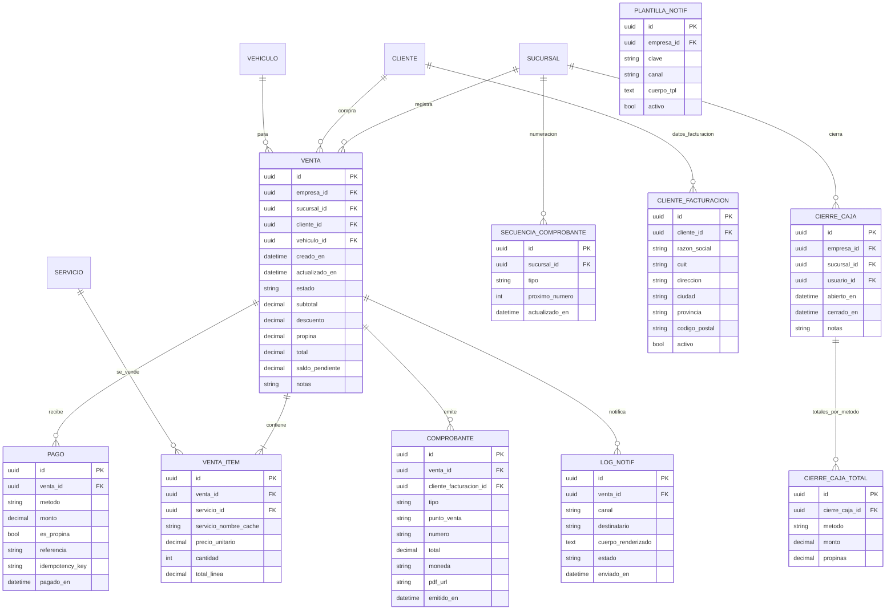

# Documentación de Modelos — SaaS Lavaderos

Este documento consolida el **modelo de datos** y lo complementa con **reglas de negocio**, **procesos granulares con entradas/salidas**, **estados**, **restricciones** e **indicadores**. El objetivo es mantener un **MVP simple, vendible y operable**, evitando complejidades innecesarias pero dejando espacio para escalar.

---

## 0) Alcance y principios del MVP

- **Simplicidad primero**: cubrir recepción → venta → cobro → comprobante no fiscal → cierre de caja.
- **Multitenant real**: todo cuelga de `EMPRESA`. Datos aislados por empresa.
- **Precios determinísticos**: resolución por `sucursal + servicio + tipo_vehiculo + fecha`.
- **Trazabilidad**: cada venta tiene cliente, vehículo, ítems, pagos, comprobante y notificaciones.
- **Operable en campo**: flujos en 5–7 toques; mínimos obligatorios.
- **Medible**: ventas, ticket promedio, servicios top, métodos de pago, propinas.

### Mejoras sugeridas

1. **Índices y restricciones** (ver §5) para evitar inconsistencias y acelerar consultas.
2. **Estados explícitos de venta** (ver §3.1) y transiciones claras.
3. **Campos de tiempo de proceso** opcionales en `VENTA` (`iniciado_en`, `finalizado_en`) para medir lead time. _(Opcional, pero muy útil para tiempos y productividad)_
4. **Normalización mínima de patente y teléfono** para evitar duplicados por formato. _(sin crear nuevas tablas)_
5. **Plantillas de notificación** por empresa con **placeholders estándar** (`{{nombre}}`, `{{patente}}`, `{{total}}`).

---

## 1) Vista A — Organización y Clientes


**Notas y propósito**

- **EMPRESA**: tenant; raíz jerárquica.
- **EMPRESA_CONFIG**: extensión por claves (p.ej., `moneda`, `propina_porcentual_sugerida`, `habilitar_whatsapp`).
- **SUCURSAL**: soporta `codigo_erp` para mapear con sistemas existentes.
- **USUARIO**: autorización por rol simple (ver §6).
- **CLIENTE**: datos básicos y `extra_json` para campos libres.
- **TIPO_VEHICULO**: catálogo simple.
- **VEHICULO**: vehículo por cliente; `patente` utilizada para búsquedas rápidas.

---

## 2) Vista B — Catálogo y Precios


**Notas y propósito**

- **SERVICIO**: catálogo (lavado, encerado, interior, etc.).
- **PRECIO_SERVICIO**: tarifa efectiva por `sucursal + tipo_vehiculo + servicio + rango de vigencia`.

---

## 3) Vista C — Ventas, Pagos, Comprobantes y Cierre



**Reglas y fórmulas mínimas**

- `total_linea = cantidad * precio_unitario`
- `subtotal = SUM(total_linea)`
- `total = subtotal - descuento + propina`
- `saldo_pendiente = total - SUM(pagos donde es_propina=false)`
- La **propina** se almacena también en `PAGO.es_propina=true` si se cobra separada por método.

### 3.1) Estados de una venta (MVP)


---

## 4) Vista D — SaaS y Observabilidad


**Eventos recomendados (Outbox, MVP)**

- `VentaPagada`, `ComprobanteEmitido`, `VehiculoListo`, `CierreCajaCerrado`

---

## 5) Restricciones, índices y validaciones (valor negocio)

**Unicidad y formato**

- `VEHICULO.patente` **única por empresa** `(empresa_id, patente_normalizada)` con normalización (trim, uppercase, sin guiones/espacios).
- `SERVICIO.nombre` **único por empresa** `(empresa_id, nombre_normalizado)` para evitar duplicados.
- `SUCURSAL.codigo_erp` **único por empresa** si se usa mapeo ERP.

**Precios sin solapamiento (simple)**

- En `PRECIO_SERVICIO`, no permitir rangos superpuestos para la misma tupla `(empresa_id, sucursal_id, servicio_id, tipo_vehiculo_id)`.
  - Chequeo: al insertar, validar que `[vigencia_inicio, vigencia_fin]` no colisione con otro rango activo.

**Integridad operacional**

- `VENTA_ITEM.cantidad >= 1`, `precio_unitario >= 0`.
- `PAGO.monto > 0` y no exceder `saldo_pendiente` cuando `es_propina=false`.
- `COMPROBANTE.numero` consecutivo por `(sucursal_id, tipo)` vía `SECUENCIA_COMPROBANTE` + **idempotencia** a nivel de operación de emisión.

**Índices prácticos**

- Búsquedas:
  - `CLIENTE(email)`, `CLIENTE(telefono_wpp)`
  - `VEHICULO(patente_normalizada)`
  - `VENTA(sucursal_id, creado_en)`, `VENTA(estado)`
  - `PAGO(venta_id, pagado_en)`
  - `PRECIO_SERVICIO(sucursal_id, servicio_id, tipo_vehiculo_id, vigencia_inicio)`

---

## 6) Roles (mínimos, MVP)

- **Admin**: todo sobre su empresa (catálogo, usuarios, precios, reportes, cierres).
- **Operador/Cajero**: crear ventas, ítems, pagos, emitir comprobantes, notificar, cerrar caja.
- **Auditor (solo lectura)**: reportes, ventas, cierres, sin modificar.

_(Implementable en Django con `groups`/`permissions` simples.)_

---

## 7) Procesos granulares (Entradas / Salidas / Reglas / Errores)

> **Regla de oro**: cada proceso retorna una **salida clara** y deja **estado consistente**.

### 7.1 Alta/selección de Cliente y Vehículo

- **Entradas**: `empresa_id`, (`cliente_id` _o_ {nombre, apellido, email?, telefono*wpp?}), (`vehiculo_id` \_o* {tipo_vehiculo_id, marca, modelo, patente?})
- **Salidas**: `cliente_id`, `vehiculo_id` (upsert si coincide por teléfono/email y patente)
- **Reglas**: normalizar `telefono_wpp`, `patente`; evitar duplicados.
- **Errores**: formato inválido, patente duplicada, tipo_vehiculo inexistente.

### 7.2 Crear venta (borrador)

- **Entradas**: `empresa_id`, `sucursal_id`, `cliente_id`, `vehiculo_id`
- **Salidas**: `venta_id` (estado=`borrador`, `saldo_pendiente = 0`)
- **Reglas**: sucursal activa, cliente/vehículo pertenecen a la misma empresa.
- **Errores**: referencias cruzadas de otra empresa, sucursal inactiva.

### 7.3 Agregar/editar ítems de venta

- **Entradas**: `venta_id`, lista de `{servicio_id, cantidad}`, **fecha_precio** (default: `now()` del servidor)
- **Salida**: `subtotal`, `total`, `saldo_pendiente` recalculados
- **Reglas**: resolver **precio** en `PRECIO_SERVICIO` por `sucursal + servicio + tipo_vehiculo + fecha_precio`; cachear `servicio_nombre`.
- **Errores**: precio no encontrado, cantidad < 1, servicio inactivo.

### 7.4 Registrar pago(s)

- **Entradas**: `venta_id`, `metodo` (efectivo/tarjeta/MP), `monto`, `es_propina?`, `idempotency_key?`
- **Salida**: `saldo_pendiente` actualizado; posible transición a `pagado` si `saldo_pendiente = 0`.
- **Reglas**: no permitir `monto` > `saldo_pendiente` cuando `es_propina=false`.
- **Errores**: monto inválido, `idempotency_key` repetida (duplicado).

### 7.5 Finalizar venta (trabajo completo)

- **Entradas**: `venta_id`
- **Salida**: `estado=terminado` (o `pagado` si saldo=0)
- **Reglas**: debe existir ≥1 `VENTA_ITEM`.
- **Errores**: venta sin ítems; venta cancelada.

### 7.6 Emitir comprobante (no fiscal)

- **Entradas**: `venta_id`, `tipo`, `punto_venta`, `cliente_facturacion_id?`
- **Salida**: `COMPROBANTE{numero, pdf_url}`
- **Reglas**: reservar número con `SECUENCIA_COMPROBANTE` (transacción + idempotencia); snapshot de totales.
- **Errores**: secuencia bloqueada, venta sin total, venta cancelada.

### 7.7 Notificar cliente (opcional)

- **Entradas**: `venta_id`, `PLANTILLA_NOTIF.clave`
- **Salida**: `LOG_NOTIF{id, estado=enviado|fallido}`
- **Reglas**: render de plantilla con placeholders y datos de la venta.
- **Errores**: canal no habilitado, destinatario vacío.

### 7.8 Cierre de caja

- **Entradas**: `sucursal_id`, `usuario_id`, `rango_horas`
- **Salida**: `CIERRE_CAJA{id}` + `CIERRE_CAJA_TOTAL` agrupado por `metodo`
- **Reglas**: sumar pagos del periodo; propinas separadas.
- **Errores**: solapamiento de cierres, rango vacío.

#### Diagrama de flujo de Cierre (MVP)


---

## 8) Endpoints MVP (sugeridos, nombres lógicos)

- `/clientes [GET/POST]`, `/vehiculos [GET/POST]`
- `/ventas [POST]` (crear borrador), `/ventas/{id} [GET/PATCH]`
- `/ventas/{id}/items [POST/PATCH/DELETE]`
- `/ventas/{id}/pagos [POST]`
- `/ventas/{id}/finalizar [POST]`
- `/ventas/{id}/comprobante [POST]`
- `/ventas/{id}/notificar [POST]`
- `/cierres [POST]`, `/cierres/{id} [GET]`
- `/precios [GET/POST]`, `/servicios [GET/POST]`

_(En Django: `UUIDField` como PK, `auto_now(_add)` para timestamps, `constraints` en `Meta`.)_

---

## 9) Reportes y KPIs (operativos, MVP)

- **Ventas por día / sucursal** (total, #ventas, ticket promedio)
- **Servicios top** por cantidad y facturación
- **Métodos de pago** (mix por periodo)
- **Propinas** (total y % sobre ventas)
- **Clientes recurrentes** (% repiten en 30/60 días) _(simple: por `vehiculo_id` o `cliente_id`)_

---

## 10) Consideraciones de implementación (Django, prácticas simples)

- **Soft-delete**: usar `eliminado_en` (filtro global por empresa y `eliminado_en IS NULL`).
- **Transactions**: emisión de comprobante y movimientos críticos con `select_for_update()` sobre `SECUENCIA_COMPROBANTE`.
- **Idempotencia**: `PAGO.idempotency_key` y “safe re-try” en emisión de comprobantes.
- **Validación de precios**: función única `resolver_precio(empresa, sucursal, servicio, tipo_vehiculo, fecha)` para centralizar la lógica.
- **Serializadores simples**: exponer sólo campos necesarios a UI.
- **Seeds mínimos**: `TIPO_VEHICULO` comunes (auto, moto, camioneta).

---

## 11) Circuito de una Venta (secuencia)


---

# Plan detallado por app (Django) — SaaS Lavaderos (MVP)

> Objetivo: que cada app tenga **responsabilidades claras**, **módulos internos** y **flujos** listos para implementar.  
> Convención de diagramas: usar `flowchart` sin etiquetas en aristas para máxima compatibilidad.

---

## 1) `accounts/` (allauth + membresías + roles)

**Rol**: Autenticación (allauth), pertenencia a empresas y autorización por rol.

**Módulos**

- `models.py`: `UserProfile`, `EmpresaMembership(user, empresa, rol)`
- `services.py`: alta empresa + owner, asignación de roles, helpers de autorización
- `serializers.py` (DRF): perfiles y membresías
- `views.py`/`urls.py`: endpoints de perfil y onboarding simple
- `permissions.py`: `IsMemberOfEmpresa`, `HasRole`


---

## 2) `org/` (empresa, sucursal, configuración)

**Rol**: Raíz multi-tenant; sucursales; configuración por claves.

**Módulos**

- `models.py`: `EMPRESA`, `SUCURSAL`, `EMPRESA_CONFIG`
- `services.py`: lectura de config, alta sucursal, validaciones
- `serializers.py` y `views.py`: CRUD limitado
- `selectors.py`: queries frecuentes por empresa/sucursal


---

## 3) `customers/` (clientes y datos de facturación)

**Rol**: Gestión de clientes y perfiles fiscales.

**Módulos**

- `models.py`: `CLIENTE`, `CLIENTE_FACTURACION`
- `services.py`: `upsert_cliente`, `get_or_create_facturacion`
- `serializers.py` y `views.py`: endpoints REST
- `normalizers.py`: email/teléfono


---

## 4) `vehicles/` (tipos y vehículos)

**Rol**: Tipos de vehículo y vehículos por cliente con unicidad de patente por empresa.

**Módulos**

- `models.py`: `TIPO_VEHICULO`, `VEHICULO`
- `services.py`: `upsert_vehiculo`, `normalizar_patente`
- `serializers.py` y `views.py`: endpoints REST
- `validators.py`: unicidad `(empresa_id, patente_normalizada)`


---

## 5) `catalog/` (servicios)

**Rol**: Catálogo de servicios.

**Módulos**

- `models.py`: `SERVICIO`
- `services.py`: validación de nombre único por empresa
- `serializers.py`, `views.py`
- `selectors.py`: listar activos


---

## 6) `pricing/` (precios efectivos por sucursal/tipo/servicio)

**Rol**: Tarifas con vigencia; resolver precio efectivo.

**Módulos**

- `models.py`: `PRECIO_SERVICIO`
- `services.py`: `resolver_precio`, alta sin solapamientos
- `validators.py`: colisión de rangos
- `serializers.py`, `views.py`


---

## 7) `sales/` (ventas e ítems; estados)

**Rol**: Crear venta, gestionar ítems, totales y estados.

**Módulos**

- `models.py`: `VENTA`, `VENTA_ITEM` (métodos de recálculo)
- `services.py`: `crear_venta`, `agregar_items`, `finalizar_venta`
- `calculations.py`: subtotal, total, saldo
- `serializers.py`, `views.py`
- `fsm.py`: transiciones de estado


---

## 8) `payments/` (pagos e idempotencia)

**Rol**: Registrar pagos, actualizar saldo, transición a pagado.

**Módulos**

- `models.py`: `PAGO`
- `services.py`: `registrar_pago` con `idempotency_key`
- `serializers.py`, `views.py`
- `validators.py`: `monto > 0`, límite por saldo


---

## 9) `invoicing/` (comprobante no fiscal + secuencia)

**Rol**: Emitir comprobante con numeración atómica por sucursal/tipo.

**Módulos**

- `models.py`: `COMPROBANTE`, `SECUENCIA_COMPROBANTE`
- `services.py`: `emitir_comprobante` (`select_for_update` sobre secuencia)
- `pdf.py`: generador PDF simple (placeholder MVP)
- `serializers.py`, `views.py`


---

## 10) `notifications/` (plantillas y logs)

**Rol**: Render de mensajes y registro de envíos.

**Módulos**

- `models.py`: `PLANTILLA_NOTIF`, `LOG_NOTIF`
- `services.py`: `enviar_notificacion(venta, clave_plantilla)`
- `renderers.py`: placeholders estándar
- `serializers.py`, `views.py`


---

## 11) `cashbox/` (cierres de caja)

**Rol**: Consolidar pagos por rango y método; generar cierre + totales.

**Módulos**

- `models.py`: `CIERRE_CAJA`, `CIERRE_CAJA_TOTAL`
- `services.py`: `cerrar_caja(sucursal, desde, hasta)`
- `serializers.py`, `views.py`


---

## 12) `saas/` (planes y suscripciones — estructura básica)

**Rol**: Estructura para planes y facturas SaaS (automatización luego).

**Módulos**

- `models.py`: `PLAN_SAAS`, `SUSCRIPCION_SAAS`, `FACTURA_SAAS`, `PAGO_SAAS`
- `services.py`: alta suscripción, emitir factura demo
- `serializers.py`, `views.py`


---

## 13) `audit/` y `app_log/` (observabilidad mínima)

**Rol**: Auditoría de cambios y logs de eventos.

**Módulos**

- `audit/models.py`: `AUDITORIA_CAMBIO`
- `audit/middleware.py`: captura de cambios CRUD simples
- `app_log/models.py`: `APP_LOG`
- `app_log/services.py`: registrar eventos técnicos/de negocio


---

## 14) Diagrama de dependencias entre apps (alto nivel)

```mermaid
flowchart LR
  accounts --> org
  accounts --> customers
  accounts --> vehicles
  org --> pricing
  catalog --> pricing
  vehicles --> sales
  customers --> sales
  pricing --> sales
  sales --> payments
  sales --> invoicing
  sales --> notifications
  payments --> cashbox
  invoicing --> notifications
  org --> cashbox
  saas --> org
```

---

## 15) Contratos de servicios (resumen de E/S por app)

- **customers**: `upsert_cliente(empresa, datos)` → `CustomerDTO`
- **vehicles**: `upsert_vehiculo(empresa, cliente, datos)` → `VehicleDTO`
- **pricing**: `resolver_precio(empresa, sucursal, servicio, tipo, fecha)` → `{precio, moneda}`
- **sales**: `crear_venta(...)` → `VentaDTO`; `agregar_items(venta, items, fecha)` → `VentaDTO`; `finalizar_venta(venta)` → `VentaDTO`
- **payments**: `registrar_pago(venta, metodo, monto, es_propina?, key?)` → `VentaDTO`
- **invoicing**: `emitir_comprobante(venta, tipo, pv, cf?)` → `ComprobanteDTO`
- **notifications**: `enviar_notificacion(venta, plantilla)` → `log_id`
- **cashbox**: `cerrar_caja(empresa, sucursal, desde, hasta)` → `CierreCajaDTO`

---

## 16) Reglas transversales (mínimas y prácticas)

- **Multitenancy**: `empresa_id` obligatorio en todo; filtros por defecto en managers.
- **Estados de venta**: transiciones controladas; no finalizar sin ítems.
- **Idempotencia** en pagos y emisión de comprobantes (lock de secuencia).
- **Validación de precios**: sin solapamiento por tupla `(empresa, sucursal, servicio, tipo)`.
- **Unicidades**: patente por empresa; servicio por nombre normalizado y empresa.

---

# LavaderosApp — Documentación de **Estructura General**

> **Objetivo**: Establecer la arquitectura de carpetas, los layouts de UI y las convenciones transversales del proyecto.  
> **Alcance**: Estructura global, _no_ de cada módulo; dejamos listo el terreno para seguir “app por app”.  
> **Stack**: Django (server-rendered) + Bootstrap 5 (tema Bootswatch local). **Sin DRF**.

---

## 1) Árbol del proyecto (actualizado)

```bash
lavaderosapp/
├── manage.py
├── .env
├── .gitignore
├── README.md
├── lavaderos/
│   ├── __init__.py
│   ├── urls.py                      # enrutamiento global (incluye urls de apps)
│   ├── tenancy.py                   # utilidades multi-tenant (subdominio/header) [opcional]
│   ├── middleware.py                # TenancyMiddleware: inyecta empresa/sucursal en request
│   ├── permissions.py               # permisos/roles reutilizables a nivel proyecto
│   └── settings/
│       ├── __init__.py
│       ├── base.py                  # base común a todos los entornos
│       ├── development.py           # DEBUG, sqlite, email consola
│       ├── production.py            # Postgres, seguridad, SMTP real
│       └── render.py                # ajustes para Render.com (si aplica)
├── templates/                       # templates globales + overrides de librerías
│   ├── base.html                    # layout PÚBLICO (landing, marketing, login/signup)
│   ├── base_auth.html               # layout AUTENTICADO (navbar compacto + sidebar)
│   ├── home_dashboard.html          # panel contextual para usuarios logueados
│   ├── includes/
│   │   ├── _navbar_public.html      # navbar público (CTA de login/signup)
│   │   ├── _navbar_auth.html        # navbar autenticado (perfil, membresías, salir)
│   │   ├── _sidebar.html            # menú lateral principal (apps, selector de sucursal)
│   │   ├── _messages.html           # Django messages (alerts Bootstrap)
│   │   ├── _footer.html             # pie de página
│   │   └── _pagination.html         # componente reutilizable de paginación
│   ├── account/                     # overrides de django-allauth
│   │   ├── login.html
│   │   ├── signup.html
│   │   ├── password_reset.html
│   │   ├── password_reset_done.html
│   │   ├── password_reset_from_key.html
│   │   ├── password_reset_from_key_done.html
│   │   ├── password_change.html
│   │   └── password_change_done.html
│   └── errors/                      # páginas de error personalizadas
│       ├── 401.html
│       ├── 403.html
│       ├── 404.html
│       └── 500.html
├── static/                          # assets globales versionados
│   ├── css/
│   │   ├── bootswatch/brite.min.css # tema Bootstrap local
│   │   └── app.css                  # reservado para estilos propios (mínimos)
│   ├── js/
│   │   ├── bootstrap.bundle.min.js  # Bootstrap + Popper
│   │   └── app.js                   # scripts globales (inicializaciones)
│   ├── img/
│   │   └── logo.png
│   └── vendor/                      # librerías opcionales (bootstrap-icons, chart.js, etc.)
├── media/                           # uploads en desarrollo (en prod: storage externo)
├── staticfiles/                     # destino de collectstatic (no editar a mano)
└── apps/                            # **todas** las apps de dominio
    ├── accounts/                    # auth (allauth), perfil, membresías
    ├── org/                         # lavadero (Empresa), Sucursal, selector
    ├── customers/
    ├── vehicles/
    ├── catalog/
    ├── pricing/
    ├── sales/
    ├── payments/
    ├── invoicing/
    ├── notifications/
    ├── cashbox/
    ├── saas/                        # planes/limitaciones (ej. 1 empresa por usuario)
    ├── audit/
    └── app_log/
```

> **Regla de oro**: los templates de cada app viven en `apps/<app>/templates/<app>/**`. Así evitamos colisiones de nombres y mantenemos aislamiento por dominio.

---

## 2) Layouts y herencia de templates

### 2.1 `templates/base.html` (público)

- **Uso**: landing/marketing, login/signup y páginas no autenticadas.
- **Bloques clave**: `title`, `meta_description`, `navbar`, `hero`, `content`, `extra_css`, `extra_js`, `footer`.
- **Navbar**: incluye `includes/_navbar_public.html` (sobrescribir `block navbar` si se desea otra cabecera).
- **Hero**: bloque opcional; se puede anular con ``.

### 2.2 `templates/base_auth.html` (autenticado)

- **Uso**: toda página tras login.
- **Composición**:
  - Navbar compacto: `includes/_navbar_auth.html` (perfil, membresías, logout).
  - **Layout con sidebar**:
    - Columna fija con `includes/_sidebar.html` (menú acordeón y **selector de sucursal**).
    - Contenedor principal para ``.
- **Mensajes**: `_messages.html` integrado antes del contenido.

### 2.3 `templates/home_dashboard.html`

- **Uso**: panel contextual tras login.
- **Lógica de presentación** (sin entrar al código):
  - Sin lavadero → CTA “Crear lavadero”.
  - Con lavadero pero sin sucursales → CTA “Crear primera sucursal”.
  - “Listo para operar” (≥ 1 sucursal) → accesos rápidos y widgets placeholder (KPIs).

---

## 3) Partials globales (includes)

- **`_navbar_public.html`**: marca + CTAs “Ingresar” / “Crear cuenta”. Sin enlaces de operación.
- **`_navbar_auth.html`**: avatar/nombre, accesos a **Perfil**, **Membresías**, **Cambiar contraseña** y **Salir**. Navegación funcional se deriva al **sidebar**.
- **`_sidebar.html`**:
  - Encabezado: **Lavadero actual** (empresa activa).
  - **Selector de Sucursal** (`<select>` con `onchange=submit`) que hace **POST** a una ruta de selector (centraliza la fijación en sesión).
  - Acordeones: Organización, Operación, Maestros, Reportes, Administración (links preparados; algunos módulos aún en desarrollo).
- **`_messages.html`**: renderiza `django.contrib.messages` a Bootstrap alerts.
- **`_pagination.html`**: tabla/listados con paginación consistente.
- **`_footer.html`**: pie común (legal/links).

> **Convención**: cualquier página autenticada que necesite navegación de negocio **debe** extender `base_auth.html` para heredar sidebar y mensajes.

---

## 4) Estáticos (static/) y assets

- **Bootstrap**: tema **Bootswatch “brite”** local (`static/css/bootswatch/brite.min.css`).  
  No dependemos de CDNs.
- **JS**: `bootstrap.bundle.min.js` + `app.js` para inicializaciones (por ejemplo, tooltips).
- **Imágenes**: `static/img/` (logo, íconos básicos).
- **Vendor**: espacio para librerías de terceros sin NPM (p. ej., `bootstrap-icons/`).
- **Producción**: ejecutar `collectstatic` → servir `staticfiles/` (Nginx u otro).

---

## 5) Settings y middleware (resumen de integración)

- `INSTALLED_APPS` (clave):
  - `django.contrib.sites`, `allauth`, `allauth.account`
  - Apps propias (`apps.org`, `apps.accounts`, …)
  - `SITE_ID = 1`
- `MIDDLEWARE`:
  - **`lavaderos.middleware.TenancyMiddleware`** (inyecta `request.empresa_activa` y `request.sucursal_activa` desde sesión; si falta, intenta fijar por defecto la primera empresa del usuario).
- `TEMPLATES`:
  - `DIRS = [BASE_DIR / "templates"]`
  - `context_processors.request` **habilitado** (requerido por allauth y varios templates).
- Allauth (email-only recomendado en MVP):
  - `ACCOUNT_AUTHENTICATION_METHOD="email"`
  - `ACCOUNT_EMAIL_REQUIRED=True`
  - `ACCOUNT_EMAIL_VERIFICATION="none"` (en prod real: `"mandatory"`)
  - `ACCOUNT_USERNAME_REQUIRED=False`
  - `ACCOUNT_LOGOUT_ON_GET=True`
  - `LOGIN_REDIRECT_URL="/"`, `LOGOUT_REDIRECT_URL="/"`

---

## 6) Convenciones por app (estructura recomendada)

Cada módulo en `apps/<app>/` sigue este patrón (MVP):

```bash
apps/<app>/
├── __init__.py
├── apps.py
├── admin.py
├── migrations/
│   └── __init__.py
├── models.py
├── urls.py
├── views.py                     # CBVs; delgadas; usan services/selectors
├── forms/
│   ├── __init__.py
│   └── <app>.py
├── services/
│   ├── __init__.py
│   └── casos_de_uso.py          # lógica de dominio (crear/editar, etc.)
├── selectors.py                 # lecturas/queries para vistas
├── permissions.py               # reglas de acceso/roles específicas del app
├── templates/<app>/             # templates namespaced de la app
│   └── ...
└── static/<app>/                # assets propios del módulo
    └── ...
```

**Principios**:

- **Separation of concerns**: vistas delgadas; mutaciones en `services/`, lecturas en `selectors.py`.
- **Templates con Bootstrap** directo (solo clases en HTML; sin CSS custom salvo casos puntuales).
- **Nombres namespaced** (`templates/<app>/**`) para evitar choques entre apps.

---

## 7) Ruteo global y convenciones de URL

- `lavaderos/urls.py` incluye:
  - `/accounts/` (django-allauth)
  - Rutas de **accounts** propias (perfil, membresías), p. ej.: `/cuenta/perfil/`, `/cuenta/membresias/`
  - Rutas por **app** con prefijos claros (`/org/...`, `/clientes/...`, etc.).
- **Nombrado**: `app_namespace:view_name` (p. ej., `org:sucursales`), para usar con `` sin ambigüedad.

---

## 8) Tenancy (multi-tenant simplificado)

- **Plan estándar**: 1 empresa por usuario (controlado desde `apps/saas/` o settings).
- **Sesión**:
  - `empresa_id`: lavadero activo
  - `sucursal_id`: sucursal activa dentro del lavadero
- **TenancyMiddleware**:
  - Carga `request.empresa_activa` / `request.sucursal_activa`.
  - Si `empresa_id` no existe y el usuario tiene empresas, fija la **primera** por defecto.
  - Si `sucursal_id` no pertenece a la empresa activa, se limpia.
- **Selector centralizado**: un único endpoint que recibe `POST` con `sucursal` (y, en planes superiores, `empresa`) para actualizar la sesión.

> Esto permite que **cualquier** vista pueda suponer un contexto consistente (`request.empresa_activa`, `request.sucursal_activa`) sin duplicar lógica.

---

## 9) Accesibilidad, SEO y calidad

- **A11y**: skip link, labels, `autocomplete` en formularios, colores y contrastes por Bootstrap.
- **SEO meta** en `base.html`: `title`, `description`, Open Graph y Twitter Cards con valores por defecto y bloques sobrescribibles.
- **Mensajería** clara: usar `django.contrib.messages` para éxitos y errores de validación/flujo.
- **Errores**: páginas personalizadas en `templates/errors/` (401/403/404/500).

---

## 10) Cómo agregar una página nueva (checklist)

1. Elegí layout: **público** (`base.html`) o **autenticado** (`base_auth.html`).
2. Creá el template en `apps/<app>/templates/<app>/mi_pagina.html` y extendé el layout correspondiente.
3. Agregá la **CBV** en `views.py` y la ruta en `urls.py` del app (namespace).
4. Si la página necesita navegación del sistema, usa **`base_auth.html`** para heredar sidebar.
5. Mostrá feedback con `messages` y, si es un form, **errores de campo y `non_field_errors`**.
6. (Opcional) Añadí assets específicos en `apps/<app>/static/<app>/` y referencialos con ``.

---

# Módulo 1 — `apps/accounts` (Autenticación, Perfil y Membresías)

> **Objetivo:** Integrar **django-allauth** (login/registro/cierre de sesión y recuperación de clave), exponer vistas server-rendered para **Perfil** y **Membresías**, y modelar la relación **Usuario ↔ Empresa (rol)** del SaaS.  
> **Fuera de alcance:** alta/edición de Empresa/Sucursal (vive en `apps/org`) y flujos de operación/ventas.

---

## 1) Estructura del módulo (MVP final)

```
apps/accounts/
├─ __init__.py
├─ apps.py
├─ admin.py
├─ migrations/
│  └─ __init__.py
├─ models.py                  # EmpresaMembership (User↔Empresa, rol)
├─ urls.py                    # /cuenta/perfil/, /cuenta/membresias/
├─ views.py                   # ProfileView, MembershipListView (server-rendered)
├─ forms/
│  ├─ __init__.py             # Login/Signup + Reset/Set/Change Password (Bootstrap)
│  └─ profile.py              # ProfileForm (Bootstrap)
├─ services/
│  ├─ __init__.py
│  ├─ memberships.py          # ensure_membership, cambio de rol
│  └─ profile.py              # update_user_profile
├─ selectors.py               # memberships_for(user), etc.
├─ permissions.py             # helpers de rol (admin/operador/auditor)
├─ templates/
│  └─ accounts/
│     ├─ profile.html
│     ├─ memberships.html
│     └─ _profile_form.html
```

### Estructura global de templates (overrides + layout)

```
templates/
├─ base.html
├─ includes/
│  ├─ _navbar.html            # menú Cuenta, selector de empresa, logout
│  └─ _messages.html          # alerts Bootstrap (django.messages)
└─ account/                   # overrides de allauth (sin “s”)
   ├─ login.html
   ├─ signup.html
   ├─ password_reset.html
   ├─ password_reset_done.html
   ├─ password_reset_from_key.html
   ├─ password_reset_from_key_done.html
   ├─ password_change.html            # ambio estando logueado
   └─ password_change_done.html
```

---

## 2) Qué hace cada cosa (resumen ejecutivo)

- **`models.py`**: `EmpresaMembership(user, empresa, rol)` con unicidad `(user, empresa)`.
- **`forms/__init__.py`**: _todos_ los formularios clave de allauth (login, signup, reset, set, change) inyectan clases Bootstrap a widgets (`form-control`, `form-select`, `form-check-input`) y placeholders/`autocomplete`.
- **`forms/profile.py`**: `ProfileForm` con el mismo patrón Bootstrap.
- **`views.py`**: vistas delgadas; mutaciones en **services**, lecturas en **selectors**.
- **`services/*`**: casos de uso (perfil y membresías), con logging mínimo.
- **`selectors.py`**: consultas para vistas/UX (p.ej., membresías del usuario).
- **`templates/account/*`**: todos los flujos de allauth con el layout de `base.html`.
- **`_messages.html`**: muestra feedback como alerts.
- **`_navbar.html`**: accesos a Perfil, Membresías, Selector de empresa y Logout.

> **Principio:** vistas finas; lógica en services/selectors; estilos Bootstrap desde los **forms** (no repetimos clases en cada template).

---

## 3) Settings esenciales (lo mínimo para que funcione igual en todos los entornos)

```python
INSTALLED_APPS += [
    "django.contrib.sites",
    "allauth",
    "allauth.account",
    "apps.org",        # debe migrar antes que accounts (FK)
    "apps.accounts",
]
SITE_ID = 1

MIDDLEWARE += [
    "allauth.account.middleware.AccountMiddleware",  # requerido por allauth reciente
]

TEMPLATES[0]["DIRS"] = [BASE_DIR / "templates"]
# ¡Importante! para allauth:
# "django.template.context_processors.request" debe estar en context_processors

AUTHENTICATION_BACKENDS = [
    "django.contrib.auth.backends.ModelBackend",
    "allauth.account.auth_backends.AuthenticationBackend",
]

# Email-only login (MVP)
ACCOUNT_AUTHENTICATION_METHOD = "email"
ACCOUNT_EMAIL_REQUIRED = True
ACCOUNT_EMAIL_VERIFICATION = "none"   # en prod real: "mandatory"
ACCOUNT_USERNAME_REQUIRED = False
ACCOUNT_LOGOUT_ON_GET = True          # logout inmediato (sin logout.html)
LOGIN_REDIRECT_URL = "/"
LOGOUT_REDIRECT_URL = "/"

ACCOUNT_FORMS = {
    "login": "apps.accounts.forms.LoginForm",
    "signup": "apps.accounts.forms.SignupForm",
    "reset_password": "apps.accounts.forms.ResetPasswordForm",
    "reset_password_from_key": "apps.accounts.forms.ResetPasswordKeyForm",
    "change_password": "apps.accounts.forms.ChangePasswordForm",  # opcional
}
```

---

## 4) Rutas y vistas (qué URL usa qué template)

**Allauth (ya provisto, con nuestros overrides):**

- `/accounts/login/` → `account/login.html`
- `/accounts/signup/` → `account/signup.html`
- `/accounts/logout/` → inmediato si `ACCOUNT_LOGOUT_ON_GET=True` (sin template)
- `/accounts/password/reset/` → `account/password_reset.html`
- `/accounts/password/reset/done/` → `account/password_reset_done.html`
- `/accounts/password/reset/key/<uidb36>-<key>/` → `account/password_reset_from_key.html`
- `/accounts/password/reset/key/done/` → `account/password_reset_from_key_done.html`
- `/accounts/password/change/` → `account/password_change.html` _(opcional)_
- `/accounts/password/change/done/` → `account/password_change_done.html` _(opcional)_

**Accounts (esta app):**

- `/cuenta/perfil/` → perfil (GET/POST)
- `/cuenta/membresias/` → listado de empresas y rol; botón **“Activar”** → `/org/seleccionar/?empresa=<id>`

---

## 5) Modelado de membresías (multi-tenant)

- `EmpresaMembership(user, empresa, rol)` con choices (`admin`, `operador`, `auditor`).
- Un registro **único por (user, empresa)**.
- **Dependencia**: `org.Empresa` debe existir y migrar **antes**.
- Uso en UI: `memberships.html` linkea al selector `/org/seleccionar/`.

---

## 6) UX / UI (convenciones)

- **Bootstrap 5** global en `base.html` (tema Bootswatch ok).
- **Mensajes** → `_messages.html` (alerts).
- **Navbar** → `_navbar.html` con acciones de cuenta y chip de empresa activa (si `empresa_id` en sesión).
- **Accesibilidad**: labels y `autocomplete` correctos; placeholders coherentes.

---

## 7) Seguridad / permisos

- Vistas del módulo → requieren **usuario autenticado**.
- No se mutan empresas ni roles desde `accounts`.
- CSRF por defecto en formularios server-rendered.
- Reutilizar `permissions.py` donde aplique.

---

## 8) Pasos de verificación rápida

1. Migrar `org` y `accounts` (en ese orden).
2. Crear una **Empresa** en admin y asignar membresía al usuario.
3. Probar: signup → login → perfil → membresías → activar empresa.
4. Probar “¿Olvidaste tu contraseña?” en login:
   - reset → done → link email → set password → done.

---

## 9) Estado actual y próximos pasos

- **Estado**: `accounts` completo (allauth con Bootstrap, perfil, membresías, integración con selector de `org`).
- **Siguiente**: `apps/org` CRUD Empresa/Sucursal y middleware de tenancy (inyectar `empresa_activa` en request/plantillas).
- **Producción**: valorar `ACCOUNT_EMAIL_VERIFICATION="mandatory"` y backend SMTP real.

> **Decisión registrada:** estilos centralizados en **forms**; overrides de templates en `templates/account/`; vistas delgadas con lógica en services/selectors. La selección de empresa vive en `org` y se invoca desde “Membresías”.

# Módulo 2 — `apps/org` (Lavadero/Empresa, Sucursales, Empleados y Contexto)

> **Objetivo:** Modelar **Lavadero (Empresa)** y **Sucursales**, proveer el **onboarding** (crear lavadero → crear sucursal), mantener el **contexto activo** (empresa/sucursal) y permitir a la empresa **gestionar empleados y permisos**.  
> **Alcance:** Django server-rendered (sin DRF), CBVs, Bootstrap 5, permisos centralizados.  
> **Integración SaaS:** límites y suscripciones se resuelven vía `apps.saas` (`limits.py`, `services/subscriptions.py`).

---

## 1) Estructura del módulo (actualizada)

```
apps/org/
├─ __init__.py
├─ apps.py
├─ admin.py
├─ migrations/
│  └─ __init__.py
├─ models.py                 # Empresa, EmpresaConfig (opcional), Sucursal
├─ urls.py                   # /org/...
├─ views.py                  # CBVs: empresas, sucursales, empleados, selector, post-login
├─ forms/
│  ├─ __init__.py
│  └─ org.py                 # EmpresaForm, SucursalForm, EmpleadoForm
├─ services/
│  ├─ __init__.py
│  ├─ empresa.py             # (opcional)
│  └─ sucursal.py            # (opcional)
├─ selectors.py              # empresas_para_usuario, etc. (sin hardcode de límites)
├─ permissions.py            # Perm, ROLE_POLICY, mixins (centraliza permisos)
├─ templatetags/
│  ├─ __init__.py
│  └─ org_perms.py           #  en templates
├─ templates/
│  └─ org/
│     ├─ empresas.html
│     ├─ empresa_form.html
│     ├─ sucursales.html
│     ├─ sucursal_form.html
│     ├─ empleados.html
│     └─ empleado_form.html
├─ static/
│  └─ org/
│     ├─ org.js
│     └─ org.css
└─ emails/
   └─ empresa_created.txt    # (opcional)
```

**Notas de diseño**

- **Vistas delgadas**: permisos en `permissions.py`; vistas declaran `required_perms`.
- **Bootstrap** en templates; forms “limpios”.
- **Onboarding** guiado (signup → empresa → primera sucursal).
- **Límites por plan**: ya **no** se usan constantes en `settings`. Todo gating pasa por `apps.saas.limits` y la suscripción activa de la empresa.

---

## 2) Modelos (resumen)

### `Empresa`

- `nombre`, `subdominio` (único), `logo`, `activo`, timestamps.
- Relaciones: `memberships` (`accounts.EmpresaMembership`), `sucursales`, **`suscripcion` (OneToOne con `saas.SuscripcionSaaS`)**.
- Se fija en sesión como `empresa_id`.

### `Sucursal`

- `empresa` (FK), `nombre`, `direccion` (opcional), `codigo_interno` (único por empresa, **autogenerado en `save()`**).
- Se fija como `sucursal_id`.

### `EmpresaConfig` (opcional)

- Par `clave/valor` JSON por empresa.

---

## 3) Formularios (`forms/org.py`)

- `EmpresaForm`: `nombre`, `subdominio`, `logo`, `activo` (en alta, forzado a `True`).
- `SucursalForm`: `nombre`, `direccion` (sin `codigo_interno`).
- `EmpleadoForm`: `email`, `rol` (`admin`/`operador`), `sucursal_asignada`, `password_inicial` (solo crear).

---

## 4) Permisos centralizados (`permissions.py`)

- **`Perm`**:
  - `ORG_VIEW`, `ORG_EMPRESAS_MANAGE`, `ORG_SUCURSALES_MANAGE`, `ORG_EMPLEADOS_MANAGE`
  - (extensibles: `CATALOG_SERVICES_MANAGE`, `CATALOG_PRICES_MANAGE`, etc.)
- **`ROLE_POLICY`** define permisos por rol (admin/operador/…).
- **Mixins**:
  - `EmpresaPermRequiredMixin` resuelve **contexto** y **membership** y valida `required_perms`.
  - Evita loops con `SAFE_VIEWNAMES`.
- **Helper**:
  - `has_empresa_perm(user, empresa, perm)`.

---

## 5) Gating por Plan (integración con `apps.saas`)

- Consultas de límite vía **`apps.saas.limits`**:
  - `can_create_empresa(user)`
  - `can_create_sucursal(empresa)`
  - `can_add_usuario_a_empresa(empresa)`
  - `can_add_empleado(sucursal)`
- **Enforcement**:
  - **Soft** (por defecto): se **muestra mensaje** y se **deshabilitan CTAs** en UI; el `POST` valida y devuelve alerta si no corresponde.
  - **Hard** (`settings.SAAS_ENFORCE_LIMITS = True`): además del mensaje, **se bloquean las creaciones** en los `POST`.
- **Suscripción por defecto**:
  - Tras crear empresa, se llama a `ensure_default_subscription_for_empresa(empresa)` para asignar plan default (con trial si corresponde).

---

## 6) Vistas (CBVs) y comportamiento

- **`EmpresaListView`** (`/org/empresas/`): `required_perms = (ORG_VIEW,)`  
  Muestra “Mi Lavadero”. Contexto incluye `puede_crear_empresa` y `gate_empresa_msg` (desde `can_create_empresa(user)`).

- **`EmpresaCreateView`** (`/org/empresas/nueva/`): onboarding  
  Valida con `can_create_empresa(user)`. Crea `Empresa` + `EmpresaMembership` (**OWNER/ADMIN/ACTIVA**), setea sesión y ejecuta `ensure_default_subscription_for_empresa`. Redirige a crear primera sucursal.

- **`EmpresaUpdateView`**: `ORG_EMPRESAS_MANAGE`.

- **`SucursalListView`**: `ORG_VIEW`  
  Lista sucursales y pasa `puede_crear_sucursal` / `gate_sucursal_msg` desde `can_create_sucursal(empresa)`.

- **`SucursalCreateView`**: `ORG_SUCURSALES_MANAGE`  
  Valida con `can_create_sucursal(empresa)`; primera sucursal → redirige a `/` con “Listo para operar”; si no, vuelve a `/org/sucursales/`.

- **`SucursalUpdateView`**: `ORG_SUCURSALES_MANAGE`.

- **`EmpleadoListView`**: `ORG_EMPLEADOS_MANAGE`  
  Pasa `puede_agregar_empleado` / `gate_empleado_msg` (empresa).

- **`EmpleadoCreateView`**: `ORG_EMPLEADOS_MANAGE`  
  GET: calcula `can_add_usuario_a_empresa(empresa)` para la UI.  
  POST: valida `can_add_usuario_a_empresa(empresa)` y, si hay sucursal, `can_add_empleado(sucursal)`. Crea/actualiza `User` + `EmpresaMembership`.

- **`EmpleadoUpdateView`**: `ORG_EMPLEADOS_MANAGE` (no edita `owner`).

- **`EmpleadoResetPasswordView` / `EmpleadoToggleActivoView` / `EmpleadoDestroyUserView`**: `ORG_EMPLEADOS_MANAGE` (con protecciones: no `owner`, no auto-eliminarse, etc.).

- **`SelectorEmpresaView`**: segura, sanea sesión, activa empresa/sucursal.

- **`PostLoginRedirectView`**: decide onboarding o panel según membership/sucursales.

---

## 7) URLs (namespace `org`)

_(sin cambios; ver listado original)_

---

## 8) Templates (UI/UX + permisos + límites)

- Siempre cargar `` cuando haya CTAs condicionados.
- Mostrar **mensajes** con `` (ya en `base_auth.html`).
- Variables de gating usadas por UI (cuando la vista las provee):
  - `puede_crear_empresa`, `gate_empresa_msg`
  - `puede_crear_sucursal`, `gate_sucursal_msg`
  - `puede_agregar_empleado`, `gate_empleado_msg`
- Ejemplos:
  - `org/empresas.html`: “Nueva sucursal” visible si permiso y si `puede_crear_sucursal`.
  - `org/sucursales.html`: banner informativo cuando no se puede crear más.
  - `org/empleados.html` / `org/empleado_form.html`: botón “Nuevo/Crear empleado” deshabilitado si no se puede.

---

## 9) Sesión y Middleware (Tenancy)

- Claves: `empresa_id`, `sucursal_id`.
- `TenancyMiddleware` inyecta `request.empresa_activa` / `request.sucursal_activa`; limpia inconsistencias.
- `SelectorEmpresaView` evita loops.

---

## 10) Seguridad y reglas

- Solo **miembros activos** operan en una empresa.
- `owner`: no editable/deshabilitable/eliminable desde UI de empleados.
- Acciones destructivas: **POST-only** + **CSRF** + **modales**.
- Si una membresía queda inactiva y el usuario no tiene otras activas, se marca `user.is_active=False`.

---

## 11) Onboarding (secuencia)

```mermaid
sequenceDiagram
  participant U as Usuario
  participant WEB as Vistas Django
  participant DB as DB

  U->>WEB: /accounts/signup -> login
  WEB-->>U: redirect / (Panel)

  alt sin lavadero
    U->>WEB: POST /org/empresas/nueva/
    WEB->>DB: create Empresa + EmpresaMembership(admin)
    DB-->>WEB: Empresa {id}
    note over WEB,U: session.empresa_id = id
    WEB-->>U: redirect /org/sucursales/nueva/
  end

  U->>WEB: POST /org/sucursales/nueva/
  WEB->>DB: create Sucursal(empresa_id = session.empresa_id)
  DB-->>WEB: Sucursal {id}

  alt primera sucursal
    WEB-->>U: redirect /(Panel) + success Listo para operar
  else mas sucursales
    WEB-->>U: redirect /org/sucursales/ + success
  end

  U->>WEB: Sidebar -> POST sucursal=[id] a /org/seleccionar/
  WEB->>DB: validar sucursal pertenece a empresa_activa
  DB-->>WEB: OK
  note over WEB,U: session.sucursal_id = id
  WEB-->>U: success seleccion de sucursal
```

---

## 12) Planes (SaaS) — **(actualizado)**

- **Límites por plan** en `saas.PlanSaaS` (p. ej., `max_sucursales_por_empresa`, `max_usuarios_por_empresa`, `max_empleados_por_sucursal`, etc.).
- **Gating centralizado** en `saas/limits.py`:
  - `can_create_empresa(user)`
  - `can_create_sucursal(empresa)`
  - `can_add_usuario_a_empresa(empresa)`
  - `can_add_empleado(sucursal)`
  - Cada función retorna un objeto con `message` y `should_block()`.
- **Enforcement**:
  - `SAAS_ENFORCE_LIMITS = False` (default “soft”: solo avisos, la vista decide).
  - Si `True`: los `POST` deben **bloquear** creaciones cuando `should_block()` sea `True`.
- **Suscripciones**:
  - `SuscripcionSaaS` (1:1 con Empresa) define `estado`, `payment_status`, `vigente`, `is_trialing`, etc.
  - Onboarding llama `ensure_default_subscription_for_empresa(empresa)` para asignar plan **default** (con `trial_days` si corresponde).

> **Eliminado:** `SAAS_MAX_EMPRESAS_POR_USUARIO`. No se usa más hardcode; todo sale del **Plan vigente**.

---

## 13) Auditoría y datos históricos

_(sin cambios)_

---

## 14) Errores comunes

- **No se ven avisos de límites** → asegurarse de incluir `_messages.html` y de pasar las variables `puede_*`/`gate_*` desde las vistas (ya contemplado en nuestras vistas).
- **Se puede crear más allá del plan** → verificar `SAAS_ENFORCE_LIMITS` y que los `POST` llamen a `limits.*` (hecho).

---

## 15) Extensiones previstas

_(sin cambios, sumando que nuevos límites se agregan en `PlanSaaS` y `limits.py`)_

---

### Resumen ejecutivo

- **Gating por plan 100% centralizado** en `apps.saas` (nada hardcodeado en `org`).
- **UI consciente de límites**: muestra banners y deshabilita CTAs cuando corresponde.
- **Enforcement conmutable** (`SAAS_ENFORCE_LIMITS`) sin tocar vistas.

# Módulo 3 — `apps/customers` (Clientes)

> **Objetivo del módulo:** Administrar los datos de los clientes (contacto, cumpleaños, notas internas). Este módulo provee la información base para asociar clientes a vehículos, ventas y notificaciones.

---

## 1) Estructura de carpetas/archivos

```
apps/customers/
├─ __init__.py
├─ apps.py                   # Config de la app (name="apps.customers")
├─ admin.py                  # Registro de Cliente en admin
├─ migrations/
│  └─ __init__.py
├─ models.py                 # Modelo Cliente
├─ urls.py                   # Rutas propias (listado, alta, edición, detalle)
├─ views.py                  # Vistas server-rendered CRUD de clientes
├─ forms/
│  ├─ __init__.py
│  └─ customer.py            # Formulario CustomerForm (validaciones + normalizaciones)
├─ services/
│  ├─ __init__.py
│  └─ customers.py           # Casos de uso: crear/editar cliente
├─ selectors.py              # Lecturas: buscar cliente por nombre/teléfono/email
├─ normalizers.py            # Normalización de datos (email, documento, teléfono, capitalización)
├─ templates/
│  └─ customers/
│     ├─ list.html           # Listado de clientes + búsqueda
│     ├─ form.html           # Alta/edición de cliente
│     ├─ detail.html         # Detalle con datos del cliente (extensible a vehículos/ventas)
│     └─ _form_fields.html   # Partial con los campos (incluible en alta/edición)
├─ static/
│  └─ customers/
│     ├─ customers.css       # Estilos propios (mínimos)
│     └─ customers.js        # Mejoras UX (placeholder para búsqueda/validaciones simples)
└─ emails/
   └─ birthday.txt           # (Opcional) plantilla de felicitación de cumpleaños
```

### Rol de cada componente

- **`models.py`**: define `Cliente` (nombre, apellido, email, teléfono WhatsApp, fecha_nac, dirección, etc.) y campos auxiliares (`tags`, `notas`, `activo`).
- **`forms/customer.py`**: `CustomerForm` con:
  - inyección de clases Bootstrap,
  - normalización de email, documento, teléfono,
  - guardado con empresa activa y usuario creador,
  - conversión de `tags` a lista.
- **`services/customers.py`**: mutaciones de dominio (crear/editar cliente).
- **`selectors.py`**: consultas de lectura (`buscar_cliente(q)`).
- **`normalizers.py`**: helpers para normalizar input (email, documento, teléfono a E.164, capitalizar textos).
- **`views.py`**: CRUD basado en `ListView`, `CreateView`, `UpdateView`, `DetailView`. Incluye vistas para activar/desactivar cliente.
- **`templates/customers/*`**: interfaz UI (listado, formulario, detalle). `_form_fields.html` maneja validación y muestra correctamente `fecha_nac`.

---

## 2) Endpoints implementados

- `/clientes/` → Listado + búsqueda de clientes.
- `/clientes/nuevo/` → Alta de cliente.
- `/clientes/<id>/editar/` → Edición de cliente.
- `/clientes/<id>/detalle/` → Detalle de cliente (con notas y estado activo/inactivo).
- `/clientes/<id>/desactivar/` → POST para desactivar cliente.
- `/clientes/<id>/activar/` → POST para reactivar cliente.
- `/clientes/<id>/eliminar/` → (opcional, solo admin, con confirmación).

---

## 3) Contratos de entrada/salida

### Alta Cliente

- **Input (POST)**: nombre, apellido, email, tel_wpp, fecha_nac, dirección, notas, activo.
- **Proceso**:
  - validación de campos obligatorios,
  - normalización de email/documento/teléfono,
  - asignación de empresa activa y usuario creador.
- **Output**: cliente creado, redirect a listado con mensaje de éxito.

### Edición Cliente

- **Input (POST)**: mismos campos.
- **Proceso**: validar cambios, conservar fecha_nac guardada si no se modifica, actualizar registro.
- **Output**: redirect con mensaje “Cliente actualizado”.

### Búsqueda Cliente

- **Input (GET)**: `q` (cadena).
- **Proceso**: selectors buscan en nombre, apellido, email, tel.
- **Output**: listado filtrado.

### Activar / Desactivar Cliente

- **Input (POST)**: acción sobre un cliente existente.
- **Proceso**: cambia flag `activo`.
- **Output**: redirect con mensaje de confirmación.

---

## 4) Dependencias e integraciones

- **Depende de `org`**: todos los clientes pertenecen a la empresa activa.
- **Integración futura con `vehicles`**: un cliente puede tener uno o varios vehículos.
- **Integración futura con `sales`**: las ventas requieren un cliente asociado.
- **Integración futura con `notifications`**: notificación de cumpleaños o segmentación por etiquetas.

---

## 5) Seguridad

- Todas las vistas requieren usuario autenticado.
- Validación multi-tenant:
  - Solo se listan/gestionan clientes de la empresa activa (`request.empresa_activa`).
- Acciones de activar/desactivar o eliminar restringidas a roles `admin` / `operador`.

---

## 6) Estado actual del módulo

- Modelo `Cliente` completo y migrado.
- `CustomerForm` con validaciones y normalización.
- Normalización de teléfono para Argentina → formato E.164 (+549…).
- Templates list, form, detail con `_form_fields.html` que muestran errores y mantienen valores (incluida fecha de nacimiento).
- Vistas CRUD + activar/desactivar implementadas.
- Admin: listado de clientes y filtros básicos.
- UX: mensajes de feedback (`django.contrib.messages`) integrados con Bootstrap.

---

## 7) Extensiones previstas

- Exportar/Importar clientes (CSV/Excel).
- Segmentación avanzada con `tags` o categorías predefinidas.
- Asociar clientes a vehículos (`apps.vehicles`).
- Mostrar historial de ventas en el `detail`.
- Hook de cumpleaños en `notifications`.
- Acciones masivas (activar/inactivar, exportar) en listado.

---

# Módulo 4 — `apps/vehicles` (Vehículos)

> **Objetivo del módulo:** Administrar los vehículos de los clientes, clasificarlos por tipo y mantenerlos disponibles para asociar a las ventas. Cada vehículo pertenece a un cliente y a una empresa (tenant).

---

## 1) Estructura de carpetas/archivos

```
apps/vehicles/
├─ __init__.py
├─ apps.py                   # Config de la app (name="apps.vehicles")
├─ admin.py                  # Registro de Vehículo y TipoVehículo en admin
├─ migrations/
│  └─ __init__.py
├─ models.py                 # Modelos: Vehiculo, TipoVehiculo
├─ urls.py                   # Rutas propias (listado, alta, edición, detalle)
├─ views.py                  # Vistas server-rendered CRUD de vehículos y tipos
├─ forms/
│  ├─ __init__.py
│  └─ vehicle.py             # Formularios de alta/edición de vehículo
├─ services/
│  ├─ __init__.py
│  ├─ vehicles.py            # Casos de uso: crear/editar vehículo
│  └─ types.py               # Casos de uso: CRUD de TipoVehiculo
├─ selectors.py              # Lecturas: buscar por patente, por cliente, listar tipos
├─ validators.py             # Validaciones específicas (ej. patente única por empresa)
├─ templates/
│  └─ vehicles/
│     ├─ list.html           # Listado de vehículos
│     ├─ form.html           # Alta/edición de vehículo
│     ├─ detail.html         # Detalle de vehículo
│     ├─ type_form.html      # Alta/edición de tipos
│     ├─ types_list.html     # Listado de tipos
│     └─ _form_fields.html   # Partial de formulario de vehículo
├─ static/
│  └─ vehicles/
│     ├─ vehicles.css        # Estilos propios (mínimos)
│     └─ vehicles.js         # Scripts UX (validaciones cliente-side, búsqueda rápida)
└─ emails/
   └─ vehicle_added.txt      # (Opcional) notificación al cliente al registrar vehículo
```

### Rol de cada componente

- **`models.py`**:
  - `TipoVehiculo`: catálogo de tipos de vehículos (auto, moto, camioneta, etc.).
  - `Vehiculo`: datos principales (cliente, tipo, marca, modelo, año, color, patente única por empresa, activo/inactivo).
- **`forms/vehicle.py`**: `VehicleForm` con validaciones y compatibilidad Bootstrap.
- **`services/vehicles.py`**: mutaciones de dominio (`crear_vehiculo`, `editar_vehiculo`, `activar_vehiculo`, `desactivar_vehiculo`).
- **`services/types.py`**: mutaciones de dominio sobre tipos de vehículo.
- **`selectors.py`**: consultas de lectura (`vehiculos_de(cliente)`, `buscar_por_patente`, `tipos_activos`).
- **`validators.py`**: helper de validación para patente única dentro de la empresa.
- **`views.py`**: CRUD con CBVs (`ListView`, `CreateView`, `UpdateView`, `DetailView`) tanto de vehículos como de tipos. Incluye mixin `BackUrlMixin` para soportar botón **Volver** en todas las vistas.
- **`templates/vehicles/*`**: interfaz UI con Bootstrap 5, hereda de `base_auth.html`.
  - `list.html`: tabla de vehículos con filtros.
  - `form.html`: alta/edición con `_form_fields.html`.
  - `detail.html`: ficha de vehículo.
  - `types_list.html` y `type_form.html`: gestión de tipos.
- **`static/vehicles/*`**: assets opcionales de mejora UX.

---

## 2) Endpoints implementados

- `/vehiculos/` → Listado de vehículos (con búsqueda y filtro por cliente).
- `/vehiculos/nuevo/` → Alta de vehículo (soporta `?cliente=<id>` para preseleccionar).
- `/vehiculos/<id>/editar/` → Edición de vehículo.
- `/vehiculos/<id>/detalle/` → Detalle de vehículo.
- `/vehiculos/<id>/activar/` → Reactivar vehículo.
- `/vehiculos/<id>/desactivar/` → Desactivar vehículo.
- `/vehiculos/tipos-vehiculo/` → Listado de tipos de vehículo.
- `/vehiculos/tipos-vehiculo/nuevo/` → Alta de tipo.
- `/vehiculos/tipos-vehiculo/<id>/editar/` → Edición de tipo.
- `/vehiculos/tipos-vehiculo/<id>/activar/` → Activar tipo.
- `/vehiculos/tipos-vehiculo/<id>/desactivar/` → Desactivar tipo.

---

## 3) Contratos de entrada/salida

### Alta Vehículo

- **Input (POST)**: cliente, tipo_vehiculo, marca, modelo, año, color, patente, notas, activo.
- **Proceso**:
  - Validación de unicidad de patente por empresa (en `validators.py`).
  - Persistencia vía `services.crear_vehiculo`.
  - Mensaje de éxito con `django.contrib.messages`.
- **Output**: redirect a:
  - `next` (si estaba en query/POST, p. ej. volver a edición de cliente),
  - o al listado de vehículos.

### Edición Vehículo

- **Input (POST)**: mismos campos.
- **Proceso**: validación de cambios, persistencia en `services.editar_vehiculo`.
- **Output**: redirect a `next` o al listado con mensaje de éxito.

### Activar/Desactivar Vehículo

- **Input (POST)**: ID de vehículo.
- **Proceso**: cambia flag `activo`.
- **Output**: redirect a `next` o listado.

### Alta/Edición TipoVehículo

- **Input (POST)**: nombre, slug, activo.
- **Proceso**: validación de slug único por empresa. Persistencia en `services/types.py`.
- **Output**: redirect a `next` (si existía, p. ej. volver a form de vehículo) o listado de tipos.

---

## 4) Dependencias e integraciones

- **Depende de `customers`**: cada vehículo requiere un cliente asociado.
- **Depende de `org`**: el vehículo y el tipo pertenecen a la empresa activa (`request.empresa_activa`).
- **Integración con `customers.detail.html`**: muestra todos los vehículos asociados a un cliente, con CTA “Agregar vehículo” si no tiene ninguno.
- **Integración futura con `sales`**: al crear una venta se seleccionará un vehículo de un cliente.
- **Integración futura con `pricing`**: el tipo de vehículo determina el precio base del servicio.

---

## 5) Seguridad

- Todas las vistas requieren usuario autenticado.
- Validación multi-tenant:
  - Solo se listan/gestionan vehículos de la empresa activa.
  - Las vistas de edición comprueban que el objeto pertenezca a la empresa activa.
- Acciones de alta/edición/activación restringidas a roles habilitados (`admin` / `operador`).

---

## 6) UX / UI

- Formularios con `crispy` Bootstrap manual (clases aplicadas en `_form_fields.html`).
- Botones **Volver** y **Cancelar**:
  - Implementados con `BackUrlMixin`.
  - Prioridad: `?next` > `HTTP_REFERER` > fallback (`list` o `types_list`).
- Listado de clientes muestra un resumen de sus vehículos (hasta 3 patentes, badge “+N” si hay más).
- Si el cliente no tiene vehículos → botón directo **Agregar vehículo** (lleva al form con `?cliente=<id>&next=<listado>`).
- En el form de vehículo, botón “+ Crear tipo” abre el alta de tipo con `next` apuntando al form actual → al guardar vuelve a la edición/alta del vehículo.

---

## 7) Estado actual

- Modelos y migraciones completas (`Vehiculo`, `TipoVehiculo`).
- Formularios con validaciones (patente única por empresa).
- Services y Selectors implementados (mutaciones y lecturas).
- CBVs CRUD funcionales, integradas con `BackUrlMixin`.
- Templates `list`, `form`, `detail`, `types_list`, `type_form` listos y probados.
- Integración con `customers.detail.html` y `customers.list.html`.
- Sidebar actualizado: enlace directo a **Vehículos** en sección **Maestros**.

---

## 8) Extensiones previstas

- Exportar vehículos (CSV/Excel).
- Historial de lavados por vehículo (integración con `sales`).
- Notificación al cliente cuando el vehículo esté listo (`apps.notifications`).
- Filtros avanzados en listado (por tipo, año, color).
- Soporte para adjuntar fotos/documentos del vehículo.

---

## 9) Diagrama de relaciones

```mermaid
erDiagram
    Empresa ||--o{ Cliente : tiene
    Empresa ||--o{ TipoVehiculo : define
    Cliente ||--o{ Vehiculo : posee
    TipoVehiculo ||--o{ Vehiculo : clasifica

    Empresa {
        int id
        varchar nombre
    }

    Cliente {
        int id
        varchar nombre
        varchar apellido
        varchar email
        int empresa_id
    }

    TipoVehiculo {
        int id
        varchar nombre
        varchar slug
        bool activo
        int empresa_id
    }

    Vehiculo {
        int id
        varchar marca
        varchar modelo
        int anio
        varchar color
        varchar patente
        bool activo
        int cliente_id
        int tipo_id
        int empresa_id
    }
```

# Módulo 5 — `apps/catalog` (Catálogo de Servicios)

> **Objetivo del módulo:** Administrar el catálogo de **servicios** que ofrece el lavadero (lavado, encerado, interior, etc.), que luego serán asociados a precios y ventas. Este módulo es la fuente central de qué se puede vender.

---

## 1) Estructura de carpetas/archivos

```
apps/catalog/
├─ __init__.py
├─ apps.py                   # Config de la app (name="apps.catalog")
├─ admin.py                  # Registro de Servicio en admin
├─ migrations/
│  └─ __init__.py
├─ models.py                 # Modelo Servicio
├─ urls.py                   # Rutas propias (listado, alta, edición, detalle)
├─ views.py                  # Vistas server-rendered CRUD de servicios
├─ forms/
│  ├─ __init__.py
│  └─ service.py             # Formulario de alta/edición de servicio
├─ services/
│  ├─ __init__.py
│  └─ services.py            # Casos de uso: crear, editar, desactivar servicio
├─ selectors.py              # Lecturas: listar activos, buscar por nombre, get por ID
├─ templates/
│  └─ catalog/
│     ├─ list.html           # Listado de servicios
│     ├─ form.html           # Alta/edición
│     ├─ detail.html         # Detalle de servicio
│     └─ _form_fields.html   # Partial de formulario
├─ static/
│  └─ catalog/
│     ├─ catalog.css         # Estilos propios
│     └─ catalog.js          # Scripts UX
└─ emails/
   └─ service_updated.txt    # (Opcional) aviso interno si cambia un servicio
```

### Rol de cada componente

- **`models.py`**: define `Servicio` (nombre, descripción, slug, activo, timestamps, empresa FK).
- **`forms/service.py`**:
  - valida nombre único en empresa,
  - inyecta clases Bootstrap,
  - gestiona campo `activo` (oculto en creación, editable en edición).
- **`services/services.py`**: mutaciones de dominio (`crear_servicio`, `editar_servicio`, `activar_servicio`, `desactivar_servicio`).
- **`selectors.py`**: consultas (`servicios_activos(empresa)`, `buscar_por_nombre`, `get_servicio_por_id`).
- **`views.py`**:
  - CBVs para List, Create, Update, Detail,
  - acciones POST para activar/desactivar,
  - soporte `?next` para redirecciones.
- **`templates/catalog/*`**: interfaz UI:
  - `list.html` listado con búsqueda, badges de estado, acciones,
  - `form.html` con `_form_fields.html`,
  - `detail.html` ficha completa con info, acciones y recordatorio de integraciones (pricing, sales).

---

## 2) Endpoints implementados

- `/catalogo/servicios/` → Listado de servicios (`ServiceListView`).
- `/catalogo/servicios/nuevo/` → Alta servicio (`ServiceCreateView`).
- `/catalogo/servicios/<id>/editar/` → Edición servicio (`ServiceUpdateView`).
- `/catalogo/servicios/<id>/detalle/` → Detalle de servicio (`ServiceDetailView`).
- `/catalogo/servicios/<id>/activar/` → Activar servicio (`ServiceActivateView`).
- `/catalogo/servicios/<id>/desactivar/` → Desactivar servicio (`ServiceDeactivateView`).

---

## 3) Contratos de entrada/salida

### Alta Servicio

- **Input (POST)**: nombre, descripción opcional.
- **Proceso**:
  - validación de unicidad por empresa,
  - creación de `Servicio`,
  - asignación a empresa activa.
- **Output**: servicio creado, redirect a listado (o a `next` si existe), mensaje de éxito.

### Edición Servicio

- **Input (POST)**: nombre, descripción, activo.
- **Proceso**: validaciones y actualización.
- **Output**: redirect a listado (o `next`), mensaje “Servicio actualizado”.

### Detalle Servicio

- **Input (GET)**: id.
- **Proceso**: obtener servicio de empresa activa, validar permisos.
- **Output**: render `detail.html` con info completa y acciones.

### Listado Servicios

- **Input (GET)**: opcional `q` (búsqueda por nombre).
- **Proceso**: filtrar servicios de empresa activa, paginar.
- **Output**: render `list.html`.

### Activar/Desactivar Servicio

- **Input (POST)**: id + `csrf_token`.
- **Proceso**: cambiar flag `activo`.
- **Output**: redirect a listado (o `next`), mensaje confirmación.

---

## 4) Dependencias e integraciones

- **Depende de `org`**: cada servicio pertenece a la empresa activa.
- **Integración con `pricing`**: los precios se definen por combinación (`servicio` + `tipo_vehículo` + `sucursal`).
- **Integración con `sales`**: las ventas referencian un servicio del catálogo.
- **Integración UI**: sidebar actualizado con link directo a Catálogo de Servicios.

---

## 5) Seguridad

- Todas las vistas requieren usuario autenticado.
- Validación multi-tenant: solo se listan/gestionan servicios de la empresa activa (`request.empresa_activa`).
- Acciones de alta/edición/activación restringidas a roles `admin` / `operador`.

---

## 6) Estado actual

- Modelo `Servicio` implementado con unicidad por empresa y slug autogenerado.
- Formularios estilizados con Bootstrap (`form-control`, `is-invalid`, `form-check-input`).
- Vistas CRUD y de activación/desactivación funcionando.
- Templates `list`, `form`, `detail` completos y responsivos.
- Sidebar con link a “Catálogo de servicios”.
- Mensajes de éxito/error integrados con `django.contrib.messages`.

---

## 7) Extensiones previstas

- Exportar/Importar servicios (CSV/Excel).
- Historial de cambios en servicios (auditoría).
- Hooks de notificación (`service_updated.txt`).
- Integración más profunda con `pricing` para gestionar precios desde el detalle de servicio.
- Posibilidad de categorizar servicios por grupos (ej. básicos, premium).

---

## 8) Diagrama de relaciones (actual + integración futura con precios)

```mermaid
erDiagram
    Empresa ||--o{ Servicio : ofrece
    Servicio ||--o{ ServicePrice : tiene
    TipoVehiculo ||--o{ ServicePrice : condiciona
    Sucursal ||--o{ ServicePrice : aplica_en

    Empresa {
        int id
        varchar nombre
    }

    Servicio {
        int id
        varchar nombre
        text descripcion
        varchar slug
        bool activo
        int empresa_id
    }

    TipoVehiculo {
        int id
        varchar nombre
        bool activo
        int empresa_id
    }

    Sucursal {
        int id
        varchar nombre
        int empresa_id
    }

    ServicePrice {
        int id
        int servicio_id
        int tipo_vehiculo_id
        int sucursal_id
        decimal precio
        date vigente_desde
        date vigente_hasta
    }
```

# Módulo 6 — `apps/pricing` (Precios por Sucursal y Tipo de Vehículo)

> **Objetivo del módulo:** Definir y resolver el **precio vigente** de cada **Servicio × TipoVehículo × Sucursal** dentro de una Empresa. Es la fuente única de verdad para cálculos de ventas.

---

## 1) Estructura de carpetas/archivos

```
apps/pricing/
├─ __init__.py
├─ apps.py                    # Config de la app (name="apps.pricing")
├─ admin.py                   # Registro de modelos en admin
├─ migrations/
│  └─ __init__.py
├─ models.py                  # Modelo PrecioServicio (con vigencias)
├─ urls.py                    # Rutas propias (listado, alta, edición)
├─ views.py                   # Vistas server-rendered CRUD y consulta
├─ forms/
│  ├─ __init__.py
│  └─ price.py                # Form de alta/edición (validaciones + widgets tipo date)
├─ services/
│  ├─ __init__.py
│  ├─ pricing.py              # Comandos: crear/actualizar precio; cerrar vigencias
│  └─ resolver.py             # Resolver: obtener precio vigente dado (srv, tipo, suc)
├─ selectors.py               # Lecturas: listar precios por filtros/estado
├─ validators.py              # Reglas: solapamiento de vigencias, monto > 0, moneda válida
├─ templates/
│  └─ pricing/
│     ├─ list.html            # Listado con filtros y tabla responsive
│     ├─ form.html            # Alta/edición de precio
│     └─ _form_fields.html    # Partial del formulario (Bootstrap)
└─ static/
   └─ pricing/
      ├─ pricing.css          # Estilos propios
      └─ pricing.js           # UX: filtros dinámicos, validaciones simples
```

### Rol de cada componente

- **`models.py`**: `PrecioServicio(empresa, sucursal, servicio, tipo_vehiculo, precio, moneda, vigencia_inicio, vigencia_fin, activo)`.
- **`forms/price.py`**:
  - valida montos y fechas,
  - fuerza `vigencia_inicio` y `vigencia_fin` como `<input type="date">` (calendario HTML5),
  - integra Bootstrap (`form-control`, `form-select`).
- **`validators.py`**: chequea **solapamientos** de vigencias para la misma combinación (srv×tipo×suc).
- **`services/pricing.py`**: mutaciones seguras (cierre automático de vigencias previas y alta del nuevo precio).
- **`services/resolver.py`**: API interna para ventas: `get_precio_vigente(empresa, sucursal, servicio, tipo, fecha=None)`.
- **`selectors.py`**: consultas para listados y filtros (por sucursal, servicio, estado, fecha).
- **`templates/*`**: interfaz Bootstrap 5:
  - `list.html`: filtros amigables con `<select>` en vez de IDs,
  - `form.html` + `_form_fields.html`: alta/edición con selects dinámicos y calendarios.

---

## 2) Endpoints implementados

- `GET /precios/` → listado con filtros (sucursal, servicio, tipo, estado, vigencia).
- `GET /precios/nuevo/` → alta de precio.
- `POST /precios/nuevo/` → crear precio (cierra/ajusta vigencias previas si aplica).
- `GET /precios/<id>/editar/` → edición de precio.
- `POST /precios/<id>/editar/` → actualizar precio (opcional: finalizar vigencia).

> Nota: el **resolver** de precios **no expone vista**; es consumido por `sales` vía `services.resolver`.

---

## 3) Contratos de entrada/salida

### Alta/Edición de Precio

- **Input (POST)**: `sucursal`, `servicio`, `tipo_vehiculo` (elegidos desde `<select>` con nombres claros), `precio` (decimal), `moneda` (str), `vigencia_inicio` (date con calendario), `vigencia_fin` (opcional).
- **Proceso**:
  - Validar que **no haya solapamiento** de vigencias para la misma combinación.
  - Si existe un precio vigente que choca, **cerrar** su `vigencia_fin` al día anterior.
  - Persistir nuevo registro “activo”.
- **Output**: creación/actualización exitosa; redirect a `/precios/` con mensaje.

### Resolución de Precio (uso interno)

- **Input**: `empresa`, `sucursal`, `servicio`, `tipo_vehiculo`, `fecha` (default: hoy).
- **Proceso**: buscar registro con `vigencia_inicio <= fecha <= vigencia_fin (o NULL)` y `activo=True`, priorizando la fecha de inicio más reciente.
- **Output**: objeto `PrecioServicio` o excepción `PrecioNoDisponibleError`.

---

## 4) Dependencias e integraciones

- **Depende de `org`**: Sucursal y Empresa.
- **Depende de `catalog`**: Servicio.
- **Depende de `vehicles`**: TipoVehiculo.
- **Usado por `sales`**: cálculo de ítems en venta (precio unitario cacheado).

---

## 5) Seguridad

- Todas las vistas requieren autenticación.
- Solo usuarios con rol **`admin`** en la empresa pueden **crear/editar** precios.
- Usuarios **`operador`** pueden **listar/consultar**.
- Validación multi-tenant: solo se listan/gestionan precios de la empresa activa (`request.empresa_activa`).

---

## 6) Estado actual del módulo

- Modelo `PrecioServicio` migrado y en uso.
- Formularios con selects dinámicos (no IDs manuales) y `<input type="date">` para vigencias.
- Validaciones de solapamiento y de pertenencia a empresa activa funcionando.
- Vistas CRUD limpias con CBVs y redirecciones controladas (`?next`).
- Templates Bootstrap 5: UX consistente con sidebar y otros módulos.
- Admin: registro de `PrecioServicio` con filtros por empresa, servicio, sucursal y vigencia.

---

## 7) Roadmap próximo

1. Mejorar filtros en `list.html` con selects dependientes (sucursal → servicios de esa sucursal).
2. Integrar el resolver directamente en `sales` para precargar precio unitario en línea de venta.
3. Exportar precios (CSV/Excel) con filtros aplicados.
4. Agregar historial de cambios (auditoría).
5. Integración de notificaciones cuando se actualicen precios.

---

## 8) Diagrama de relaciones

```mermaid
erDiagram
    Empresa ||--o{ Sucursal : contiene
    Empresa ||--o{ Servicio : ofrece
    Empresa ||--o{ TipoVehiculo : define
    Sucursal ||--o{ PrecioServicio : tiene
    Servicio ||--o{ PrecioServicio : tiene
    TipoVehiculo ||--o{ PrecioServicio : condiciona

    Empresa {
        int id
        varchar nombre
    }

    Sucursal {
        int id
        varchar nombre
        int empresa_id
    }

    Servicio {
        int id
        varchar nombre
        text descripcion
        int empresa_id
    }

    TipoVehiculo {
        int id
        varchar nombre
        int empresa_id
    }

    PrecioServicio {
        int id
        int sucursal_id
        int servicio_id
        int tipo_vehiculo_id
        decimal precio
        varchar moneda
        date vigencia_inicio
        date vigencia_fin
        bool activo
        int empresa_id
    }
```

# Módulo 7 — `apps/sales` (Ventas / Órdenes de Servicio)

> **Objetivo:** Crear y gestionar **Ventas** con sus **ítems**, manejar **estados** (FSM) y mantener **totales** consistentes. La Venta es la orden madre para **pagos**, **comprobantes** y **notificaciones**.  
> **Stack:** Django server-rendered + Bootstrap 5 (tema Bootswatch local).

---

## 1) Estructura de carpetas/archivos (actualizada)

```
apps/sales/
├─ __init__.py
├─ apps.py                         # name="apps.sales"
├─ admin.py                        # Registro de Venta y VentaItem
├─ migrations/
│  └─ __init__.py
├─ models.py                       # Venta, VentaItem
├─ urls.py                         # Rutas namespaced (app_name="sales")
├─ views.py                        # CBVs: listado, crear, detalle + acciones
├─ forms/
│  ├─ __init__.py
│  ├─ sale.py                      # VentaForm (cliente, vehículo, notas)
│  └─ service_select.py            # ServiceSelectionForm (checkboxes de servicios vigentes)
├─ services/
│  ├─ __init__.py
│  ├─ sales.py                     # crear_venta, finalizar, cancelar, recalcular_totales, marcar_pagada
│  ├─ items.py                     # agregar_items (multi-servicio), eliminar_item
│  └─ lifecycle.py                 # Hooks de cambio de estado (side-effects)
├─ selectors.py                    # Lecturas optimizadas (listado, detalle)
├─ calculations.py                 # subtotal, total, propina, saldo_pendiente
├─ fsm.py                          # máquina de estados y validación de transiciones
├─ templates/
│  └─ sales/
│     ├─ list.html                 # Listado + filtros (estado/sucursal) + modales
│     ├─ create.html               # Crear: (GET) cliente/vehículo → (POST) servicios
│     ├─ detail.html               # Detalle: ítems, totales, pagos, comprobante + acciones
│     ├─ _item_row.html            # Fila de ítem con modal de eliminación
│     └─ _summary_card.html        # Tarjeta de totales
├─ static/
│  └─ sales/
│     ├─ sales.css                 # (Opcional)
│     └─ sales.js                  # (Reserva p/ mejoras progresivas)
└─ signals.py                      # (Opcional) post-save/commit hooks
```

**Diferencias vs. diseño inicial**

- **Ítems con cantidad**: `VentaItem` tiene `cantidad` y `subtotal` (propiedad = `cantidad × precio_unitario`). Se mantiene una fila por servicio (constraint único por venta+servicio) y la cantidad puede evolucionar (UI futura).
- Se mantiene `forms/service_select.py` (checkboxes) para MVP: agrega cada servicio con cantidad 1 (la edición de cantidad se planifica).
- **Detalle de Venta** incluye **panel de comprobante** (emisión en módulo `invoicing`) y **tabla de pagos** (módulo `payments`).

---

## 2) UX / UI (decisiones clave)

1. **Flujo Crear Venta (2 pasos, simple y guiado):**

   - **GET**: Selección de **Cliente** → habilita **Vehículo** del cliente (auto-submit).  
     Links visibles para **crear cliente** (`customers:create`) o **agregar vehículo** (`vehicles:new`) con `next` de retorno.
   - **POST**: Checkboxes de **Servicios disponibles** (filtrados por tipo de vehículo + precios vigentes en la **sucursal activa**).  
     Se crea la venta en **borrador** y se redirige al **detalle**.

2. **Cantidad por ítem** (modelo): persistimos `cantidad`; en el MVP la agregación es por selección (1 c/u). La edición de cantidad se habilitará en un paso posterior.

3. **Sucursal**: nunca se elige en el form. Se toma **siempre** de `request.sucursal_activa` (TenancyMiddleware).

4. **Validaciones fuertes**:

   - `vehiculo.cliente == cliente` y ambos pertenecen a la **empresa activa**.
   - Solo se listan para selección **servicios con precio vigente** para `(sucursal, tipo_vehículo, fecha=hoy)`.

5. **Bootstrap 5 limpio**:
   - Inputs con `form-select` / `form-control` desde los **forms**.
   - Checkboxes en **grid** (`row g-2`).
   - **Modales** Bootstrap para confirmar **Finalizar**, **Cancelar** y **Eliminar ítem** (con `bi-exclamation-triangle-fill`).
   - `text-break` en notas para evitar overflow/scroll horizontal.

> Requisito: **Bootstrap Icons** cargado en el layout (se usan íconos en modales).

---

## 3) Modelos (resumen funcional)

- **Venta**
  - `empresa`, `sucursal`, `cliente`, `vehiculo`
  - `estado`: `borrador | en_proceso | terminado | pagado | cancelado`
  - `subtotal`, `propina`, `descuento`, `total`, `saldo_pendiente`
  - `notas`, `creado_por`, `creado/actualizado`
- **VentaItem**
  - `venta` (FK), `servicio` (FK, único por venta)
  - **`cantidad`** (entero ≥ 1; en MVP se crea en 1)
  - `precio_unitario` (cache del resolver al agregar)
  - **`subtotal`** (propiedad = `cantidad × precio_unitario`)

**Cálculo de totales**: cada mutación llama a `calculations.py`.  
**FSM** en `fsm.py` controla las transiciones y bloqueos de edición.

---

## 4) FSM (máquina de estados)

```mermaid
stateDiagram-v2
    [*] --> borrador
    borrador --> en_proceso: iniciar trabajo (opcional)
    en_proceso --> terminado: finalizar
    %% Pago completo puede ocurrir desde estados no finales
    borrador --> pagado: saldo=0
    en_proceso --> pagado: saldo=0
    terminado --> pagado: saldo=0
    borrador --> cancelado: cancelar
    en_proceso --> cancelado: cancelar
    terminado --> cancelado: cancelar (reglas)
    pagado --> [*]
    cancelado --> [*]
```

> **Regla operativa actual:** cuando el **saldo llega a 0**, la venta pasa a **`pagado`** aunque esté en `borrador` o `en_proceso` (no se permite si está `cancelado`). Luego, los lavacoches pueden marcar **`terminado`** para notificar.  
> La **edición de ítems** está **permitida** en `borrador` y `en_proceso`, y **bloqueada** desde `terminado`.

---

## 5) Forms

### 5.1 `VentaForm` (`forms/sale.py`)

- Campos: `cliente`, `vehiculo`, `notas`.
- **Bootstrap**: asigna `form-select` / `form-control` en `__init__`.
- **Filtrado**:
  - `cliente`: activos de la **empresa**.
  - `vehiculo`: **solo** los del cliente seleccionado (o `disabled` hasta elegir).
- **Validación**: `vehiculo.cliente == cliente` y ambos dentro de la **empresa activa**.

### 5.2 `ServiceSelectionForm` (`forms/service_select.py`)

- Campo: `servicios` (MultipleChoice, `CheckboxSelectMultiple`).
- **Choices**: `Servicio` con **PrecioServicio vigente** para:  
  `empresa = request.empresa_activa` · `sucursal = request.sucursal_activa` · `tipo_vehiculo = venta.vehiculo.tipo` · `fecha = hoy`.

---

## 6) Services

### 6.1 `services/sales.py`

- `crear_venta(empresa, sucursal, cliente, vehiculo, creado_por, notas="")`
  - Valida tenant + relación cliente/vehículo. Estado inicial `borrador`.
- `finalizar_venta(venta)` / `cancelar_venta(venta)`
  - Validan transición vía `fsm.py` y aplican `lifecycle` si corresponde.
- `recalcular_totales(venta)`
  - Suma `items.subtotal` y actualiza `subtotal/total/saldo_pendiente`.
- **`marcar_pagada(venta)`**
  - Marca `estado="pagado"` desde cualquier estado **no cancelado** (acorde al circuito operativo).

### 6.2 `services/items.py`

- `agregar_items(venta, servicios_ids, actor)`
  - Por cada servicio, resuelve **precio vigente** con `pricing.services.resolver.get_precio_vigente(empresa, sucursal, servicio, tipo_vehiculo, fecha)` y crea `VentaItem` (cachea `precio_unitario`, `cantidad=1`).
  - Recalcula totales.
- `eliminar_item(venta, item, actor)`
  - Borra ítem si el estado permite y recalcula totales.

**Nota**: el parámetro del resolver es **`tipo_vehiculo`** (no `tipo`).

---

## 7) Views (CBVs)

- **`VentaListView`**  
  Filtros por `estado` y `sucursal`. Tabla responsive. Acciones rápidas (Ver, Finalizar, Cancelar) con **modales**.

- **`VentaCreateView`**

  - **GET**: muestra `VentaForm` con selects (cliente → vehículo). Auto-submit `onchange`.
  - **Context**: `cliente_seleccionado`, `vehiculo_seleccionado`, `services_form` y `crear_habilitado`.
  - **POST**: recibe `cliente`, `vehiculo`, `servicios[]`. Toma `sucursal = request.sucursal_activa`. Crea venta + ítems → redirect a **detail**.

- **`VentaDetailView`**  
  Meta de la venta, **\_summary_card**, tabla de ítems, panel **Agregar servicios**, **tabla de pagos**, y **panel de comprobante** (si `pagado`, permite emitir). Modales **Finalizar / Cancelar**.

- **Acciones**
  - `AgregarItemView` (POST multi-servicio)
  - `EliminarItemView` (POST, modal de confirmación)
  - `FinalizarVentaView` / `CancelarVentaView` (POST, modales)

---

## 8) URLs (namespace `sales`)

Prefijo global montado en `lavaderos/urls.py`:  
`path("ventas/", include(("apps.sales.urls", "sales"), namespace="sales")),`

```
GET  /ventas/                          name="sales:list"
GET  /ventas/nueva/                    name="sales:create"
POST /ventas/nueva/                    (mismo endpoint)
GET  /ventas/<uuid:pk>/                name="sales:detail"

POST /ventas/<uuid:pk>/items/agregar/  name="sales:item_add"
POST /ventas/<uuid:pk>/items/<int:item_id>/eliminar/  name="sales:item_delete"

POST /ventas/<uuid:pk>/finalizar/      name="sales:finalize"
POST /ventas/<uuid:pk>/cancelar/       name="sales:cancel"
```

> En templates, los atajos externos usan los **names reales**: `customers:create` y `vehicles:new`.

---

## 9) Templates (UI/UX)

- **`create.html`**
  - **Paso 1 (GET)**: selects de **Cliente** / **Vehículo** (filtrado). Links a crear cliente / agregar vehículo con `next`. Auto-submit simple.
  - **Paso 2 (POST)**: checkboxes de **Servicios**. Botón **Crear venta** deshabilitado hasta tener datos válidos.
- **`detail.html`**
  - Encabezado con **badges** de estado. Meta de venta. **\_summary_card** de totales.
  - Tabla de **ítems**; cada fila incluye **modal Eliminar**.
  - Panel **Agregar servicios** (checkboxes).
  - **Pagos**: tabla con método, monto, propina, referencia + botón “Registrar pago”.
  - **Comprobante**: si `pagado` y sin comprobante → CTA “Emitir”; si existe → **Ver / Descargar**.
- **`list.html`**
  - Filtros (estado/sucursal) y tabla responsive. Acciones rápidas (Ver, **Finalizar**, **Cancelar**) con modales por fila.
- **`_item_row.html`**
  - Fila: Servicio / Subtotal / Acciones. Modal de confirmación con `bi-exclamation-triangle-fill`.
- **`_summary_card.html`**
  - Tarjeta compacta con subtotal, descuento, propina, total y saldo.

> Reglas duras de templates: sin lógica compleja ni `.get()` en HTML; clases Bootstrap desde los Forms; URLs por **namespace:name**; **modales** para confirmaciones (nunca `confirm()`).

---

## 10) Seguridad / Tenancy

- Vistas con **login** requerido y membresía en la **empresa activa**.
- **Sucursal** tomada de la **sesión** (no desde form).
- Edición solo en `borrador` / `en_proceso`; bloqueo a partir de `terminado`.
- Lecturas/acciones validan que la **venta** pertenece a la **empresa activa**.

---

## 11) Integraciones

- **pricing**: resolver de precio vigente para `(sucursal, servicio, tipo_vehículo, fecha=hoy)`.
- **payments**: al registrar pagos, actualizar `saldo_pendiente` y **si llega a 0 → `marcar_pagada()`** (aunque esté en `borrador`/`en_proceso`; no si está `cancelado`).
- **invoicing**: emisión de comprobante cuando la venta está **`pagado`** (número por sucursal y tipo; snapshot de la venta).
- **notifications**: aviso “listo para retirar” al pasar a **`terminado`**.
- **cashbox**: cierres por período con totales de ventas/pagos (propinas separadas).

---

## 12) Errores zanjados / Lecciones

- `NoReverseMatch` por nombres inconsistentes → corregidos con **names reales**.
- `TemplateSyntaxError` por paréntesis en `` → lógica movida a vistas con **flags**.
- Resolver de precio: parámetro correcto **`tipo_vehiculo`**.
- `vehiculo` filtrado por cliente en form.
- Sucursal se toma del **middleware** (no desde el form).
- **Circuito ajustado**: pago completo → `pagado` sin requerir `terminado`; la **finalización** puede ocurrir luego para notificar.

---

## 13) QA Manual (checklist)

1. Crear cliente **A** + vehículo **A1**; cliente **B** + vehículo **B1**.
2. Iniciar **Crear venta** → elegir **A** → el select **Vehículo** muestra **solo A1** (no B1).
3. Link “Agregar vehículo” prellena `?cliente=A` y retorna con `next`.
4. Con vehículo elegido, aparecen **solo** servicios con precio vigente para el **tipo** y **sucursal activa**.
5. Intentar crear venta **sin servicios** → botón deshabilitado / error amigable.
6. Crear venta → estado **borrador**; en detalle se muestran ítems.
7. Registrar **pagos parciales** → `saldo_pendiente` se reduce correctamente (propina no descuenta).
8. **Sobrepago**: el sistema ofrece registrar la **diferencia como propina** (confirmación/split).
9. Al cubrir el saldo → estado pasa a **`pagado`** (aun si estaba en `borrador`/`en_proceso`).
10. Finalizar → estado **`terminado`**; no permite agregar ítems.
11. Emitir comprobante (en `invoicing`) solo cuando la venta está **`pagado`**.
12. Notas largas no rompen layout (sin scroll horizontal).

---

## 14) Roadmap próximo

1. Edición de **cantidad** por ítem desde el detalle (con recalculado instantáneo).
2. Auditoría (quién/qué/cuándo sobre ítems, pagos y estados).
3. Exportes (CSV) con filtros.
4. Acciones masivas en listado (ej. cancelar borradores).
5. KPIs en **home_dashboard** (ventas del día / en proceso / pagadas).

---

## 15) Diagrama de relaciones

```mermaid
erDiagram
    Empresa ||--o{ Sucursal : tiene
    Empresa ||--o{ Cliente  : tiene
    Empresa ||--o{ TipoVehiculo : define
    Empresa ||--o{ Servicio : ofrece
    Cliente ||--o{ Vehiculo : posee
    Sucursal ||--o{ Venta   : opera
    Venta ||--o{ VentaItem  : compone
    Servicio ||--o{ VentaItem : se_vende
    Vehiculo ||--o{ Venta    : participa

    Empresa { int id varchar nombre }
    Sucursal { int id varchar nombre int empresa_id int punto_venta }
    Cliente { int id varchar nombre varchar apellido int empresa_id }
    Vehiculo { int id varchar patente int cliente_id int empresa_id int tipo_id }
    Servicio { int id varchar nombre int empresa_id }
    Venta {
        uuid id
        int empresa_id
        int sucursal_id
        int cliente_id
        int vehiculo_id
        varchar estado
        decimal subtotal
        decimal propina
        decimal descuento
        decimal total
        decimal saldo_pendiente
    }
    VentaItem {
        int id
        uuid venta_id
        int servicio_id
        int cantidad
        decimal precio_unitario
        %% subtotal se calcula (propiedad)
    }
```

---

## 16) Convenciones de calidad (recordatorio global)

- **Templates**: sin `.as_widget(attrs=...)`; comparaciones simples; mover lógica a vista; selects muestran **nombres** (no IDs).
- **Forms**: clases Bootstrap se inyectan en `__init__`; en template usar `{{ field }}` + `invalid-feedback`/`form-text`.
- **CBVs / URLs**: `success_url`/redirect explícito; nombres cortos y namespaced.
- **Mensajes**: `django.contrib.messages` para feedback consistente.
- **Tenancy**: `empresa_activa` / `sucursal_activa` desde middleware; selector de sucursal en sidebar.

---

### Resumen ejecutivo

- Flujo de creación **simple y centrado en negocio**: Cliente → Vehículo (del cliente) → Servicios válidos (según tipo + precios en sucursal activa).
- **Ítems con cantidad** (persistida); en MVP se agregan como 1 y se planifica UI para editar.
- **Pagos** con idempotencia y tratamiento de **sobrepago** (diferencia como propina).
- **Estado `pagado`** al cubrir saldo, independientemente de estar en `borrador` o `en_proceso` (no si `cancelado`).
- **UI cuidada** con Bootstrap 5 y modales; **panel de comprobante** integrado con `invoicing`.
- **FSM** y **totales** consistentes; integraciones con `pricing`, `payments`, `invoicing`, `notifications` y `cashbox`.

# Módulo 8 — `apps/payments` (Pagos)

> **Objetivo del módulo:** Registrar **pagos** para una venta (medio, monto, propina), mantener **saldo** consistente y, cuando el saldo llegue a **0**, pasar la venta a **`pagado`** (aunque esté en `borrador`/`en_proceso`). El módulo garantiza **idempotencia** básica, maneja **sobrepago** con confirmación (puede **dividir** en pago + propina) y aporta trazabilidad (`referencia`, `idempotency_key`).  
> **Stack:** Django + CBVs server-rendered, Bootstrap 5 (modales; sin `confirm()` nativo).

---

## 1) Estructura de carpetas/archivos (actualizada)

```
apps/payments/
├─ __init__.py
├─ apps.py                       # name="apps.payments"
├─ admin.py                      # Registro de MedioPago y Pago
├─ migrations/
│  └─ __init__.py
├─ models.py                     # MedioPago, Pago
├─ urls.py                       # Rutas (crear pago, confirmación sobrepago, listado opcional)
├─ views.py                      # Vistas server-rendered (form de pago, confirmación/split)
├─ forms/
│  ├─ __init__.py
│  └─ payment.py                 # PaymentForm (medio, monto, es_propina, referencia, idempotency_key)
├─ services/
│  ├─ __init__.py
│  └─ payments.py                # registrar_pago(), recalcular_saldo(), OverpayNeedsConfirmation
├─ selectors.py                  # Consultas (pagos por venta, por rango/medio/sucursal)
├─ validators.py                 # (Opcional) Reglas extra; parte quedó en services/models
├─ templates/
│  └─ payments/
│     ├─ form.html               # Alta de pago (desde detalle de venta)
│     ├─ confirm_overpay.html    # Confirmación de sobrepago → registrar diferencia como propina
│     ├─ list.html               # (Opcional) Listado global/por fecha
│     └─ _summary_sale.html      # (Opcional) Resumen venta+saldo para sidebar
└─ static/
   └─ payments/
      ├─ payments.js             # (Opcional) UX (máscaras, autoselect)
      └─ payments.css            # (Opcional) Estilos
```

**Cambios clave vs. borrador anterior**

- Se incorpora **`MedioPago`** por empresa (único `empresa+nombre`, `activo`).
- `Pago` tiene `es_propina` y **constraint** `monto > 0`. Idempotencia por `(venta, idempotency_key)` (condicional).
- **Service** `registrar_pago()` maneja **sobrepago**:
  - Si **monto > saldo** y `es_propina=False` → lanza `OverpayNeedsConfirmation(saldo, monto)`.
  - Si se confirma (o `auto_split_propina=True`) → **split**: crea **2 pagos**  
    (uno por el **saldo** `es_propina=False`, otro por la **diferencia** `es_propina=True`).
- **recalcular_saldo()** descuenta solo **pagos no propina** y, si `saldo == 0` y la venta **no está cancelada**, llama a `sales.services.marcar_pagada()`.

---

## 2) Endpoints

```
GET  /ventas/<uuid:venta_id>/pagos/nuevo/                name="payments:create"         # form
POST /ventas/<uuid:venta_id>/pagos/nuevo/                name="payments:create"         # submit

# Flujo de sobrepago (confirmación)
GET  /ventas/<uuid:venta_id>/pagos/confirmar-sobrepago/  name="payments:confirm_overpay"  # muestra confirmación
POST /ventas/<uuid:venta_id>/pagos/confirmar-sobrepago/  name="payments:confirm_overpay"  # hace el split

# (Opcional) Listado global
GET  /pagos/                                             name="payments:list"
```

> Entrada típica: botón **“Registrar pago”** en `sales:detail` abre `payments:create` en la misma página o en ruta dedicada.

---

## 3) Modelos

### 3.1 `MedioPago`

- Campos: `empresa(FK)`, `nombre`, `activo`, timestamps.
- Constraint: único por `empresa+nombre` (evita duplicados “Efectivo”, “Transferencia BBVA”, etc.).

### 3.2 `Pago`

- Campos: `id(UUID pk)`, `venta(FK)`, `medio(FK)`, `monto(>0)`, `es_propina(bool)`, `referencia`, `notas`, `idempotency_key`, `creado_por`, timestamps.
- Índices: por fecha y `(venta, es_propina)`.
- Constraint: `monto > 0`. Idempotencia condicional por `(venta, idempotency_key)` (cuando la key no es `NULL`).

**Reglas de negocio**

- **Propina** no descuenta saldo.
- **Idempotencia**: si existe `(venta, idempotency_key)`, se devuelve ese pago y se recalcula saldo (no duplica).
- **Sobrepago**:
  - Si el pago NO es propina y `monto > saldo` → se exige confirmación del usuario para registrar **diferencia como propina**.
  - Al confirmar (o si se pasa `auto_split_propina=True` desde la vista), se crean **dos pagos** con keys derivadas `"<key>:saldo"` y `"<key>:propina"`.

---

## 4) Services

### 4.1 `registrar_pago(venta, medio, monto, es_propina, referencia, notas, creado_por, idempotency_key=None, auto_split_propina=False) -> list[Pago]`

- Bloquea la venta con `select_for_update()` para consistencia de saldo en concurrencia.
- Valida `monto > 0` y pertenencia de `medio.empresa == venta.empresa`.
- Idempotencia simple (cuando **no hay split**).
- Recalcula saldo previo y posterior.
- Casuística:
  - `es_propina=True` → crea un pago (propina), recalcula y retorna.
  - `es_propina=False` y `monto <= saldo` → crea un pago normal, recalcula y retorna.
  - `es_propina=False` y `monto > saldo` →
    - Si `auto_split_propina=False` → **raise `OverpayNeedsConfirmation`** con `saldo`/`monto`.
    - Si `auto_split_propina=True` → crea **pago por saldo** + **pago propina por diferencia**; recalcula y retorna ambos.

### 4.2 `recalcular_saldo(venta)`

- Suma pagos **no propina** y setea `venta.saldo_pendiente = max(venta.total - sum, 0)` (update atómico).
- Si `saldo == 0` y `venta.estado != "cancelado"` → `sales.services.marcar_pagada(venta)`.

> **Importante:** por decisión operativa, una venta puede quedar **`pagado`** incluso si está en `borrador` o `en_proceso`. Más tarde se puede marcar **`terminado`** para notificar al cliente.

---

## 5) Views (flujo)

### 5.1 `CreatePaymentView` (`payments:create`)

- GET: muestra `PaymentForm` (medio, monto, es_propina, referencia, idempotency_key).
- POST: intenta `registrar_pago()`:
  - Si **OK** → mensajes y redirect a `sales:detail`.
  - Si **`OverpayNeedsConfirmation`** → guarda `monto`, `saldo`, `medio_id`, `idempotency_key`, etc. en la **session** (scope corto) y redirige a `payments:confirm_overpay`.

### 5.2 `ConfirmOverpayView` (`payments:confirm_overpay`)

- GET: muestra un resumen (saldo, monto ingresado, **diferencia**) con **modal** → “Registrar diferencia como propina”.
- POST: llama `registrar_pago(..., auto_split_propina=True)` usando los valores almacenados y limpia la session. Mensaje y redirect a `sales:detail`.

### 5.3 `PaymentListView` (opcional)

- Filtros por rango, medio, sucursal/empresa; tabla resumida para backoffice/caja.

---

## 6) Forms

### `PaymentForm`

- Campos: `medio (ModelChoice por empresa activa y activos)`, `monto (Decimal)`, `es_propina (bool)`, `referencia (str opcional)`, `idempotency_key (str opcional)`.
- `__init__` inyecta clases Bootstrap (`form-select` / `form-control`) y filtra `medio` por `empresa_activa`.
- Validación `monto > 0` (duplicada con constraint/servicio por defensa en profundidad).

---

## 7) Selectors

- `pagos_por_venta(venta)`
- `pagos_por_fecha(empresa, desde, hasta, medio=None, sucursal=None)`
- `resumen_por_medio(empresa, rango)` → totales y propinas separadas (para cierres de caja).

---

## 8) URLs (namespace `payments`)

Prefijo recomendado en `lavaderos/urls.py` (o el que uses):

```
path("pagos/", include(("apps.payments.urls", "payments"), namespace="payments")),
```

Rutas:

```
GET/POST /ventas/<uuid:venta_id>/pagos/nuevo/                 name="payments:create"
GET/POST /ventas/<uuid:venta_id>/pagos/confirmar-sobrepago/   name="payments:confirm_overpay"
GET       /pagos/                                             name="payments:list"         # opcional
```

---

## 9) Integración con `sales`

- **Detalle de venta (`sales:detail`)** muestra la **tabla de pagos** y un botón **“Registrar pago”** → `payments:create`.
- Cada registro/edición borra cache y **recalcula**: `saldo_pendiente` y eventualmente **`estado="pagado"`** (si saldo==0 y no cancelado).
- Los **templates** no calculan nada: solo muestran **flags** y valores computados por la vista/servicio.

---

## 10) Seguridad / Tenancy

- Requiere `LoginRequired` y **empresa activa** válida en `request` (middleware Tenancy).
- El `medio` debe pertenecer a la **misma empresa** que la venta.
- El usuario debe tener permiso para operar la venta en esa empresa/sucursal (en MVP se asume membresía; roles finos a futuro).
- Restringir **revertir/eliminar pagos** a rol `admin` (si se habilita) y dejar audit log.

---

## 11) UX / UI

- **Nada de `confirm()` nativo**. Se usan **modales Bootstrap** para confirmar acciones (sobrepago, eliminar pago si se habilita).
- Inputs con clases Bootstrap desde el **Form**. En template: `{{ form.campo }}` + mensajes con `invalid-feedback`.
- **Mensajes** coherentes via `django.contrib.messages` (success/info/warning/error).
- En sobrepago, la confirmación muestra **monto**, **saldo**, **diferencia** y el texto “La diferencia se registrará como **propina**”.

---

## 12) Errores tratados / Idempotencia

- **Idempotencia**: si llega un reintento con la misma `idempotency_key`, se retorna el pago existente y se recalcula el saldo (no duplica).
- **Con split**: se derivan keys `"<key>:saldo"` y `"<key>:propina"` para poder reintentar sin duplicar ninguna de las dos mitades.
- **Concurrencia**: se usa `select_for_update()` sobre la venta dentro de una transacción para evitar condiciones de carrera al recalcular el saldo.

---

## 13) QA Manual (checklist)

1. **Medios** por empresa: crear “Efectivo”, “Transferencia” (activos).
2. Crear **Venta** con total ≈ 30.000 y **saldo_pendiente** = total.
3. Registrar **pago parcial** (10.000, no propina) → saldo = 20.000; estado **no** cambia a `pagado`.
4. Registrar **pago exacto** por el **saldo restante** → saldo = 0; estado pasa a **`pagado`**.
5. Registrar **propina** (marcada) → saldo **no** cambia; propinas suman aparte.
6. Intentar **sobrepago** (p. ej. 35.000 con saldo 30.000 y `es_propina=False`) → ver **pantalla de confirmación**; aceptar → se crean **2 pagos** (30.000 no propina + 5.000 propina); saldo = 0; estado `pagado`.
7. Reintentar el submit con la **misma `idempotency_key`** → no duplica (mismo pago/split), saldo consistente.
8. En detalle de venta, ver **tabla de pagos** y **saldo** correcto tras cada operación.
9. Si la venta está `cancelado`, intentar registrar pagos → bloquear (política a definir; en MVP evitar registrar).

---

## 14) Roadmap inmediato

- **Reversa de pago** (soft delete/estado `revertido` + recalcular saldo + auditoría).
- **Cierres de caja**: resumen por medio, sucursal, rango. Monto de propinas separado.
- **Integración pasarelas** (MP/Stripe): usar `referencia` como id externo y **`idempotency_key`** origen pasarela.
- **Roles/permisos** finos (cajero, supervisor).

---

## 15) Notas de implementación

- Mantener el **cálculo de saldo** y **transición a `pagado`** **únicamente** en el **service** (`payments.services.payments`), nunca en templates o signals con lógica duplicada.
- Si se usa `signals` (post-save de `Pago`), que deleguen en el **service** para evitar divergir reglas.
- **Mensajes** cortos y claros en UI; evitar textos técnicos en errores.

---

## 16) Ejemplo de circuito (resumen)

```mermaid
sequenceDiagram
  participant U as Operador
  participant PAY as payments.services
  participant DB as PostgreSQL

  U->>PAY: registrar_pago(venta, medio, monto, es_propina, ...)
  PAY->>DB: lock venta (select_for_update)
  PAY->>DB: sumar pagos no-propina, calcular saldo
  alt monto > saldo y !es_propina
    PAY-->>U: OverpayNeedsConfirmation(saldo, monto)
    U->>PAY: confirmar split (auto_split_propina=True)
    PAY->>DB: crear pago_saldo + pago_propina
  else
    PAY->>DB: crear pago simple
  end
  PAY->>DB: recalcular saldo
  alt saldo == 0 y venta != cancelado
    PAY->>DB: venta.estado = pagado
  end
  DB-->>U: OK (pagos, saldo, estado)
```

---

### Resumen ejecutivo

- **Pagos robustos** con idempotencia y tratamiento de **sobrepago** (confirmación/split a propina).
- **Saldo** consistente y **transición automática a `pagado`** cuando corresponde.
- **Tenancy** garantizado (medio y venta en misma empresa).
- **UI** simple, con modales y mensajes claros; sin lógica en templates.
- Lista para integrarse con **invoicing** (emisión solo cuando **`pagado`**), **cashbox** y auditoría.

# Módulo 9 — `apps/invoicing` (Comprobantes Simples y Numeración)

> **Objetivo:** Emitir **comprobantes no fiscales** (p. ej. **REMITO** o **TICKET**) para **ventas pagadas**, con **numeración por Sucursal + Punto de Venta + Tipo**, guardando un **snapshot inmutable** y un archivo **HTML/PDF** imprimible.  
> **Stack:** Django server-rendered + Bootstrap 5 (plantilla B/N, sin colores), renderer HTML→PDF.

---

## 1) Estructura de carpetas/archivos (actualizada)

```
apps/invoicing/
├─ __init__.py
├─ apps.py                           # name="apps.invoicing"
├─ admin.py                          # Admin de Comprobante / Secuencia / Clientes de facturación
├─ migrations/
│  └─ __init__.py
├─ models.py                         # Comprobante, SecuenciaComprobante, ClienteFacturacion, TipoComprobante
├─ urls.py                           # Rutas (listado, emitir desde venta, ver/descargar)
├─ views.py                          # Listado, Detalle, Emitir (FormView), Descargar
├─ forms/
│  ├─ __init__.py
│  └─ invoice.py                     # InvoiceEmitForm (tipo, punto_venta, cliente_facturacion opc.)
├─ services/
│  ├─ __init__.py
│  ├─ numbering.py                   # next_number(): numeración atómica por sucursal/tipo/punto_venta
│  ├─ emit.py                        # emitir(): valida, numera, snapshot, render y persistencia
│  └─ renderers.py                   # render_html(context) y html_to_pdf(html) (opcional)
├─ selectors.py                      # por_rango(empresa, sucursal?, tipo?, desde?, hasta?)
├─ templates/
│  └─ invoicing/
│     ├─ list.html                   # Listado con filtros (fecha/sucursal/tipo)
│     ├─ emit.html                   # Form de emisión (confirma con modal)
│     ├─ detail.html                 # Metadatos + links a archivo
│     └─ _invoice_print.html         # Plantilla imprimible (B/N, bordes, tipografía sans-serif)
├─ static/
│  └─ invoicing/
│     ├─ invoicing.css               # Reglas mínimas para impresión/PDF (B/N)
│     └─ invoicing.js                # (Opcional) mejoras UI
└─ pdf/
   └─ storage_backend.md             # Notas de almacenamiento (MEDIA_ROOT en dev; S3/GCS en prod)
```

---

## 2) Modelos (definición funcional)

### 2.1 `TipoComprobante` (enum)

- Valores: `REMITO`, `TICKET` (extensible).
- `choices` para formularios/selects.

### 2.2 `SecuenciaComprobante`

- `sucursal(FK)`, `tipo (TipoComprobante)`, `punto_venta (int)`, `proximo_numero (int)`.
- **Unicidad**: `(sucursal, tipo, punto_venta)`.
- Usado por `services/numbering.py` para **incremento atómico** (dentro de transacción).

### 2.3 `ClienteFacturacion` (opcional)

- `empresa(FK)`, `cliente(FK opc.)`, `razon_social`, `cuit`, `domicilio`, `localidad`, `condicion_iva`, `activo`.
- Permite **perfil alternativo** de facturación distinto del cliente operativo (si está cargado).

### 2.4 `Comprobante`

- **Claves**: `empresa(FK)`, `sucursal(FK)`, `venta(OneToOne)` _(MVP: 1 venta → 1 comprobante)_.
- **Numeración**: `tipo (enum)`, `punto_venta (int)`, `numero (int)`.
- **Importes**: `total`, `moneda` _(string; MVP asume moneda única por empresa)_.
- **Archivos**: `archivo_html (FileField)`, `archivo_pdf (FileField opcional)`.
- **Otros**: `cliente(FK)`, `cliente_facturacion(FK opcional)`, `emitido_por (User)`, `snapshot (JSONField)`, `emitido_en`.
- **Propiedades**:
  - `numero_completo` → `"PPPP-NNNNNNNN"` (punto_venta y número 0-padded).
  - `get_absolute_url()` → detalle.

**Snapshot (inmutable):**

```json
{
  "comprobante": {"tipo":"REMITO","numero":"0001-00001234","emitido_en":"..","moneda":"ARS"},
  "empresa": {"id":..,"nombre":"..","logo_url":".."},
  "sucursal": {"id":..,"nombre":"..","punto_venta":"1","direccion":"..","telefono":"..","email":".."},
  "cliente": {"id":..,"nombre":"..","apellido":"..","cuit":"..","domicilio":"..","localidad":"..","iva":".."},
  "vehiculo": {"id":..,"patente":"..","tipo":".."},
  "venta": {"id":"..","estado":"pagado","subtotal":"..","propina":"..","descuento":"..","total":"..","saldo_pendiente":"0.00","notas":".."},
  "items": [
    {"servicio_id":..,"servicio_nombre":"Lavado Full","cantidad":1,"precio_unitario":"30000.00","subtotal":"30000.00"}
  ],
  "leyendas": {"no_fiscal":"Documento no fiscal."}
}
```

> El snapshot se **serializa a JSON** al emitir y **no cambia** aunque modifiquen datos posteriores.

---

## 3) Servicios

### 3.1 `services/numbering.next_number(sucursal, tipo, punto_venta) -> ctx`

- Dentro de `transaction.atomic()` toma o crea la `SecuenciaComprobante` y retorna:
  - `punto_venta (int)`, `numero (int)` y **formato** `numero_completo` `"PPPP-NNNNNNNN"`.
- **Atómico** y **concurrente-seguro** (row-level lock).

### 3.2 `services/emit.emitir(...) -> EmitirResultado`

**Firma:**

```py
emitir(
  *, venta_id, tipo: str, punto_venta: int = 1,
  cliente_facturacion_id: int | None = None,
  actor: User | None = None, reintentos_idempotentes: bool = True
) -> EmitirResultado  # {comprobante, creado: bool}
```

**Flujo:**

1. Cargar `Venta` y validar: pertenece a **empresa activa** (la vista lo asegura) y **estado = "pagado"**.
2. **Idempotencia**: si la venta ya tiene `comprobante` y `reintentos_idempotentes=True` → retorna existente (`creado=False`).
3. `next_number()` por `(sucursal, tipo, punto_venta)`.
4. Construir **snapshot** (copias literales de líneas y totales).
5. `render_html({"snapshot": ...})` y `html_to_pdf(html)` (si está disponible).
6. Crear `Comprobante` y **guardar** `archivo_html` y `archivo_pdf` (si existe).

> **Nota:** El **logo** se inserta desde el **snapshot** (`empresa.logo_url` o `empresa.logo` → `url`). Si el logo faltara, la plantilla reserva el **placeholder** (bloque vacío con bordes).

---

## 4) Vistas y URLs

### 4.1 URLs (namespace `invoicing`)

Prefijo global (ejemplo en `lavaderos/urls.py`):

```
path("comprobantes/", include(("apps.invoicing.urls", "invoicing"), namespace="invoicing"))
```

Rutas:

```
GET   /comprobantes/                             name="invoicing:list"
GET   /comprobantes/<uuid:pk>/                   name="invoicing:detail"
GET   /comprobantes/<uuid:pk>/descargar/         name="invoicing:download"

# Iniciado desde el detalle de la venta
GET   /ventas/<uuid:venta_id>/emitir/            name="invoicing:emit"
POST  /ventas/<uuid:venta_id>/emitir/            name="invoicing:emit"
```

### 4.2 `ComprobanteListView`

- Filtra por **empresa activa** y GET params:
  - `?sucursal=<id>` (válida si pertenece a la empresa), `?tipo=REMITO|TICKET`, `?desde=YYYY-MM-DD`, `?hasta=YYYY-MM-DD`.
- Usa `selectors.por_rango(...)`.

### 4.3 `ComprobanteDetailView`

- Carga el `Comprobante` validando **empresa activa**.
- Muestra metadatos y acciones (**Ver/Descargar**).

### 4.4 `EmitirComprobanteView` (FormView)

- Muestra `InvoiceEmitForm` con:
  - **Tipo** (`TipoComprobante`), **Punto de Venta** (pre-llenado con `sucursal_activa.punto_venta` si existe; editable para edge cases), **Cliente de facturación** (opcional).
- `POST`: llama `emitir(...)`. Si ya existía y `reintentos_idempotentes=True`, redirige al existente con mensaje **info**.
- **Precondición**: venta en **estado `"pagado"`**. Si no, muestra **error** y redirige a `sales:detail`.

### 4.5 `ComprobanteDownloadView`

- Sirve **PDF** si existe; si no, **HTML** (`FileResponse`, `content_type` por extensión).
- Valida que el comprobante **pertenezca** a la empresa activa.

---

## 5) Plantilla imprimible `_invoice_print.html` (B/N)

**Requisitos visuales (cumplidos):**

- **Encabezado**: logo (si no hay, bloque con placeholder), **Nombre de la Empresa**, datos de **Sucursal** (dirección, teléfono, mail). A la derecha: **título** `REMITO` o `TICKET` y **leyenda** pequeña: _“DOCUMENTO NO VÁLIDO COMO FACTURA”_.
- **Datos del Comprobante**: `N° 0001-00001234`, **Fecha**.
- **Cliente**: Nombre/Razón social, Domicilio, Localidad, **CUIT**, **IVA** (si snapshot lo contiene).
- **Condiciones**: “Contado”, “Cta. Cte.” y “Factura N° \_\_\_\_” (casillas visuales no interactivas).
- **Tabla de ítems** (bordes): columnas **CANTIDAD**, **DESCRIPCIÓN**, **P. UNIT.**, **PARCIAL**. Al pie: **TOTAL** (alineado a la derecha).
- **Observaciones** (si hay) y **Firmas** (Recibí/Entregué).
- **Tipografía**: sans-serif (ej. Arial). **Sin color**. **Solo utilidades Bootstrap** + reglas mínimas en `invoicing.css` para impresión.

> El **tipo** mostrado en el título se toma del **comprobante** (no hardcodeado).  
> El **logo** se dibuja si `snapshot.empresa.logo_url` o `empresa.logo.url` existe; si no, se deja el **placeholder**.

---

## 6) Seguridad / Tenancy

- Toda consulta filtra por **empresa activa** (middleware Tenancy).
- Solo se puede **emitir** si `Venta.estado == "pagado"` y la **venta** pertenece a la empresa activa.
- **Numeración** protegida por transacción y lock sobre `SecuenciaComprobante`.

---

## 7) Integración con Ventas y Pagos

- **Ventas (`apps/sales`)**: el **detalle** muestra tarjeta **Comprobante** con flags:
  - Si **pagado** y **sin comprobante** → botón “Emitir comprobante”.
  - Si **ya emitido** → botones “Ver” / “Descargar”.
- **Pagos (`apps/payments`)**: cuando el **saldo** queda en `0` se marca la venta como **`pagado`** (incluso si sigue en `borrador/en_proceso`). Luego, el taller puede pasar a **`terminado`** para notificar al cliente.

---

## 8) Selectors

- `por_rango(empresa, sucursal=None, tipo=None, desde=None, hasta=None)` → `QuerySet` optimizado (select_related a `sucursal`, `venta`, `cliente`).
- Útil para listados, cierres y exportes.

---

## 9) Consideraciones MVP / Decisiones

- **Snapshot inmutable** y **archivo persistido** (HTML obligatorio; PDF si el renderer está disponible).
- **Numeración** por **Sucursal + Punto de Venta + Tipo**; el **punto de venta** se propone desde la **sucursal activa** (si está configurado) y puede ajustarse manualmente para casos especiales (sucursales con múltiples PtoV o migraciones).
- **Re-emisión**: no se reusa número ni se sobreescribe; si ya existe y el usuario reintenta, el flujo devuelve el **existente** (idempotente).
- **Logo**: provisto por `Empresa` (campo `logo` o `logo_url` en snapshot). Si está ausente, el diseño **no se rompe**: se muestra un bloque reservado.
- **Formato** B/N **sin emojis ni colores**; Bootstrap utilities + bordes visibles para mesa y firmas.

---

## 10) QA Manual (checklist)

1. Venta con **saldo=0** y `estado="pagado"` → botón “Emitir comprobante” visible en `sales:detail`.
2. Emisión de **REMITO** con `punto_venta` propuesto (p. ej. 1) → se genera `0001-00000001`, archivo HTML y (si aplica) PDF.
3. Reintentar emisión sobre misma venta → se informa que ya existía y redirige al detalle.
4. Listado `/comprobantes/` con filtros: por **sucursal**, **tipo**, **rango de fechas**; mantiene `empresa` actual.
5. Detalle muestra **título** correcto (**REMITO/TICKET**), **leyenda no fiscal**, **items**, **totales**, **firmas**.
6. **Logo**: si la empresa tiene archivo/logo URL, se ve; si no, el placeholder respeta el layout.
7. **Descarga**: abre PDF si existe; si no, abre HTML con `content-type` correcto.
8. Cambiar **punto_venta** y emitir otra venta → la secuencia continúa por `(sucursal, tipo, punto_venta)` correcto.
9. Intentar emitir con venta **no pagada** → bloquea con mensaje y redirige a detalle de venta.

---

## 11) Roadmap

- **Anulación** / **nota de crédito** (no fiscal) con encadenamiento a la venta/comprobante original.
- **Exportes** (CSV/PDF masivo) por sucursal/tipo/rango.
- **Campos fiscales** opcionales por país (si en el futuro se integran **CAI/CAE** reales).
- **Notificaciones**: incluir link al comprobante en el mensaje “Listo para retirar”.
- **Diseños alternativos** (ticket térmico compacto).

---

## 12) Secuencia de alto nivel

```mermaid
sequenceDiagram
  participant U as Operador
  participant PAY as payments
  participant INV as invoicing
  participant DB as PostgreSQL

  U->>PAY: Registrar pago(s) (medio, monto)
  PAY->>DB: Insert pagos + recalcular saldo
  alt saldo == 0
    PAY->>DB: Venta.estado = "pagado"
  end

  U->>INV: Emitir comprobante (tipo, punto_venta, cliente_facturación?)
  INV->>DB: next_number(sucursal,tipo,ptoV) (atomic)
  INV->>DB: Guardar Comprobante + snapshot + archivos
  DB-->>U: OK (número, links Ver/Descargar)
```

---

### Resumen ejecutivo

- Emisión **idempotente** y **segura** sobre ventas **pagadas**.
- **Numeración atómica** por Sucursal/Tipo/PtoV.
- **Snapshot inmutable** + **archivo HTML/PDF** listo para imprimir.
- **Plantilla B/N** con datos de empresa/sucursal/cliente/ítems y **bordes** claros.
- Integrado con **Sales** (UI de emisión desde el detalle) y **Payments** (estado `pagado`).

# Módulo 10 — `apps/notifications` (Plantillas y Log de Notificaciones)

> **Objetivo del módulo:** Gestionar **plantillas** de mensajes (Email/WhatsApp/SMS — simulado en MVP), **renderizarlas** con datos de la venta/cliente, y **registrar** cada envío en un **log** con su estado.  
> En el MVP no se integra un proveedor real: el “envío” es simulado y auditable.

---

## 1) Estructura de carpetas/archivos

```
apps/notifications/
├─ __init__.py
├─ apps.py                         # Config de la app (name="apps.notifications")
├─ admin.py                        # Registro de PlantillaNotif y LogNotif en admin
├─ migrations/
│  └─ __init__.py
├─ models.py                       # Modelos: PlantillaNotif, LogNotif
├─ urls.py                         # Todas las rutas (CRUD plantillas, enviar desde venta)
├─ views.py                        # Vistas server-rendered (CRUD plantillas, acción enviar/preview)
├─ forms/
│  ├─ __init__.py
│  └─ template.py                  # Form de creación/edición de plantilla
├─ services/
│  ├─ __init__.py
│  ├─ renderers.py                 # Render de plantilla con contexto (venta, cliente, empresa)
│  └─ dispatcher.py                # Orquestación de envío simulado + persistencia de LogNotif
├─ selectors.py                    # Lecturas: listar plantillas activas, logs por venta/fecha
├─ templates/
│  └─ notifications/
│     ├─ templates_list.html       # Listado de plantillas
│     ├─ template_form.html        # Alta/edición de plantilla (con ayuda memoria de variables)
│     ├─ preview.html              # Vista previa con variables de muestra
│     └─ send_from_sale.html       # Pantalla para enviar notificación de una venta
├─ static/
│  └─ notifications/
│     ├─ notifications.css         # Estilos propios
│     └─ notifications.js          # UX: copiar cuerpo, reemplazos en vivo (preview)
└─ emails/
   └─ generic_subject.txt          # (Opcional) asunto por defecto si canal=email
```

### Rol de cada componente

- **`models.py`**:
  - `PlantillaNotif(empresa, clave, canal, cuerpo_tpl, activo)` — ej.: `canal ∈ {email, whatsapp}`.
  - `LogNotif(venta, canal, destinatario, cuerpo_renderizado, estado, enviado_en)` — traza histórica.
- **`services/renderers.py`**: compone **contexto** (cliente, vehículo, venta, empresa) y rinde `cuerpo_tpl` → `cuerpo_renderizado`.
- **`services/dispatcher.py`**: simula el **envío** según `canal` y crea `LogNotif` con `estado ∈ {enviado, error}`.
- **`selectors.py`**: listados de plantillas activas; logs por venta/fecha/canal.
- **`views.py`**: CRUD de plantillas y acción **enviar** (desde una venta).
- **`urls.py`**: concentra tanto las rutas de plantillas como la acción `/ventas/<id>/notificar/`.

---

## 2) Endpoints propuestos

- `GET  /notificaciones/plantillas/` → Listado.
- `GET  /notificaciones/plantillas/nueva/` → Alta plantilla.
- `POST /notificaciones/plantillas/nueva/` → Crear.
- `GET  /notificaciones/plantillas/<uuid:id>/editar/` → Edición.
- `POST /notificaciones/plantillas/<uuid:id>/editar/` → Actualizar.
- `GET  /ventas/<uuid:venta_id>/notificar/` → Form para elegir **plantilla** y **destinatario** (autocompleta con cliente).
- `POST /ventas/<uuid:venta_id>/notificar/` → Render + “envío” simulado + creación de `LogNotif`.
- `GET  /notificaciones/logs/` → (Opcional) Listado de logs con filtros por fecha/venta/canal/estado.

> La UI natural agrega un botón **“Notificar cliente”** en el **detalle de la venta** cuando está `terminado` o `pagado`.

---

## 3) Contratos de entrada/salida (conceptual)

### Crear/Editar Plantilla

- **Input (POST)**:  
  `clave` (única por empresa), `canal` (`email`/`whatsapp`), `cuerpo_tpl` (texto con `{{variables}}`), `activo`.
- **Proceso**: persistir plantilla; validar que `clave` no se repita.
- **Output**: plantilla lista para usar en envíos.

### Enviar Notificación desde una Venta

- **Input (POST)**:  
  `venta_id`, `plantilla_id`, `destinatario` (email o teléfono), **contexto adicional opcional** (`nota_extra`).
- **Proceso**:
  1. `renderers.render(plantilla, venta, extras)` → `cuerpo_renderizado`.
  2. `dispatcher.send(canal, destinatario, cuerpo_renderizado)` (simulado).
  3. Crear `LogNotif(venta, canal, destinatario, cuerpo_renderizado, estado, enviado_en=now)`.
- **Output (UI)**: redirect al detalle de la venta con mensaje de éxito/error.

### Preview

- **Input (GET/POST)**: `plantilla_id`, `venta_id` (opcional).
- **Proceso**: render con **datos de ejemplo** o con una venta real.
- **Output**: `preview.html` mostrando el cuerpo final.

---

## 4) Variables soportadas en plantillas (MVP sugerido)

- `{{cliente.nombre}}`, `{{cliente.apellido}}`, `{{cliente.telefono}}`
- `{{vehiculo.patente}}`, `{{vehiculo.marca}}`, `{{vehiculo.modelo}}`
- `{{venta.id}}`, `{{venta.total}}`, `{{venta.estado}}`
- `{{empresa.nombre}}`, `{{sucursal.nombre}}`
- `{{venta.comprobante_url}}` (link público al comprobante en invoicing, si existe)
- `{{nota_extra}}` (dato libre desde el form de envío)

> El **renderer** maneja faltantes con `"—"` para no romper el envío.  
> En los templates se muestra una “ayuda memoria” con todas estas variables.

---

## 5) Dependencias e integraciones

- **Depende de `sales`**: para cargar venta/cliente/vehículo y validar empresa activa.
- **Usado por `invoicing`**: incluir `link` a comprobante público en el mensaje.
- **Transversal**: `org` (empresa/sucursal) para contexto.

---

## 6) Seguridad

- Solo usuarios autenticados y con permiso en la **empresa activa**.
- Validar que la **venta** pertenezca a la empresa.
- Sanitizar variables en el render para evitar inyección.
- Los links públicos de comprobantes son **read-only** y no requieren login, pero se generan con un **`public_key` UUID** para seguridad por ofuscación.

---

## 7) Roadmap inmediato

1. Modelos `PlantillaNotif` y `LogNotif`.
2. Renderer de variables con contexto de venta y valores por defecto.
3. Dispatcher simulado + creación de `LogNotif`.
4. Vistas y templates: CRUD de plantillas, “Enviar desde venta” y “Preview”.
5. Enlace claro en `/ventas/<id>/` para notificar al cliente.
6. Logs de notificación visibles por admins o staff para auditoría.

# Módulo 11 — `apps/cashbox` (Cierres de Caja)

> **Objetivo del módulo:** Gestionar el **ciclo de caja** en cada sucursal: apertura obligatoria antes de operar, un único cierre abierto por sucursal a la vez, consolidación automática de pagos y propinas, y registro de notas y trazabilidad de usuarios.

---

## 1) Estructura de carpetas/archivos

```
apps/cashbox/
├─ __init__.py
├─ apps.py                        # Config de la app (name="apps.cashbox")
├─ admin.py                       # Admin de CierreCaja y CierreCajaTotal (solo lectura/auditoría)
├─ migrations/
│  └─ __init__.py
├─ models.py                      # CierreCaja y CierreCajaTotal
├─ urls.py                        # Endpoints: abrir, cerrar, detalle, listado
├─ views.py                       # Vistas server-rendered CRUD (abrir/cerrar, detalle, listado)
├─ forms/
│  ├─ __init__.py
│  └─ closure.py                  # Validaciones de cierre (ej. notas obligatorias si hay diferencias)
├─ services/
│  ├─ __init__.py
│  ├─ cashbox.py                  # abrir_cierre(), cerrar_cierre() con reglas de negocio
│  └─ totals.py                   # Calcular totales de pagos por método y propinas
├─ selectors.py                   # Consultas optimizadas: cierres por rango, detalle con totales
├─ templates/
│  └─ cashbox/
│     ├─ list.html                # Listado de cierres por sucursal
│     ├─ form.html                # Form de apertura/cierre (notas, confirmación)
│     ├─ detail.html              # Detalle de un cierre con desglose de totales
│     └─ _totals_table.html       # Partial con tabla de métodos de pago/propinas
└─ static/
   └─ cashbox/
      ├─ cashbox.css              # Estilos propios
      └─ cashbox.js               # UX: confirmación, recálculo de totales en vivo
```

---

## 2) Modelos

### `CierreCaja`

- **Tenancy**: `empresa`, `sucursal`.
- **Usuario**: `usuario` que abre, `cerrado_por` que cierra.
- **Fechas**: `abierto_en` automático (now), `cerrado_en` al momento del cierre.
- **Estado**: exactamente **un cierre abierto por sucursal** (constraint parcial).
- **Notas**: comentarios, observaciones o diferencias.
- **Helpers**: `esta_abierta`, `rango()`.

### `CierreCajaTotal`

- Relacionado a `CierreCaja`.
- Campos: `medio` (forma de pago), `monto`, `propinas`.
- Usado para almacenar el resumen generado por `services.totals`.

---

## 3) Servicios

### `services/cashbox.py`

- **`abrir_cierre(empresa, sucursal, usuario)`**:
  - Verifica que no exista cierre abierto en esa sucursal.
  - Crea `CierreCaja(abierto_en=now)`.
- **`cerrar_cierre(cierre, usuario, notas)`**:
  - Calcula totales de pagos con `services.totals`.
  - Marca `cerrado_en=now`, `cerrado_por=usuario`.
  - Crea registros `CierreCajaTotal` por cada método de pago.

### `services/totals.py`

- Resume pagos (`apps.payments.Pago`) desde `abierto_en` hasta `cerrado_en`.
- Devuelve {medio → monto, propinas}.

---

## 4) Selectors

- `cierres_por_rango(empresa, sucursal, desde, hasta)` → lista de cierres con filtros.
- `detalle_con_totales(cierre_id)` → incluye `CierreCajaTotal`.

---

## 5) Vistas y URLs

### Rutas (`apps/cashbox/urls.py`)

- `GET  /caja/` → listado de cierres por sucursal.
- `GET  /caja/abrir/` → form de apertura.
- `POST /caja/abrir/` → ejecutar apertura.
- `GET  /caja/<uuid:id>/` → detalle de cierre.
- `GET  /caja/<uuid:id>/cerrar/` → form de cierre con totales precargados.
- `POST /caja/<uuid:id>/cerrar/` → confirmar cierre.

### Integración

- Al **iniciar sesión**, si no hay caja abierta → forzar apertura.
- Al **cerrar sesión**, si hay caja abierta → forzar cierre.

---

## 6) Seguridad

- Autenticación obligatoria.
- Validación multi-tenant: solo cierres de `empresa_activa`.
- Solo roles **cajero** y **admin** pueden abrir/cerrar.
- Constraints garantizan que solo haya **1 caja abierta por sucursal**.

---

## 7) Dependencias e integraciones

- **payments**: origen de pagos para totales.
- **sales**: contexto de ventas del rango.
- **org**: empresa y sucursal para tenancy.
- Integración en `sales`: bloquear ventas si no hay caja abierta en la sucursal del usuario.

---

## 8) Roadmap

1. Automatizar apertura/cierre forzando flujo en login/logout.
2. Dashboard con comparación “totales de sistema” vs. “efectivo contado”.
3. Exportación de cierres a CSV/PDF para auditoría.
4. Soporte a arqueo intermedio (cortes parciales de caja).

# Módulo 12 — `apps/saas` (Planes y Suscripciones)

> **Objetivo del módulo:** Administrar **planes** del SaaS y **suscripciones** de cada Empresa. Controlar límites (soft) y estado de facturación en un **MVP sin pasarela**.  
> **UX actual:**
>
> - El usuario ve su **panel** con plan/estado/uso y un **catálogo de planes** para solicitar upgrade.
> - **Toda** la administración real de Planes y Suscripciones se hace en **Django Admin** (no hay CRUD público).

---

## 1) Estructura de carpetas/archivos (viva)

```
apps/saas/
├─ __init__.py
├─ apps.py                       # Config de la app (name="apps.saas")
├─ admin.py                      # Admin de PlanSaaS y SuscripcionSaaS
├─ migrations/
│  └─ __init__.py
├─ models.py                     # PlanSaaS, SuscripcionSaaS
├─ urls.py                       # /saas/panel/, /saas/planes/, /saas/upgrade/
├─ views.py                      # Panel empresa + catálogo público + acción POST upgrade
├─ forms/
│  ├─ __init__.py
│  ├─ plan.py                    # ModelForm (uso en admin/soporte si se necesitara)
│  └─ subscription.py            # ModelForm (idem)
├─ services/
│  ├─ __init__.py                # ServiceError, ServiceResult
│  ├─ plans.py                   # create/update/set_default (planes)
│  └─ subscriptions.py           # ensure_default, change_plan, confirm_paid_cycle, etc.
├─ selectors.py                  # planes_activos, suscripcion_snapshot, ...
├─ limits.py                     # gating soft: can_create_* y snapshots de uso
├─ templates/
│  └─ saas/
│     ├─ panel.html              # Panel de la empresa (plan vigente + uso + CTA)
│     └─ planes_public.html      # Catálogo público de planes (usuarios logueados)
└─ policies/
   └─ gating.md                  # Lineamientos de “gating” por plan (referencial)
```

> **Eliminados** del árbol (ya no se usan): `plans_list.html`, `plan_form.html`, `subs_list.html`, `sub_form.html` y las vistas CRUD públicas.

---

## 2) Endpoints (actuales)

- `GET  /saas/panel/` → **Panel** de la empresa activa: plan, estado (vigente/trial/suspendida), y **uso vs límites** (sucursales, usuarios, empleados de sucursal activa).
- `GET  /saas/planes/` → **Catálogo público** de planes (todo usuario autenticado). Muestra precio, límites y badges “recomendado/trial”.
- `POST /saas/upgrade/` → Acción de **“Solicitar upgrade”** (MVP: registra intención con mensaje; no cambia plan ni cobra).

> **Backoffice real** (crear/editar Planes y Suscripciones): **Django Admin**.

---

## 3) Contratos (conceptual)

### Plan (`PlanSaaS`)

- **Campos clave:** `nombre`, `descripcion`, `activo`, `default`, `trial_days`,  
  `max_empresas_por_usuario`, `max_sucursales_por_empresa`,  
  `max_usuarios_por_empresa`, `max_empleados_por_sucursal`, `max_storage_mb`,  
  `precio_mensual`, `external_plan_id`.
- **Salida típica (UI):** nombre, precio, límites y badges (default/trial).

### Suscripción (`SuscripcionSaaS`)

- **Relación:** `empresa (OneToOne) → plan (FK)`.
- **Estado funcional (`estado`):** `activa | vencida | suspendida`.
- **Pago (`payment_status`):** `trial | paid | unpaid | past_due` (informativo en MVP).
- **Fechas:** `inicio`, `fin` (vigencia funcional).
- **Cálculos:** `vigente`, `trial_ends_at`, `is_trialing`.

### Panel (empresa)

- **Input:** empresa activa (de sesión/middleware).
- **Proceso:** `suscripcion_snapshot(empresa)` + `get_usage_snapshot(empresa, sucursal)`.
- **Output:** plan/estado/fechas + uso vs límites y **CTA** de upgrade.

---

## 4) Dependencias e integraciones

- **`apps/org`**:

  - **Onboarding** de empresa debe invocar
    ```python
    ensure_default_subscription_for_empresa(empresa=empresa)
    ```
    para asignar automáticamente el **plan default** (con trial si corresponde).
  - Los flujos de **crear sucursal** / **invitar empleado** pueden llamar a `limits.can_create_sucursal(empresa)` y `limits.can_add_empleado(sucursal)` para mostrar **avisos** (o bloquear si activás enforcement duro).

- **`apps/accounts`**:

  - Para contar usuarios/membresías activas en `limits.py`.

- **Tenancy middleware**:
  - Expone `request.empresa_activa` y `request.sucursal_activa` (requeridos por el panel y algunos contadores).

---

## 5) Seguridad

- **Panel `/saas/panel/`**: requiere usuario autenticado y empresa activa.
- **Catálogo `/saas/planes/`**: requiere usuario autenticado (no requiere empresa activa).
- **Upgrade `/saas/upgrade/`**: `POST` y requiere empresa activa.
- **Admin Django**: restringe Planes/Suscripciones a staff/superuser.

---

## 6) Límites (gating)

- Implementados en **`limits.py`** como **“soft”** por defecto:
  - `can_create_empresa(user)` → usa plan **default** como política global (L1).
  - `can_create_sucursal(empresa)` (L2).
  - `can_add_empleado(sucursal)` (L3).
  - `can_add_usuario_a_empresa(empresa)` (opcional).
- **Snapshot** de uso: `get_usage_snapshot(empresa, sucursal)` → alimenta UI del panel.
- **Enforcement duro (opcional):**
  ```python
  # settings.py
  SAAS_ENFORCE_LIMITS = True
  ```
  Si está `True`, los `GateResult.should_block()` permiten bloquear creaciones en los servicios/vistas de `org`.

---

## 7) Flujo de upgrades (MVP y escalabilidad)

- **MVP (actual):**

  - El usuario ve `/saas/planes/` y **POST** `/saas/upgrade/`.
  - Mostramos **mensaje** de interés; **no** cambiamos plan ni cobramos.
  - Vos cambiás plan desde **Admin** o, si querés, podemos activar en el POST:
    ```python
    change_plan(empresa=empresa, nuevo_plan=plan, keep_window=True)
    ```
    (deshabilitado por ahora para no sorprender).

- **Trial 30 días (listo):**

  - `PlanSaaS.trial_days` + `SuscripcionSaaS.payment_status="trial"` al crear la suscripción default.
  - `trial_ends_at` se muestra en el panel.

- **Pasarela (futuro, p. ej. Mercado Pago):**
  - POST `/saas/upgrade/` inicia checkout → al **webhook de pago**:  
    `confirm_paid_cycle(empresa=empresa, months=1, external_subscription_id=..., ...)`  
    que actualiza `payment_status="paid"`, fechas y `fin`.

---

## 8) Integración con `org` (puntos de anclaje)

- **Onboarding Empresa** → después de `EmpresaCreateView` exitoso:
  ```python
  from apps.saas.services.subscriptions import ensure_default_subscription_for_empresa
  ensure_default_subscription_for_empresa(empresa=empresa)
  ```
- **Crear Sucursal (Org)** → previo a persistir:
  ```python
  from apps.saas.limits import can_create_sucursal
  gate = can_create_sucursal(empresa)
  # mostrar gate.message como warning; si SAAS_ENFORCE_LIMITS=True y gate.should_block(): abortar
  ```
- **Crear/Invitar Empleado (Org)** → previo a persistir:
  ```python
  from apps.saas.limits import can_add_empleado, can_add_usuario_a_empresa
  gate1 = can_add_usuario_a_empresa(empresa)
  gate2 = can_add_empleado(sucursal)
  ```
- **Navbar** → link visible a `/saas/panel/` para usuarios autenticados.

---

## 9) Verificación rápida

1. **Crear planes** en **Admin** (marcar uno como **default**).
2. Crear una **empresa** → se asigna suscripción automáticamente (trial si aplica).
3. **Panel `/saas/panel/`**: se visualiza plan/estado/uso.
4. **Catálogo `/saas/planes/`**: cards con precios y límites; botón de **Solicitar upgrade** (POST).
5. Probar límites (crear sucursales/usuarios) y recibir **avisos** (soft).
6. (Opcional) Activar `SAAS_ENFORCE_LIMITS=True` y validar **bloqueo** en flows de `org`.

---

## 10) Decisiones y razones

- **CRUD público eliminado**: administración real via **Django Admin** (más simple y seguro).
- **Catálogo público** y **Panel** separados: UX clara (info + upsell).
- **States separados**: `estado` (funcional) vs. `payment_status` (pago); necesario para pasarela.
- **Gating en `limits.py`**: centralizado y **conmutable** (soft → hard) por `settings`.

---

## 11) Roadmap corto

1. Hook de **backfill**: script para `ensure_default_subscription_for_empresa` sobre empresas legadas.
2. Conectar **gating** en `org` (views de sucursales/empleados) con mensajes Bootstrap.
3. (Opcional) Habilitar que `/saas/upgrade/` haga `change_plan` automático en entornos de demo.
4. Integrar **pasarela** (Mercado Pago): checkout + webhooks → `confirm_paid_cycle`.

# Módulo 13 — `apps/audit` (Auditoría de Cambios y Accesos)

> **Objetivo del módulo:** Registrar eventos de **auditoría** (quién hizo qué y cuándo) sobre modelos y vistas clave del sistema. En el MVP: traza mínima de **accesos a vistas sensibles** y **mutaciones** (create/update/delete) con un **diff** compacto.

---

## 1) Estructura de carpetas/archivos

```
apps/audit/
├─ __init__.py
├─ apps.py                      # Config de la app (name="apps.audit")
├─ admin.py                     # Registro de AuditEvent en admin
├─ migrations/
│  └─ __init__.py
├─ models.py                    # Modelo: AuditEvent
├─ urls.py                      # Rutas: listado y detalle (opcional en MVP)
├─ views.py                     # Vistas server-rendered (listado/filtrado de auditoría)
├─ middleware.py                # Middleware: registra accesos a vistas marcadas como sensibles
├─ hooks/
│  ├─ __init__.py
│  ├─ django_signals.py         # Conexiones a post_save/post_delete para modelos clave
│  └─ audit_helpers.py          # Helpers para construir diffs y normalizar payloads
├─ services/
│  ├─ __init__.py
│  └─ audit_log.py              # API interna: write_event(actor, action, object_ref, diff, meta)
├─ selectors.py                  # Lecturas: filtrar eventos por fecha/usuario/modelo/empresa
├─ templates/
│  └─ audit/
│     ├─ list.html              # Listado con filtros
│     └─ detail.html            # Vista detalle de un evento (payload/diff)
└─ static/
   └─ audit/
      ├─ audit.css              # Estilos (enfatizar campos cambiados)
      └─ audit.js               # UX (toggle JSON pretty-print, filtros)
```

### Rol de cada componente

- **`models.py`**: `AuditEvent(empresa, usuario, accion, tabla, fila_pk, diff_json, meta_json, creado_en)`; `accion ∈ {create, update, delete, access}`.
- **`middleware.py`**: registra `access` para vistas marcadas (por convención: añadir un atributo en la vista o usar path regex).
- **`hooks/django_signals.py`**: conecta `post_save`/`post_delete` para modelos críticos (Venta, Pago, Comprobante, PrecioServicio, etc.) y construye el **diff** con `audit_helpers`.
- **`services/audit_log.py`**: punto único de escritura; asegura normalización y control de tamaño de `diff_json`.
- **`selectors.py`**: consultas para reportes/filtrado.
- **`templates/audit/*`**: interfaz simple para inspección (opcional en MVP).

---

## 2) Endpoints propuestos

- `GET  /audit/` → Listado de eventos con filtros: fecha (rango), usuario, modelo, acción, empresa/sucursal.
- `GET  /audit/<uuid:id>/` → Detalle del evento (muestra `diff_json` y `meta_json`).

> Los endpoints son opcionales en MVP si solo se consulta por admin. Se recomiendan para soporte.

---

## 3) Contratos de entrada/salida (conceptual)

### Escritura de evento (API interna)

- **Input**:
  - `actor`: `request.user` o sistema.
  - `accion`: `create|update|delete|access`.
  - `tabla` y `fila_pk`: referencia al objeto (o `None` si es acceso general).
  - `diff_json`: JSON compacto (`{"campo": ["antes", "despues"], ...}` para update; o snapshot mínimo para create/delete).
  - `meta_json`: JSON con contexto (IP, path, método, empresa_id, sucursal_id, user_agent).
- **Proceso**: normaliza y persiste `AuditEvent`.
- **Output**: id de evento para posible correlación con logs técnicos.

### Acceso a vista sensible (middleware)

- **Input**: `request` a rutas marcadas (p.ej. `/ventas/<id>/`, `/pagos/`, `/comprobantes/`).
- **Proceso**: si cumple criterios, invoca `audit_log.write_event(accion="access", ...)`.
- **Output**: evento `access` registrado (no afecta respuesta).

### Mutaciones (signals)

- **Input**: `post_save` (`created=True/False`) y `post_delete` de modelos seleccionados.
- **Proceso**: construir `diff_json` comparando estado anterior/posterior (para update) o snapshot (create/delete).
- **Output**: evento `create|update|delete` persistido.

---

## 4) Integraciones y alcance

- **Modelos iniciales a auditar (MVP)**: `Venta`, `Pago`, `Comprobante`, `PrecioServicio`.
- **Campos sensibles**: montos, estado, referencias; no registrar datos altamente sensibles (en MVP no hay tarjetas).
- **Relación con `app_log`**: `AuditEvent` es **funcional**; `app_log` es **técnico**. Pueden correlacionarse por timestamps o IDs si se desea.

---

## 5) Seguridad

- Vistas `/audit/` requieren rol `admin` de la **empresa activa**.
- Sanitizar `meta_json` (no guardar cookies/headers sensibles).
- Limitar tamaño de `diff_json` para evitar payloads excesivos.

---

## 6) Roadmap inmediato

1. Modelo `AuditEvent` y migración.
2. Servicio `audit_log.write_event(...)`.
3. Hooks: conectar `post_save/post_delete` de 3–4 modelos clave.
4. Middleware de `access` para 1–2 rutas sensibles.
5. Listado/Detalle básico para inspección rápida en soporte.

# Módulo 14 — `apps/app_log` (Observabilidad: Logs Técnicos + Auditoría + Negocio)

> **Objetivo:** Proveer observabilidad **profesional y reutilizable**:
>
> - **Access logs** enriquecidos (HTTP) con `request_id` y `parent_request_id`.
> - **Business logs** (servicios de dominio) con `success`, `reason`, `affected_rows`, `prev_state/new_state`.
> - **Auditoría CRUD** automática con diffs `before/after`.
> - **Destino dual**: **BD** (consulta/soporte) y **archivos por usuario/día** (debug rápido).
> - **Sanitización de payloads** (body preview) y metadata útil para diagnóstico.

---

## 1) Estructura

```
apps/app_log/
├─ __init__.py
├─ apps.py                       # AppConfig que carga señales
├─ admin.py                      # Admin de AppLog y AuditLog
├─ migrations/
│  └─ __init__.py
├─ models.py                     # AppLog, AuditLog
├─ services/
│  ├─ __init__.py
│  └─ logger.py                  # log_event, log_exception, helpers
├─ logging_handler.py            # Handler: logging de Django → AppLog (BD)
├─ file_handler.py               # Handler: archivos por usuario/día
├─ logging_filters.py            # RequestContextFilter (usuario, empresa, req/parent IDs, etc.)
├─ signals.py                    # Auditoría CRUD (pre/post save/delete) + logger apps.audit
├─ selectors.py                  # Consultas de soporte (filtros por empresa, nivel, fecha)
├─ middleware.py                 # RequestID + AccessLog + ExceptionLog (enriquecidos)
├─ templates/
│  └─ app_log/
│     ├─ list.html               # Listado filtrable (opcional)
│     └─ detail.html             # Detalle (mensaje + meta_json)
└─ static/
   └─ app_log/
      ├─ app_log.css
      └─ app_log.js
```

---

## 2) Modelos

### `AppLog`

- **Qué registra:** eventos técnicos y **access logs** con contexto.
- **Campos clave:** `empresa_id`, `user_id`, `username`, `nivel`, `origen`, `evento`, `mensaje`, `http_method`, `http_path`, `http_status`, `duration_ms`, `ip`, `user_agent`, `meta_json`, `request_id`, `correlation_id`.
- **`meta_json` típico (access):**
  ```json
  {
    "status": 302,
    "duration_ms": 20,
    "route_name": "sales:cancel",
    "redirect_to": "/ventas/<id>/",
    "messages": [{ "level": "success", "message": "Venta cancelada." }],
    "template_name": null,
    "body_preview": { "csrfmiddlewaretoken": "***redacted***" },
    "parent_request_id": "aaa-bbb-ccc"
  }
  ```

### `AuditLog`

- **Qué registra:** auditoría de negocio (CRUD) con snapshots y diffs.
- **Campos clave:** `empresa_id`, `user_id`, `username`, `resource_type`, `resource_id`, `action (create|update|delete|soft_delete|restore)`, `changes`, `snapshot_before`, `snapshot_after`, `success`, `reason`, `ip`, `user_agent`, `request_id`.

---

## 3) Flujo de observabilidad

```mermaid
flowchart TD
    subgraph Request
        A[HTTP Request]
        B[RequestIDMiddleware]
        C[RequestLogMiddleware (access enriquecido)]
        D[Views/Services (business logs)]
        E[Signals (Audit CRUD)]
    end

    A --> B --> C --> D --> F
    D --> E --> F
    C --> F

    subgraph Sinks
        F[Handlers]
        F --> G[BD: AppLog / AuditLog]
        F --> H[Archivos: logs/YYYY-MM-DD/<username>.log]
    end
```

- **Correlación:** `request_id` por request; cuando hay redirect 3xx, el siguiente request lleva `parent_request_id` para encadenar POST → GET.

---

## 4) Dónde loguear (guía práctica)

- **Middleware (automático, una vez):**
  - Access log **enriquecido**: `method`, `path`, `status`, `duration_ms`, `redirect_to`, `route_name`, `template_name`, `messages`, `body_preview` (sanitizado).
  - Excepciones no manejadas → AppLog + archivos.
- **Servicios de dominio (`apps/*/services/*.py`):**
  - Cada operación crítica: **ANTES** (validaciones) y **DESPUÉS** (persistencia), con:
    - `success`, `reason`, `affected_rows`
    - `entity_id(s)`
    - `prev_state` / `new_state`
  - Ej: `cancelar_venta(venta, user, request)` hace `save(update_fields=["estado"])`, re-lee, compara y loguea `success`.
- **Señales (`signals.py`):**
  - CRUD automático con `changes` y snapshots (no para `bulk_*`).
- **Regla simple:** **vistas** llaman **servicios**; los servicios contienen la **verdad** (persistencia + logs de negocio).

---

## 5) Configuración en `settings.py`

### Variables

```python
AUDIT_TRACKED_MODELS = [
    "sales.Venta",
    "payments.Pago",
    "vehicles.Vehiculo",
    "catalog.Servicio",
]
AUDIT_EXCLUDE_FIELDS = ["id", "creado_en", "actualizado_en", "created_at", "updated_at"]
```

### Feature flags (por entorno)

```python
APP_LOG_ENABLE_DB = True              # BD AppLog
APP_LOG_ENABLE_AUDIT = True           # BD AuditLog (señales)
APP_LOG_ENABLE_FILES = True           # Archivos por usuario/día
APP_LOG_FILES_BASE_DIR = "logs"       # Carpeta de logs
# APP_LOG_JSON_FILES = False          # (opcional) JSONL si usás python-json-logger
```

### LOGGING (handlers y loggers)

- **Handlers**:
  - `applog_db`: a BD (AppLog).
  - `per_user_daily_file`: **formato corto** (negocio/auditoría).
  - `per_user_daily_access_file`: **formato extendido** (access).
- **Loggers**:
  - `apps.access` → `per_user_daily_access_file` (+ BD si flag).
  - `apps` → `per_user_daily_file` (+ BD si flag).
  - `apps.audit` → `per_user_daily_file` (+ BD si flag).
  - `django.request` (errores) → `per_user_daily_access_file` (+ BD si flag).

_(ver bloque de LOGGING en el settings del proyecto)_

---

## 6) Seguridad y sanitización

- **Nunca** almacenar secretos (contraseñas, tokens, cookies).
- `body_preview` captura **solo** primeras N bytes y **redacta** claves sensibles.
- Sanitizar snapshots y diffs (`AuditLog`) si contienen PII no necesaria.

---

## 7) Operación y retención

- **Archivos:** `logs/YYYY-MM-DD/<username>.log`.
- **BD:** AppLog/AuditLog consultables por admin (índices por fecha, empresa, status, path).
- **Retención recomendada:** dev 15–30 días (archivos), prod según normas (BD/archivos).
- Comando (sugerido) de limpieza BD: `manage.py prune_logs --days N` (implementar si aplica).

---

## 8) Debug checklist (casos como “cancelar venta”)

1. Ver access del **POST**: `status`, `messages`, `redirect_to`, `body_preview`.
2. Ver **business log** del servicio: `success`, `reason`, `prev_state/new_state`, `affected_rows`.
3. Ver **AuditLog**: `changes.estado` (debería mostrar `before → after`).
4. Si 2 o 3 no muestran cambio, es que **no se persistió** (revisar `save()` y `update_fields`).
5. Correlacionar POST `request_id` con GET `parent_request_id` para la pantalla resultante.

---

## 9) Buenas prácticas

- **Idempotencia** en servicios (si ya está cancelada, `success=False` con `reason` explícito).
- **Logs estructurados** (usa keys estables en `meta_json`).
- **No usar prints**; usar `logging.getLogger("apps")` y `log_event`.
- **Evitar bulk_update** en operaciones auditadas (no dispara señales); o loguear explícito.
- **Tests**: cubrir que el servicio deja `success=True` y que `AuditLog` registra el diff esperado.

---

# Módulo 15 — `apps/reporting` (Reportes Operativos)

> **Objetivo del módulo:** Centralizar reportes de **ventas, pagos, propinas y cierres de caja**, con filtros por rango de fechas, sucursal y cliente. Proveer vistas server-rendered y exportes CSV/Excel.  
> En MVP: reportes de lectura, sin edición ni cálculos complejos; todo basado en `selectors`.

---

## 1) Estructura de carpetas/archivos

```
apps/reporting/
├─ __init__.py
├─ apps.py                        # Config de la app (name="apps.reporting")
├─ urls.py                        # Rutas de reportes
├─ views.py                       # Vistas server-rendered (listados y exportes)
├─ selectors.py                   # Consultas optimizadas a sales/payments/cashbox
├─ services/
│  ├─ __init__.py
│  └─ exports.py                  # Generación de CSV/Excel con filtros aplicados
├─ templates/
│  └─ reporting/
│     ├─ sales_by_client.html     # Ventas agrupadas por cliente
│     ├─ payments_by_method.html  # Pagos agrupados por método y sucursal
│     ├─ tips.html                # Reporte de propinas
│     ├─ cash_closures.html       # Reporte de cierres de caja
│     └─ _filters.html            # Partial con formulario de filtros comunes
├─ static/
│  └─ reporting/
│     ├─ reporting.css            # Estilos propios (tablas, totales)
│     └─ reporting.js             # UX: datepickers, exportar con confirmación
└─ exports/
   └─ storage_backend.md          # Notas sobre dónde se guardan los exportes (MEDIA_ROOT/S3)
```

### Rol de cada componente

- **`selectors.py`**: consultas con `annotate`/`aggregate` sobre `sales.Venta`, `payments.Pago`, `cashbox.CierreCaja`.
- **`views.py`**: vistas que renderizan reportes con filtros (`fecha_desde`, `fecha_hasta`, `sucursal`, `cliente`).
- **`services/exports.py`**: utilidades para exportar datasets a CSV/Excel con nombres de columnas legibles.
- **`templates/reporting/*`**: UI de reportes con tablas, totales y botones “Exportar”.
- **`_filters.html`**: formulario reutilizable de filtros (fecha desde/hasta, sucursal, cliente).
- **`static/reporting/*`**: mejoras UX mínimas (datepickers, mensajes de feedback).

---

## 2) Endpoints propuestos

- `GET  /reportes/ventas-por-cliente/`  
  → listado de ventas agrupadas por cliente, con totales.

- `GET  /reportes/pagos-por-metodo/`  
  → pagos agrupados por método de pago × sucursal.

- `GET  /reportes/propinas/`  
  → totales de propinas por fecha/sucursal.

- `GET  /reportes/cierres-de-caja/`  
  → listado de cierres con resumen de totales.

- `GET  /reportes/export/<slug>/`  
  → exporte CSV/Excel del reporte solicitado (ej. `ventas-por-cliente`, `pagos-por-metodo`).

---

## 3) Contratos de entrada/salida (conceptual)

### Ventas por Cliente

- **Input (GET)**: `fecha_desde`, `fecha_hasta`, `sucursal?`, `cliente?`.
- **Proceso**: sumar `ventas.total` agrupando por cliente.
- **Output**: tabla `{cliente, cantidad_ventas, total}`.

### Pagos por Método

- **Input (GET)**: `fecha_desde`, `fecha_hasta`, `sucursal?`.
- **Proceso**: sumar `pagos.monto` agrupando por método × sucursal.
- **Output**: tabla `{sucursal, metodo, total}`.

### Propinas

- **Input (GET)**: `fecha_desde`, `fecha_hasta`, `sucursal?`.
- **Proceso**: sumar `pagos.propina` o campo equivalente.
- **Output**: tabla `{sucursal, fecha, propinas_total}`.

### Cierres de Caja

- **Input (GET)**: `fecha_desde`, `fecha_hasta`, `sucursal?`.
- **Proceso**: mostrar cierres de caja (abierto/cerrado, usuario, totales por método).
- **Output**: tabla `{cierre_id, sucursal, usuario, abierto_en, cerrado_en, totales}`.

---

## 4) Dependencias e integraciones

- **Depende de `sales`**: usa ventas para agrupar por cliente.
- **Depende de `payments`**: suma montos y propinas por método.
- **Depende de `cashbox`**: lista cierres y totales.
- **Depende de `org`**: filtro por sucursal/empresa.
- **Integración futura con `saas`**: limitar cantidad de exportes o accesos según plan.

---

## 5) Seguridad

- Solo usuarios autenticados.
- Validar **empresa activa** (tenancy).
- Filtrar sucursales: usuario debe tener `SucursalMembership` en esa sucursal.
- Exportes solo accesibles a roles `admin` / `auditor`.

---

## 6) Estado inicial del módulo

- `selectors` con consultas básicas para ventas, pagos, propinas y cierres.
- Vistas server-rendered con Bootstrap.
- Exportes CSV simples (Excel opcional).
- Plantillas con filtros de fechas y sucursal.
- Sidebar con menú “Reportes” → enlaces a cada reporte.

---

## 7) Roadmap inmediato

1. Implementar `selectors` optimizados.
2. Vistas y templates de los 4 reportes base.
3. Exportes CSV funcionales.
4. Integración con permisos de `SucursalMembership`.
5. Mejorar UX con filtros y datepickers.

---

## 8) Diagrama de relaciones (simplificado)

```mermaid
erDiagram
    Empresa ||--o{ Sucursal : contiene
    Empresa ||--o{ Cliente : tiene
    Cliente ||--o{ Venta : realiza
    Sucursal ||--o{ Venta : registra
    Venta ||--o{ Pago : incluye
    Sucursal ||--o{ CierreCaja : tiene
    CierreCaja ||--o{ CierreCajaTotal : resume

    Empresa {
        int id
        varchar nombre
    }

    Sucursal {
        int id
        varchar nombre
        int empresa_id
    }

    Cliente {
        int id
        varchar nombre
        int empresa_id
    }

    Venta {
        int id
        int cliente_id
        int sucursal_id
        decimal total
        date fecha
    }

    Pago {
        int id
        int venta_id
        varchar metodo
        decimal monto
        decimal propina
        date fecha
    }

    CierreCaja {
        int id
        int sucursal_id
        datetime abierto_en
        datetime cerrado_en
    }

    CierreCajaTotal {
        int id
        int cierre_id
        varchar medio
        decimal monto
        decimal propinas
    }
```

# Integración `apps/saas` ↔ `apps/org` — Pasos para sincronizar planes/suscripciones con Lavadero y Sucursales

> **Objetivo**: dejar documentado **qué** hay que hacer (y **dónde**) para que el módulo **SaaS** gobierne límites y estados del **módulo Org** (Lavadero/Empresa y Sucursales), incluido el **trial automático** y el eventual tope de **más de una empresa** para ciertos clientes.  
> **Importante**: esto es una **guía de implementación**; no incluye código. Queda lista para ejecutarla luego, en una rama dedicada al Módulo 12.

---

## 0) Mapa de integración (qué se relaciona con qué)

| Dominio         | Objeto                                                | ¿Quién lo crea?      | ¿Quién lo usa?   | Sincronía SaaS                                              |
| --------------- | ----------------------------------------------------- | -------------------- | ---------------- | ----------------------------------------------------------- |
| Org             | **Empresa** (Lavadero)                                | Usuario (onboarding) | Toda la app      | Al crear **Empresa** → crear **Suscripción** (trial)        |
| Org             | **Sucursal**                                          | Usuario              | Operación        | Al crear **Sucursal** → verificar **límite** del plan       |
| SaaS            | **PlanSaaS**                                          | Admin interno        | SaaS/Org         | Define límites y features (p.ej. `max_sucursales`)          |
| SaaS            | **SuscripcionSaaS**                                   | Hook de Org + Admin  | Middleware/Views | Determina estado (activa/vencida), trial, y límites reales  |
| SaaS (opcional) | **User entitlement** (límite de empresas por usuario) | Admin                | Org              | Controla **cuántas Empresas** puede crear/operar un usuario |

> Nota: en tu diseño actual, **Suscripción** es por **Empresa**. Si querés **limitar cuántas Empresas** puede tener un **Usuario**, definí además un **entitlement por usuario** en SaaS (ver paso 6).

---

## 1) Definir planes y estados (SaaS) — Semillas y reglas

**Qué hacer:**

1. En **SaaS/PlanSaaS**, definir al menos:
   - **Trial** (por ejemplo, `max_sucursales = 1`, duración X días).
   - **Standard** / **Pro** (con límites distintos).
2. En **SaaS/SuscripcionSaaS**, acordar la **máquina de estados** (MVP: `activa`/`vencida`/`suspendida`), y la regla de **vigencia** por fechas (`hoy ∈ [inicio, fin]` o `fin = NULL`).
3. Marcar **un plan por defecto para trial** (p.ej., flag `por_defecto_trial`), para no depender de `settings`.
4. Dejar documentado: **duración exacta del trial** (días).

**Información que me tenés que pasar cuando implementemos:**

- Lista de planes con sus **límites** (`max_sucursales`, y futuros `max_usuarios`, etc.).
- **Duración** del trial (en días).
- ¿El trial bloquea al vencer o solo avisa? (política MVP).

---

## 2) Hook al crear Empresa (Org) — Trial automático

**Qué hacer (sin código):**

1. En el **punto de éxito** de creación de Empresa (onboarding paso 1), invocar servicio SaaS para:
   - Crear **SuscripcionSaaS** de **trial** para esa Empresa.
   - Setear `inicio = now()`, `fin = now() + duración_trial`.
   - `estado = activa` de entrada.
2. Registrar **evento/auditoría** (opcional): “Empresa creada → Trial activado”.
3. **Mensajes UI**: en el redirect al paso 2 (Crear Sucursal), incluir un flash tipo:
   - “Trial activado. Tenés **N días** para probar todas las funciones del plan **Trial**”.

**Información que me tenés que pasar cuando implementemos:**

- Texto de **mensajes** (idioma, tono).
- Si querés **enviar email** de bienvenida/trial (asunto, plantilla).

---

## 3) Verificación de límites al crear Sucursal (Org) — Soft/hard gate

**Qué hacer:**

1. Antes de guardar una **Sucursal**, llamar a un **checker** de SaaS (p.ej., `limits.check_max_sucursales(empresa)`).
2. Definir **política MVP**:
   - **Soft gate**: permitir crear pero mostrar **warning** si superó el límite.
   - **Hard gate**: **bloquear** creación y pedir **upgrade** (botón enlaza a panel SaaS).
3. Agregar **contadores/uso** en el listado de Sucursales: “**X de Y** sucursales usadas”.

**Información que me tenés que pasar cuando implementemos:**

- ¿Soft o hard gate\*\* para `max_sucursales`?
- Mensajes concretos (warning/error) y **CTA de upgrade** (URL destino).

---

## 4) Middleware/Contexto — Exponer plan/suscripción vigente

**Qué hacer:**

1. Extender (o añadir) middleware para **inyectar** en el request de autenticados:
   - `request.empresa_activa` (ya existe),
   - `request.suscripcion_vigente` y/o `request.plan_vigente` (derivados de SaaS),
   - y opcionalmente `request.trial_days_left`.
2. Esto permite que **templates** (sidebar, dashboard, org/\*) muestren **badge** de plan y **días restantes**.

**Información que me tenés que pasar cuando implementemos:**

- Diseño textual de la **badge** (“Trial”, “Pro”, etc.) y formato “Días restantes”.

---

## 5) UI/UX — Señales visibles de plan y uso

**Qué hacer:**

1. **Sidebar**: debajo de “Empresa actual”, mostrar **Plan** y, si aplica, **días de trial restantes**.
2. **Dashboard** (home autenticado):
   - Si **sin Empresa**: CTA “Crear Lavadero” (igual que hoy).
   - Si **con Empresa y sin sucursales**: CTA “Crear Sucursal” (igual que hoy).
   - Si **trial**: alerta informativa: “Te quedan **N días**. **Mejorar plan**”.
3. **Pantallas de Org**:
   - En `org/sucursales.html`, mostrar **uso**: “**X/Y** sucursales”.
   - Donde corresponda, mostrar **botón Upgrade** si chocó el límite.

**Información que me tenés que pasar cuando implementemos:**

- Copys exactos de banners/alertas y **links** de upgrade/pago (aunque sea placeholder).

---

## 6) (Opcional, pero recomendado) Tope de **Empresas por Usuario**

> Como tu **Suscripción es por Empresa**, para limitar **cuántas Empresas** puede tener un **Usuario**, definimos un **entitlement por usuario** dentro de SaaS (sin usar `settings`).

**Qué hacer:**

1. Crear una entidad simple en SaaS (p.ej., “UserLimit” o “SubscriptionUser”), con `max_empresas` y relación 1–1 al usuario.
2. Añadir un **helper** central (SaaS) que devuelva el **límite efectivo** de Empresas para ese usuario (si no hay override → `1`).
3. En **Org/EmpresaCreateView**, antes de permitir alta, consultar ese helper.
4. En **selector/empresas.html**, usar ese helper para **mostrar/ocultar CTA** “Nueva empresa”.

**Información que me tenés que pasar cuando implementemos:**

- ¿Quién gestiona este valor? (Admin interno via Django Admin).
- **Valores por defecto** (1) y **excepciones** (2 o más).

---

## 7) Panel SaaS (empresa) — Visión de plan/uso/estado

**Qué hacer:**

1. Implementar una vista **/saas/panel/** que, con **empresa activa**, muestre:
   - Plan y estado (trial/activa/vencida),
   - Fechas (inicio/fin), **días restantes**,
   - Uso de **sucursales** y otros límites (usuarios, storage, cuando existan),
   - CTA de **Upgrade** / **Renovar**.
2. Enlazar este panel desde el **sidebar** (sección “Administración” → “Suscripción”).

**Información que me tenés que pasar cuando implementemos:**

- Contenido/estructura de ese panel y navegación deseada.
- Políticas al **vencer** (bloqueo o solo aviso).

---

## 8) Backfill y utilidades

**Qué hacer:**

1. **Comando de gestión** para generar **Suscripciones** trial retroactivas a las Empresas ya existentes (si faltan).
2. **Tareas programadas** (opcional) para:
   - Marcar suscripciones como **vencidas** al llegar a `fin`,
   - Enviar **recordatorios** (7 días antes, mismo día).

**Información que me tenés que pasar cuando implementemos:**

- Cron/periodicidad para recordatorios,
- Emails/plantillas si corresponde.

---

## 9) Admin y gobernanza

**Qué hacer:**

1. Admin de **PlanSaaS**: inline de atributos (límite de sucursales, precio, flags de trial/defecto).
2. Admin de **SuscripcionSaaS**: filtros por estado/plan, acciones masivas (suspender/activar).
3. Admin de **User entitlements** (si aplicamos límite de empresas por usuario).
4. **Permisos**: restringir esta administración a **staff** interno.

**Información que me tenés que pasar cuando implementemos:**

- Quiénes serán **staff** y cómo segmentar permisos.

---

## 10) Mensajería y errores (UX consistente)

**Qué hacer:**

1. Reutilizar `django.contrib.messages` para:
   - Trial activado,
   - Trial por vencer (N días),
   - Límite alcanzado de sucursales (warning/error),
   - Upgrade necesario.
2. En formularios (crear sucursal), mostrar **non_field_errors** si se bloquea por límite.

**Información que me tenés que pasar cuando implementemos:**

- Los **textos** (casts) finales de esos mensajes y su gravedad (info/warning/danger).

---

## 11) Pruebas (qué cubrir)

**Qué probar (sin código):**

- **EmpresaCreate → Trial**: se crea suscripción trial, estado activo, fin a N días.
- **SucursalCreate**: con `max_sucursales=1` y 1 existente:
  - **Soft gate**: crea y lanza warning.
  - **Hard gate**: no crea, muestra error y CTA upgrade.
- **Panel/Sidebar**: muestra plan y días restantes en trial.
- **Entitlement usuario** (si lo aplicamos): usuario con tope **1** no puede crear 2ª empresa; usuario con tope **2** sí puede.
- **Backfill**: empresas antiguas quedan con suscripción creada.

---

## 12) Circuito de sincronización (Mermaid)

```mermaid
sequenceDiagram
  participant U as Usuario
  participant ORG as Org (Views/Services)
  participant SAAS as SaaS (Services/Selectors)
  participant DB as DB

  U->>ORG: Crear Empresa (onboarding paso 1)
  ORG->>SAAS: Crear Suscripción trial para Empresa
  SAAS->>DB: Insert SuscripcionSaaS (inicio, fin, estado=activa, plan=trial)
  DB-->>SAAS: OK
  SAAS-->>ORG: OK (trial activo)
  ORG-->>U: Mensaje "Trial activado (N días)" → Redirige a "Crear Sucursal"

  U->>ORG: Crear Sucursal (onboarding paso 2)
  ORG->>SAAS: check_max_sucursales(Empresa)
  alt Dentro del límite
    SAAS-->>ORG: OK
    ORG->>DB: Insert Sucursal
    DB-->>ORG: OK
    ORG-->>U: Éxito (si 1ª → Panel, si no → Listado)
  else Límite superado
    SAAS-->>ORG: LIMIT_EXCEEDED (policy)
    ORG-->>U: Warning/Error + CTA Upgrade (según soft/hard gate)
  end
```

---

## 13) Recordatorio de piezas clave de **Org** (lo que te tengo que pedir cuando codeemos SaaS)

Para conectar correctamente desde SaaS, acordate de pasarme (o tener presente) esto de **Org**:

- **Claves de sesión**: `empresa_id`, `sucursal_id`.
- **Objetos en request** (por middleware): `request.empresa_activa`, `request.sucursal_activa`.
- **CBVs y flujos**:
  - `EmpresaCreateView`: punto exacto donde se **confirma** la creación (hook para trial).
  - `SucursalCreateView`: punto exacto antes de guardar (hook para **check de límite**).
- **Selectors** disponibles o a crear**:**
  - `empresas_para_usuario(user)`,
  - `sucursales_de(empresa)` y **conteo**,
  - `primera_empresa_de(user)` (si no existe, lo creamos para fallback).
- **Templates** a tocar para UI SaaS**:** `home_dashboard.html`, `includes/_sidebar.html`, `org/sucursales.html`, `org/empresas.html`.
- **Mensajes/Redirecciones** esperadas tras alta/edición.

---

## 14) Checklist de implementación (orden sugerido)

1. **Planes**: definir y cargar Trial/Standard/Pro (Admin).
2. **Selector SaaS**: helpers `suscripcion_vigente(empresa)` y `plan_vigente(empresa)`.
3. **Hook EmpresaCreate** → crear trial automático.
4. **Checker SucursalCreate** → policy soft/hard gate definida.
5. **Middleware contexto** → exponer plan y días restantes.
6. **UI/UX**: badges, contadores de uso y banners trial/upgrade.
7. **Entitlement usuario** (si se limita **n° de Empresas por usuario**).
8. **Backfill** suscripciones para Empresas existentes.
9. **Tests** de flujos críticos y mensajes.
10. **Documentación** de políticas y procesos (este documento + README del módulo).

---

### Cierre

Con estos pasos, el **Módulo 12 (SaaS)** queda preparado para **gobernar** el onboarding y la operación del **Módulo 2 (Org)**: trial al crear Lavadero, límites por plan al crear Sucursales, visibilidad de plan/uso en UI y, si lo necesitás, tope de **Empresas por Usuario** sin depender de `settings`.  
Cuando estemos listos para implementarlo, traé la **lista de planes**, la **duración** de trial, las **políticas** (soft/hard gate) y los **textos** de mensajes/CTAs para cerrar el circuito.
